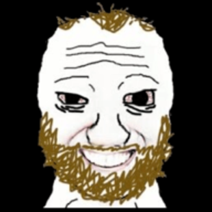

# Now

Welcome to the end of the book, it's lovely having you here.

First, congratulations on quitting! You'll find that life becomes even more beautiful without porn, and that quitting opens your eyes to the many ways that it can be.

You're an important part of the world, and right *now* is the only time that exists, and to summarise many different spiritual teachings: you can cause great suffering for yourself by refusing to accept now, and craving for anything else.

It's okay, and healthy, to have goals and to strive towards purpose, but you shouldn't place your personal value in something outside of you, or let yourself be defined by the imagined past or future.

So, be present and attentive to right now -- it's the only place that's real.

As an example of this and a practise throughout the withdrawal period, you'll find a different 'moment of revelation' (or understanding) soon where you have a 'craving' thought about pornography, and then recognise it *as* a thought caused by porn in the first place, and then feel blissful that you're freed from that thought being 'you'.

You can do this with every thought you ever have, like negativity, or ruminating over the past or future, or times you're feeling wonderful too, and enjoy them more presently and fully without your mind hijacking you with displeasure.

You could be on a tropical beach with the waves rolling in, listening to calm music whilst enjoying the sunset, and you could still be in despair through your thinking.

Even now, as you're reading, you can become aware of your body resting in space, and the sounds where you are, and the sphere of light around you, and *know* that this is all these is. Nothing external can add to the serenity you already have. You're not defined by pornography, or anything else, unless you think your way into it.

Awareness is the most important teaching I can give you, and easypeasy is simply giving you awareness over pornography and asking you whether you enjoy it; and so, pure awareness itself will give you the answers to any other problem you're facing.

I know this is all a bit 'woo woo', but it's really important, since all the problems that I hear from people (including with easypeasy) is the failure to recognise their own thoughts. Letting minor and major things stress you out by making them a personal problem, or for easypeasy, it's wrestling with the the infinite reasons your mind *will* manufacture as valid for using porn -- and many of them might be really strong reasons -- instead of understanding that you can instead just happily drop the rope instead. In fact, all of the problems we face are exactly that, a failure to pay attention and accept the present moment. You may not prefer it, sure, but accepting it fully is the only way forward.

Anyway, the book is being rewritten to give you this understanding, as easypeasy tries to counteract your brainwashing by *telling* you the reasons why you're not enjoying it, instead of us having a conversation and letting you come to the understanding yourself. I'm working on it, and looking forward to chatting in the future, and in the meantime I had to include this (less elegantly written part) 

So, on MO: just *accept* the beauty of your body's natural sexual energy, and circulate and expand it around your body instead.

## So, where to now?

You shouldn't change your life because of quitting porn -- for example, you can imagine someone purposely hiding their computer to keep themselves away from porn out of fear -- but you'll find that dropping something that was only holding you back, and gaining happiness, calmness, attention, and freedom from slavery, tends to help quite a lot in creating a better life you'd love.

You can also see what else we're doing at <https://peacefulfoundation.org>, which basically amounts to rekindling local communities.

## Sharing easypeasy everywhere

One of the things that makes communities better is freedom from addiction; if you'd like to help spreading easypeasy, there's two things you can do:

- First, **use the Coomer meme everywhere.**

I have thousands of Coomer memes available on <https://coomer.org> that I'd appreciate you reposting where possible.

If you're an edgelord, you should check out the <https://coomer.org/ethos> ethos, and to consider the world's complexity and the ego-escalation inheriant in screen addiction, otherwise you'll be unironically called cringe.

Anyway, it's also my favourite meme and I hope you'll love it too x

- **Creating conversations**

People following this checklist will realistically create a global conversation about pornography and other normalised addictions, realistically enabling hundreds of millions to quit.

You can also create conversations online, and you should pause to consider all the people who are directly and indirectly affected by porn and how you can reach them, and also remember that local impact is the most real, and seeing real impact works best.

----------

You can also check out <https://quiteasily.org/help> for another conversational campaign, donation links for <https://peacefulfoundation.org>, and other ways you can get involved in changing the world.

Really, it just involves thinking about where people who are affected by pornography are (so, everyone), and how to reach out to them.

## Fantasy!

Pornography is the elimination of fantasy, where you are mechanically led to orgasm through conditioned fetishes, which escalate in proportion to your desensitisation. Quitting will raise many questions about your sexuality, but you should understand these conditioned fetishes aren't *you* and never could be. A gooner watching hardcore rough porn and a casual user watching softcore static image porn are more similar than different. Rest now, cultivate purity and love, and these questions will work themselves out in time.

For further assistance, you can check out <https://semenretention.org>.

Eliminating fantasy has many societal impacts. You cannot dream of a better future, you are stuck with fantasies that live within the current system. You are sold on dreams rather than dreaming them, and you watch projections of other people's to rationalise apathy to your own.

So, I have a favour to ask that might help.

*Could you please read [17776, An American Football Story by Jon Bois](https://sbnation.com/a/17776-football/), and then, if you want, write fanfiction about it. Post it somewhere, somewhere funny, and feel free to link me to it.*

You can find me on,

- [deleteinstaplease](https://instagram.com/deleteinstaplease)
- [peacefulfraser on toktok](https://tiktok.com/@peacefulfraser)
- [Fraser Patterson](https://youtube.com/@fraserpattersonau) on deleteyoutubeplease x

or as ~racnec-palren/hello on [urbit](https://urbit.org)

I'll read every single one.

Yours,

Hackauthor²

[urbit](https://urbit.org) - ~racnec-palren/hello | [coomer meme archive](https://coomer.org) | [discord](https://discord.com/invite/bCXEnf9) | [reddit](https://reddit.com/r/pmohackbook) | [feedback form](https://forms.gle/p7cTxowaNpKqgi5Z7)
