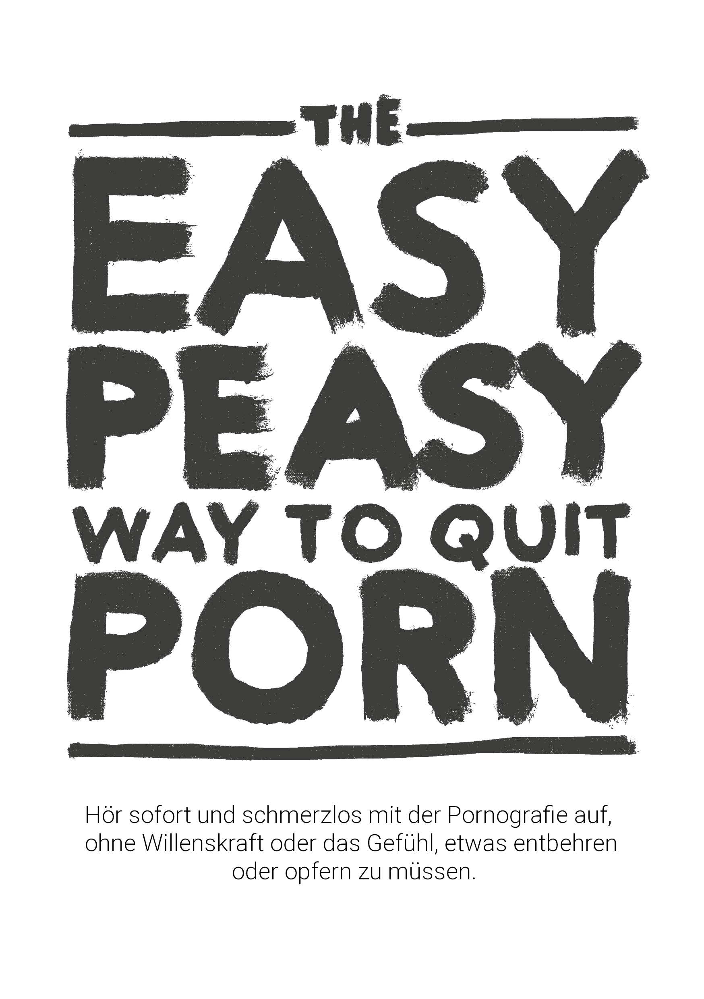

# Einleitung

{width=45% height=45%}

ÜBERSPRINGE KEINE KAPITEL

Dieses Open-Source-Buch wird dich in die Lage versetzen, sofort, schmerzlos und dauerhaft mit der Pornografie aufzuhören, ohne Willenskraft und ohne das Gefühl von Entbehrungen oder Opfern. Es wird dich nicht verurteilen, beschämen oder unter Druck setzen, schmerzhafte Maßnahmen zu ergreifen.

Es gibt sogar keinen Grund, deinen Konsum beim Lesen einzuschränken oder zu reduzieren; das ist sogar schädlich.

Vielleicht macht dir der Gedanke Angst oder du gehörst zu den [Millionen](https://old.reddit.com/r/nofap), die [aktiv](https://old.reddit.com/r/pornfree) [versuchen](https://rebootnation.org), aufzuhören(https://yourbrainrebalanced.com). Wenn das so ist, widerspricht das, was du hier gelesen hast, vielleicht allem, was man dir bisher gesagt hat - aber frage dich, ob das, was man dir gesagt hat, funktioniert hat. Wenn es so wäre, würdest du dieses Buch gar nicht lesen.

Vielleicht kannst du dich mit den folgenden Fragen identifizieren:

- Verbringst du viel mehr Zeit mit dem Anschauen von Pornografie, als du ursprünglich vorhattest?

- Bist du bei deinen Bemühungen, deinen Pornografiekonsum zu stoppen oder einzuschränken, erfolglos?

- Hat die Zeit, die du mit dem Anschauen von Pornografie verbringst, Vorrang vor deinen persönlichen oder beruflichen Verpflichtungen, Hobbys oder Beziehungen in deinem Leben eingenommen oder ist mit ihnen in Konflikt gekommen?

- Bemühst du dich, deinen Pornografiekonsum geheim zu halten (z. B. durch Löschen des Browserverlaufs oder Lügen)?

- Hat die Nutzung von Pornografie zu erheblichen Problemen in deiner Intimbeziehung geführt?

- Erlebst du einen Kreislauf von Erregung und Genuss vor und während des Pornografiekonsums, gefolgt von Scham-, Schuld- und Reuegefühlen?

- Verbringst du viel Zeit damit, an Pornografie zu denken, auch wenn du sie dir nicht ansiehst?

- Hat die Nutzung von Pornografie andere negative Folgen in deinem Privat- oder Berufsleben verursacht (z. B. verpasste Arbeit, schlechte Leistungen, vernachlässigte Beziehungen, finanzielle Probleme)?

Wenn du ein Pornografiekonsument bist, der bei der Selbstbefriedigung oder beim Sex *überhaupt* und *aus welchem Grund auch immer* darauf angewiesen ist, dann musst du nur weiterlesen.
Wenn du wegen eines geliebten Menschen hier bist, musst du ihn nur davon überzeugen, dieses Buch zu lesen.
Wenn du ihn aber nicht überreden kannst, lies das Buch selbst. Wenn du die Methode verstehst, hilft das, die Botschaft zu vermitteln und zu verhindern, dass deine Kinder damit anfangen. Lass dich nicht von der Tatsache täuschen, dass sie jetzt keinen Zugang dazu haben - alle haben ihn, bevor sie süchtig werden.

## Über das Buch {-}

Dieses Buch ist eine umgeschriebene Version von *Allen Carr's EasyWay to Smoking* für Pornografie, es ist frei und Open Source und unter CC-BY-SA lizenziert. Sein Erfolg beruht auf folgender Grundlage:

ÜBERSPRINGE KEINE KAPITEL

Wenn du ein Zahlenschloss öffnen willst, musst du die Zahlen in der richtigen Reihenfolge eingeben. Bei Sucht ist das nicht anders.

Für mich persönlich hat die Originalversion von Google Sites (die nicht von mir geschrieben wurde) mein Leben verändert. Wenn du so bist wie die meisten Menschen, hast du Pornografie schon in jungen Jahren entdeckt und sie seitdem immer wieder genutzt. Bis du über die überwältigende - allerdings etwas zensierte - Literatur gestolpert bist, die vor den Gefahren warnt. Wie ich selbst hast du es wahrscheinlich zu mehr oder weniger langen Phasen ohne Pornografie geschafft, bist aber immer wieder dem trügerischen Verlangen erlegen. Ich freue mich, dir mitteilen zu können, dass diese Methode ganz anders funktioniert und die einzige ist, die funktioniert hat.

Vielleicht hat dich aber auch jemand auf dieses Buch aufmerksam gemacht und du bist skeptisch. Zunächst einmal danke ich dir, dass du es dir wenigstens anschaust. Dazu gleich mehr, aber erinnere dich bitte kurz an das erste Mal, als du dir Pornografie angeschaut hast. Hast du damit gerechnet, dass du für den Rest deines Lebens zu ihr zurückkehren würdest? Meinen eigenen informellen Studien zu diesem Thema zufolge (ich habe Freunde dazu genötigt, dieses Buch zu lesen) ist EasyPeasy für gelegentliche Pornografiekonsumenten genauso effektiv wie für schwer süchtige Menschen. Es ist nicht furchtbar lang, mit hohen Chancen auf große Gewinne, also bitte ich dich, weiterzulesen.

Die in diesem Hackbook beschriebene Methode:

- Ist unmittelbar.

- Ist gleichermaßen wirksam für Viel- und gelegentliche Nutzer.

- Verursacht keine schlimmen Entzugserscheinungen.

- Braucht keine Willenskraft.

- Erfordert keine Schockbehandlung, Hilfsmittel oder Spielereien.

- Wird nicht dazu führen, dass du diese Sucht durch andere Süchte wie übermäßiges Essen, Rauchen oder Trinken ersetzt.

- Ist dauerhaft.

Du magst es vielleicht nicht glauben, aber diese Meinung wird von vielen Menschen geteilt.

> *"Dies ist das wegweisende Werk über Pornosucht"*
>
> --- Ein Typ auf reddit, den ich nicht wiederfinden kann. Ich glaube nicht, dass das Wortspiel beabsichtigt war.

> "*Ich war 10 Jahre lang süchtig. In diesen 10 Jahren war ich gelähmt von Depressionen, Zweifeln, Ängsten und der Angst, dass mein Geheimnis ans Licht kommt. Nach jeder Sitzung hasste ich mich selbst und nach jeder Porno-Diät war ich im Handumdrehen wieder auf der Wasserrutsche. Doch dieses Buch half mir, aufzuhören. In der Vergangenheit war ich immer in der Defensive gegenüber Pornos. Jetzt, nachdem ich dieses Buch zweimal gelesen habe, bin ich in der Offensive. Pornos haben keine Kontrolle mehr über mich und kommen mir jetzt wie ein trauriger Witz vor.*"
>
> --- u/DeepNewt

> "Vor ein paar Tagen bin ich 20 Jahre alt geworden. Zum ersten Mal seit langer Zeit konnte ich meinen Geburtstag frei von der Pornofalle verbringen, und das verdanke ich diesem Buch, auf das ich vor ein paar Monaten zufällig gestoßen bin. Davor hatte ich so viel Zeit damit verbracht, auf herkömmliche Weise aufzuhören, und dabei so viel inneren Aufruhr erlebt, dass ich mich als für immer süchtig bezeichnete. Das Buch hat all das für mich gelöst. Wo ich früher befürchtete, keine Kontrolle über mich selbst zu haben, selbst wenn ich das kleine Monster unbewusst schon besiegt hatte, kann ich jetzt mit Stolz feststellen, dass ich nicht mehr süchtig sein muss.*
>
> *Ich habe keinen wirklichen Grund, dies zu posten. Ich hatte einfach das Gefühl, dass ich das irgendwo anders als in meinem Kopf niederschreiben muss, weil es mir so viel bedeutet. Wenn du das hier liest und darüber nachdenkst, das Buch zu lesen oder zu empfehlen, dann lass dir von mir sagen, dass es besser funktioniert als jede andere Methode da draußen. Mein wichtigster Tipp ist, sich Notizen zu machen. Das klingt komisch, aber es hat mir wirklich geholfen, bestimmte Ideen zu verfestigen.*"
>
> --- u/Suspicious_Web_4594

> "*based*"
>
> --- anon, /fit/

## Warnung

Wenn du erwartest, dass dieses Buch dich mit den verschiedenen gesundheitlichen Problemen, die Nutzer riskieren, wie sexuelle Funktionsstörungen (einschließlich durch Pornografie verursachte Erektionsstörungen), unzuverlässige Erregung, Verlust des Interesses an echten Sexpartnern, Hypofrontalität des Gehirns und die blinde Anschuldigung, dass es eine schmutzige, ekelhafte Angewohnheit ist und *du* eine dumme, rückgratlose, willensschwache Qualle bist, zum Aufhören "einschüchtert", wirst du schwer enttäuscht sein. Diese Taktiken haben mir nie geholfen aufzuhören, und wenn sie dir helfen würden, hättest du schon längst aufgehört.

Herkömmliche Methoden zum Aufhören empfehlen den Einsatz von Willenskraft oder "Pornografie-Diät"-Ersatzmethoden wie "einmal alle *n* Tage konsumieren" und die Reduzierung des Konsums. Auf einigen Websites werden von Experten begutachtete Forschungsergebnisse über Neurotransmitter und Neuroplastizität aufgelistet. Obwohl diese Seiten informativ sind, sind sich viele der Gesundheitsrisiken bewusst und entscheiden sich dafür, nichts zu tun, obwohl solches Material in der Regel sowieso vermieden wird. Letzten Endes sind sie genauso unwirksam, da sie die Gründe für den Pornografiekonsum nicht wirklich beseitigen. Etwas in eine verbotene Frucht zu verwandeln, ist nicht der richtige Weg, um eine Sucht zu behandeln.

Diese Methode, EasyPeasy genannt, funktioniert anders. Einiges von dem, was hier gesagt wird, ist vielleicht schwer zu glauben, aber wenn du dieses Buch gelesen hast, wirst du es nicht nur glauben, sondern dich auch fragen, wie du jemals durch eine Gehirnwäsche dazu gebracht werden konntest, irgendetwas anderes zu glauben.

Es ist ein weit verbreiteter Irrglaube, dass wir es uns aussuchen, Pornos zu schauen. Pornografiesüchtige (ja, Süchtige) entscheiden sich genauso wenig dafür, Pornografie anzuschauen, wie Alkoholiker sich dafür entscheiden, Alkoholiker zu werden, oder Heroinabhängige sich dafür entscheiden, Heroinabhängige zu werden. Es stimmt, dass wir uns dafür entscheiden, den Laptop oder das Smartphone hochzufahren, den Browser zu starten und unseren Lieblings-"Online-Harem" zu besuchen. Gelegentlich entscheide ich mich für einen Kinobesuch, aber ich habe mir sicher nicht dafür entschieden, mein ganzes Leben im Kinosaal zu verbringen. Ursprünglich haben mich Neugier und die menschliche Natur dorthin geführt, aber ich hätte nicht damit angefangen, wenn ich gewusst hätte, dass ich süchtig werden würde, was den Niedergang meiner Gesundheit, meines Glücks und meiner Beziehungen zur Folge hat. *Hätte ich doch nur bei meinem ersten Besuch auf der Pornoseite von sexueller Dysfunktion gehört!*

Nimm dir einen Moment Zeit zum Nachdenken: Hast du jemals die 'bewusste' Entscheidung getroffen, dass du Pornografie zum Masturbieren brauchst/brauchen musst? Oder dass du pornografische Fantasien haben solltest/musst/brauchst, um den Sex mit deinem Partner aufzupeppen? Oder dass du zu bestimmten Zeiten in deinem Leben nicht gut schlafen kannst oder vielleicht nicht einmal einen Abend nach einem harten Arbeitstag verbringen kannst, ohne nach Pornos zu surfen? Oder dass du dich ohne Pornos nicht konzentrieren oder mit Stress umgehen kannst? Zu welchem Zeitpunkt hast du beschlossen, dass du Pornografie *brauchst*, dass du sie dauerhaft in deinem Leben benötigst und dich ohne Pornografie, ohne deinen Online-Harem, unsicher oder sogar panisch fühlst?

Wie jeder andere Pornografienutzer bist du in die finsterste und raffinierteste Falle gelockt worden, die Mensch und Natur je gemeinsam ersonnen haben. Kein Mensch auf der Welt, ob selbst Pornografiekonsument oder nicht, mag den Gedanken, dass seine Kinder Pornos zum Klarkommen oder zum Vergnügen nutzen. Das bedeutet, dass alle Süchtigen wünschen, dass sie nie damit angefangen hätten. Das ist nicht überraschend: Niemand braucht Pornografie, um das Leben zu genießen oder Stress zu bewältigen - bevor er süchtig wird.

Gleichzeitig wollen alle Nutzer weiter konsumieren. Schließlich zwingt uns niemand dazu, den Inkognito-Modus unseres Browsers zu starten. Ob sie den Grund verstehen oder nicht, es sind nur die Nutzer, die sich entscheiden, an die Türen ihrer Online-Harems zu klopfen.

Wenn es einen magischen Knopf gäbe, mit dem man am nächsten Morgen aufwachen könnte, als hätte man nie seine erste Tube-Site besucht, wären die einzigen Süchtigen von morgen junge Menschen, die noch "experimentieren".

Das Einzige, was uns davon abhält, aufzuhören, ist **ANGST!** Angst, die durch den Glauben verursacht wird, dass wir eine unbestimmte Zeit des Elends, der Entbehrung und des unbefriedigten Verlangens überleben müssen, um von Pornografie frei zu sein. Diese entstehen durch irrationale Überzeugungen, die wir gelernt oder erworben haben, wie zum Beispiel:

- Selbstbefriedigung oder Sex, der zum Orgasmus führt, ist die *einzige* und *wichtigste* Sache im Leben.

- Pornos sind "sicherer" als Sex im echten Leben, weil Pornos mich nicht abweisen können.

- Pornos sind lehrreich und nützlich.

- Anspruch auf ein "besseres" Sexerlebnis.

- Mehr ist immer besser.

Diese irrationalen Überzeugungen ziehen irrationale Konsequenzen nach sich, wenn sie umgesetzt werden:

- Verehrung und Besessenheit, wenn eine "perfekte 10/10" gefunden wird.

- Sich als Verlierer zu fühlen, wenn man keinen Sex hat, als wäre er das Wichtigste in der menschlichen Erfahrung.

- Du wartest auf eine perfekte 10.

- Du bist übermäßig urteilend und kritisch gegenüber potenziellen Partnern.

- Du zwingst dich zum Sex, ob du willst oder nicht.

Es ist die Angst, dass eine Nacht allein elendig wird und du mit unkontrollierbaren Impulsen kämpfst. Die Angst, dass die Nacht vor den Prüfungen ohne Pornos die Hölle sein wird. Angst, dass wir uns ohne unsere kleine Stütze nicht mehr konzentrieren, mit Stress umgehen oder selbstbewusst sein können und dass sich unsere Persönlichkeit und unser Charakter verändern werden.

Vor allem aber die Angst, dass wir "einmal süchtig, immer süchtig" sein werden: dass wir nie ganz frei sein werden und den Rest unseres Lebens damit verbringen, uns gelegentlich nach einem durch Pornografie ausgelösten Orgasmus zu sehnen. Wenn du, so wie ich, bereits alle konventionellen Methoden zum Aufhören ausprobiert hast und das Elend und die Qualen der "Willenskraftmethode" durchgemacht hast, wirst du nicht nur von dieser Angst betroffen sein, sondern auch davon überzeugt sein, dass du niemals aufhören kannst.

Wenn du Angst hast, in Panik gerätst oder das Gefühl hast, dass die Zeit zum Aufhören noch nicht reif ist, kann ich dir versichern, dass deine Angst und Panik nicht durch Pornos gelindert wird - sie wird durch sie verursacht. Du hast dich nicht dafür entschieden, in die Pornofalle zu tappen, aber wie alle Fallen ist sie darauf ausgelegt, dass du in ihr gefangen bleibst. Frag dich selbst: Als du die ersten Pornobilder und -videos gesehen hast, hast du da beschlossen, sie dir immer wieder anzusehen, solange du lebst? Wann wirst du also aufhören? Morgen? Nächstes Jahr? Hör auf, dir etwas vorzumachen! Die Falle ist so ausgelegt, dass sie dich ein Leben lang festhält. Warum sonst, glaubst du, hören all die anderen Süchtigen nicht auf, bevor es ihr Leben "tötet"?

Ich habe von einem magischen Knopf gesprochen; EasyPeasy funktioniert genau wie dieser magische Knopf. Ich möchte klarstellen, dass EasyPeasy keine Zauberei ist, aber für mich und andere, denen es so leicht und angenehm gefallen ist, aufzuhören, sieht es so aus!

Die Warnung lautet wie folgt:
Es ist wie mit dem Huhn und dem Ei: Jeder Süchtige will aufhören und jeder Süchtige kann es leicht und angenehm finden, aufzuhören. Es ist nur die **Angst**, die einen Nutzer davon abhält, den Versuch zu unternehmen, aufzuhören. Der größte Gewinn ist es, diese Angst loszuwerden, aber du wirst nicht frei von dieser Angst sein, bis du das Buch abgeschlossen hast. Im Gegenteil, deine Angst kann sich beim Lesen sogar noch verstärken, was dich davon abhalten könnte, das Buch zu beenden. Nimm diesen Kommentar von einer Frau.

***"Ich habe gerade EasyPeasy zu Ende gelesen. Ich weiß, dass es erst vier Tage her ist, aber ich fühle mich so gut, weil ich weiß, dass ich nie wieder Pornos brauchen werde. Ich habe vor fünf Monaten angefangen, dein Buch zu lesen, bin bis zur Hälfte gekommen und habe Panik bekommen. Ich wusste, wenn ich weiter lese, muss ich aufhören. War das nicht dumm von mir?" ***

Du hast nicht beschlossen, in die Falle zu tappen, aber sei dir darüber im Klaren: Du wirst ihr nicht entkommen, wenn du dich nicht bewusst dazu entscheidest. Vielleicht "zerrst du schon an der Leine", um auszusteigen, oder du hast Angst vor dem Gedanken daran, aber wie dem auch sei, denke bitte daran: **DU HAST NICHTS ZU VERLIEREN!**

Wenn du am Ende des Buches beschließt, dass du weiterhin Pornografie zur Selbstbefriedigung oder zum Sex nutzen möchtest, steht dem nichts im Wege. Du musst nicht einmal den Pornografiekonsum reduzieren oder einstellen, während du das Buch liest, und denk daran: Es gibt keine Schocktherapie. Im Gegenteil, ich habe nur gute Nachrichten für dich. Kannst du dir vorstellen, wie sich Andy Dufresne gefühlt hat, als er endlich aus dem Shawshank-Gefängnis geflohen ist? So habe ich mich gefühlt, als ich der Pornofalle entkommen bin, und so fühlen sich auch die Ex-Nutzer, die EasyPeasy benutzt haben. Am Ende des Buches wirst du dich auch so fühlen! Mach es!

## Schließlich... {-}

Es kann für jeden einfach und angenehm sein, mit Pornografie aufzuhören, auch für dich! Alles, was du tun musst, ist, den Rest dieses Buches mit einer offenen Einstellung zu lesen; je mehr du verstehst, desto einfacher wird es sein. Selbst wenn du kein Wort verstehst, wird es dir leicht fallen, wenn du den Anweisungen folgst. Das Wichtigste ist, dass du dich nicht mehr nach Pornos sehnst oder dich beraubt fühlst, und am Ende des Buches wird das einzige Rätsel sein, warum du es so lange gemacht hast.

Mit EasyPeasy gibt es nur zwei Gründe für ein Scheitern.

**Nichtbefolgung der Anweisungen**.
Manche werden es nervig finden, dass das Buch so dogmatisch ist, wenn es um bestimmte Empfehlungen geht, z. B. dass man nicht versuchen sollte, weniger zu schauen oder Ersatz zu finden. Ich bestreite nicht, dass es vielen gelungen ist mit solchen Tricks aufzuhören, aber sie haben es *trotz* dieser Tricks geschafft und nicht wegen ihnen. Manche Menschen können auf einer Hängematte stehend Liebe machen, aber das ist nicht der einfachste Weg. Die Zahlen, um das Schloss dieser Falle zu öffnen, stehen in diesem Buch, aber sie müssen in der richtigen Reihenfolge verwendet werden: von einem Kapitel zum nächsten gehen und keine Kapitel überspringen.

**Nicht verstehen**.
Nimm nichts als selbstverständlich hin, hinterfrage nicht nur, was dir gesagt wird, sondern auch deine eigenen Ansichten und das, was dir die Gesellschaft über Sex, InternetPornografie und Sucht erzählt hat. Diejenigen, die glauben, dass es nur eine Angewohnheit ist, sollten sich zum Beispiel fragen, warum andere Gewohnheiten - von denen einige angenehm sind - leicht zu brechen sind, während eine Gewohnheit, die sich schrecklich anfühlt, Energie, Zeit und Potenz kostet, so schwer zu brechen ist. Diejenigen, die glauben, dass sie Pornos "genießen", sollten sich fragen, warum sie andere Dinge, die unendlich viel mehr Spaß machen, nicht bevorzugen. Warum *musst* du Pornografie nutzen, Panik einsetzend, wenn du es nicht tust?

Mit EasyPeasy erfährst du, wie einfach und angenehm es ist, mit Pornografie aufzuhören. Wie für viele andere auch, war es einer meiner größten Triumphe im Leben, der Pornografiefalle zu entkommen. Es gibt keinen Grund, deprimiert zu sein, im Gegenteil, du bist dabei, etwas zu erreichen, was jeder Nutzer auf der Welt gerne erreichen würde: **FREIHEIT!**

**DENKE DARAN, DASS DU KEINE KAPITEL ÜBERSPRINGST.**

Einige Begriffe, bevor du anfängst:
***PMO***: Der Kreislauf von Porno, Masturbation und Orgasmus.
***Online Harem***: Websites, die Hochgeschwindigkeits-Internetpornos anbieten.

## Tipps zum Lesen und letzte kleine Anmerkungen

**Lies dieses Buch nicht wie ein normales Buch**, es ist sehr kurz, und du solltest es in ein paar Stunden durchlesen können. Die meisten Leute profitieren davon, wenn sie *Hervorhebungen oder Notizen* machen und empfehlen, das Buch ein paar Mal zu lesen, um die Lektionen zu verinnerlichen.

Warum das Hackbook? Weil Allen Carr schon lange verstorben ist und die Institutionen, die er gegründet hat, Internetpornografie nicht als eine der Süchte aufführen, die sie behandeln. Ich profitiere weder monetär noch anderweitig.

In diesem Buch treten ich, der ursprüngliche Hackautor und Allen Carr transparent auf, um dir eine einzigartige und überzeugende Methode zu bieten, mit der du leicht und schmerzlos aufhören kannst.

**Hackbook:** Ein Buch, das auf einem anderen Buch basiert und von diesem gehackt wurde. Der ursprüngliche Autor wird vollständig genannt. 

Es gibt auch eine Reihe von Communities für das Hackbook, aber ich würde dir empfehlen, sie erst zu besuchen, wenn du das Buch gelesen hast.

[urbit](https://urbit.org) - ~mislyr-midnyt/coomer (Jetzt funktioniert es tatsächlich!! die bestmögliche Kontaktmethode, benutze diese bitte) | [coomer meme archive](https://coomer.org) | [analytics](https://plausible.io/easypeasymethod.org) | [matrix](https://matrix.to/#/!xmJZznbJXuwzEGSEti:matrix.org?via=matrix.org) | [discord](https://discord.com/invite/bCXEnf9) | [reddit](https://reddit.com/r/pmohackbook) | [feedback form](https://forms.gle/p7cTxowaNpKqgi5Z7)

Kurze Erinnerung: **ÜBERSPRINGE KEINE KAPITEL**

Ich würde dir Glück wünschen, aber wie du bald merken wirst, brauchst du es nicht.

Gute Vibes,

Hackauthor² und Tim Budweg

{width=88 height=31}

Diese Arbeit ist lizensiert unter einer [Creative Commons Attribution-ShareAlike 4.0 International License](https://creativecommons.org/licenses/by-sa/4.0/). Code ist [GPLv3](https://gitlab.com/snuggy/easypeasy/-/blob/master/LICENSE).
