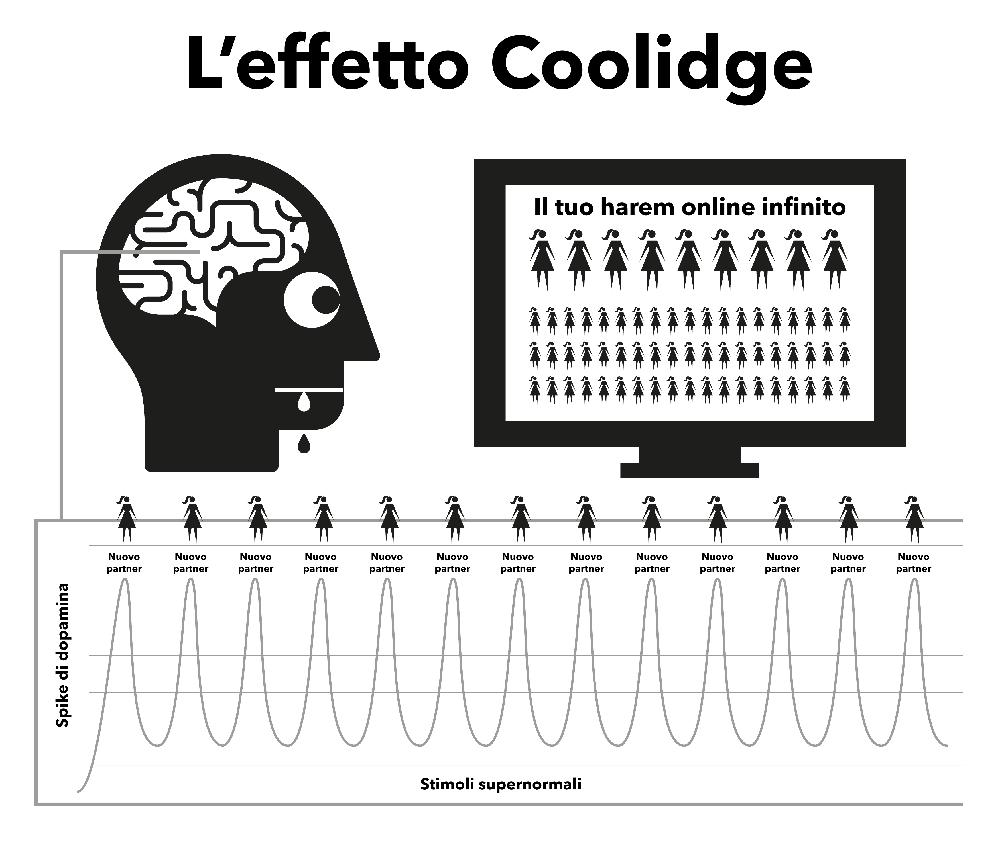

# Natura

Il porno su Internet agisce dirottando i meccanismi naturali di ricompensa progettati per mantenere la riproduzione il più a lungo possibile. La forma istantanea e altamente accessibile del porno su Internet fa sì che il meccanismo di ricompensa del cervello produca dopamina molto più a lungo del normale. Scientificamente, questo fenomeno è chiamato effetto Coolidge, che forse conosci già.

La dopamina è un neurotrasmettitore associato alla sensazione di desiderio, mentre il piacere vero e proprio è prodotto dagli oppioidi. Più dopamina, più oppioidi e più azione. Senza la dopamina, azioni come mangiare non sono piacevoli e non vengono portate a termine; gli alimenti ricchi di grassi e zuccheri producono il massimo rilascio di queste sostanze chimiche.

La dopamina viene rilasciata anche in risposta alla novità. Con una quantità apparentemente infinita di pornografia disponibile, si inonda il sistema limbico (circuito di ricompensa), per cui la prima volta che si vede un porno si agisce, raggiungendo l'orgasmo e innescando un'altra cascata di rilascio oppioidi. Incentivato a ottenere la maggior quantità possibile di dopamina, il cervello memorizza il tutto come un copione da richiamare facilmente e rafforza i percorsi neurali attraverso il rilascio di una sostanza chimica chiamata DeltaFosB. Ora, il cervello richiama questi percorsi in risposta a spunti come spot pubblicitari sexy, momenti di solitudine, stress o anche solo per sentirsi un po' meno giù e improvvisamente si è pronti a fare un giro sullo "scivolo d'acqua". Ogni volta che questo si ripete, viene rilasciata una maggiore quantità di DeltaFosB, in modo che lo scivolo sia inondato, vivo e più facile da percorrere la volta successiva.

Il sistema limbico è dotato di un sistema di autocorrezione per ridurre il numero di recettori della dopamina e degli oppioidi quando viene rilevata una cascata frequente e quotidiana di dopamina. Purtroppo, questi recettori sono necessari anche per mantenerci motivati a gestire gli stress della vita quotidiana. Le quantità nominali di dopamina prodotte dalle ricompense naturali non sono paragonabili a quelle della pornografia e non vengono assorbite in modo altrettanto efficiente dai recettori ridotti, facendo sì che ci si senta più stressati e irritati del normale. Questo processo è noto come desensibilizzazione.

In questo ciclo si è superata la "linea rossa" e si sono scatenate emozioni come il senso di colpa, il disgusto, l'imbarazzo, l'ansia e la paura, che a loro volta fanno aumentare ulteriormente i livelli di dopamina e inducono il cervello a interpretare erroneamente queste sensazioni come eccitazione sessuale.

Con il passare del tempo, il cervello si desensibilizza non solo ai filmati visti in precedenza, ma anche a generi simili e al livello di shock. Questa minore motivazione innesca sentimenti di minore soddisfazione, poiché il nostro cervello si impegna in una valutazione costante, spingendoti a trovare clip per soddisfare la fame. Così si cerca una maggiore novità, cliccando sulla clip amatoriale e scioccante della homepage che si era detto di non voler vedere inizialmente.

> *"Perché nella rugiada delle piccole cose il cuore trova il suo mattino e si rinfresca"*.

> --- Kahlil Gibran

Una fugace sensazione di sicurezza è tutto ciò che serve per superare un momento difficile della vita, ma il tuo cervello desensibilizzato sarà in grado di cogliere quella goccia di sicurezza che il cervello di un non consumatore è in grado di utilizzare?

L'inondazione di dopamina agisce come una droga ad azione rapida, diminuendo rapidamente e inducendo crisi di astinenza. Molti consumatori si illudono che questi dolori siano il terribile trauma che subiscono quando cercano o sono costretti a smettere. In realtà, sono soprattutto mentali, poiché l'utente si sente privato del suo piacere o del suo vizio.

## Il piccolo mostro

La vera e propria astinenza chimica dal porno è così sottile che la maggior parte dei consumatori ha vissuto ed è morta senza rendersi conto di essere dipendente. Molti consumatori hanno paura delle droghe, eppure è proprio questo che sono, tossicodipendenti. Fortunatamente è una droga facile da eliminare, ma bisogna prima accettare di essere dipendenti. L'astinenza da porno non provoca alcun dolore fisico ed è semplicemente una sensazione di vuoto, di inquietudine, di mancanza di qualcosa, motivo per cui molti credono che abbia a che fare con il desiderio sessuale. Se prolungata, questa sensazione si trasforma in nervosismo, insicurezza, agitazione, scarsa fiducia e irritabilità. È come la fame, per un veleno.

Dopo pochi secondi dall'inizio di una masturbazione, la dopamina viene rilasciata e il desiderio termina, con una sensazione di appagamento mentre si sfreccia sullo scivolo. Nei primi giorni, le crisi di astinenza e il loro successivo sollievo sono così lievi che non ce ne rendiamo conto. Quando diventiamo consumatori abituali, crediamo che sia perché ci piace o perché abbiamo "preso l'abitudine". La verità è che siamo già dipendenti, ma non ce ne rendiamo conto. Il mostriciattolo è già nel nostro cervello, quindi ogni tanto facciamo un giro sullo scivolo per alimentarlo.

Tutti gli utenti iniziano a cercare il porno per motivi irrazionali. L'*unico* motivo per cui l'utente continua a fare uso di porno, che sia occasionale o abituale, è per alimentare quel piccolo mostro. L'intero enigma è una serie di punizioni crudeli e confuse, ma forse l'aspetto più patetico è il senso di godimento che un utente trae da una masturbazione, cercando di tornare al senso di pace, tranquillità e fiducia che il suo corpo aveva prima di essere adescato.

## L'allarme noioso

Avete presente la sensazione che si prova quando l'allarme di casa del vicino suona per tutto il giorno - o qualche altra piccola e persistente seccatura - e poi il rumore cessa all'improvviso e si prova una meravigliosa sensazione di pace e tranquillità? Non si tratta di una vera e propria pace, ma della fine di un fastidio. Prima di iniziare la masturbazione successiva il nostro corpo è completo, ma poi iniziamo a forzare il nostro cervello a pompare dopamina e quando abbiamo finito e questa inizia ad andarsene, soffriamo di crisi di astinenza. Non si tratta di dolore fisico, ma solo di una sensazione di vuoto. Non siamo nemmeno consapevoli della sua esistenza, ma è come un rubinetto che gocciola all'interno del nostro corpo.

La nostra mente razionale non lo capisce, ma non ne ha bisogno. Tutto ciò che sappiamo è che desideriamo il porno e quando ci masturbiamo il desiderio passa. Tuttavia, la soddisfazione è fugace, perché per placare il desiderio è necessario un altro porno. Non appena si raggiunge l'orgasmo, la voglia ricomincia e la trappola continua ad attanagliarci. Un circolo vizioso, a meno che non lo si interrompe!

La trappola del porno è simile all'indossare scarpe strette solo per ottenere il piacere di toglierle. Ci sono tre ragioni principali per cui gli utenti non riescono a vederla in questo modo.

1.  Fin dalla nascita, siamo stati sottoposti a un massiccio lavaggio del cervello che ci dice che il porno su Internet è semplicemente uno sviluppo moderno che ha sostituito la versione cartacea delle riviste. Questa falsità è accompagnata dalla verità che la masturbazione non è dannosa, quindi perché non dovremmo crederci?

2.  Poiché l'astinenza fisica da dopamina non comporta un vero e proprio dolore, ma solo una sensazione di vuoto e insicurezza inseparabile dalla fame e dal normale stress, questa sensazione si manifesta in una masturbazione di porno, poiché sono proprio questi i momenti in cui tendiamo a cercare il porno su Internet. Tendiamo a considerare questa sensazione come normale.

3.  Il motivo principale per cui gli utenti non riescono a vedere il porno su Internet nella sua vera luce è che funziona in modo retroattivo. È quando *non* si consuma che si prova la sensazione di vuoto. Poiché il processo di dipendenza è incredibilmente sottile e graduale nei primi giorni, la sensazione di vuoto è considerata normale e quindi non viene attribuita alla masturbazione precedente. Nel momento in cui si apre il browser e si inizia la masturbazione, si ottiene una scarica immediata e si diventa meno nervosi o più rilassati, quindi il porno su Internet si prende il merito.

Questo processo inverso "da dietro a davanti" rende tutte le droghe difficili da eliminare. Immaginate lo stato di panico di un eroinomane senza eroina; ora immaginate la gioia assoluta di quando può finalmente infilarsi un ago in vena. I non eroinomani non soffrono di questa sensazione di panico.

L'eroina non allevia la sensazione, la provoca. Allo stesso modo, i non consumatori non provano la sensazione di vuoto e di bisogno del porno su Internet, né il panico quando sono offline. I non utenti non riescono a capire come gli utenti possano trarre piacere da video bidimensionali, con suoni attenuati e proporzioni corporee anormali. Alla fine, nemmeno gli utenti riescono a capirlo.

Si dice che il porno su Internet sia rilassante o soddisfacente, ma come si può essere soddisfatti se non si è insoddisfatti in partenza? Un non utente non soffre di questo stato di insoddisfazione, è completamente rilassato dopo un appuntamento senza sesso, mentre l'utente non lo è finché non ha soddisfatto il suo "piccolo mostro".

## Un piacere o un sostegno?

Un promemoria importante: il motivo principale per cui gli utenti hanno difficoltà a smettere è la convinzione di rinunciare a un vero piacere o a un sostegno. È essenziale capire che non si sta rinunciando ad *assolutamente nulla*. Il modo migliore per capire le sottigliezze della trappola del porno è paragonarla al mangiare. L'abitudine a pasti regolari fa sì che non si senta la fame tra un pasto e l'altro, ma che la si avverta solo se il pasto viene ritardato. Non c'è dolore fisico, ma solo una sensazione di vuoto e insicurezza riconosciuta come fame. Il processo di soddisfazione della fame è un'esperienza molto piacevole.

La pornografia sembra quasi identica, ma non è così. Come la fame, non c'è dolore fisico e il meccanismo di ricompensa si comporta in modo simile, ma è questa somiglianza con il mangiare che inganna l'utente facendogli credere che ci sia un vero piacere o un sostegno. Anche se il mangiare e il porno sembrano molto simili, in realtà sono esattamente l'opposto.

-   Si mangia per sopravvivere e dare energia alla propria vita, mentre il porno affievolisce e riduce il proprio umore.

-   Il cibo ha un sapore genuino e mangiare è un'esperienza davvero piacevole che ci accompagna per tutta la vita. Il porno comporta l'auto sabotaggio dei recettori della felicità, distruggendo così le possibilità di farcela e di sentirsi felici.

-   Mangiare non crea fame e la allevia realmente, mentre la prima masturbazione di porno dà inizio al desiderio di dopamina e a ogni masturbazione successiva. Lungi dall'alleviare la fame, assicura la sofferenza per il resto della vita.

Mangiare è un'abitudine? Se lo pensate, provate a interromperla completamente! Descrivere il mangiare come un'abitudine sarebbe come descrivere il respirare come un'abitudine: entrambi sono essenziali per la sopravvivenza. È vero che le persone hanno l'abitudine di soddisfare la loro fame in momenti diversi con diversi tipi di cibo, ma mangiare in sé non è un'abitudine. E nemmeno il porno lo è. L'unico motivo per cui un utente apre il browser è cercare di porre fine alle sensazioni di vuoto che la masturbazione precedente ha creato, in momenti diversi e con generi diversi e crescenti.

Su Internet, il porno viene spesso definito un'abitudine e per comodità anche EasyPeasy si riferisce ad esso con il termine "abitudine". Tuttavia, bisogna essere sempre consapevoli che il porno non è un'abitudine, ma una **dipendenza!** Quando iniziamo a usare il porno, dobbiamo forzarci ad affrontarlo. Prima che ce ne accorgiamo, ci stiamo dedicando a porno sempre più bizzarri e scioccanti. Il brivido è nella caccia, non nell'uccisione, e la dopamina abbandona rapidamente il corpo dopo l'orgasmo, spiegando il motivo per cui gli utenti desiderano "spiare" (ritardare l'orgasmo) sfogliando più finestre e schede del browser.

## Oltrepassare la linea rossa

Come per qualsiasi altra droga, il corpo tende a sviluppare un'immunità agli effetti degli stessi video, il nostro cervello vuole di più o qualcos'altro. Dopo brevi periodi di visione dello stesso filmato, il corpo cessa di alleviare completamente le crisi di astinenza provocate dalla masturbazione precedente. In questo paradiso del porno si verifica un tiro alla fune: volete rimanere al sicuro della vostra "linea rossa", ma il vostro cervello vi chiede di cliccare sulla clip del frutto proibito.

Vi sentite meglio dopo aver partecipato a questa masturbazione porno, ma siete più nervosi e meno rilassati di chi non ha mai iniziato, anche se vivete in un presunto paradiso del porno. Questa posizione è ancora più ridicola dell'indossare scarpe strette, perché man mano che si va avanti nella vita rimane un disagio sempre maggiore dopo aver tolto le scarpe. Poiché l'utente sa che il piccolo mostro deve essere nutrito, è lui stesso a decidere l'orario, tendenzialmente in quattro tipi di occasioni o in una loro combinazione.

Noia / Concentrazione - Due opposti completi!\
Stress / Rilassamento - Due opposti completi!

Quale droga magica può improvvisamente invertire l'effetto che aveva pochi minuti prima? La verità è che il porno non allevia la noia e lo stress né favorisce la concentrazione e il rilassamento. Se ci pensate, quali altri tipi di occasioni ci sono nella nostra vita, a parte il sonno? Se avete in mente di passare ad altri generi di porno "realistici" o "soft", tenete presente che il contenuto di questo libro si applica a tutto il porno, stampa, webcam, pay-per-view, chat, spettacoli dal vivo, ecc. Il corpo umano è l'oggetto più sofisticato del pianeta, ma nessuna specie, nemmeno la più bassa ameba o verme, sopravvive senza conoscere la differenza tra cibo e veleno.

Attraverso la selezione naturale, le nostre menti e i nostri corpi hanno sviluppato tecniche per premiare le azioni che moltiplicano e sostengono l'umanità. Non sono preparati per stimoli supernormali che sono più grandi, più luminosi e più taglienti di qualsiasi cosa si trovi in natura. Anche la più tenue immagine bidimensionale ci fa eccitare, ma se guardate ripetutamente la stessa immagine, non lo sarete più. Nella vita reale, i controlli e gli equilibri assicurano che si faccia qualcos'altro, ma il porno su Internet non ha questo tipo di limitazione, facendovi passare la vita in un harem virtuale!

È una falsa credenza che le persone deboli fisicamente e mentalmente diventino utilizzatori; i fortunati sono quelli che hanno trovato la prima visione ripugnante e sono guariti a vita. Si può anche pensare che non sono mentalmente preparati ad affrontare il severo processo di apprendimento che consiste nel lottare per farsi adescare, nel timore di "essere scoperti" o nel non essere abbastanza tecnici per gestire le impostazioni di privacy del browser. Forse la parte più tragica dell'intera faccenda riguarda gli adolescenti - abili nel trovare il materiale e nel coprire le proprie tracce - che iniziano sempre più numerosi.

Godere del porno su Internet è un'illusione. Saltiamo da un genere all'altro, limitandoci a mantenere la nostra "scimmia" da novità all'interno della "linea rossa" dei generi porno "sicuri" per ottenere la nostra dose di dopamina. Come gli eroinomani, tutto ciò di cui godono in realtà è il rituale per alleviare i dolori.

## L'apice della danza intorno alla linea rossa

Anche con l'unico filmato rimasto, gli utenti imparano costantemente a filtrare le parti brutte e cattive dei filmati porno. Anche se si tratta di un solo, filtrano comunque le parti del corpo che li attraggono di più. In effetti, alcuni traggono piacere da questa danza intorno alla linea rossa, trovando scuse per dichiarare che a loro piace la "roba soft" e che non sono dipendenti da stimoli supernormali. Ma chiedete a un utente che crede di attenersi a un certo attore o genere: *"Se non riesci a ottenere la tua normale categoria di porno e puoi ottenere solo un genere non sicuro, smetti di masturbarti?"*.

Assolutamente no! Un utente si masturba con qualsiasi cosa, generi diversi, orientamenti sessuali differenti, sosia, ambientazioni pericolose, relazioni scioccanti, qualsiasi cosa per saziare il piccolo mostro. All'inizio hanno un sapore orribile, ma con il tempo impareranno a piacergli. Gli utenti cercano un vuoto appagamento dopo aver fatto sesso vero, dopo una lunga giornata di lavoro, dopo la febbre, il raffreddore, l'influenza, il mal di gola e persino durante il ricovero in ospedale.

Il piacere non c'entra nulla, se si vuole fare sesso, non ha senso farlo con il portatile. Alcuni utenti trovano allarmante rendersi conto di essere dipendenti e credono che questo renda ancora più difficile smettere. In realtà, questa è una buona notizia per due importanti motivi.

1.  Il motivo per cui la maggior parte degli utenti continua a fare uso di pornografia è che, pur sapendo che gli svantaggi superano di gran lunga i vantaggi, credono che il porno gli piaccia davvero o che agisca come una sorta di strumento di sostegno. Ci illudiamo che dopo aver smesso di usare il porno ci sia un vuoto, che certe situazioni della nostra vita non siano più le stesse. In realtà il porno non solo non dà nulla, ma sottrae.

2.  Sebbene il porno su Internet sia il più potente fattore scatenante dell'inondazione di dopamina basata sulla novità e sul sesso, a causa della velocità con cui si diventa dipendenti non lo si è mai in modo grave. Le vere e proprie crisi di astinenza sono così lievi che la maggior parte degli utenti è vissuta e morta senza rendersi conto di averle subite.

Perché allora molti consumatori trovano così difficile smettere, passando mesi di tortura e trascorrendo il resto della loro vita a rimpiangere la droga in momenti strani? La risposta è la seconda ragione: il lavaggio del cervello. La dipendenza da neurotrasmettitori è facile da gestire: la maggior parte degli utenti resta per giorni senza porno online durante viaggi di lavoro, senza risentire delle crisi di astinenza. Il vostro piccolo mostro è al sicuro sapendo che aprirete il portatile non appena tornerete nella vostra camera d'albergo. Potete sopravvivere al vostro cliente odioso e al vostro manager megalomane, sapendo che la soluzione è lì a portata di mano.

## L'analogia con i fumatori

Una buona analogia è quella del fumatore di sigarette. Se stessero dieci ore al giorno senza una sigaretta si strapperebbero i capelli, ma molti fumatori comprano un'auto nuova e si astengono dal fumare al suo interno. Molti si recano in teatri, supermercati, chiese e il fatto di non poter fumare non crea loro alcun problema. Anche sui treni e sugli aerei non ci sono rivolte. I fumatori sono quasi contenti che qualcuno o qualcosa impedisca loro di fumare.

Gli utenti si astengono automaticamente dall'uso del porno su Internet a casa dei genitori durante le riunioni di famiglia e altri eventi con poco disagio. In effetti, la maggior parte degli utenti ha periodi prolungati durante i quali si astiene senza sforzo. Il piccolo mostro neurologico è facile da gestire anche quando si è ancora dipendenti. Ci sono milioni di consumatori che rimangono consumatori occasionali per tutta la vita e sono altrettanto dipendenti dei consumatori abituali. Ci sono anche utenti pesanti che hanno abbandonato la dipendenza, ma che di tanto in tanto danno una sbirciatina, ungendo lo scivolo d'acqua da percorrere al prossimo calo d'umore.

Come detto in precedenza, la dipendenza dal porno non è il problema principale, ma funge semplicemente da catalizzatore per mantenere le nostre menti confuse rispetto al vero problema: il lavaggio del cervello. Non bisogna però pensare che gli effetti negativi del porno su Internet siano esagerati, semmai sono tristemente sottovalutati. Di tanto in tanto circola la voce che i percorsi neurali creati sono lì per tutta la vita, con il giusto mix di caso e stimolo che ti fa scendere di nuovo sullo scivolo che ti rovina la vita, ma non è vero. Il nostro cervello e il nostro corpo sono macchine miracolose, che si riprendono nel giro di poche settimane.

Non è mai troppo tardi per smettere! Una rapida occhiata alle comunità online vi mostrerà persone di tutte le età che stanno riavviando la loro vita (e quella dei loro partner). Come in tutte le cose che gli esseri umani fanno, alcuni si spingono al livello successivo, praticando la ritenzione dello sperma, la Karezza e, attraverso la differenziazione dei lati sensoriali e propagativi del sesso, rendono i loro partner più felici che mai.

Può essere di consolazione per i consumatori abituali il fatto che per loro è altrettanto facile smettere come per i consumatori occasionali, e in un certo senso è più facile. Più ci si trascina verso il basso, maggiore è il sollievo. Quando ho smesso sono andato direttamente a *zero* e non ho avuto una sola brutta sensazione. Anzi, il processo è stato piacevole anche durante il periodo di astinenza.

Ma prima dobbiamo eliminare il lavaggio del cervello.
