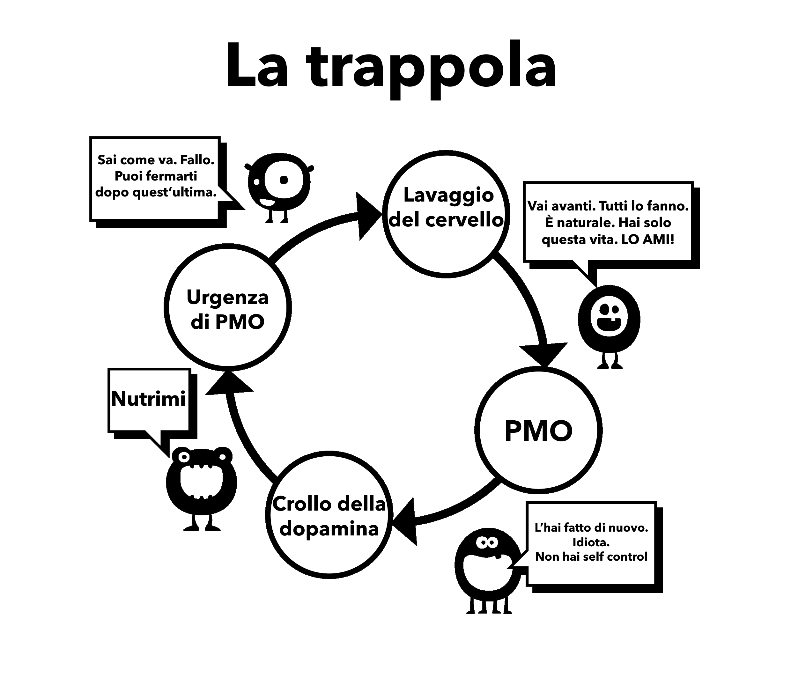

# Lavaggio del cervello

Questo è il secondo motivo per cui iniziamo ad usare il porno. Per comprendere appieno questo lavaggio del cervello dobbiamo prima esaminare i potenti effetti degli stimoli supernormali. Il nostro cervello non è semplicemente preparato alla creazione di un "harem online", che ci permette di scegliere tra più potenziali partner in quindici minuti di quanto i nostri antenati potessero fare in diverse vite.

In passato si sono diffuse molte credenze errate, come quella secondo la quale la masturbazione porta alla cecità. Questa, insieme ad altre credenze allarmistiche, sono chiaramente esagerate. Idee sbagliate come queste dovevano essere giustamente confutate dalla scienza. Ma, come si suol dire, "il bambino è stato buttato via con l'acqua sporca"; fin dalla più tenera età la nostra mente subconscia è bombardata da messaggi e immagini sessuali, riviste e pubblicità cariche di allusioni. Alcuni video pop sono estremamente allusivi, ma non disperate, fate in modo che il gioco consista nell'individuare queste allusioni: valore d'urto, novità, colore, dimensione, tabù, nostalgia, ecc. Un gioco del genere può essere insegnato anche ai preadolescenti per educarli.

Il messaggio di fondo è *"La cosa più preziosa su questa terra, il mio ultimo pensiero e azione, sarà l'orgasmo"*. È forse un'esagerazione? Guardate una qualsiasi trama televisiva o cinematografica e vedrete la confusione tra le parti sensoriali (tatto, odore, voce) e quelle propagative (orgasmo) del sesso. L'impatto di tutto ciò non viene registrato dalla nostra coscienza, ma il subconscio ha il tempo di assorbirlo.

## Ragionamento scientifico

Esiste anche la pubblicità in senso opposto, le paure per le disfunzioni sessuali, la perdita di motivazione, la preferenza per il porno virtuale alle ragazze reali, YourBrainOnPorn e varie sottoculture di Internet, ma questi movimenti non impediscono effettivamente alle persone di smettere di usare il porno. A rigor di logica dovrebbero, ma il fatto è che non lo fanno. Nemmeno i rischi per la salute elencati dagli studi peer reviewed su YourBrainOnPorn sono sufficienti a fermare un adolescente dall'iniziare.

Ironicamente, la forza più potente in questa confusione è l'utente stesso. È falso che gli utenti siano persone deboli di volontà o fisicamente deboli. Bisogna essere fisicamente forti per affrontare una dipendenza dopo averne conosciuto l'esistenza. Forse l'aspetto più doloroso è che si pongono come perdenti senza successo e introversi insopportabili. È probabile che un amico potrebbe essere più interessante di persona se non si fosse "messo in ginocchio" per la ricerca del piacere personale.

## Problemi nell'uso della forza di volontà

Gli utenti che smettono con il metodo della forza di volontà danno la colpa alla loro mancanza di forza di volontà e rovinano la loro pace e felicità. Una cosa è fallire nell'autodisciplina e un'altra è il disprezzo per se stessi. Dopo tutto, non c'è nessuna legge che impone di essere sempre in forma prima del sesso, adeguatamente eccitati e in grado di soddisfare il partner. Stiamo lavorando su una dipendenza, non su un'abitudine e mai si discute con se stessi per smontare un'abitudine come il golf, ma fare lo stesso con la dipendenza dal porno è normalizzato, perché?

L'esposizione costante a uno stimolo supernormale modifica il cervello, quindi resistere a questo lavaggio del cervello è fondamentale, come quando si acquista un'auto da un rivenditore di auto usate: si annuisce educatamente ma non si crede a una parola di quello che dice. Quindi non credere di dover fare più sesso possibile, tutto eccezionalmente buono, in assenza di porno.

Non fafre nemmeno il gioco del porno sicuro, che il tuo piccolo mostro ha inventato per attirarti. Il porno amatoriale è certificato da qualche autorità? I siti porno raccolgono dati dai loro utenti e li usano per soddisfare le loro esigenze, se vedono un aumento in una certa categoria si concentrano su di essa e ci pubblicano contenuti il prima possibile. Non lasciarti ingannare da intenti educativi o da clip femminili "sicure". Inizia a chiederti: *"Perché lo sto facendo? Ne ho davvero bisogno?"*.

**No, certo che no!**

La maggior parte degli utenti giura di guardare solo porno statico e soft e di essere quindi a posto, mentre in realtà sta tirando il guinzaglio, lottando con la propria forza di volontà per resistere alle tentazioni. Se ciò avviene troppo spesso e troppo a lungo, la forza di volontà si esaurisce notevolmente e si inizia a fallire in altri progetti di vita nei quali la forza di volontà ha un grande valore, come l'esercizio fisico, la dieta, ecc. Il fallimento in questi ambiti fa sentire infelici e in colpa, e a cascata fa ricadere nella pornografia. Oppure, sfogheranno la loro rabbia e la loro depressione sui propri cari.

Una volta che si diventa dipendenti dal porno su Internet, il lavaggio del cervello aumenta. La mente subconscia sa che il piccolo mostro deve essere alimentato, bloccando tutto il resto. È la paura che impedisce alle persone di smettere, la paura di quella sensazione di vuoto e insicurezza che provano quando smettono di inondare il loro cervello di dopamina. Solo perché non ne sei consapevole, non significa che non ci sia. Non devi capirlo più di quanto un gatto debba capire dove sono i tubi dell'acqua calda: il gatto sa solo che se si siede in un certo punto sente caldo.

## Passività

La passività della nostra mente e la dipendenza dall'autorità che porta al lavaggio del cervello è la difficoltà principale nell'abbandonare il porno. La nostra educazione nella società, rafforzata dal lavaggio del cervello della nostra stessa dipendenza e combinata con i più potenti - i nostri amici, parenti e colleghi. La frase "rinunciare" è un classico esempio di lavaggio del cervello, che implica un vero e proprio sacrificio. La bella verità è che non c'è nulla a cui rinunciare; al contrario, vi libererete da una terribile malattia e otterrete meravigliosi vantaggi positivi. Cominciamo subito a rimuovere questo lavaggio del cervello, iniziando a non parlare più di "rinuncia" ma di stop, abbandono o forse la vera azione, **fuga!**

L'unica cosa che ci persuade a fare uso di sostanze inizialmente è la presenza di altre persone che lo fanno, sentendo che ci stiamo perdendo qualcosa. Ci impegniamo a fondo per essere dipendenti, ma non capiamo mai quello che si sono persi. Ogni volta che vediamo un altro video ci convinciamo che ci deve essere qualcosa, altrimenti la gente non lo farebbe e il business non sarebbe così grande. Anche una volta abbandonata l'abitudine, l'ex-utente si sente privato quando si parla di un intrattenitore sexy, di un cantante o addirittura di una pornostar durante le feste o le funzioni sociali. *"Devono essere bravi se tutti i miei amici ne parlano, vero? Hanno foto gratuite online?"* Si sentono al sicuro, daranno solo una sbirciatina stasera e prima che se ne accorgano, saranno di nuovo attaccati.

Il lavaggio del cervello è estremamente potente e bisogna essere consapevoli dei suoi effetti. La tecnologia continua a crescere e il futuro porterà siti e metodi di accesso esponenzialmente più veloci. L'industria del porno sta investendo milioni di euro nella realtà virtuale, in modo che diventi la cosa migliore del momento. Non sappiamo dove stiamo andando, non siamo attrezzati per affrontare la tecnologia attuale o quella che verrà.

Stiamo per rimuovere questo lavaggio del cervello, non è il non utente che viene privato, ma l'utente che perde una vita intera:

-   Salute

-   Energia

-   Ricchezza

-   Pace mentale

-   Fiducia

-   Coraggio

-   Rispetto di sé

-   Felicità

-   Libertà

Cosa guadagnano da questi notevoli sacrifici? **NULLA**, a parte l'illusione di cercare di tornare allo stato di pace, tranquillità e fiducia di cui gode sempre chi non ne fa uso.

## Crisi d'astinenza

Come spiegato in precedenza, gli utenti credono di utilizzare il porno per divertimento, relax o una sorta di educazione. Il vero motivo è il sollievo dai rimorsi da astinenza. Il nostro subconscio inizia a imparare che il porno su internet e la masturbazione in certi momenti tendono ad essere piacevoli. Man mano che diventiamo sempre più dipendenti dal farmaco, diventa maggiore la necessità di alleviare i dolori da astinenza e la sottile trappola ti trascina giù. Questo processo avviene così lentamente che non si è nemmeno consapevoli di esso, la maggior parte dei giovani utenti non si rendono conto che sono dipendenti finchè non provano a fermarsi e anche allora, molti non lo ammettono.

Prendi questa conversazione che un terapista ha avuto con centinaia di adolescenti:

> **Terapista:**"*Ti rendi conto che il porno su internet è una droga e l'unica ragione per cui lo stai usando è che non puoi fermarti.*"
>
> **Paziente:**"*Sciocchezze! Se non lo facessi, mi fermerei.*"

> **Terapista:**"*Fermati per una settimana per dimostrarmi che puoi, se vuoi.*"
>
> **Paziente:**"*Non ce n'è bisogno, mi piace. Se volessi smettere, lo farei.*"
>
> **Terapista:**"*Fermati per una settimana per dimostrare a te stesso che non sei dipendente.*"
>
> **Paziente:**"*Qual è il punto? Mi piace."*

Come già detto, gli utenti tendono ad alleviare le loro crisi d'astinenza nei momenti di stress, noia, concentrazione o combinazioni di questi. Nei capitoli seguenti, ci occuperemo di questi aspetti del lavaggio del cervello.
