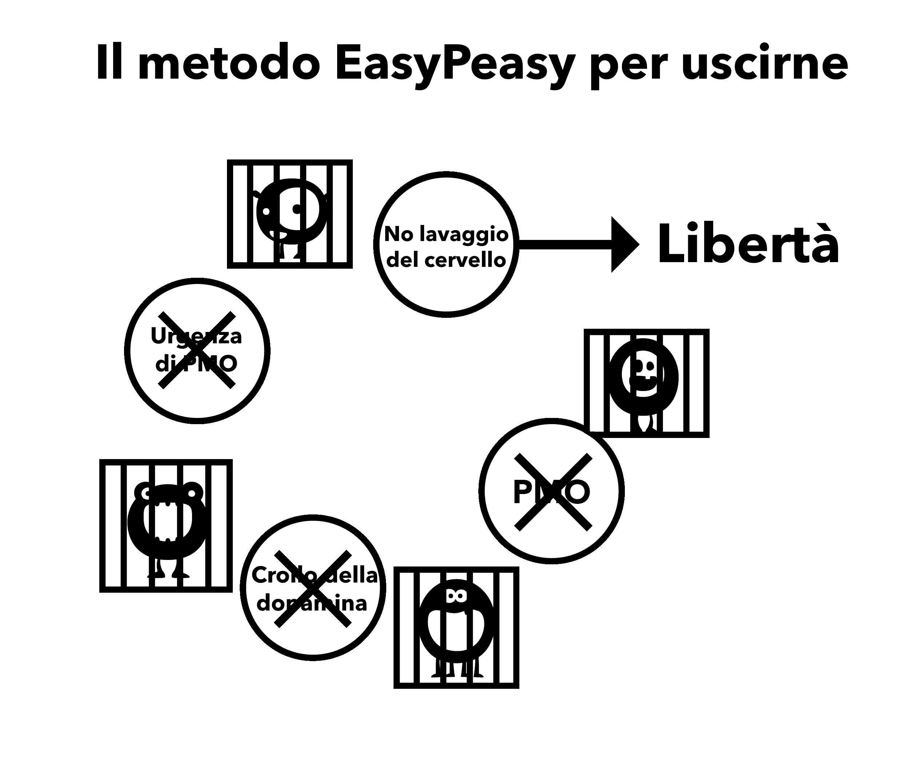

# Aspetti del lavaggio del cervello

Il grande mostro della trappola del porno è generato dalla combinazione di molti aspetti, tra cui la società, le rappresentazioni dei media, i coetanei e la narrazione interna dell'utente. L'incapacità di de-costruire queste fallacie utilizzando il metodo della forza di volontà porta alla fine a sentimenti di privazione, che conducono l'utente a ricadere nella trappola. La decostruzione del valore immaginario del porno è fondamentale per il successo e permette di capire dove si viene derubati!

È importante notare il legame tra il lavaggio del cervello e la paura. È la paura di provare ***future crisi di astinenza*** a creare le crisi. La paura è il dolore stesso. Pensate a quando avete avuto sintomi di astinenza come palmi sudate, respiro affannoso, problemi di sonno e incapacità di ragionare. Ora pensate a situazioni simili in cui avete provato queste sensazioni: colloqui di lavoro, nervosismo nei confronti di una persona attraente, parlare in pubblico, ecc. Queste sono le stesse sensazioni di ansia che provoca la paura. In parole povere, come fa una droga fisica ad attirare ancora le persone mesi dopo aver smesso? Deve essere una questione mentale, giusto?

## Stress

Non solo le grandi tragedie della vita, ma anche i piccoli stress spingono gli utenti nella zona proibita "non sicura" precedentemente esclusa. Tra gli stress ci sono la socializzazione, le telefonate, le ansie della casalinga con figli piccoli e molti altri. Prendiamo ad esempio le telefonate, in particolare per un uomo d'affari. La maggior parte delle telefonate non è fatta da clienti soddisfatti o dal vostro capo che si congratula con voi, ma tratterà di un qualche problema. Tornando a casa, la banale vita familiare, con i bambini che urlano e le richieste emotive del partner, induce l'utente - se non lo sta già facendo - a fantasticare sul sollievo del porno promesso quella sera. Inconsciamente soffrono di crisi d'astinenza, sono indeboliti e impreparati ad affrontare ulteriori aggravamenti. Alleviando parzialmente i dolori del normale stress, l'utente ottiene una spinta temporanea. La spinta non è un'illusione, l'utente si sente davvero meglio di prima, ma è più teso di quanto non sarebbe se non fosse un utente.

L'esempio che segue non è pensato per scioccare l'utente, EasyPeasy non promette un trattamento simile, ma per sottolineare che il porno distrugge i nervi anziché rilassarli.

Provate a immaginare di arrivare al punto in cui non riuscite ad eccitarvi, nemmeno con un partner molto sexy e attraente. Fermatevi un attimo e provate a visualizzare una vita in cui una persona molto bella e affascinante deve competere e fallire con le pornostar virtuali che occupano il vostro "harem" per ottenere la vostra attenzione. Immaginate lo stato d'animo di una persona che, dopo aver ricevuto questo avvertimento, continua ad usare e muore senza aver mai fatto sesso reale con questo partner affascinante e disponibile. È facile etichettare queste persone come strampalate, ma storie come queste non sono finte, è ciò che la terribile droga del porno fa al cervello. Più si va avanti nella vita, più il coraggio viene meno e più ci si illude che il porno faccia il contrario.

Siete mai stati sopraffatti dal panico quando di punto in bianco il Wi-Fi smette di funzionare o è troppo lento? I non utenti non ne soffrono, perché il porno su Internet *causa* questa sensazione. Nel corso della vita, distrugge sistematicamente i vostri nervi e il vostro coraggio, lasciando che il DeltaFosB formi potenti scivoli neurali, distruggendo progressivamente la vostra capacità di dire di no. Nella fase in cui la virilità è stata uccisa, l'utente crede che il porno sia il suo nuovo partner ed è incapace di affrontare la vita senza di esso.

*Il porno su Internet non allevia i nervi, ma li distrugge lentamente*. Uno dei grandi vantaggi dell'interruzione della dipendenza è il ritorno della naturale fiducia e sicurezza in se stessi.

Non c'è bisogno di autovalutarsi in base alla propria capacità di soddisfare un partner, questa non è libertà. Ma questa libertà non può essere ottenuta continuando a ingrassare lo scivolo della dopamina in modi che compromettono la felicità e la libido, ripetendo gli stessi comportamenti distruttivi.

## Noia

Se siete come molte persone, appena vi mettete a letto siete già sul vostro sito porno preferito, probabilmente dimenticandovene. È diventata una seconda natura. Allo stesso modo, l'idea che il porno allevi la noia è un'altra falsità, perché la noia è uno stato d'animo che si verifica quando si è privati del porno per molto tempo o si sta cercando di ridurlo.

La situazione reale è questa: quando si è dipendenti dall'attrazione supernormale del porno su Internet e poi si cerca di astenersi, si ha la sensazione che manchi qualcosa. Se si ha qualcosa per occupare la mente che non sia stressante, si può andare avanti per lunghi periodi di tempo senza essere disturbati dall'assenza della droga. Tuttavia, quando si è annoiati non c'è nulla che distolga la mente, quindi si alimenta il mostro. Quando ci si lascia andare e non si cerca di smettere o di ridurre, anche l'accensione della navigazione in incognito diventa inconscia. Questo rituale è automatico; se l'utente cerca di ricordare le masturbazioni dell'ultima settimana, riesce a ricordarne solo una piccola parte, come l'ultima o la masturbazione dopo una lunga astinenza.

La verità è che il porno aumenta la noia indirettamente, perché gli orgasmi fanno sentire letargici e, invece di intraprendere un'attività energica, gli utenti tendono a preferire l'ozio, annoiandosi e alleviando le proprie crisi di astinenza. Contrastare il lavaggio del cervello è importante perché gli utenti tendono a guardare il porno quando si annoiano, il nostro cervello è cablato per interpretare il porno come interessante. Allo stesso modo, ci è stato fatto il lavaggio del cervello per farci credere che il sesso, anche quello cattivo, aiuti a rilassarci. È un dato di fatto che quando si è tristi o sotto stress, le coppie vogliono fare sesso. In assenza di discriminazioni tra sesso tantrico e propagativo, osservate quanto velocemente volete allontanarvi l'uno dall'altro dopo aver raggiunto l'orgasmo. Se la coppia avesse semplicemente deciso di abbracciarsi, parlare o coccolarsi e andare a dormire, si sarebbe sentita sollevata.

## Concentrazione

La masturbazione e il sesso non aiutano la concentrazione, perché quando si cerca di concentrarsi si cerca automaticamente di evitare le distrazioni. Pertanto, quando un utente vuole concentrarsi, non ci pensa nemmeno: apre automaticamente il browser, alimentando il piccolo mostro e ponendo parzialmente fine al desiderio. Si dedica al lavoro, dimenticando già di aver visto il porno. Dopo anni di inondazione di dopamina, i cambiamenti neurologici influiscono su capacità come l'accesso alle informazioni, la pianificazione e il controllo degli impulsi.

Si è anche spinti a cercare novità per la masturbazione successiva, poiché le stesse cose non generano più abbastanza dopamina e oppioidi. Dovrai quindi vagare per le strade di Internet alla ricerca di novità, combattendo l'attrazione per il materiale scioccante, che a sua volta genera più stress e ti lascia insoddisfatto dopo aver finito.

Anche la concentrazione viene influenzata negativamente, poiché i recettori della dopamina diminuiscono a causa della naturale tolleranza ai grandi picchi, riducendo i benefici dei piccoli incrementi di dopamina provenienti dai destressor naturali. La concentrazione e l'ispirazione saranno notevolmente potenziate dalla riduzione di questa dipendenza. Per molti, è l'aspetto della concentrazione che impedisce il successo del metodo della forza di volontà: si può sopportare l'irritabilità e il malumore, ma l'incapacità di concentrarsi su qualcosa di difficile una volta rimossa il sostegno rovina molti.

La perdita di concentrazione che gli utenti subiscono quando cercano di evadere non è dovuta all'assenza di sesso, tanto meno di porno. Quando si è dipendenti da qualcosa si hanno dei blocchi mentali e quando si ha un blocco mentale cosa si fa? Si accende il browser - il che non cura il blocco - e allora cosa si fa? Si fa quello che si deve fare, andando avanti proprio come fanno i non utenti.

Quando si è utenti non si dà la colpa alla causa, gli utenti non hanno mai *disfunzioni sessuali*, ma solo occasionali tempi morti. Nel momento in cui si smette di drogarsi, tutto ciò che va male viene attribuito al motivo per cui si è smesso. Ora, quando si ha un blocco mentale, invece di andare avanti, si comincia a dire "*Se solo potessi controllare il mio harem ora, risolverei tutti i miei problemi*". Si comincia quindi a mettere in discussione la propria decisione di smettere e di fuggire dalla schiavitù.

Se credi che il porno sia un vero e proprio aiuto alla concentrazione, preoccupartene ti garantirà l'incapacità di concentrarvi. Il dubbio, e non le crisi di astinenza fisica, crea il problema. Ricorda sempre che è il consumatore a soffrire di crisi, non chi non lo fa.

## Relax

La maggior parte degli utenti pensa che il porno li aiuti a rilassarsi. Non è così. La ricerca affannosa di una dose in quei "vicoli bui di Internet" e la lotta interiore per tirare il guinzaglio e superare la linea rossa non sembrano certo un'attività molto rilassante.

Quando arriva la sera, dopo un viaggio in un posto nuovo o una lunga giornata, ci sediamo per rilassarci, placando la nostra fame e la nostra sete e siamo completamente soddisfatti. L'utente non lo è, perché ha un'altra fame da soddisfare. Gli utenti pensano al porno come alla ciliegina sulla torta, ma in realtà è il "mostriciattolo" da nutrire. La verità è che il tossicodipendente non può mai essere completamente rilassato e, nel corso della vita, la situazione peggiora esponenzialmente. Prendiamo un commento online di un ex utente:

> "\*Credevo davvero di avere un demone malvagio dentro di me, ora so che era così, tuttavia non era un difetto intrinseco del mio carattere, ma il piccolo mostro del porno su Internet che creava il problema. In quel periodo pensavo di avere tutti i problemi del mondo, ma quando guardo indietro alla mia vita mi chiedo dove fosse tutto questo grande stress. In tutto il resto della mia vita avevo il controllo, l'unica cosa che mi controllava era la schiavitù del porno. La cosa triste è che ancora oggi non riesco a convincere i miei figli che era la schiavitù a rendermi così irritabile".

Ogni volta che sento i pornodipendenti cercare di giustificare la loro dipendenza il messaggio è: "*Oh mi aiuta a rilassarmi.*". Prendiamo il resoconto online di un padre single il cui figlio di sei anni voleva condividere il suo letto di notte dopo un film di paura, ma il padre rifiutava per poter fare la sua masturbazione e rilassarsi per ore.

Ecco un'altra analogia con il fumo: un paio di anni fa le autorità competenti per le adozioni hanno minacciato di impedire ai fumatori di adottare bambini. Un uomo ha telefonato, irato: "Vi sbagliate completamente", disse, "ricordo che quando ero bambino, se dovevo affrontare una questione controversa con mia madre, aspettavo che si accendesse una sigaretta perché allora era più rilassata". Perché l'uomo non poteva parlare con sua madre quando non stava fumando una sigaretta?

Perché alcuni consumatori sono così stressati quando non ottengono la loro dose, anche dopo il sesso reale? Una storia online racconta di un uomo che lavorava nel campo della pubblicità e che aveva avuto 9/10 anni disponibili per avere appuntamenti in qualsiasi momento, ma che aveva perso interesse nel arli perché il porno su Internet era molto più facile, non comportava spese per il ristorante e non c'era la possibilità di un "no" da parte della sua ragazza alla fine della serata. Perché preoccuparsi quando il suo mostriciattolo gli fa desiderare il sistema a basso rischio e alta ricompensa a portata di mano una volta arrivato a casa?

Perché allora i non utenti sono completamente rilassati? Perché gli utenti non riescono a rilassarsi senza una dose per un giorno o due? Leggete l'esperienza di un utente che fa il giuramento di astinenza e smette di fumare e noterete che lotta contro le tentazioni, chiaramente non è affatto rilassato quando non gli è più permesso di avere l'"unico piacere" di cui ha "diritto di godere". Hanno dimenticato cosa significa essere completamente rilassati. Il porno può essere paragonato a una mosca che viene catturata da una pianta di brocca: all'inizio la mosca mangia il nettare, ma a un certo punto, impercettibilmente, la pianta inizia a mangiare la mosca.

Non è ora di uscire dalla pianta?

## Energia

La maggior parte degli utenti è consapevole degli effetti progressivi che la ricerca della novità e dell'escalation del porno ha sul sistema di ricompensa cerebrale e sessuale. Tuttavia, non è consapevole dell'effetto che ha sul livello di energia.

Una delle sottigliezze della trappola del porno è che gli effetti che ha su di noi, sia fisicamente che mentalmente, avvengono in modo così graduale e impercettibile che non ne siamo consapevoli e consideriamo l'astinenza come normale. L'effetto è simile a quello delle cattive abitudini alimentari: guardiamo le persone in forte sovrappeso e ci chiediamo come abbiano potuto permettersi di raggiungere quello stato. Ma supponiamo che sia successo durante la notte: sei andato a letto in forma, pieno di muscoli e senza un grammo di grasso sul corpo, e ti sei svegliato con un corpo grasso, gonfio e panciuto. Invece di svegliarti completamente riposato e pieno di energia, ti senti infelice, letargico e a malapena in grado di aprire gli occhi.

Sarai in preda al panico, chiedendoti quale terribile malattia tu abbia contratto durante la notte, eppure la malattia è esattamente la stessa. Il fatto che ci siano voluti vent'anni per arrivarci è irrilevante. Il porno è lo stesso, se fosse possibile trasferire immediatamente la tua mente e il tuo corpo per permetterti un confronto diretto su come ti sentiresti dopo aver smesso con il porno per sole tre settimane, basterebbe questo per convincerti. Chiederesti se ci si senta davvero così bene o cosa significhi davvero. "Sono davvero caduto così in basso?". Non ti sentiresti solo più sano e con più energia, ma avresti anche molta più fiducia in te stesso e una maggiore capacità di concentrazione.

La mancanza di energia, la stanchezza e tutto ciò che ne consegue vengono tranquillamente nascosti sotto il tappeto dell'"invecchiare". Gli amici e i colleghi che conducono uno stile di vita sedentario contribuiscono ulteriormente alla normalizzazione di questo comportamento. La convinzione che l'energia sia una prerogativa esclusiva dei bambini e degli adolescenti e che la vecchiaia inizi a vent'anni è un altro sintomo del lavaggio del cervello, così come l'ignoranza delle abitudini alimentari e di esercizio fisico come risultato dell'effetto combinato della desensibilizzazione alla dopamina.

Poco dopo aver smesso con il porno, la sensazione di nebbia e di afa vi abbandonerà. Il punto è che con il porno si sta diminuendo la propria energia e, in questo processo, si manomette la chimica del sistema limbico. A differenza dello smettere di fumare, dove il ritorno alla salute fisica e mentale è solo graduale, smettere con il porno dà ottimi risultati fin dal primo giorno. Uccidere il "mostriciattolo" e chiudere gli scivoli d'acqua richiede un po' di tempo, ma risanare il sistema di ricompensa non è come scivolare lentamente nella fossa. Se state vivendo il trauma del metodo della forza di volontà, qualsiasi guadagno in termini di salute o di energia sarà cancellato dalla depressione che vi attanaglia. Purtroppo non è possibile che EasyPeasy vi trasferisca immediatamente nella vostra mente tra tre settimane, ma voi potete farlo! Sapete istintivamente che ciò che vi viene detto è corretto, tutto ciò che dovete fare è **usare la vostra immaginazione!**

## masturbazioni sociali notturne

Si tratta di una disinformazione che sembra avere un senso, ma non lo ha. Per controllare l'appetito, mangiate a casa prima di uscire per andare al ristorante o a una festa? È quello che fate con le sedute prima delle serate mondane, sembrando stanchi e non al meglio. La convinzione generalizzata che bisogni rimorchiare ha introdotto la pressione a performare, rimorchiare e a vincere. Tentare di affogare le proprie emozioni con il porno e le sostanze non farà altro che peggiorare il problema a lungo andare. Personalmente, mi piace avere un po' di ansia per mantenere la concentrazione e l'impegno e stancarsi mentalmente e fisicamente con l'orgasmo non aiuta.

La pornografia sociale notturna è causata da due o più dei nostri soliti motivi di ricerca di piacere/vizio, in quanto le funzioni sociali sono al tempo stesso stressanti e rilassanti. Questo potrebbe sembrare una contraddizione, ma qualsiasi forma di socializzazione può essere stressante, anche con gli amici, se si vuole essere se stessi e completamente rilassati. Ci sono molte occasioni in cui sono presenti più fattori contemporaneamente: prendiamo ad esempio la guida, dopo tutto è in gioco la vita. È un'attività stressante, che richiede concentrazione per periodi di tempo prolungati. Non è necessario che siate consapevoli di questi fattori: il vostro subconscio sta già ricevendo il messaggio. Allo stesso modo, quando ci si trova bloccati in un ingorgo o ci si annoia durante i lunghi viaggi in autostrada, la promessa di una seduta una volta arrivati a casa occupa la mente.

Un altro buon esempio è quello di andare a un primo appuntamento, con la mente che si interroga sulla persona che si sta per incontrare. Poi, se l'entusiasmo comincia a scemare quando si incontra la persona in carne e ossa, ci si sente troppo rilassati e poi in colpa per essersi sentiti così. È iniziato il tiro alla fune: "*Voglio il sesso o portatemi via di qui il prima possibile*", preparandovi alla pornografia post appuntamento.

Anche se l'appuntamento è andato bene e vieni invitato a casa sua, non importa come andrà a finire, non sarai soddisatto se il tuo unico obiettivo è la ricerca dell'orgasmo. Altre volte, invece, torni a casa da solo, pensando solo al tuo harem online invece di congratularti con te stesso per i tuoi sforzi. C'è da scommettere che chi si trova in questa situazione avrà una masturbazione al rientro a casa, e spesso notti come queste, in cui ci si sveglia con una sensazione di vuoto, sono quelle che ci mancano di più quando pensiamo di smettere con il porno. Pensiamo che la vita non sarà mai più così piacevole. In realtà, si tratta dello stesso principio: le masturbazioni forniscono semplicemente un sollievo dalle crisi di astinenza, in alcuni momenti si ha più bisogno di altri.

Sia chiaro: non sono il porno su Internet e gli abitanti degli harem a essere speciali, ma l'occasione. Una volta eliminato il bisogno di porno, queste occasioni diventeranno più piacevoli e le situazioni di stress meno stressanti.

