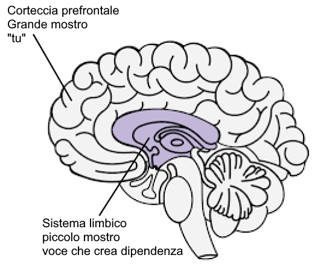

# Risorse {.unnumbered}

[Meditations of a Porn Addict](../resources/meditations.pdf) - Guillaco

[EasyPeasy Statements Checklist](https://pastebin.com/dybv6qkD) - SWATxKATS

[9 Minute Meditation](https://www.youtube.com/watch?v=tw7XBKhZJh4) - Sam Harris

[Waking Up Meditation Course](https://wakingup.com) - Sam Harris

[Exiting Modernity](https://meta-nomad.net/exiting-modernity) - Meta Nomad

[Letter I'm sending to schools](../resources/principal.pdf)

[Freedom Forever (PMO Hacknotes)](https://sites.google.com/view/freeforever/home)

[Why you're relapsing - u/Different_Guide_5205](https://old.reddit.com/r/pmohackbook/comments/mynwjl/why_youre_relapsing/)

[Countering Fear - u/Different_Guide_5205](https://old.reddit.com/r/pmohackbook/comments/n5027n/countering_fear/)

## REBT Dichiarazioni di coping {.unnumbered}

-   *"Posso smettere di fare PMO, anche se sembra"difficile" farlo. Non è troppo difficile, e non importa quanto ci voglia, ne vale la pena!"*.

-   *"Se continuo a ignorare e a non cedere ai miei potenti impulsi a fare PMO, mi sarà sempre più facile resistere"*.

-   *"Riesco ad accettarmi pienamente e incondizionatamente - sì, anche con tutti i miei difetti e le mie mancanze"*.

-   *"La PMO sembra"curare" rapidamente i miei problemi, ma in realtà li peggiora"*.

-   *"A volte mi piacerebbe molto affogare i miei problemi nel PMO, ma questo non è mai un motivo per farlo"*.

-   *"La cosa più spiacevole è quando non ottengo ciò che voglio davvero. Ma non è terribile o orribile a meno che io non scelga di credere che lo sia, e scelga di credere a qualcosa di più realistico e utile"*.

-   *"Non mi piacerà mai un trattamento ingiusto, ma posso benissimo sopportarlo e forse complottare e tramare per fermarlo"*.

-   *"Non importa quante volte io fallisca in questa importante ricerca, il mio fallimento non mi rende mai un pidocchio incompetente. Mi rende solo una persona che può aver agito in modo incompetente in quel momento"*.

-   *"Non ho assolutamente bisogno di ciò che voglio, ma posso comunque essere ragionevolmente felice, anche se non così felice come quando non lo ottengo"*.

-   *"Preferisco fortemente essere eccellente nel mio lavoro, ma non devo esserlo per forza. Peccato se non lo sono, ma questo non mi rende inferiore. Posso sempre cercare di fare meglio, senza bisogno di fare meglio"*.

-   *"Molte cose possono contribuire a farmi dispiacere e a deludermi, ma quando pretendo e ordino che queste cose non debbano esistere, mi faccio prendere dal panico, dalla depressione e dalla rabbia"*.

-   *"Sì, spesso non sono riuscito a fare ciò che avevo promesso di fare, ma questo non significa che non posso o non voglio portare a termine la promessa"*.

-   *"Odio da morire essere ansioso e depresso, ma non devo dissolvere immediatamente questi sentimenti con la PMO. Quando faccio PMO, mi sento temporaneamente meglio riguardo ai miei problemi, ma non sto meglio. A lungo andare, il PMO li peggiora"*.

-   *"Le persone non mi fanno arrabbiare trattandomi male. Io scelgo di infuriarmi per il loro cattivo trattamento, chiedendo e comandando che si comportino meglio"*.

## Combinando EasyPeasy con la Tecnica di riconoscimento vocale delle dipendenze (AVRT) di Jack Trimpey {.unnumbered}

*Credit to az#8773 on Discord*

Questo è per le persone che hanno difficoltà a utilizzare il metodo Easyway di Allen Carr per guarire da una dipendenza, nonostante la rimozione del lavaggio del cervello. Presumo che chi sta leggendo abbia letto uno dei libri di Allen Carr e abbia compreso il suo metodo Easyway (alias Easypeasy). In caso contrario, consiglio vivamente di farlo. Sarebbe utile anche leggere "Rational Recovery" di Jack Trimpey. Se non l'avete letto, non c'è problema perché qui ne tratterò le basi, ma vi consiglio di leggerlo comunque perché entrerà molto più nel dettaglio di quanto farò io. Questo scritto non sarà rivolto a una dipendenza in particolare e sarà quindi applicabile a qualsiasi dipendenza. Lo scopo di questo scritto è quello di confrontare Easyway con un altro metodo di successo per il recupero delle dipendenze, chiamato "Addictive Voice Recognition Technique" (AVRT), e di combinare i due metodi. Sebbene io ritenga che Easyway sia di gran lunga superiore a tutti gli altri metodi di recupero delle dipendenze, credo che la comprensione anche dell'AVRT possa essere l'anello mancante per tanti che falliscono con Easyway nonostante abbiano ucciso il grande mostro.

Esistono molti metodi concorrenti per superare la dipendenza, ognuno con percentuali di successo diverse. Non ne citerò nessuno perché la maggior parte di essi sono una perdita di tempo e voglio essere il più breve possibile. Gli unici metodi di cui parlerò sono Easyway di Allen Carr e AVRT di Jack Trimpey (fondatore di Rational Recovery). Entrambi i metodi hanno tassi di successo estremamente elevati, ma ognuno di essi si rivolge a un aspetto diverso. Easyway e AVRT sono simili in quanto Easyway separa la dipendenza in "Piccolo mostro" e "Grande mostro", mentre AVRT separa la mente in "Voce della dipendenza" (alias la bestia) e "Tu". La voce della dipendenza e il piccolo mostro sono la stessa cosa, mentre il grande mostro (alias lavaggio del cervello) è il sistema di credenze che vi fa credere che la vostra dipendenza vi dia qualche beneficio o appoggio. Easyway si concentra sull'eliminazione del mostro grande, senza tenere conto del mostro piccolo, mentre AVRT si concentra sul mostro piccolo, senza tenere conto del mostro grande. Mentre Easyway distrugge la dipendenza psicologica, la AVRT vi insegna a riconoscere la dipendenza fisica che si maschera da voi e a separarvi da essa. Trovo interessante che Easyway e AVRT abbiano entrambi tassi di successo molto elevati, nonostante si concentrino su aspetti opposti.

Sebbene ritenga che Easyway sia di gran lunga superiore a tutti gli altri metodi di recupero dalle dipendenze e lo raccomandi sopra ogni altra cosa, posso individuare due piccole lacune. In primo luogo, trovo che sottovaluti il piccolo mostro. Voglio evitare di usare aneddoti personali in questo scritto, ma dalle mie esperienze e da quelle di altri sembra che alcuni di noi falliscano con Easyway non perché non sono riusciti a eliminare completamente il mostro grande (anche se questo può accadere e accade), ma perché hanno sottovalutato il mostro piccolo. Il mostro piccolo non è un problema per la maggior parte delle persone, il che spiega le alte percentuali di successo di Easyway, ma per altri, me compreso, può esserlo. Il secondo punto debole è che Easyway sostiene che tutti i fallimenti sono dovuti al fatto di non aver seguito le istruzioni o di non aver rimosso il mostro grande.

Il succo di base di Easyway è questo. La dipendenza ha due componenti: la dipendenza fisica dalla dopamina e la dipendenza psicologica composta dalle convinzioni (lavaggio del cervello) che la dipendenza dia una sorta di piacere o di stampella. Queste componenti sono chiamate, rispettivamente, il piccolo e il grande mostro. Secondo Easyway, il piccolo mostro non è altro che un sentimento vuoto leggermente insicuro, appena percettibile. Una volta ucciso il mostro grande, annullando il lavaggio del cervello e imparando che la dipendenza non ha benefici e che qualsiasi piacere o appoggio percepito è solo un'illusione, e soprattutto che non c'è nulla da temere da una vita senza dipendenza, le voglie scompaiono. Le voglie derivano dalla paura che la vita senza il vostro piccolo appoggio sarebbe insopportabile, il che vi porta a dubitare di smettere, il che rappresenta la voglia. Si supera la paura rendendosi conto di quanto sarà più piacevole la vita senza la propria dipendenza e si mantiene questa sensazione di euforia.

Sono convinto che questo sia il metodo migliore per guarire da una dipendenza, ma non pone l'accento sul piccolo mostro perché, in teoria, una volta che ci si è occupati del mostro grande, il piccolo mostro, impotente e indifeso, appassirà e morirà da solo, e comunque è quasi impercettibile, quindi chi se ne frega. Il piccolo mostro può essere insignificante per molte persone, ma dalle mie esperienze e da quelle di altri sembra che non sia sempre così. Quando le persone falliscono con Easyway, secondo Easyway, ci sono solo due ragioni possibili: o non avete seguito correttamente le istruzioni o non avete rimosso il mostro grande. Ritengo che ciò sia dannoso e spiegherò il perché più avanti.

La tecnica di riconoscimento vocale delle dipendenze (AVRT) separa il cervello in due parti: il cervello inferiore (sistema limbico) dove risiede la vostra dipendenza e il cervello superiore (corteccia prefrontale) dove risiedete voi (o almeno i vostri pensieri e il vostro ego). Jack Trimpey si riferisce alla voce della dipendenza come alla bestia, perché risiede nella parte animale del nostro cervello e sa solo una cosa: "LO VOGLIO E LO VOGLIO ORA". Personalmente non trovo utile personificarla come una bestia, ma suppongo sia meglio che credere che si tratti di voi. La voce della dipendenza (AV, piccolo mostro) dirotta la voce della vostra mente e la usa contro di voi per indurvi a indulgere nella vostra dipendenza. Deve farlo perché non può controllare da sola le vostre funzioni motorie. Provate a farlo ora: alzate la mano davanti al viso e muovete le dita. Ora chiedete alla vostra dipendenza di fare lo stesso. Non ci riesce. Ciò significa che, in ultima analisi, siete voi ad avere il controllo.

L'AV non solo dirotta la voce della vostra mente, ma si nasconde anche in modo ingannevole dietro il pronome "io". Dice: "Mi servirebbe proprio X in questo momento", "Mi manca proprio fare X", "Non sarebbe bello fare X proprio adesso, dopo tutto me lo merito dopo oggi". La AVRT sottolinea il fatto che voi non siete la vostra voce che crea dipendenza, ma solo pensate di esserlo. Quando riconoscete l'AV come "non voi" e gli dite di no, esso abbandona l'"io" e inizia a usare il "voi" o il "noi". Questa è la prova che non siete voi.

Quando dite "no" al vostro AV, succede questo: "Potrei davvero fare a meno di X in questo momento" diventa "Oh, andiamo, potresti davvero fare a meno di X in questo momento e lo sai". "Mi manca proprio fare X" diventa "Ma dai, ti manca proprio fare X, non lo senti?". "Non sarebbe bello fare X adesso, dopo tutto me lo merito dopo oggi" diventa "Ci meritiamo di fare X adesso dopo tutto quello che abbiamo passato, come puoi negarcelo?".

A questo punto devo chiarire una cosa. Non si tratta del "tiro alla fune" a cui si riferisce Allen Carr. Il "tiro alla fune" è la dissonanza cognitiva, cioè quando si hanno due o più sistemi di credenze contrastanti ed è il risultato della mancata uccisione del grande mostro. "Non voglio fare X a causa dell'effetto negativo che mi provoca, ma mi rende anche X, quindi voglio farlo". Questo è il tiro alla fune ed è l'azione del grande mostro. Una volta che il mostro grande sarà morto rimuovendo il lavaggio del cervello, le uniche voci che vi diranno di impegnarvi nella vostra dipendenza verranno dal mostro piccolo (l'AV). Poiché l'AV usa il pronome "io", è possibile confondere l'AV con il grande mostro.

È anche importante sottolineare che l'AV è un grande bugiardo. La sua unica preoccupazione è ottenere dopamina a qualsiasi costo. L'AV cercherà di convincervi a mettervi in situazioni potenzialmente mortali pur di ottenere una dose.

Prima ho detto: "Quando le persone falliscono con Easyway, secondo Easyway, ci sono solo due ragioni possibili: o non avete seguito correttamente le istruzioni o non avete rimosso il grande mostro. Credo che questo sia dannoso e spiegherò perché più avanti". Credo che questo sia dannoso perché il mancato riconoscimento dell'AV ha portato me e altri che hanno usato Easyway a credere erroneamente di non aver ucciso completamente il grande mostro, per cui rileggiamo il libro per cercare di uccidere di nuovo il lavaggio del cervello anche se lo abbiamo già fatto. Il mancato riconoscimento dell'AV, unito alla convinzione che "se hai fallito con Easyway significa che non sei riuscito a uccidere il grande mostro", ti porterà a concentrare i tuoi sforzi sul grande mostro quando è già stato sconfitto. Potreste finire in un ciclo di rilettura dei libri di Allen Carr, che dura un po' e poi ricade ancora e ancora.

Quando l'AV dice qualcosa come "Voglio fare X adesso perché mi fa diventare X", se avete annullato il lavaggio del cervello e rimosso il grande mostro, potreste pensare: "Ma so che questo non è vero, quindi perché continuo a crederlo? Non sono riuscito ad annullare completamente il lavaggio del cervello". La verità è che avete rimosso il lavaggio del cervello, come dimostra il fatto che sapete meglio di quello che il vostro AV vi sta dicendo, solo che pensate che l'AV sia voi perché ha usato il pronome "io". Riconoscere l'AV e costringerlo a rivelarsi abbandonando l'"io" per "tu", "noi" o "ci" dovrebbe confermarvi che non si tratta del mostro grande, ma del mostro piccolo. Se fosse davvero il mostro grande, non sostituirebbe l'io con il tu, il noi o il noi.

Ora, quando l'AV dice: "Per favore, possiamo fare X un'altra volta in memoria dei vecchi tempi, solo un'altra volta?" e voi dite "No", potreste provare una reazione emotiva. Potreste provare paura o tristezza. È estremamente importante rendersi conto che questa sensazione non proviene da voi, ma da lui. Se non siete in grado di riconoscere l'AV, penserete che questa emozione provenga da voi e sarete più inclini a cedere. Riconoscete l'AV e il fatto che le emozioni che ne derivano non provengono da voi, quindi provate gioia per questo.

Quando metterete insieme questi due metodi (se necessario, non tutte le persone sembrano avere problemi con il piccolo mostro) e manterrete una sensazione di gioia ed euforia ogni volta che riconoscerete l'AV, il successo sarà vostro.
