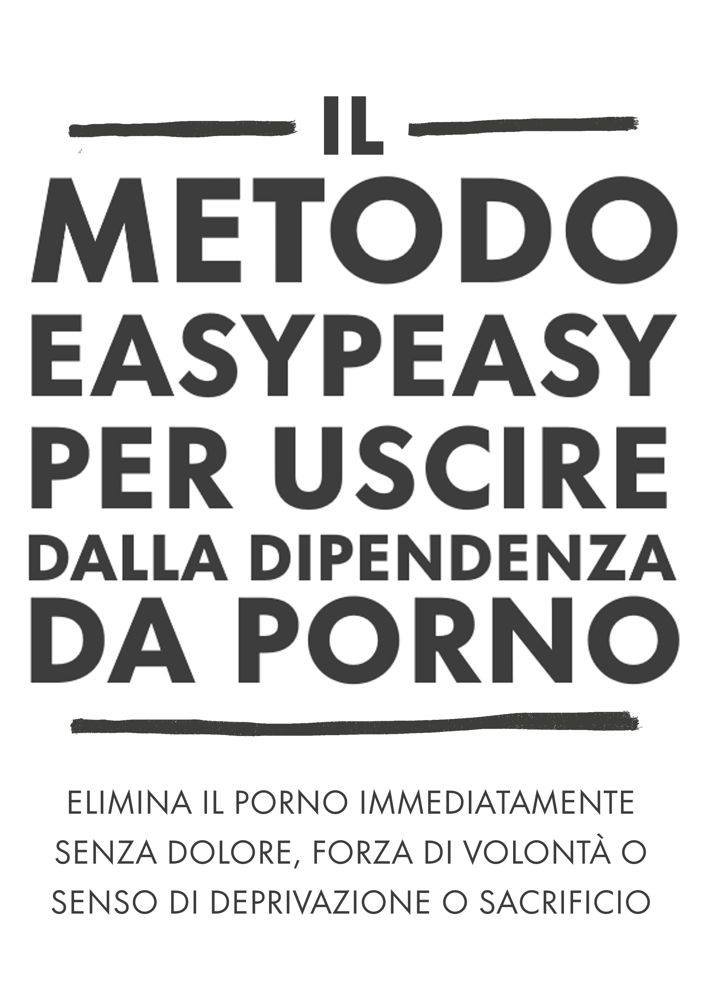

# Introduzione

{width="45%" height="45%"}

[NON SALTARE I PARAGRAFI]{style="font-size:xx-large;"}

Questo libro open source vi permetterà di smettere di usare la pornografia in modo immediato, indolore e permanente, senza forza di volontà o senso di privazione o sacrificio.
Non vi darà alcun giudizio, imbarazzo o pressione a sottoporvi a misure dolorose.

In realtà, non è assolutamente necessario ridurre il consumo durante la lettura; anzi, farlo è dannoso.

Potreste essere in apprensione al solo pensiero, o uno dei [milioni](https://old.reddit.com/r/nofap) che [attivamente](https://old.reddit.com/r/pornfree) [tentano](https://rebootnation.org) di [smettere](https://yourbrainrebalanced.com).
Se è così, forse ciò che hai letto va contro tutto ciò che ti è stato detto, ma chiedetevi se ciò che ti è stato detto ha funzionato.
Se così fosse, non staresti leggendo questo libro.

Forse vi riconoscete nelle seguenti domande:

-   Trascorri molto più tempo a guardare materiale pornografico di quanto avresti voluto?

-   Non riesci a smettere o a limitare il consumo di pornografia?

-   Il tempo trascorso a guardare la pornografia ha interferito o ha avuto la precedenza su impegni personali o professionali, hobby o relazioni nella tua vita?

-   Fai di tutto per tenere nascosto il tuo consumo di pornografia (ad esempio, cancellando la cronologia del browser, mentendo sulla visione di materiale pornografico)?

-   La visione di pornografia ha causato problemi significativi nelle relazioni intime?

-   Sperimenti un ciclo di eccitazione e piacere prima e durante il consumo di pornografia, seguito da sentimenti di vergogna, colpa e rimorso?

-   Trascorri una quantità significativa di tempo pensando alla pornografia, anche quando non la guardati?

-   La visione di pornografia ha causato altre conseguenze negative nella tua vita personale o professionale (ad esempio, lavoro rimandato, scarso rendimento, relazioni trascurate, problemi finanziari)?

Se sei un utilizzatore del porno che dipende da esso per la masturbazione o per il sesso, *per qualsiasi motivo*, non devi fare altro che continuare a leggere.
Se sei qui per una persona cara, non devi fare altro che convincerla a leggere questo libro.
Ma se non riesci a persuaderli, leggi tu stesso il libro.
Capire il metodo aiuta a trasmettere il messaggio e ad evitare che i tuoi figli inizino.
Non lasciarti ingannare dal fatto che non ne hanno accesso ora: tutti ne hanno accesso prima di diventare dipendenti.

## Sul libro {-}

Questo libro è una versione riscritta di una [riscrittura](https://sites.google.com/site/hackbookeasypeasy) di *Allen Carr's EasyWay to Smoking* per la pornografia, è gratis e open source e concesso in licenza CC-BY-SA.
Il suo successo si basa sul fatto che tu:

[NON SALTi I PARAGRAFI]{style="font-size:xx-large;"}

Quando si apre una serratura a combinazione, bisogna inserire i numeri nell'ordine giusto.
La dipendenza non è diversa.

Personalmente, la [versione originale di Google Sites](https://sites.google.com/site/hackbookeasypeasy) (che non è stata scritta da me) mi ha cambiato la vita.
Se sei come la maggior parte delle persone, hai scoperto il porno quando eri relativamente giovane e lo usi da allora.
Fino a quando non ti sei imbattuto in una letteratura schiacciante - ma in qualche modo censurata - che ne avverte i pericoli.
Come me, probabilmente sei riuscito a smettere per periodi più o meno lunghi, ma alla fine hai sempre ceduto agli impulsi illusori.
Sono lieto di comunicarti che questo metodo funziona in modo completamente diverso ed è stato l'unico metodo che ha funzionato.

O forse ti è stato segnalato questo libro da una persona interessata e sei scettico.
Innanzitutto, ti ringrazio per avergli dato almeno un'occhiata.
Questo aspetto sarà approfondito tra poco, ma ti prego di ricordare brevemente la prima volta che hai guardato della pornografia.
Ti aspettavi di tornarci per il resto della tua vita?
Secondo i miei studi informali sull'argomento (ho spinto gli amici a leggere questo libro), EasyPeasy è altrettanto efficace sia per i consumatori occasionali di pornografia che per quelli fortemente dipendenti.
Non è lungo, con alte possibilità di grandi risultati, quindi ti prego di continuare a leggere.

Il metodo descritto in questo manuale è:

-   Immediato.

-   Efficace sia per i consumatori abituali che per quelli occasionali.

-   Non provoca crisi di astinenza.

-   Non richiede forza di volontà.

-   Non richiede terapie d'urto, aiuti o espedienti.

-   Non ti porterà a sostituire questa dipendenza con altre, come mangiare troppo, fumare o bere.

-   Permanente.

Forse ti sembrerà impossibile da credere, ma questo sentimento è condiviso da molte persone.

> *"Si tratta dell'opera fondamentale sulla dipendenza dal porno"*
>
> --- Un ragazzo su reddit che non riesco a trovare.

> "*Sono stato dipendente per 10 anni. In quei 10 anni sono stata paralizzato dalla depressione, dai dubbi, dall'ansia e dalla paura che il mio segreto venisse fuori. Dopo ogni masturbazione, mi odiavo e dopo ogni astinenza dal porno tornavo a scivolarci subito. Tuttavia, questo libro mi ha aiutato a smettere. In passato ero sempre sulla difensiva verso il porno. Ora, dopo aver letto questo libro due volte, sono all'attacco. Il porno non ha alcun controllo su di me e ora mi sembra una triste barzelletta.*"
>
> --- u/DeepNewt

> "*Qualche giorno fa ho compiuto 20 anni. Per la prima volta dopo tanto tempo, ho trascorso il mio compleanno libero dalla trappola del porno, e tutto grazie a questo libro in cui mi sono imbattuto casualmente solo pochi mesi fa. Prima di allora, avevo passato molto tempo a cercare di smettere con i mezzi tradizionali, sperimentando così tanti turbamenti interiori ed etichettandomi definitivamente come dipendente. Il libro ha risolto tutto questo per me. Laddove prima temevo di non avere alcun controllo su me stesso, anche quando avevo inconsapevolmente già sconfitto il piccolo mostro, ora posso essere orgoglioso di capire che non ho più bisogno di essere una tossicodipendente.*
>
> *Non ho una vera e propria ragione per postare questo commento, ho solo sentito il bisogno di scriverlo in un posto diverso dalla mia testa, perché significa molto per me. Se state leggendo e state pensando di leggere o consigliare il libro, sappiate che funziona meglio di qualsiasi altro metodo in circolazione. Il mio consiglio più grande è quello di prendere appunti, che sembra buffo, ma mi ha davvero aiutato a consolidare certe idee.*"
>
> --- u/Suspicious_Web_4594

> "*based*"
>
> --- anon, /fit/

## Attenzione

Se ti aspetti che questo libro ti "spaventi" per farti smettere, facendo leva sui vari problemi di salute che gli utenti rischiano, come le disfunzioni sessuali (compresa la disfunzione erettile indotta dal porno), l'inaffidabilità dell'eccitazione, la perdita di interesse per i partner sessuali reali, l'ipofrontalità cerebrale e l'accusa accecante che si tratta di un'abitudine sporca e disgustosa e che *tu* sei una medusa stupida, smidollata e debole, rimarrai molto deluso.
Queste tattiche non mi hanno mai aiutato a smettere e se ti avessero aiutato, avresti già smesso.

I metodi convenzionali per smettere prevedono l'uso della forza di volontà o dell'"astensione dal porno", come "usare una volta ogni *n* giorni" e ridurne il consumo.
Alcuni siti elencano ricerche peer-reviewed sui neurotrasmettitori e la neuroplasticità e, sebbene questi siti siano informativi, molti sono consapevoli dei rischi per la salute e scelgono di non fare nulla, anche se questo materiale è tipicamente evitato.
In definitiva, sono ugualmente inefficaci perché non eliminano le ragioni che spingono a usare il porno.
Infine, trasformare qualcosa in un frutto proibito non è il modo di trattare la dipendenza.

Questo metodo, denominato EasyPeasy, funziona in modo diverso.
Alcune delle cose che stanno per essere dette potrebbero essere difficili da credere, ma quando avrai finito questo libro, non solo ci crederai, ma ti chiederai come hai fatto a farti fare il lavaggio del cervello per credere il contrario.

C'è un'idea sbagliata comune secondo cui siamo noi a scegliere di guardare il porno.
I pornodipendenti (sì, i dipendenti) non scelgono di guardare il porno più di quanto gli alcolisti scelgano di diventare alcolisti o gli eroinomani di diventare eroinomani.
È vero che scegliamo di avviare il computer portatile o lo smartphone, accendere il browser e visitare il nostro "harem online" preferito.
Ogni tanto scelgo di andare al cinema, ma di certo non ho scelto di passare tutta la mia vita in sala.
In origine, la curiosità e la natura umana mi hanno portato lì, ma non avrei iniziato se avessi saputo che sarei diventato dipendente, portando al declino la mia salute, la mia felicità e le mie relazioni.
*"Se solo avessi sentito parlare di disfunzioni sessuali durante la mia prima visita a quel sito porno!"*

Prenditi un momento per riflettere: hai mai preso la decisione "positiva" che devi/hai bisogno del porno per masturbarti?
O che dovresti/devi/hai bisogno di fantasie indotte dal porno per rendere più piccante il sesso con il tuo partner?
O che, in certi momenti della tua vita, non sei riuscito a godervi una buona notte di sonno o forse nemmeno a passare una serata dopo una dura giornata di lavoro senza utilizzare il porno?
O che non riuscivi a concentrarti o a gestire lo stress senza di esso?
A che punto hai deciso che hai *bisogno* del porno, che ne hai *bisogno* in modo permanente nella tua vita, sentendoti insicuro, persino in preda al panico senza il porno, senza il tuo harem online?

Come tutti gli altri utilizzatori del porno, sei stato attirato nella trappola più sinistra e sottile che l'uomo e la natura abbiano mai escogitato.
Non c'è persona al mondo, che sia un utente o meno, a cui piaccia il pensiero che i propri figli usino il porno per affrontare un'emozione o per piacere.
Ciò significa che tutti i dipendenti vorrebbero non aver mai iniziato.
Questo non sorprende: nessuno ha bisogno del porno per godersi la vita o per affrontare lo stress prima di diventarne dipendente.

Allo stesso tempo, tutti gli utenti desiderano continuare a utilizzarlo.
Dopo tutto, nessuno ci obbliga ad aprire la modalità in incognito del nostro browser.
Che ne capiscano o meno il motivo, sono solo gli utenti che decidono di bussare alle porte dei loro harem online.

Se ci fosse un pulsante magico che l'utente potesse premere per svegliarsi la mattina seguente come se non avesse mai avuto accesso al suo primo sito porno, gli unici dipendenti di domani sarebbero i giovani che stanno ancora "sperimentando".

L'unica cosa che ci impedisce di smettere è la **Paura!** Paura causata dalla convinzione di dover sopravvivere a un periodo indeterminato di miseria, privazione e desiderio insoddisfatto per potersi liberare dal porno.
Queste credenze derivano da convinzioni irrazionali, sia apprese che acquisite, quali:

-   La masturbazione o il sesso che porta all'orgasmo è la *sola* e *più* importante cosa nella vita.

-   Il porno è "più sicuro" del sesso nella vita reale perché il porno non può respingermi.

-   Il porno è educativo e utile.

-   Diritto a un'esperienza sessuale "superiore".

-   Di più è sempre meglio.

Queste convinzioni irrazionali generano conseguenze irrazionali quando vengono messe in atto, tra cui:

-   Venerazione e ossessione quando si trova un "10/10 perfetto".

-   Percepirsi come un perdente se ci si perde il sesso, come se fosse la cosa più importante dell'esperienza umana.

-   Aspettarsi un 10 perfetto.

-   Essere eccessivamente critici e giudicanti nei confronti dei potenziali partner.

-   Costringersi a fare sesso, che lo si voglia o meno.

È la paura che una notte da soli sia infelice, trascorsa a combattere impulsi incontrollabili.
La paura che la notte prima degli esami sia una notte d'inferno senza il porno.
La paura di non riuscire più a concentrarsi, a gestire lo stress o a essere sicuri di sé senza il nostro piccolo appoggio e che la nostra personalità e il nostro carattere cambino.

Ma soprattutto, la paura che "una volta drogati, sempre drogati": che non saremo mai completamente liberi, passando il resto della nostra vita a desiderare l'occasionale orgasmo indotto dal porno in momenti strani.
Se, come me, hai già provato tutti i metodi convenzionali per smettere e sei passato attraverso la miseria e la tortura del "metodo della forza di volontà", non solo sarai colpito da questa paura, ma sarai convinto di non poter mai smettere.

Se sei in apprensione, in preda al panico o senti che non è il momento giusto per smettere, ti assicuro che la tua apprensione e il tuo panico non sono alleviati dal porno, ma sono causati da esso.
Non hai deciso tu di cadere nella trappola del porno, ma come tutte le trappole, è progettata per fartici rimanere dentro.
Chiediti: quando hai visto le prime foto e i primi video porno, hai deciso di tornare a vederli finché vivrai?
Quindi, quando smetterai?
Domani?
L'anno prossimo?
Smettila di prenderti in giro!
La trappola è progettata per trattenerti a vita.
Altrimenti perché pensate che tutti gli altri tossicodipendenti non smettano prima che la trappola "uccida" le loro vite?

Ho parlato di un pulsante magico; EasyPeasy funziona proprio come quel pulsante magico.
Vorrei chiarire che EasyPeasy non è una magia, ma per me e per altri che hanno trovato così facile e piacevole smettere, sembra proprio così!

L'avvertimento è il seguente: La situazione è quella dell'uovo e della gallina: ogni dipendente vuole smettere e ogni dipendente può trovare facile e piacevole smettere.
È solo la **paura** che impedisce agli utenti di provare a smettere.
Il guadagno più grande è quello di liberarsi da questa paura, ma non lo si farà finché non si completerà il libro.
Anzi, la paura potrebbe aumentare man mano che si prosegue nella lettura, impedendovi di finirlo.
Prendete questo commento di una donna.

***"Ho appena finito di leggere EasyPeasy. So che sono passati solo quattro giorni, ma mi sento così bene che so che non avrò mai più bisogno di usare il porno. Ho iniziato a leggere il libro cinque mesi fa, sono arrivata a metà strada e sono andata nel panico. Sapevo che se avessi continuato a leggere avrei dovuto smettere. Non sono stata sciocca?"***

Non hai deciso tu di cadere nella trappola, ma abbi ben chiaro in mente che non ne uscirai a meno che non prendi la decisione affermativa di farlo.
Forse stai già tirando il guinzaglio per smettere, o forse sei in apprensione al solo pensiero, ma in ogni caso tieni a mente che: \*\*NON HAI NULLA DA PERDERE!\*
\*

Se alla fine del libro deciderai di continuare a usare il porno per la masturbazione o il sesso, non c'è nulla che ti impedisce di farlo.
Non devi nemmeno ridurre o smettere di usare il porno mentre leggete il libro, e ricorda, non c'è nessuna terapia d'urto.
Al contrario, ho solo buone notizie per te.
Riesci ad immaginare come si è sentito Andy Dufresne quando è finalmente evaso dalla prigione di Shawshank?
È così che mi sono sentito io quando sono scappato dalla trappola del porno, ed è così che si sentono gli ex utenti che hanno usato EasyPeasy.
Alla fine del libro, è così che ti sentirai anche tu!
Coraggio!

## Infine... {.unnumbered}

Tutti possono trovare facile e piacevole smettere con il porno, anche tu!
Tutto ciò che devi fare è leggere il resto di questo libro con una mente aperta; più capirai, più sarà facile.
Anche se non capisci qualche parola, basta che segui le istruzioni e ti sarà facile.
Soprattutto, non passerai la vita a rimpiangere il porno o a sentirti privato, e alla fine del libro l'unico mistero sarà perché l'hai fatto per così tanto tempo.

Con EasyPeasy, ci sono solo due ragioni per fallire.

**Mancata esecuzione delle istruzioni**.
Alcuni troveranno fastidioso il fatto che il libro sia così dogmatico su alcune raccomandazioni, come ad esempio quella di non provare a ridurre o usare sostituti.
Non nego certo che ci siano molti che sono riusciti a smettere usando questi stratagemmi, ma ci sono riusciti *nonostante* e non grazie ad essi.
C'è chi riesce a fare l'amore in piedi su un'amaca, ma non è il modo più semplice.
I numeri per aprire la serratura di questa trappola sono in questo libro, ma devono essere usati nell'ordine corretto: passando da un capitolo all'altro e non saltando i capitoli.

**Non capire**.
Non date nulla per scontato, metti in discussione non solo ciò che vi viene detto, ma anche le tue opinioni e ciò che la società ti ha detto sul sesso, il porno su Internet e la dipendenza.
Per esempio, chi crede che sia solo un'abitudine, si chieda perché altre abitudini, alcune delle quali piacevoli, sono facili da interrompere, mentre un'abitudine che fa stare male, costa energia, tempo e virilità è così difficile da interrompere.
Quelli che credono che a loro piaccia il porno, si chiedano perché altre cose che sono infinitamente più piacevoli si possono prendere o lasciare.
Perché si deve avere il porno, e se non lo si ha si scatena il panico?

EasyPeasy sta per darti la conoscenza di quanto sia facile e piacevole smettere con il porno.
Come per molte altre persone, uno dei miei più grandi trionfi nella vita è stato quello di sfuggire alla trappola del porno.
Non c'è bisogno di sentirsi depressi, al contrario, state per realizzare qualcosa che ogni utente del pianeta vorrebbe ottenere: **LA LIBERTÀ!**

**RICORDA, NON SALTARE I PARAGRAFI.**

Alcuni termini prima di iniziare: ***PMO***: Il ciclo di porno, masturbazione e orgasmo.
***Harem online***: Siti web che ospitano porno ad alta velocità su Internet.

## Consigli per la lettura e note finali minori

**Non leggere questo libro come un libro normale**, è molto breve e dovresti essere in grado di finirlo in un paio d'ore.
La maggior parte delle persone trae beneficio dal *sottolineare o prendere appunti*, e di solito si consiglia di **rileggerlo** un paio di volte per consolidare completamente le lezioni.

Perché l'hackbook?
Perché Allen Carr è morto da tempo e le istituzioni da lui fondate non elencano la pornografia su Internet tra le dipendenze per le quali offrono un trattamento.
Non ci guadagno né in denaro né in altro modo.

In questo libro, io, l'autore originale di Hackauthor e Allen Carr scriviamo in modo trasparente per fornirvi un metodo unico e convincente per smettere in modo facile e indolore.

[**Hackbook:** Un libro basato e hackerato da un altro libro. L'autore originale è pienamente accreditato.]{style="font-size:smaller;"}

Esistono anche diverse comunità per l'hackbook, ma vi consigliamo di visitarle solo dopo aver finito di leggere il libro.

[urbit](https://urbit.org) - \~mislyr-midnyt/coomer (Adesso davvero funzionante!! Miglior metodo di contatto possibile, usa questo per favore) \| [coomer meme archive](https://coomer.org) \| [analytics](https://plausible.io/easypeasymethod.org) \| [matrix](https://matrix.to/#/!xmJZznbJXuwzEGSEti:matrix.org?via=matrix.org) \| [discord](https://discord.com/invite/bCXEnf9) \| [reddit](https://reddit.com/r/pmohackbook) \| [feedback form](https://forms.gle/p7cTxowaNpKqgi5Z7)

Promemoria veloce: [**NON SALTARE I PARAGRAFI**]{style="font-size:larger;"}

Ti augurerei buona fortuna, ma come scoprirai presto, non ne hai bisogno.

Good vibes,

Hackauthor²

{width="88" height="31"}

This work is licensed under a [Creative Commons Attribution-ShareAlike 4.0 International License](https://creativecommons.org/licenses/by-sa/4.0/).
Code is [GPLv3](https://gitlab.com/snuggy/easypeasy/-/blob/master/LICENSE).
