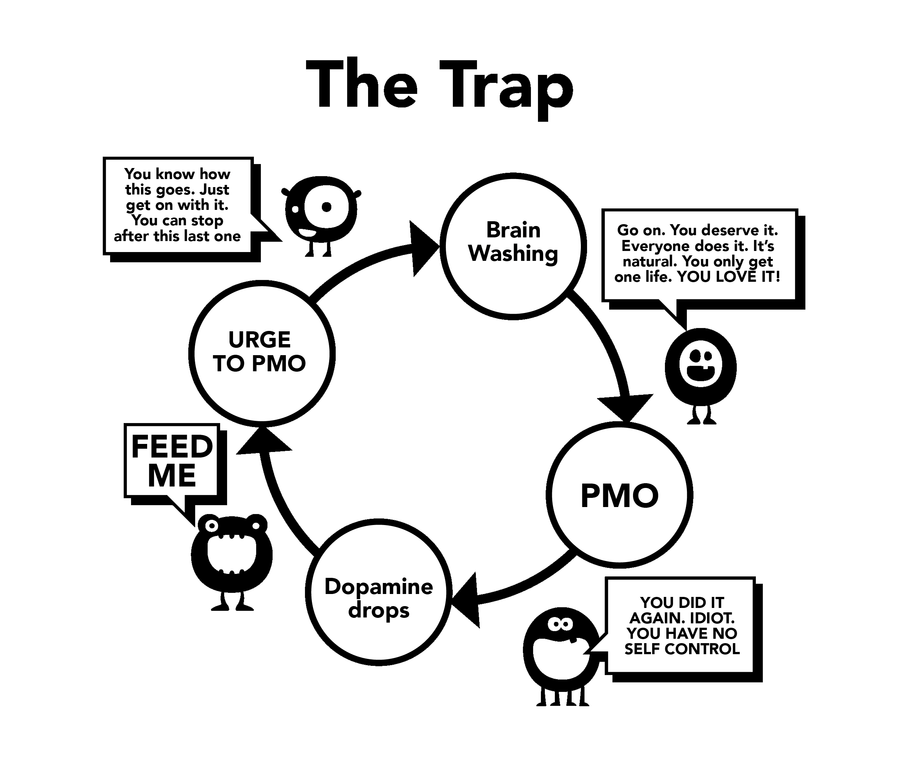

# 세뇌

이것이 우리가 사용하기 시작하는 두 번째 이유입니다. 이 세뇌를 완전히 이해하려면 먼저 초자연적 자극의 강력한 효과를 조사해야 합니다. 우리의 뇌는 단순히 '온라인 하렘'을 만드는 데 준비가 ​​되어 있지 않아서, 조상들이 여러 생애 동안 했던 것보다 15분 만에 더 많은 잠재적 배우자를 바꿀 수 있습니다.

과거에는 많은 잘못된 조언이 있었습니다. 한 가지 예는 자위 행위가 실명으로 이어진다는 것입니다. 이것은 다른 공포 전략과 함께 분명히 지나쳤습니다. 이러한 오해는 과학에 의해 전복되는 것이 옳았습니다. 그러나 아기는 목욕물과 함께 버려졌습니다. 우리의 잠재 의식은 어린 시절부터 성적 메시지와 이미지, 암시로 가득 찬 잡지와 광고로 폭격을 받습니다. 일부 팝 비디오는 극도로 암시적이지만 절망하지 말고 어떤 구성 요소를 사용하는지 식별하는 게임으로 만드세요. 충격적 가치, 참신함, 색상, 크기, 금기, 향수 등입니다. 이러한 게임은 사춘기 전 아동에게 교육 방법으로 가르칠 수도 있습니다.

핵심 메시지는 *"이 세상에서 가장 소중한 것, 내 마지막 생각과 행동은 오르가즘입니다."*입니다. 과장된 표현일까요? TV나 영화 줄거리를 보면 섹스의 감각적(촉각, 후각, 음성)과 전파적(오르가즘) 부분이 뒤섞인 것을 볼 수 있습니다. 이것의 영향은 우리의 의식에 등록되지 않지만 잠재의식은 그것을 흡수할 시간이 있습니다.

## 과학적 추론

반대 방향으로 홍보가 있습니다. 성기능 장애에 대한 공포, 동기 상실, 실제 소녀보다 가상 포르노 선호, YourBrainOnPorn.com 및 다양한 인터넷 하위 문화가 있지만 이러한 운동은 실제로 사람들이 사용하는 것을 막지 못합니다. 논리적으로 말하면 그래야 하지만 간단한 사실은 그렇지 않다는 것입니다. YourBrainOnPorn.com의 심사평가 연구에서 나열된 건강 위험조차도 청소년이 시작하는 것을 막기에 충분하지 않습니다.

아이러니하게도, 이 혼란 속에서 가장 강력한 힘은 사용자 자신입니다. 사용자는 의지가 약하거나 신체적으로 약한 사람이라는 것은 오류입니다. 중독이 존재한다는 것을 알게 된 후에는 신체적으로 강해야 중독에 대처할 수 있습니다. 아마도 가장 고통스러운 측면은 그들이 자신을 실패한 패배자이자 참을 수 없는 내성적인 사람으로 여긴다는 것입니다. 친구가 자기 쾌락을 추구하는 것을 스스로 폄하하지 않았다면 실제로 더 흥미로울 수 있었을 것입니다.

## 의지력 사용 문제

의지력 방법을 사용하여 중단하는 사용자는 자신의 의지력 부족을 비난하고 평화와 행복을 망칩니다. 자기 훈련에 실패하는 것과 자기 혐오는 다른 것입니다. 결국, 섹스 전에 항상 강하고, 적절하게 흥분하고, 파트너를 만족시킬 수 있어야 한다는 법은 없습니다. 우리는 습관이 아니라 중독에 대해 노력하고 있으며, 골프와 같은 습관을 멈추기 위해 스스로에게 논쟁하는 순간은 없지만 포르노 중독에 대해서도 마찬가지입니다. 왜 그럴까요?

지속적으로 초자연적인 자극에 노출되면 뇌가 다시 배선되므로, 중고차 딜러에서 차를 사는 것처럼 이 세뇌에 대한 저항력을 키우는 것이 중요합니다. 예의 바르게 고개를 끄덕이지만 남자가 하는 말은 믿지 않습니다. 따라서 가능한 한 많은 섹스를 해야 한다고 생각하지 마세요. 모든 것이 매우 훌륭하고, 포르노가 없는 상황에서 포르노를 사용합니다.

안전한 포르노 게임도 하지 마세요. 당신의 작은 괴물이 당신을 유혹하기 위해 그 게임을 발명했습니다. 아마추어 포르노는 어떤 권위자에 의해 인증되었나요? 포르노 사이트는 사용자로부터 데이터를 수집하여 사용자의 요구에 부응하고, 특정 범주에서 증가가 보이면 그 부분에 집중하여 최대한 빨리 콘텐츠를 내놓습니다. 교육적 의도나 '안전한' 여성 마케팅 클립에 속지 마세요. 스스로에게 이렇게 물어보세요.*"왜 그러는 거지? 정말 그럴 필요가 있을까?"*

**아니요, 물론 그럴 필요가 없습니다!**

대부분 사용자는 정적이고 부드러운 포르노만 보고 괜찮다고 맹세하지만, 실제로는 유혹에 저항하기 위해 의지력을 발휘하며 끈을 잡고 있습니다. 너무 자주 너무 오랫동안 하면 의지력이 상당히 고갈되고 운동, 다이어트 등 의지력이 매우 중요한 다른 삶의 프로젝트에서 실패하기 시작합니다. 이러한 분야에서 실패하면 비참하고 죄책감을 느끼게 되어 다시 포르노를 사용하게 됩니다. 이렇게 하지 않으면 사랑하는 사람에게 분노와 우울증을 터뜨립니다.

인터넷 포르노에 중독되면 세뇌가 증가합니다. 잠재의식은 작은 괴물에게 먹이를 주어야 한다는 것을 알고 다른 모든 것을 차단합니다. 사람들이 그만두지 못하게 하는 것은 두려움입니다. 도파민으로 뇌를 가득 채우는 것을 멈췄을 때 느끼는 공허하고 불안한 느낌에 대한 두려움입니다. 당신이 그것을 모른다고 해서 그것이 거기에 없다는 것을 의미하지는 않습니다. 고양이가 온수 파이프가 어디에 있는지 이해할 필요가 없는 것처럼 당신은 그것을 이해할 필요가 없습니다. 고양이는 특정 자리에 앉으면 따뜻하다는 것을 알 뿐입니다.

## 수동성

우리의 정신의 수동성과 권위에 대한 의존으로 인해 세뇌가 일어나는 것이 포르노를 포기하는 데 가장 큰 어려움입니다. 사회에서 자란 우리의 양육 방식은 우리 자신의 중독에 대한 세뇌로 강화되었고 가장 강력한 친구, 친척, 동료와 결합되었습니다. '포기'라는 문구는 진정한 희생을 의미하는 세뇌의 전형적인 예입니다. 아름다운 진실은 포기할 것이 없다는 것입니다. 오히려 끔찍한 질병에서 벗어나 놀라운 긍정적인 성과를 거둘 것입니다. 우리는 지금 이 세뇌를 제거하기 시작할 것입니다. 더 이상 '포기'를 언급하지 않고 중단, 그만두기 또는 아마도 진정한 위치인 **탈출**을 언급하는 것으로 시작합니다!

우리가 처음에 사용하도록 설득하는 유일한 것은 다른 사람들이 그것을 하고 우리가 놓치고 있다고 느끼는 것입니다. 우리는 중독되기 위해 열심히 노력하지만, 그들이 놓친 것을 결코 찾지 못합니다. 우리가 다른 클립을 볼 때마다 그 안에 무언가가 있어야 한다는 것을 확신하게 되고, 그렇지 않았다면 사람들이 그것을 하지 않았을 것이고 사업이 그렇게 크지 않았을 것입니다. 습관을 버렸더라도, 파티나 사교 모임에서 섹시한 연예인, 가수, 심지어 포르노 스타에 대한 토론이 나오면 전 사용자는 자신이 박탈당하고 있다고 느낀다. *"내 친구들이 다 그 사람들에 대해 이야기하는 걸 보면 그들은 훌륭할 거야, 그렇지? 온라인에서 무료 사진이 있어?"* 그들은 안전하다고 느끼고, 오늘 밤 한 번만 엿보고는 알아차리기도 전에 다시 빠져든다.

세뇌는 매우 강력하며 그 효과를 알아야 한다. 기술은 계속 발전하고 미래에는 기하급수적으로 빠른 사이트와 접근 방법이 등장할 것이다. 포르노 산업은 가상 현실에 수백만 달러를 투자하여 그것이 다음으로 좋은 것이 되도록 하고 있다. 우리는 어디로 가고 있는지 모르고, 현재 기술이나 앞으로 올 것에 대처할 준비가 되어 있지 않다.

우리는 이 세뇌를 제거하려고 한다. 박탈당하는 것은 비사용자가 아니라, 평생을 포기하는 것은 사용자입니다.

- 건강

- 에너지

- 부

- 마음의 평화

- 자신감

- 용기

- 자존감

- 행복

- 자유

그들은 이러한 상당한 희생에서 무엇을 얻는가? 비사용자가 항상 누리는 평화, 평온, 자신감 상태로 돌아가려는 착각을 제외하고는 **전혀 아무것도** 없습니다.

## 금단 증상

앞서 설명했듯이, 사용자들은 포르노를 즐거움, 휴식 또는 어떤 종류의 교육을 위해 사용한다고 믿습니다. 실제 이유는 금단 증상을 완화하기 위해서입니다. 우리의 잠재의식은 특정 시간에 인터넷 포르노와 자위 행위가 즐거움을 주는 경향이 있다는 것을 배우기 시작합니다. 우리가 약물에 점점 더 중독될수록 금단 증상을 완화해야 할 필요성이 커지고 미묘한 함정이 당신을 더욱 끌어내립니다. 이 과정은 너무 느리게 진행되어 당신은 그것을 알지 못하고, 대부분의 젊은 사용자는 중단하려고 시도하기 전까지는 자신이 중독되었다는 것을 깨닫지 못하고, 심지어 그때조차도 많은 사람들이 그것을 인정하지 않습니다.

치료사가 수백 명의 청소년과 나눈 이 대화를 들어보세요.

>**치료사:** "*인터넷 포르노가 약물이라는 것을 알고 있고 당신이 사용하는 유일한 이유는 당신이 중단할 수 없기 때문입니다.*"
>
>**환자:** "*말도 안 돼! 저는 그것을 즐깁니다. 그렇지 않다면, 저는 그만둘 것입니다.*”
>
>**치료사:** “*그냥 일주일 동안 멈추어서 당신이 원한다면 할 수 있다는 것을 저에게 증명하세요.*”
>
>**환자:** “*그럴 필요 없어요, 저는 그것을 즐깁니다. 제가 그만두고 싶다면, 저는 그렇게 할 것입니다.*”
>
>**치료사:** “*그냥 일주일 동안 멈추어서 당신이 중독되지 않았다는 것을 스스로 증명하세요.*”
>
>**환자:** “*무슨 소용이 있어요? 저는 그것을 즐깁니다.”*

이미 말했듯이, 사용자들은 스트레스, 지루함, 집중력 또는 이러한 것들이 합쳐진 시기에 금단 증상을 완화하는 경향이 있습니다. 다음 장에서는 세뇌의 이러한 측면을 집중적으로 다룰 것입니다.
