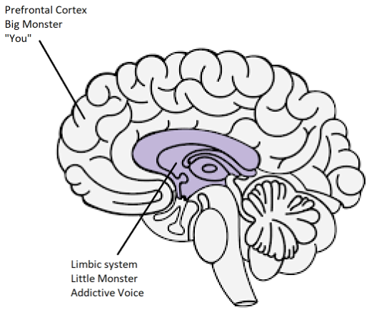

# 리소스 {-}

[Meditations of a Porn Addict](../resources/meditations.pdf) - Guillaco

[EasyPeasy Statements Checklist](https://old.reddit.com/r/pmohackbook/comments/id6nie/easypeasy_statements_checklist/) - SWATxKATS

[9 Minute Meditation](https://www.youtube.com/watch?v=tw7XBKhZJh4) - Sam Harris

[Waking Up Meditation Course](https://wakingup.com) - Sam Harris

[Exiting Modernity](https://jdemeta.net/2019/09/15/exiting-modernity/) - Meta Nomad // ([pdf](https://jdemeta.net/wp-content/uploads/2019/09/Exiting-Modernity.pdf))

[Letter I'm sending to schools](../resources/principal.pdf)

[Freedom Forever (PMO Hacknotes)](https://sites.google.com/view/freeforever/home)

[Why you're relapsing - u/Different_Guide_5205](https://old.reddit.com/r/pmohackbook/comments/mynwjl/why_youre_relapsing/)

[Countering Fear - u/Different_Guide_5205](https://old.reddit.com/r/pmohackbook/comments/n5027n/countering_fear/)

## REBT 대처 진술 {-}

- *“PMO를 멈출 수 있어요. 그렇게 하는 게 ‘어려워’ 보여도요. 그렇게 어렵지 않고, 아무리 힘들어도 그만한 가치가 있어요!”*

- *“PMO에 대한 강력한 충동을 계속 무시하고 절대 굴복하지 않는다면, 저항하기가 점점 더 쉬워질 거예요.”*

- *“저는 제 자신을 완전하고 무조건적으로 받아들일 수 있어요. 네, 제 모든 결점과 실패에도 불구하고요.”*

- *“PMO는 제 문제를 빠르게 ‘치료’하는 듯하지만, 실제로는 더 악화시켜요.”*

- *“때때로 PMO에 제 문제를 익사시키고 싶지만, 그럴 이유는 절대 없어요.”*

- *“제가 정말 원하는 것을 얻지 못할 때 가장 불편해요. 하지만 내가 그렇다고 믿기로 선택하지 않는 한, 끔찍하거나 끔찍한 것은 아니고, 좀 더 현실적이고 도움이 되는 것을 믿기로 선택하지 않는 한 그렇지 않습니다.”*

- *“나는 불공평한 대우를 결코 좋아하지 않을 것이지만, 나는 그것을 잘 견뎌낼 수 있고 아마도 그것을 막기 위해 음모를 꾸밀 수 있을 것입니다.”*

- *“이 중요한 추구에서 아무리 여러 번 실패하더라도, 내 실패는 나를 무능한 이가로 만들지 않습니다. 그것은 단지 그때 무능하게 행동했을지도 모르는 사람으로 만들 뿐입니다.”*

- *“나는 내가 원하는 것이 절대적으로 필요하지는 않지만, 그것을 얻지 못했을 때만큼 행복하지는 않더라도 어느 정도 행복할 수 있습니다.”*

- *“나는 내 일에서 뛰어나기를 강력히 선호하지만, 반드시 그럴 필요는 없습니다. 그렇지 않다면 안타까운 일이지만, 그렇다고 해서 내가 열등한 것은 아닙니다. 더 잘할 필요 없이 더 잘하려고 계속 노력할 수 있어요.”*

- *“많은 것들이 나를 미안하게 만들고 실망하게 만들 수 있지만, 이런 것들이 존재하지 않아야 한다고 요구하고 명령할 때, 나는 당황하고 우울해지고 격노하게 됩니다.”*

- *“네, 저는 종종 제가 하겠다고 약속한 것을 하지 못했지만, 그것이 제가 이 약속을 이행할 수 없거나 이행하지 않을 것이라는 것을 의미하지는 않습니다.”*

- *“저는 불안하고 우울한 것을 몹시 싫어하지만, PMO로 이런 감정을 즉시 해소할 필요는 없습니다. PMO를 할 때, 저는 일시적으로 제 문제에 대해 기분이 나아지지만 나아지지는 않습니다. 장기적으로 PMO는 문제를 더 악화시킵니다.”*

- *“사람들이 저를 나쁘게 대하는 것으로 저를 화나게 하지 않습니다. 저는 그들이 더 잘 행동하라고 요구하고 명령함으로써 그들의 나쁜 대우에 대해 고집스럽게 스스로를 화나게 합니다.”*

## EasyPeasy와 Jack Trimpey의 중독성 있는 음성 인식 기술(AVRT)을 결합 {-}

*Discord의 az#8773에게 크레딧*

이 글은 세뇌를 제거했음에도 불구하고 Allen Carr의 Easyway 방법을 사용하여 중독에서 회복하는 데 어려움을 겪고 있는 사람들을 위한 글입니다. 이 글을 읽는 모든 사람이 Allen Carr의 책을 읽고 그의 Easyway(일명 Easypeasy) 방법을 이해했다고 가정하겠습니다. 그렇지 않다면 강력히 추천합니다. Jack Trimpey의 'Rational Recovery'를 읽어보는 것도 도움이 될 것입니다. 아직 읽지 않으셨다면 문제 없습니다. 여기서 기본 사항을 다룰 것이기 때문입니다. 하지만 제가 할 것보다 훨씬 더 자세히 설명할 것이므로 어쨌든 읽어보는 것이 좋습니다. 이 글은 특정 중독을 겨냥한 것이 아니므로 모든 중독에 적용될 수 있습니다. 이 글의 목적은 Easyway를 '중독적 음성 인식 기술'(AVRT)이라는 또 다른 성공적인 중독 방법과 비교하고 두 가지를 결합하는 것입니다. Easyway가 다른 모든 중독 회복 방법보다 훨씬 뛰어나다고 믿지만, AVRT를 이해하는 것도 Easyway를 사용해도 큰 괴물을 죽였음에도 실패하는 많은 사람들에게는 잃어버린 고리가 될 수 있다고 생각합니다.

중독을 극복하기 위한 경쟁적인 방법은 여러 가지가 있으며, 각각 성공률이 다릅니다. 대부분 시간 낭비이고 가능한 한 짧게 설명하고 싶기 때문에 그 중 어느 것도 언급하지 않겠습니다. 제가 쓸 방법은 Allen Carr의 Easyway와 Jack Trimpey(Rational Recovery 설립자)의 AVRT뿐입니다. 두 방법 모두 성공률이 매우 높지만, 각각 다른 것을 목표로 합니다. Easyway와 AVRT는 Easyway가 중독을 '작은 괴물'과 '큰 괴물'로 분리하고 AVRT가 마음을 '중독적 목소리'(일명 짐승)와 '당신'으로 분리한다는 점에서 비슷합니다. 중독성 있는 목소리와 작은 괴물은 같은 것이고, 큰 괴물(일명 세뇌)은 중독이 어떤 종류의 혜택이나 버팀목을 준다고 생각하게 만드는 신념 체계입니다. Easyway는 작은 괴물에 대한 배려 없이 큰 괴물을 없애는 데 집중하는 반면 AVRT는 큰 괴물에 대한 배려 없이 작은 괴물에 집중합니다. Easyway는 심리적 중독을 파괴하는 반면 AVRT는 자신을 가장한 신체적 중독을 인식하고 그것과 분리하는 법을 가르칩니다. Easyway와 AVRT가 반대되는 것에 초점을 맞추고 있음에도 불구하고 모두 매우 높은 성공률을 보인다는 점이 흥미롭습니다.

Easyway가 다른 모든 중독 회복 방법보다 훨씬 뛰어나다고 믿고 무엇보다도 추천하지만, 두 가지 작은 허점을 지적할 수 있습니다. 첫째, 작은 괴물을 과소평가한다는 것을 알게 되었습니다. 이 글에서 개인적인 일화를 사용하는 것을 피하고 싶지만, 제 경험과 다른 사람들의 경험을 통해 우리 중 일부는 큰 괴물을 완전히 제거하지 못했기 때문이 아니라(이런 일이 발생할 수 있고 실제로 발생하지만) 작은 괴물을 과소평가했기 때문에 Easyway에서 실패하는 것 같습니다. 작은 괴물은 대부분의 사람들에게 문제가 되지 않아 Easyway의 높은 성공률을 설명하지만 저를 포함한 다른 사람들에게는 문제가 될 수 있습니다. 두 번째 허점은 Easyway에서 모든 실패는 지침을 따르지 않거나 큰 괴물을 제거하지 않은 결과라고 말한다는 것입니다.

Easyway의 기본 요점은 다음과 같습니다. 중독에는 두 가지 구성 요소가 있습니다. 도파민에 대한 신체적 중독과 중독이 어떤 종류의 쾌락이나 버팀목을 제공한다는 믿음(세뇌)으로 구성된 심리적 중독입니다. 이를 각각 작은 괴물과 큰 괴물이라고 합니다. Easyway에 따르면 작은 괴물은 거의 인식할 수 없는 공허하고 약간 불안한 느낌에 불과합니다. 중독이 아무런 이점도 없고 지각된 쾌락이나 버팀목이 환상일 뿐이며, 마찬가지로 중요하게도 중독 없는 삶에 대해 두려워할 것이 없다는 것을 깨닫고 세뇌를 풀어서 큰 괴물을 죽이면 갈망은 사라집니다. 갈망은 작은 버팀목이 없는 삶은 견딜 수 없을 것이라는 두려움에서 비롯되며, 이는 그만두는 것에 대해 의심하게 만들고, 이것이 갈망입니다. 중독 없이 삶이 얼마나 더 즐거울지 깨닫고 두려움을 극복하고, 그 기쁨의 느낌을 유지합니다.

저는 이것이 중독에서 회복하는 가장 좋은 방법이라고 믿지만, 이론적으로 큰 괴물을 처리하면 무력하고 무력한 작은 괴물은 시들어서 저절로 죽기 때문에 작은 괴물에 중점을 두지 않습니다. 그리고 어차피 거의 눈에 띄지 않으니까 누가 신경 쓰겠어요. 작은 괴물은 많은 사람들에게 중요하지 않을 수 있지만, 제 경험과 다른 사람들의 경험에 따르면 항상 그런 것은 아닌 것 같습니다. Easyway에 따르면 사람들이 Easyway에 실패하는 데는 두 가지 이유만 있습니다. 지침을 제대로 따르지 않았거나 큰 괴물을 제거하지 못했기 때문입니다. 저는 이것이 해롭다고 생각하며 나중에 그 이유를 설명하겠습니다.

중독성 음성 인식 기술(AVRT)은 뇌를 두 부분으로 나눕니다. 중독이 있는 하위 뇌(변연계)와 당신(또는 적어도 생각과 자아)이 있는 상위 뇌(전두엽 피질)입니다. 잭 트림피는 중독성 목소리를 짐승이라고 부릅니다. 왜냐하면 그것은 우리 뇌의 동물적 부분에 존재하며 "나는 그것을 원하고 지금 당장 원한다"는 한 가지 사실만 알고 있기 때문입니다. 저는 그것을 짐승으로 의인화하는 것이 도움이 되지 않는다고 생각하지만 그것이 당신이라고 믿는 것보다는 낫겠죠. 중독성 목소리(AV, 작은 괴물)는 당신의 마음의 목소리를 납치하여 당신을 중독에 빠지게 하기 위해 사용합니다. 그것은 당신의 운동 기능을 스스로 제어할 수 없기 때문에 이렇게 해야 합니다. 지금 시도해 보세요. 얼굴 앞에서 손을 들어 손가락을 흔들어 보세요. 이제 당신의 중독성에게 똑같이 하라고 요청하세요. 그것은 할 수 없습니다. 즉, 궁극적으로 여기서 통제하는 사람은 당신입니다.

AV는 당신의 마음의 목소리를 납치할 뿐만 아니라, "나"라는 대명사 뒤에 속임수를 써서 숨습니다. "지금 당장 X가 필요해", "X가 그리워", "오늘 이후로 X를 할 자격이 있으니까 지금 당장 X를 하는 게 좋지 않을까?"라고 말합니다. AVRT는 당신이 중독성 있는 목소리가 아니라, 그저 당신이 그렇게 생각할 뿐이라는 사실을 강조합니다. AV를 '당신이 아니다'고 인식하고 거부하면, AV는 "나"를 빼고 "당신", "우리", "우리"를 사용하기 시작합니다. 이것은 AV가 당신이 아니라는 증거입니다.

AV에 "아니오"라고 말하면 이런 일이 일어납니다.
"지금 당장 X가 필요해"는 "어서, 지금 당장 X가 필요해. 알잖아"가 됩니다. "X가 그리워"는 "어서, X가 그리워, 느낄 수 없니?"가 됩니다. "지금 당장 X를 하는 게 좋지 않을까, 오늘 이후로 X를 할 자격이 있으니까." "우리는 지금까지 겪어온 모든 일에도 불구하고 지금 당장 X를 할 자격이 있는데, 어떻게 이걸 거부할 수 있니?"가 됩니다.

이 시점에서 뭔가를 명확히 해야겠습니다. 이것은 앨런 카가 언급한 '줄다리기'가 아닙니다. '줄다리기'는 인지적 불협화음으로, 두 개 이상의 상충되는 신념 체계가 있는 경우이며 큰 괴물을 죽이지 않은 결과입니다. "나는 X가 주는 부정적인 영향 때문에 X를 하고 싶지 않지만, 그것은 나를 X로 만들기 때문에 하고 싶다". 이것은 줄다리기이며 큰 괴물의 행동입니다. 세뇌를 제거하여 큰 괴물이 죽으면 중독에 빠지라고 말하는 목소리는 작은 괴물(AV)에서만 나올 것입니다. AV는 대명사 "나"를 사용하기 때문에 AV와 큰 괴물을 혼동할 가능성이 있습니다.

AV는 엄청난 거짓말쟁이라는 점도 지적하는 것이 중요합니다. AV의 유일한 관심사는 무슨 대가를 치르더라도 도파민을 얻는 것입니다. 귀하의 AV는 해결책을 찾는다는 의미라면 잠재적으로 치명적인 상황에 처하도록 설득하려 할 것입니다.

앞서 "Easyway에 따르면 사람들이 Easyway에 실패하는 경우 가능한 이유는 두 가지뿐입니다. 지침을 제대로 따르지 않았거나 큰 괴물을 제거하지 못한 것입니다. 저는 이것이 해롭다고 생각하며 나중에 그 이유를 설명하겠습니다."라고 말했습니다. AV를 인식하지 못하면 Easyway를 사용한 저와 다른 사람들이 큰 괴물을 완전히 죽이지 못했다고 잘못 믿었기 때문에 이미 세뇌를 죽였음에도 불구하고 다시 책을 다시 읽어 세뇌를 죽이려고 하기 때문에 이것이 해롭다고 생각합니다. AV를 인식하지 못하는 것과 'Easyway에 실패했다면 큰 괴물을 죽이지 못했다는 의미'라는 믿음이 결합되면 이미 물리친 후에도 다시 큰 괴물에 노력을 집중하게 됩니다. Allen Carr의 책을 다시 읽는 순환에 빠져서 얼마 동안 지속된 다음 계속해서 재발할 수 있습니다.

AV가 "지금 X를 하고 싶은데, 그게 나를 X로 만들기 때문이에요"라고 말할 때, 세뇌를 풀고 큰 괴물을 제거했다면 "하지만 이게 사실이 아니라는 걸 알아요. 그래도 왜 여전히 사실이라고 믿는 거지? 세뇌를 완전히 풀지 못한 걸까"라고 생각할 수 있습니다. 여기서 진실은 세뇌를 제거했다는 것이고, AV가 말하는 것보다 더 잘 안다는 사실로 입증되지만, AV가 대명사 "나"를 사용했기 때문에 AV가 당신이라고 생각하는 것입니다. AV를 인식하고 "나"를 "당신", "우리" 또는 "우리"로 바꾸어 자신을 드러내도록 강요하면, 여기 있는 것이 큰 괴물이 아니라 작은 괴물이라는 것을 확인할 수 있을 것입니다. 만약 그것이 실제로 큰 괴물이었다면 "나"를 "당신", "우리" 또는 "우리"로 대체하지 않았을 것입니다.

이제 AV가 "제발, 옛날 추억을 위해 X를 한 번 더 할 수 있을까요? 한 번만 더요?"라고 말할 때 그리고 당신이 "아니오"라고 말할 때, 당신은 감정적인 반응을 느낄 수 있습니다. 당신은 두려움이나 슬픔을 느낄 수 있습니다. 이 감정이 당신에게서 오는 것이 아니라, 그것으로부터 온다는 것을 깨닫는 것이 매우 중요합니다. 만약 당신이 AV를 인식할 수 없다면, 당신은 이 감정이 당신에게서 온다고 생각할 것이고, 더 쉽게 포기할 것입니다. AV와 그것으로부터 오는 감정이 당신에게서 오지 않는다는 사실을 인식하고, 그 안에서 기쁨을 느끼십시오.

이 두 가지 방법을 함께 사용하고(필요하다면, 모든 사람이 작은 괴물에 문제가 있는 것은 아닌 듯합니다) AV를 인식할 때마다 기쁨과 환희의 느낌을 유지하면, 성공은 당신의 것입니다.
