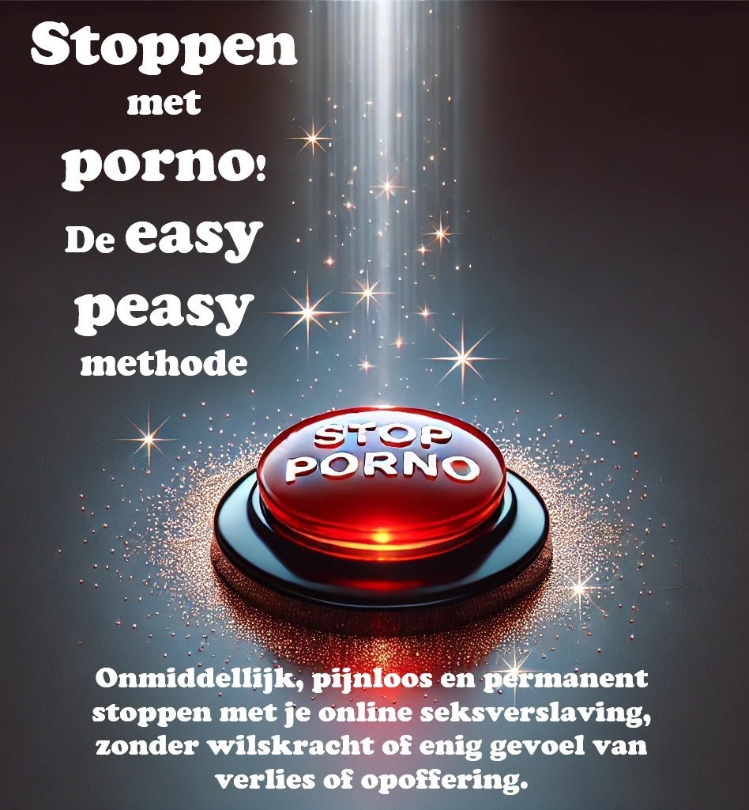

# Introductie

{width=45% height=45%}

AUDIOBOEK IN HET NEDERLANDS [YouTube](https://www.youtube.com/playlist?list=PLia4ktl6nQSLRx5mJAgf5Q5xQ8ExizbCY) | [Spotify](https://open.spotify.com/show/3PpAhsycjlN0dSBg12uiG1?si=d65ea11d70eb450d)

SLA GEEN HOOFDSTUKKEN OVER!

Dit open-source boek helpt je om onmiddellijk, zonder moeite en blijvend te stoppen met het gebruik van pornografie, zonder dat je wilskracht of een gevoel van ontbering of opoffering nodig hebt. Het legt geen oordeel, schaamte of druk op om pijnlijke stappen te ondernemen. Sterker nog, er is geen enkele reden om je pornogebruik te minderen terwijl je dit boek leest; dat zou zelfs contraproductief zijn.

Misschien voel je je terughoudend bij het idee om te stoppen met porno, of ben je een van de miljoenen die actief proberen te stoppen. Als dat zo is, lijkt wat gaat lezen misschien tegenstrijdig met alles wat je eerder hebt gehoord. Maar stel jezelf de vraag: heeft wat je gehoord hebt tot nu toe gewerkt? Als dat zo was, zou je dit boek waarschijnlijk niet aan het lezen zijn.

Misschien herken je jezelf in de volgende vragen:

1.	Besteed je veel meer tijd aan het kijken naar porno dan je van plan was?
2.	Heb je geprobeerd te stoppen of je pornogebruik te beperken, maar lukt het je niet?
3.	Heeft de tijd die je aan porno besteedt invloed gehad op je persoonlijke of professionele verplichtingen, hobby's of relaties?
4.	Ga je ver om je pornogebruik geheim te houden (bijvoorbeeld door je browsegeschiedenis te verwijderen of te liegen over het bekijken van porno)?
5.	Heeft het kijken naar porno problemen veroorzaakt in je intieme relatie(s)?
6.	Beleef je een cyclus van opwinding en plezier tijdens het kijken, gevolgd door gevoelens van schaamte, schuld en spijt daarna?
7.	Denk je veel na over porno, zelfs als je het niet kijkt?
8.	Heeft het bekijken van porno andere negatieve gevolgen gehad in je persoonlijke of professionele leven (bijvoorbeeld gemiste werkuren, slechte prestaties, verwaarloosde relaties, financiële problemen)?

Als je pornografie gebruikt voor masturbatie of seks, om welke reden dan ook, hoef je alleen maar door te lezen. Als je hier bent voor een geliefde, probeer hen dan over te halen dit boek te lezen. Lukt dat niet, lees het dan zelf. Het begrijpen van de methode kan helpen de boodschap over te brengen en te voorkomen dat je kinderen er ooit mee beginnen.

## Over het boek {-}

Dit boek is een herschreven versie van Allen Carr’s EasyWay to Quit Smoking, maar dan voor pornografie. Het is gratis, open-source, en valt onder de CC-BY-SA licentie. Het succes van het boek berust op een belangrijk principe:
SLA GEEN HOOFDSTUKKEN OVER!

WNet als bij het openen van een combinatieslot, moet je alle onderdelen goed invoeren en in de juiste volgorde. Dit is hetzelfde bij het doorbreken van de verslaving aan seks.
Persoonlijk heeft de originele versie op Google Sites (die niet door mij is geschreven) mijn leven veranderd. Net als de meeste mensen ontdekte je waarschijnlijk porno op jonge leeftijd en ben je het sindsdien blijven gebruiken. Totdat je stuitte op de overweldigende – maar enigszins gecensureerde – informatie over de gevaren ervan. Zoals velen, ben je er waarschijnlijk in geslaagd om periodes van onthouding te hebben, maar uiteindelijk bezweken aan valse verlangens. Ik ben blij te melden dat deze methode totaal anders werkt, en het enige is dat effectief is gebleken.

Misschien ben je door een bezorgde bekende naar dit boek geleid en sta je er sceptisch tegenover. Allereerst, bedankt dat je het in ieder geval bekijkt. Dit wordt straks uitgebreider besproken, maar denk even kort terug aan de eerste keer dat je naar porno keek. Had je toen gedacht dat je er voor de rest van je leven naar zou terugkeren?
Uit mijn eigen informele onderzoek (door vrienden te vragen dit boek te lezen) blijkt dat EasyPeasy net zo effectief is voor de casual gebruiker als voor de zwaar verslaafde. Het is niet erg lang en de kans op grote verbeteringen is groot, dus ik smeek je om door te lezen.

De methode die in dit boek wordt beschreven is:
1.	Eenvoudig en direct.
2.	Even effectief voor zowel zware gebruikers als gelegenheidsgebruikers.
3.	Veroorzaakt geen ernstige afkickverschijnselen.
4.	Vereist geen wilskracht.
5.	Maakt geen gebruik van shocktherapie, hulpmiddelen of trucjes.
6.	Vervangt deze verslaving niet door andere verslavingen, zoals overeten, roken of drinken.
7.	Permanent.

Je vindt dit misschien onmogelijk te geloven, maar dit gevoel wordt door veel mensen gedeeld.

>*"Dit is het baanbrekende werk voor pornoverslaving."*
>
>--- Iemand op Reddit.

>"*Ik was tien jaar lang verslaafd. Die tien jaar werd ik geplaagd door depressie, twijfel, angst en de angst dat mijn geheim zou uitkomen. Na elke sessie haatte ik mezelf, en na elke poging tot onthouding gleed ik snel weer terug. Dit boek heeft me echter geholpen te stoppen. Voorheen was ik altijd in de verdediging tegen porno. Nu, na het twee keer te hebben gelezen, ben ik in de aanval. Porno heeft geen macht meer over me en lijkt nu gewoon een zielige grap.*">
>
> --- u/DeepNewt

> "*Een paar dagen geleden werd ik 20 jaar oud. Voor het eerst in zeer lange tijd heb ik mijn verjaardag doorgebracht zonder in de val van porno te zitten, en dat is allemaal te danken aan dit boek dat ik een paar maanden geleden toevallig tegenkwam. Daarvoor had ik zoveel tijd besteed aan proberen te stoppen op traditionele manieren, en ik had zoveel innerlijke strijd ervaren en mezelf permanent gelabeld als een verslaafde. Het boek heeft dat allemaal voor mij opgelost. Waar ik eerder bang was dat ik geen controle over mezelf had, zelfs toen ik het kleine monster onbewust al had verslagen, kan ik nu trots zijn dat ik geen verslaafde meer hoef te zijn.
>
>*Ik heb eigenlijk geen reden om dit te plaatsen, ik voelde gewoon dat ik dit ergens anders dan in mijn hoofd moest neerschrijven omdat het zoveel voor me betekent. Als je dit leest en eraan denkt om het boek te lezen of aan te bevelen, geloof me dan dat het beter werkt dan elke andere methode die er is. Mijn grootste tip is om aantekeningen te maken, wat misschien grappig klinkt, maar het heeft me echt geholpen bepaalde ideeën te versterken.*”
>--- u/Suspicious_Web_4594

## Waarschuwing

 Als je verwacht dat dit boek je zal 'afschrikken' om te stoppen door je te wijzen op de gezondheidsrisico’s, zoals seksuele disfuncties (inclusief door porno veroorzaakte erectiestoornissen), verminderde opwinding, verlies van interesse in echte sekspartners, hersenveranderingen (hypofrontaliteit), of dat het een smerige, walgelijke gewoonte is en dat je zwak en besluiteloos bent, dan zul je teleurgesteld worden. Die methoden hebben mij nooit geholpen om te stoppen, en als ze jou zouden helpen, was je nu al gestopt.

De conventionele methoden om te stoppen richten zich op wilskracht of op vervangende strategieën zoals ‘om de zoveel dagen kijken’ of het afbouwen van je gebruik. Sommige websites bieden wetenschappelijke informatie over neurotransmitters en neuroplasticiteit. Hoewel deze informatief zijn, weten veel mensen al van de gezondheidsrisico's, maar kiezen ervoor om niets te doen. Deze methoden werken uiteindelijk niet omdat ze de reden waarom mensen porno gebruiken, niet aanpakken. Het verbieden van iets maakt het alleen maar aantrekkelijker, en dat lost verslaving niet op.

De methode in dit boek, genaamd EasyPeasy, werkt anders. Sommige dingen die je gaat lezen, zullen misschien moeilijk te geloven zijn. Maar als je dit boek eenmaal hebt uitgelezen, zul je niet alleen deze ideeën geloven, je zult je afvragen hoe je ooit anders hebt kunnen denken.

Er is een misvatting dat we ervoor kiezen om porno te kijken. Porno-verslaafden (ja, verslaafden) kiezen net zo min om verslaafd te raken als alcoholisten kiezen om alcoholist te worden, of heroïnegebruikers kiezen om verslaafd te raken. Natuurlijk kiezen we ervoor om de laptop of smartphone op te starten, de browser te openen en naar onze favoriete 'online harem' te gaan. Soms kies ik ervoor om naar de bioscoop te gaan, maar ik zou nooit kiezen om daar mijn hele leven door te brengen. Oorspronkelijk namen nieuwsgierigheid en menselijke natuur me mee naar porno, maar als ik had geweten dat ik verslaafd zou raken en dat mijn gezondheid, geluk en relaties zouden lijden, was ik nooit begonnen. “Had ik maar eerder gehoord over seksuele disfuncties toen ik voor het eerst naar een pornosite ging!”

Sta even stil en vraag jezelf af: Heb je ooit bewust besloten dat je porno nodig hebt om te masturberen? Of dat je porno nodig hebt om fantasieën te bedenken om je seksleven met je partner spannender te maken? Of dat je na een lange dag niet kon ontspannen zonder porno te kijken? Of dat je niet kon omgaan met stress zonder het gebruik van porno? Wanneer heb je besloten dat je porno voor altijd nodig had in je leven, en dat je je onzeker en zelfs paniekerig zou voelen zonder je online harem?

Net als elke andere gebruiker ben je in de meest verraderlijke val gelokt die ooit is bedacht. Niemand, zelfs niet gebruikers zelf, vindt het prettig om te bedenken dat hun kinderen porno zouden gebruiken voor genot of om met problemen om te gaan. Dat betekent dat elke verslaafde wenst dat hij of zij nooit was begonnen. Dat is niet vreemd, want niemand heeft porno nodig om van het leven te genieten of om met stress om te gaan voordat ze eraan verslaafd raken.

Tegelijkertijd willen alle gebruikers doorgaan met het gebruik. Niemand dwingt ons om de incognito-modus van onze browser te openen. Of we nu de reden begrijpen of niet, het zijn alleen de gebruikers die besluiten de deuren van hun online harems binnen te gaan.

Als er een magische knop zou bestaan die ervoor zorgt dat je de volgende ochtend wakker wordt alsof je nog nooit een pornosite hebt bezocht, dan zouden de enige verslaafden morgen jonge mensen zijn die nog ‘experimenteren’.

Het enige dat ons ervan weerhoudt om te stoppen is **ANGST!** Angst veroorzaakt door de overtuiging dat we een onbepaalde periode van ellende, verlies en onvervulde drang moeten overleven om vrij te zijn van porno. Deze angsten komen voort uit onlogische overtuigingen zoals:
1.	Masturbatie of seks met een orgasme is het belangrijkste in het leven.
2.	Porno is veiliger dan seks in het echte leven omdat porno me niet kan afwijzen.
3.	Porno is leerzaam en nuttig.
4.	Je hebt recht op een ‘superieure’ seksuele ervaring.
5.	Meer is altijd beter.

Deze onlogische overtuigingen leiden tot onlogische gevolgen wanneer ze worden toegepast, waaronder:
1.	Verafgoden van een ‘perfect 10’-uiterlijk.
2.	Denken dat je een mislukkeling bent als je geen seks hebt, alsof dat het belangrijkste in het leven is.
3.	Altijd wachten op de perfecte partner.
4.	Te kritisch en oordelend zijn over potentiële partners.
5.	Seks hebben, ook al wil je dat op dat moment niet.

Het is de angst dat we een avond alleen doorbrengen in ellende, vechtend tegen oncontroleerbare impulsen. Bang dat de avond voor een examen een hel zal zijn zonder porno. Bang dat we nooit meer kunnen concentreren, stress aan kunnen of zelfverzekerd zullen zijn zonder ons ‘hulpje’, en dat onze persoonlijkheid en karakter zullen veranderen.

Maar de grootste angst is dat we voor altijd verslaafd zullen blijven: dat we de rest van ons leven zullen verlangen naar een pornografisch orgasme op onverwachte momenten. Als jij, net als ik, al alle traditionele methoden hebt geprobeerd om te stoppen en de ellende en marteling van de ‘wilskrachtmethode’ hebt doorstaan, dan zul je niet alleen door die angst worden beïnvloed, maar er ook van overtuigd zijn dat je nooit zult kunnen stoppen.

Als je je angstig voelt of denkt dat het niet het juiste moment is om te stoppen, verzeker ik je: die angst wordt niet verlicht door porno, het wordt juist veroorzaakt door porno. Je hebt er niet voor gekozen om in deze val te stappen, maar net als elke val is deze zo ontworpen dat je erin blijft zitten. Vraag jezelf af: toen je voor het eerst die pornobeelden en -video’s bekeek, heb je toen besloten om dit voor de rest van je leven te blijven doen? Wanneer ga je stoppen? Morgen? Volgend jaar? Hou jezelf niet voor de gek! Deze val is ontworpen om je voor de rest van je leven gevangen te houden. Waarom denk je anders dat al die andere verslaafden niet stoppen voordat porno hun leven ruïneert?

Ik heb het gehad over een magische knop; EasyPeasy werkt als zo’n knop. Laat me duidelijk zijn: EasyPeasy is geen magie, maar voor mij en vele anderen die het makkelijk en plezierig vonden om te stoppen, voelt het wel zo!

De waarschuwing is als volgt: dit is een kip-en-ei-situatie. Elke verslaafde wil stoppen en elke verslaafde kan het stoppen gemakkelijk en plezierig vinden. Alleen angst houdt gebruikers tegen om die stap te zetten. De grootste overwinning is bevrijd te zijn van die angst, maar je zult niet volledig van die angst verlost zijn totdat je het boek hebt uitgelezen. Sterker nog, je angst kan toenemen naarmate je verder leest, wat je misschien ontmoedigt om door te gaan. Neem als voorbeeld deze opmerking van een vrouw:
***“Ik heb zojuist EasyPeasy uitgelezen. Ik weet dat het pas vier dagen geleden is, maar ik voel me zo geweldig, ik weet dat ik nooit meer porno zal hoeven te gebruiken. Ik begon vijf maanden geleden voor het eerst met het lezen van je boek, las tot halverwege en raakte in paniek. Ik wist dat als ik verder zou lezen, ik zou moeten stoppen. Was dat niet dom van mij?”***

Je hebt er niet voor gekozen om in de val te lopen, maar onthoud: je komt er alleen uit als je er bewust voor kiest. Misschien sta je al te popelen om te stoppen, of misschien ben je bang voor de gedachte. Hoe dan ook, onthoud: JE HEBT NIETS TE VERLIEZEN!

Als je aan het eind van het boek besluit dat je toch porno wilt blijven gebruiken voor masturbatie of seks, dan is er niets dat je tegenhoudt. Je hoeft niet eens te minderen of te stoppen met het gebruik van porno terwijl je dit boek leest, en onthoud, er is geen schoktherapie. Integendeel, ik heb alleen maar goed nieuws voor je. Kun je je voorstellen hoe Andy Dufresne zich voelde toen hij eindelijk uit de Shawshank-gevangenis ontsnapte? Zo voelde ik me toen ik uit de porno-val ontsnapte, en zo voelen de ex-gebruikers die EasyPeasy hebben gevolgd zich. Tegen de tijd dat je het boek uit hebt, zul jij je net zo voelen! Ga ervoor!

## Tot slot... {-}

 Iedereen kan op een makkelijke en prettige manier stoppen met porno, ook jij! Het enige wat je hoeft te doen is de rest van dit boek met een open houding te lezen. Hoe meer je begrijpt, hoe makkelijker het zal zijn. Zelfs als je niet alles begrijpt, zul je merken dat het stoppen eenvoudig is, zolang je de instructies volgt. Het belangrijkste is dat je niet door het leven hoeft te gaan met een verlangen naar porno of het gevoel dat je iets mist. Tegen het einde van het boek zul je je afvragen waarom je überhaupt zo lang doorging.

Bij EasyPeasy zijn er maar twee redenen waarom afkicken van PMO-gebruik kan mislukken:

**Het niet opvolgen van de instructies.** Sommigen vinden het misschien vervelend dat het boek zo streng is over bepaalde aanbevelingen, zoals niet proberen te minderen of vervangingen te gebruiken. Ik ontken niet dat er mensen zijn die er desondanks in slagen te stoppen met dergelijke trucs, maar dat is eerder ondanks die methoden dan dankzij. Sommige mensen kunnen zelfs seks hebben terwijl ze op een hangmat staan, maar dat is zeker niet de makkelijkste manier. De 'combinatie' om uit deze verslavingsval te ontsnappen staat in dit boek, maar je moet de volgorde van de hoofdstukken volgen en geen hoofdstukken overslaan.

**Het niet begrijpen.** Neem niets zomaar aan, stel niet alleen vragen over wat je wordt verteld, maar ook over je eigen overtuigingen en wat de maatschappij je heeft verteld over seks, internetporno en verslaving. Bijvoorbeeld: als je denkt dat porno slechts een gewoonte is, vraag jezelf dan af waarom andere gewoontes – zelfs die plezierig zijn – makkelijk te doorbreken zijn, terwijl een gewoonte die je een slecht gevoel geeft, energie kost en je viriliteit ondermijnt, zo moeilijk te stoppen is. Als je denkt dat je echt geniet van porno, vraag jezelf dan af waarom je andere dingen die veel leuker zijn gewoon kunt laten liggen. Waarom moet je persé porno kijken? Waarom raak je in paniek als je het niet hebt?

EasyPeasy gaat je laten zien hoe makkelijk en plezierig het kan zijn om te stoppen met porno. Net als velen is een van mijn grootste overwinningen in het leven het ontsnappen uit de pornoval. Je hoeft je niet somber te voelen. Integendeel, je staat op het punt iets te bereiken wat iedere gebruiker op aarde graag zou willen: VRIJHEID!

Enkele termen voordat je begint:
PMO: De cyclus van porno, masturbatie en orgasme.
Online harem: Websites met snel beschikbare internetporno.
Hackbook: is een boek gebaseerd op en aangepast van een ander boek. De oorspronkelijke auteur krijgt de volledige erkenning. Allen Carr is al lang geleden overleden en de instellingen die hij heeft opgericht behandelen internetporno niet als verslaving. Vandaar is dit boek als hackboek geschreven.

## Tips voor het lezen en laatste kleine opmerkingen

Lees dit boek niet zoals een gewoon boek. Het is heel kort, en je zou het binnen een paar uur moeten kunnen uitlezen. De meeste mensen hebben baat bij het markeren van belangrijke stukken of het maken van aantekeningen. Het wordt vaak aangeraden het boek meerdere keren te lezen om de lessen echt goed te begrijpen. En belangrijk: SLA GEEN HOOFDSTUKKEN OVER.

Er bestaan ook verschillende communities rond dit hackbook, maar ik raad je aan deze pas te bekijken nadat je het boek hebt gelezen.

[discord](https://discord.com/invite/bCXEnf9) | [reddit](https://reddit.com/r/pmohackbook) | [feedback form](https://forms.gle/p7cTxowaNpKqgi5Z7) | [urbit](https://urbit.org) - ~mislyr-midnyt/coomer | [coomer meme archive](https://coomer.org) | [analytics](https://plausible.io/easypeasymethod.org) | [matrix](https://matrix.to/#/!xmJZznbJXuwzEGSEti:matrix.org?via=matrix.org) 

Snelle herinnering: **SLA GEEN HOOFDSTUKKEN OVER**

Ik zou je geluk wensen, maar zoals je al snel zult leren, heb je het niet nodig.

Veel succes,

Hackauthor²

{width=88 height=31}

Dit werk is gelicenseerd onder de [Creative Commons Attribution-ShareAlike 4.0 International License](https://creativecommons.org/licenses/by-sa/4.0/). Code is [GPLv3](https://gitlab.com/snuggy/easypeasy/-/blob/master/LICENSE).