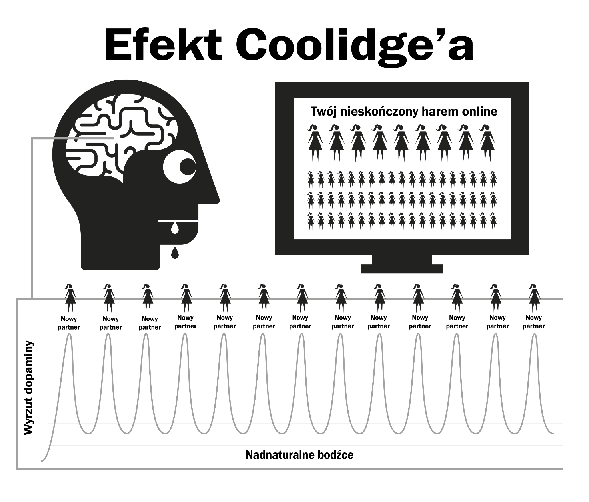

# Natura

Pornografia internetowa działa poprzez przejęcie naturalnych mechanizmów nagrody, które służą promowaniu u ciebie dalszej reprodukcji. Szybki i łatwy dostęp do pornografii utrzymuje wysoką produkcję dopaminy przez dużo dłuższy czas niż to normalnie możliwe. Naukowcy nazywają ten proces efektem Coolidge'a, o którym może już coś słyszałeś.

Dopamina to neuroprzekaźnik łączony z uczuciem podniecenia oraz fizycznej przyjemności produkowanej przez opioidy. Więcej dopaminy -> więcej opioidów –> więcej działania. Bez dopaminy takie czynności jak jedzenie są nieprzyjemne i nie przynoszą satysfakcji bez jedzenia bogatego w tłuszcz i cukier.

Dopamina uwalnia się również w odpowiedzi na nowości. Przy praktycznie nieskończonej ilości pornografii do której mamy dostęp, nasz układ limbiczny jest zalewany, więc za pierwszym razem, gdy oglądasz porno i doprowadzasz do orgazmu, twoje ciało zalewają opioidy. Zachęcony wysokim stężeniem dopaminy, twój mózg zapisuje sobie to jako przyjemny skrypt i umacnia neuronalne połączenia poprzez wydzielanie DeltaFosB. Teraz, mózg przywołuje sobie te połączenia w odpowiedzi na takie bodźce jak seksowne reklamy, samotność, stres albo nawet ogólne słabsze samopoczucie, a ty nagle jesteś gotowy na przejażdżkę na „zjeżdżalni”. Za każdym razem, gdy powtarzasz ten cykl, wydziela się więcej DeltaFosB, tak żeby twoja zjeżdżalnia była bardziej śliska i przyjemniejsza na kolejny raz.

Układ limbiczny ma swój wbudowany system ograniczający ilość receptorów dopaminy i opioidów, kiedy wykrywa częste zalewanie dopaminą. Niestety te same receptory są potrzebne by nas motywować i żebyśmy mogli radzić sobie ze stresami dnia codziennego. Symboliczne ilości dopaminy produkowane przez normalne nagrody nie mają porównania do pornografii i nie są tak wydajnie wchłaniane przez receptory, co sprawia, że jesteś bardziej poirytowany i zestresowany. Ten proces znany jest jako odczulanie.

Jeśli w tym cyklu przekroczyłeś 'czerwoną linię' i zacząłeś czuć takie emocje jak poczucie winy, wstyd, obrzydzenie, zawstydzenie, nerwowość czy strach, to one również zwiększają twój poziom dopaminy, przez co twój mózg mylnie interpretuje je jako podniecenie.

AW miarę upływu czasu mózg nie tylko staje się odporny na te klipy, które już widziałeś, ale również na podobne gatunki czy poziom ich 'skandaliczności'. Mniejsza motywacja powoduje uczucie mniejszej satysfakcji, a nasze mózgi pchają nas do znalezienia kolejnego klipu, który zaspokoi nasz głód. W ten sposób zaczynasz wyszukiwać kolejne dziwactwa, klikając na te szalone filmy, przy których wcześniej przyrzekałeś sobie, że nie są dla ciebie.

> *„Pokryte rosą małych przyjemności, serce powstaje i ożywa”*
>
> --- Kahlil Gibran

Poczucie bezpieczeństwa to wszystko czego potrzebujemy, żeby przejść przez cięższy moment naszego życia, ale czy twój odczulony mózg będzie w stanie chwycić się tej drobnej kropli, która zadziała na kogoś kto nie korzysta z pornografii?

Zalanie dopaminą to szybki narkotyk, który działa niedługo i prowadzi do głodu. Wielu użytkowników trzyma się iluzji, że te małe ukłucia głodu to ta okropna trauma, która ich dotyka gdy próbują przestać, lub gdy się ich do tego zmusza. Prawda jest taka, że większość problemu jest w głowie użytkownika i pojawia się tylko w gorszym momencie.

## Mały Potwór

Chemiczny głód po odstawieniu pornografii jest tak subtelny, że bardzo wielu ludzi żyło i umarło bez wiedzy o tym, że byli uzależnieni od narkotyku. Wielu użytkowników boi się narkotyków, jednak mimo tego są uzależnieni od narkotyku. Odstawienie pornografii nie powoduje fizycznego bólu i jest jedynie pustym, niezaspokojonym stanem wybrakowania, dlatego często myślimy, że ma to coś wspólnego z potrzebami seksualnymi. Im dłużej używasz, tym to uczucie zmienia się w nerwy, niepewność, pobudzenie, niską samoocenę i zdenerwowanie. Jakbyś miał ochotę najeść się trucizny.

W ciągu kilku sekund po zaangażowaniu się w sesję dopamina zaspokaja nasz głód, co daje ci satysfakcję, gdy zjeżdżasz po swojej zjeżdżalni. Na początku uzależnienia, symptomy odstawienia i ich zaspokojenie są tak niewielkie, że ich nie zauważamy. Kiedy zaczynamy konsumować porno regularnie, wydaje nam się, że po prostu to lubimy, albo mamy takie 'przyzwyczajenie'. Prawda jest taka, że już jesteśmy uzależnieni, ale nie zdajemy sobie z tego sprawy. Mały potworek jest już w naszym mózgu, więc raz na jakiś czas musimy wejść na zjeżdżalnię i go nakarmić.

Wszyscy zaczynają oglądać porno z nieracjonalnych powodów. Jedynym powodem dla którego dalej korzystasz, niezależnie czy często, czy rzadko, jest karmienie potworka. Cały problem to seria okrutnych i dezorientujących kar, ale chyba najbardziej żałosnym aspektem jest to poczucie przyjemności, które odczuwasz podczas sesji, próbując powrócić do stanu spokoju i pewności siebie, które twoje ciało osiągało samo zanim się uzależniłeś.

## Wkurzający alarm

Znasz to uczucie, gdy alarm w samochodzie twojego sąsiada wyje cały dzień – albo inna tego typu, denerwująca sytuacja – i kiedy w końcu hałas się kończy, a ty czujesz ten wspaniały spokój ducha, który zalewa cię z każdej strony? To nie jest do końca spokój, a bardziej 'zakończenie ataku'. Przed rozpoczęciem kolejnej sesji, nasze ciała są pełne, a wtedy my zmuszamy nasz mózg do pompowania dopaminy i kiedy skończymy, dopamina odpływa, a my cierpimy na odstawienie. To nie jest ból fizyczny, po prostu uczucie pustki. Nie mamy nawet pojęcia, że ono istnieje, po prostu czujemy korek, z którego coś bez przerwy kapie w naszym ciele.

Nasze racjonalne umysły tego nie rozumieją, bo nie muszą. Wiemy, że chcemy porno, a kiedy się masturbujemy – dyskomfort odchodzi w zapomnienie. Niestety, satysfakcja zanika, bo żeby zaspokoić kolejną chętkę – potrzeba więcej porno. Kiedy tylko dojdziesz, twój głód zaczyna się od nowa, a pułapka zaciska się mocniej. Sprzężenie zwrotne, które tylko ty możesz zatrzymać!

Pornografia jest trochę jak noszenie zbyt ciasnych butów, żeby poczuć satysfakcję z ich ściągnięcia. Są trzy powody, dla których ludzie tego nie rozumieją:

1.  Od urodzenia jesteśmy pod wpływem opinii, że pornografia w Internecie jest po prostu naturalnym rozwojem, który zastąpił pornografię drukowaną. Ten błąd myślowy często paruje się ze stwierdzeniem, że masturbacja nie szkodzi, więc czemu mielibyśmy w to nie wierzyć?

2.  Z racji tego, że fizyczny głód dopaminy nie boli i zostawia nas tylko z uczuciem niepewnej pustki, nieodróżnialnej od zwykłego głodu czy stresu, ten stan łączymy z sesją oglądania pornografii i szukania porno w Internecie. Wydaje nam się, że to uczucie jest normalne.

3.  Jednakże główną przyczyną, dla której użytkownicy nie chcą dostrzec prawdziwej twarzy pornografii, jest fakt, że działa ona tyłem na przód. Kiedy nie konsumujesz, cierpisz na tę pustkę. Proces uzależnienia od porno zaczyna się zwykle bardzo wcześnie, subtelnie i powolutku, przez co wydaje ci się, że to uczucie niepewności jest normalne i nie obarczasz nim swojej poprzedniej sesji. W chwili, w której odpalasz przeglądarkę i rozpoczynasz swoją sesję, natychmiast czujesz się lepiej, spokojniej i przyjemniej, więc traktujesz pornografię jako remedium.

Ten proces działania 'tył na przód' sprawia, że każdy narkotyk trudno odstawić. Wyobraź sobie panikę uzależnionego od heroiny, który nie ma heroiny; teraz pomyśl o szczęściu, jakie czuje, kiedy w końcu może sobie wsadzić igłę w ramię. Ludzie nieuzależnieni nie czują tej paniki.

Heroina nie daje ulgi, ona powoduje to uczucie paniki. Podobnie jest tutaj – nieużywający porno nie czują tej pustki, przez którą potrzebują pornografii, albo paniki, gdy nie mają dostępu do Internetu. Nie uzależnieni nie potrafią zrozumieć, jak użytkownicy potrafią czerpać przyjemność z dwuwymiarowych filmów z niewyraźnym dźwiękiem i nienormalnymi proporcjami ciała. Prawdę mówiąc – uzależnieni też nie rozumieją.

Mówi się, że pornografia internetowa jest relaksująca, bądź satysfakcjonująca, ale jak możesz być zaspokojony, o ile nie odczuwałeś braku satysfakcji wcześniej? Osoba nieużywająca nie cierpi na ten 'brak satysfakcji', czuje się zadowolona po randce bez seksu, podczas gdy uzależniony nie czuje satysfakcji, dopóki nie nakarmi swojego potworka.

## Przyjemność czy podpora?

Ważna przypominajka – głównym powodem, dla którego tak trudno skończyć konsumpcję pornografii jest wiara w to, że pozbędziesz się z życia przyjemności, albo podpory. Konieczne jest, żebyś zrozumiał, że nie rezygnujesz absolutnie z niczego. Łatwiej będzie to zrozumieć, gdy porównamy subtelności pułapki pornografii do jedzenia. Jedzenie regularnych posiłków powoduje, że nie czujemy głodu między nimi, a odczuwamy go tylko, kiedy ominiemy posiłek. Nie ma fizycznego bólu, tylko uczucie niepewnej pustki znane jako głód. Proces zaspokajania tego głodu – jedzenie – jest bardzo przyjemnym doświadczeniem.

Pornografia wydaje się dokładnie taka sama, chociaż tak nie jest. Jak w przypadku głodu, nie odczuwasz fizycznego bólu, a mechanizm nagrody działa w bardzo podobny sposób, ale to właśnie to podobieństwo do jedzenia sprawia, że użytkownik wierzy, że ma do czynienia z przyjemnością albo podporą. Więc mimo tego, że wydają się podobne – pornografia i jedzenie są zupełnymi przeciwnościami.

-   Jesz, by przeżyć i dodać sobie energii do życia, kiedy pornografia przygasza i zabija twój urok.
-   Posiłki są rzeczywiście pyszne, a jedzenie jest prawdziwie przyjemną czynnością, z której korzystamy przez całe swoje życie. Pornografia polega na sabotażu receptorów szczęścia, przez co uniemożliwia ci radzenie sobie i odczuwanie szczęścia.
-   Jedzenie nie powoduje głodu i rzeczywiście go zaspokaja. Twoja sesja z pornografią uruchamia twój głód dopaminy przed kolejną sesją. Nie ma mowy o uldze – jest tylko cierpienie do końca życia.

Czy jedzenie to 'przyzwyczajenie'? Jeśli tak ci się wydaje, to spróbuj nie jeść! Mówić o jedzeniu jako o nawyku to jak mówić, że oddychanie to nawyk. Oba są konieczne do przeżycia. Prawdą jest, że różni ludzie mają różne nawyki zaspokajania głodu, jedząc różne rodzaje jedzenia o różnych porach, ale samo jedzenie nawykiem nie jest. Jedynym powodem, dla którego użytkownik odpala przeglądarkę jest zaspokojenie pustego uczucia, które zostawiła po sobie poprzednia sesja – w różnym czasie i na wiele różnych sposobów.

W Internecie o pornografii często mówi się jako o przyzwyczajeniu i dla wygody w Koniec z Porno używamy tego samego słowa. Jednak pamiętaj – pornografia to nie nawyk, **to uzależnienie od narkotyku**. Kiedy zaczynamy korzystać z pornografii, zmuszamy się do nadążania za nią. Zanim się zorientujesz, korzystasz z coraz bardziej szalonej i obrzydliwej pornografii. Podniecenie polega na polowaniu na ten jeden idealny klip, a nie na orgazmie, po którym dopamina szybko ucieka z ciała, co tłumaczy, dlaczego użytkownicy chcą 'dochodzić' (opóźniać orgazm) jak najdłużej, przeskakując między zakładkami przeglądarki.

## Czerwona linia

Tak jak w przypadku innych uzależnień, nasze ciało powoli uodparnia się na działanie starych klipów, a nasz mózg pragnie czegoś innego albo mocniejszego. Po niedługim czasie oglądania tego samego nagrania, przestajemy odczuwać tę samą satysfakcję i zaspokojenie głodu wykreowane przez wcześniejszą sesję. W twojej głowie odbywa się święta wojna pornograficznego raju – ty chcesz pozostać w bezpiecznym świecie przed czerwoną linią, a twój mózg pragnie żebyś kliknął na zakazany owoc.

Czujesz się lepiej po rozpoczęciu sesji PMO, ale jesteś bardziej podenerwowany i mniej zrelaksowany niż osoba, która nigdy nie zaczęła, nawet gdy żyjesz w tym pornograficznym raju. Ten moment jest jeszcze śmieszniejszy niż noszenie zbyt ciasnych butów, bo gdy idziesz przez życie, to czujesz co raz więcej dyskomfortu na stopach nawet po rozwiązaniu sznurówek. A z racji tego, że użytkownik musi zaspokoić potworka – to ten decyduje kiedy się najeść, zwykle podczas czterech okazji, bądź ich kombinacji:
- Znudzenie/koncentracja – zupełne przeciwieństwa
- Stres/relaks – zupełne przeciwieństwa!

Co to za magiczny narkotyk, który odwraca efekt, który wywołał minutę temu? Prawda jest taka, że pornografia ani nie rozwiązuje nudy, ani stresu, ani nie pomaga się zrelaksować czy skoncentrować. Jak sobie o tym pomyślisz, to jakie jeszcze mamy sytuacje w życiu, poza może snem? Jeśli wydaje ci się, że możesz nadal oglądać 'lżejsze' albo bardziej 'realistyczne' porno, to pamiętaj, że zawartość tej książki odnosi się do każdego rodzaju pornografii – drukowanej, kamerek, czatów, pokazów na żywo... Ciało człowieka jest najbardziej skomplikowanym mechanizmem na ziemi – a żaden organizm, nawet ameba albo robak, nie przeżyje bez rozpoznania różnicy między jedzeniem a trucizną.

Poprzez naturalną selekcję nasze umysły i ciała rozwinęły techniki nagradzania działań, które prowadzą do rozmnażania, a w efekcie przetrwania ludzkości. Nie są przygotowane na wyolbrzymione stymulacje, większe, jaśniejsze i ostrzejsze od czegokolwiek co można znaleźć w naturze. Nawet najbardziej zaciemnione, dwuwymiarowe obrazy powodują u nas podniecenie. Ale patrz na ten sam obraz wiele razy i przestaniesz je czuć. W prawdziwym życiu mechanizmy gwarantują równowagę i skłaniają cię ku innym rzeczom. W Internecie pornografia nie ma limitu, przez co spędzasz swoje życie w wirtualnym haremie!

Błędne jest myślenie, że ludzie słabi fizycznie i psychicznie zaczynają używać pornografii. Farta mieli ci, którzy poczuli się obrzydzeni za pierwszym razem i wyleczyli się na całe życie. Może nie są gotowi na długi proces walki o uzależnienie, może boją się przyłapania albo może nie potrafią zbyt dobrze obsługiwać komputera. I chyba największą tragedią są tutaj nastolatkowie – którzy żyją w Internecie i potrafią dobrze zakrywać swoje ślady, co prowadzi do coraz większego użycia w tej grupie społecznej.

Przyjemność z oglądania porno online to iluzja. Skaczemy między gatunkami, utrzymując nasze nowinki i ciekawostki przed czerwoną linią 'bezpiecznego' porno, tylko po to, żeby dostać strzała dopaminy. Tak samo, jak uzależnieni od heroiny cieszą się, gdy mogą zaspokoić swoje chwilowe ukłucia głodu.

## Balansowanie na czerwonej linii

Nawet jeśli masz ten jeden specjalny klip, jako użytkownik uczysz się odsuwać 'złe' i'brzydkie' filmy pornograficzne. Nawet jeśli oglądasz filmy solo, skupiasz się na tych częściach ciała, które najbardziej cię interesują. Czasem nawet odczuwasz przyjemność z balansowania na czerwonej linii – deklarując, że lubisz tylko waniliowe nagrania i że nie jesteś uzależniony od tych bardziej hardkorowych filmów. Jako użytkownik tego jednego typu filmów albo fan aktorki, zadaj sobie pytanie „*Jeśli nie mam dostępu do tych zwykłych rzeczy i mogę dostać tylko te niebezpieczne, czy przestanę się masturbować?*”

Nie ma szans! Użytkownik będzie się masturbował do wszystkiego, coraz bardziej niszowego, różnych orientacji, aktorów przypominających o tym ulubionym, w niebezpiecznych miejscach, do dziwnych i szokujących związków, do wszystkiego co zaspokoi małego potworka. Na początku wydaje się to obrzydliwe, ale z czasem nauczysz się nimi cieszyć. Uzależnieni będą szukać zaspokojenia w każdej sytuacji – po normalnym seksie, po długim dniu w pracy, podczas gorączki, przeziębienia, grypy, a nawet gdy są w szpitalu.

Przyjemność nie ma z tym nic wspólnego – jeśli masz ochotę na seks, to uprawianie go z laptopem nie ma najmniejszego sensu. Dla niektórych wiedza o tym, że są uzależnieni od narkotyku jest alarmująca, bo wydaje im się, że będzie jeszcze trudnej przestać. Ale to dobre wieści z dwóch powodów:
1. Powodem, dla którego większość z nas nadal używa, mimo że zdajemy sobie sprawę z ogromnych wad i minusów pornografii, jest fakt, że wydaje nam się, że w pornografii jest coś, co się nam podoba i że jest ona pewnego rodzaju gadżetem. Wydaje nam się, że kiedy przestaniemy używać, wejdziemy w pustkę, a pewne sytuacje w naszym życiu nigdy już nie będą takie same. Prawda jest taka, że porno nic nie wnosi, a tylko zabiera.
2. Mimo że pornografia jest najsilniejszym bodźcem dla seksualnego zalania dopaminą, to z racji tego jak szybko się uzależniasz, nigdy nie jesteś uzależniony szczególnie mocno. Symptomy głodu i odstawienia są tak delikatne, że większość użytkowników żyje i umiera nieświadomymi, że je kiedykolwiek odczuwali.

Więc dlaczego dla tak wielu z nas przestanie jest tak trudne i miesiącami czujemy się torturowani, a potem do końca życia czujemy nieprzyjemne nawroty głodu? Odpowiedzią jest drugi powód – pranie mózgu. Z uzależnieniem neuroprzekaźników można sobie łatwo radzić, większość użytkowników może bez problemu żyć bez pornografii na wyjazdach służbowych albo wycieczkach, bez negatywnego wpływu głodu. Mały potworek czeka cierpliwie, aż wrócisz do domu i otworzysz laptopa. Bez problemu przeżyjesz kontakt z tym okropnym klientem i szalonym managerem, wiedząc, że już niedługo przyjmiesz kolejną dawkę.

## Palacze

Dobrą analogią jest tutaj porównanie do palacza. Jeśli przez dziesięć godzin nie zapalą, to zaczną sobie wyrywać włosy, ale wielu palaczy po zakupie nowego auta będzie unikało palenia w środku. W kinie, supermarkecie czy w kościele nie można palić, i nie będzie to dla nich problem. Nawet w pociągach czy w samolotach nikt nie robi rozróby. Palacze wręcz się cieszą, kiedy coś ich powstrzymuje od jarania.

Użytkownicy bez problemu przestaną oglądać pornografię w domu rodziców podczas spotkań rodzinnych czy innych takich sytuacjach bez żadnego uczucia dyskomfortu. Większość uzależnionych przechodzi przez dłuższe okresy bez masturbacji bez najmniejszego problemu. Z małym potworem można sobie łatwo radzić, nawet jeśli jesteś nadal uzależniony. Miliony użytkowników używa pornografii raz na jakiś czas, a są tak samo uzależnieni jak ci którzy oglądają codziennie. Niektórzy z nich pozbyli się uzależnienia, tylko po to, żeby po jakimś czasie znowu zaglądnąć i naoliwić zjeżdżalnię.

Tak jak mówiłem wcześniej, samo uzależnienie od pornografii nie jest problemem, bo to tylko katalizator, który utrzymuje nasz umysł w stanie stałego niezrozumienia prawdziwego problemu – prania mózgu. Niech ci się nie wydaje, że złe efekty internetowego porno są przesadzone, niestety jest na odwrót. Czasem słychać plotki, że ścieżki w neuronach są tam na całe życie, a odpowiednia mieszanka niefartu, sytuacji i bodźca wyśle cię z powrotem na tę rujnującą życie zjeżdżalnię, ale to nie prawda. Nasze mózgi i ciała to naprawdę niesamowite maszyny, które leczą się w kilka tygodni.

Nigdy nie jest za późno, żeby przestać! Wystarczy podpatrzeć co piszą ludzie online, którzy codziennie restartują swoje życie i związki. I tak jak ze wszystkim co robimy, czasem wchodzimy na wyższy poziom - praktykując retencję nasienia, karezzę, a poprzez zmianę odczuć sensorycznych podczas seksu, zadowalamy naszych partnerów lepiej niż kiedykolwiek.

Może będzie to pocieszenie dla ciężko uzależnionych, że przerwać będzie tak samo łatwo jak tym którzy używają tylko okazjonalnie, a tak właściwie – może nawet łatwiej. Im niżej upadłeś, tym większa będzie ulga, że skończyłeś. Kiedy przestałem, poszedłem prosto do zera i nie odczuwałem głodu. Cały proces był wręcz przyjemny!

Zacznijmy od naprostowania twojego mózgu.