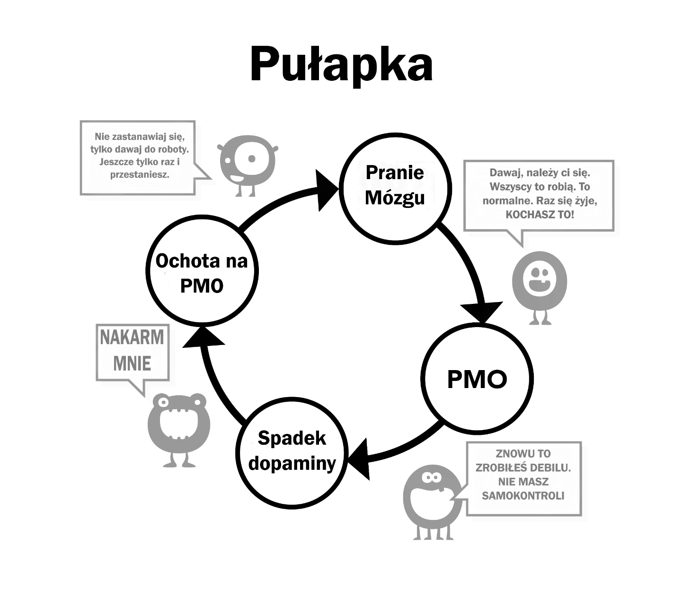

# Pranie mózgu

To jest drugi powód, dla którego używamy. Żeby zrozumieć o co chodzi, musimy skupić się na potężnych efektach nadnaturalnego podniecenia. Nasze mózgi nie są przygotowane na istnienie 'haremu online', które pozwalają na przełączanie między tyloma partnerami w 15 minut ilu nasi przodkowie nie mieli przez kilka pokoleń.

Było kiedyś wiele dezinformacji na temat masturbacji, na przykład, że powoduje ona ślepotę. To, w połączeniu z innymi straszakami na pewno było przesadą. Takie głupoty zostały obalone przez naukę. Ale to niewiele zmieniło – jakby wyrzucić dziecko razem z kąpielą. Od najmłodszych lat nasze mózgi bombardowane są obrazami seksualnymi, magazynami i reklamami naładowanymi podtekstem. Niektóre teledyski są bardzo sugestywne, ale nie martw się, zrobimy z tego grę w której będziemy identyfikować które elementy są stosowane – szok, nowinki, kolor, rozmiar, tabu, nostalgia i tak dalej. Takiej gry można nawet nauczyć nastolatka.

U źródła wiadomość brzmi „*Najcenniejszą rzeczą na tej ziemi, moją ostatnią myślą i działaniem będzie orgazm*”. Przesada? Zobacz jakiś film albo serial i zobaczysz mieszankę sensorycznych (dotyk, zapach, głos) i rozrodczych (orgazm) elementów seksu. Wpływ tych rzeczy nie jest rejestrowany przez naszą świadomość, ale podświadomość ma wystarczająco dużo czasu żeby sobie to przyswoić.

## Rozważania naukowe

Mamy wiele publikacji, które mówią o seksualnej dysfunkcji, stracie motywacji, preferencji sztucznej pornografii do prawdziwych kobiet, jest społeczność YourBrainOnPorn i inne subkultury, ale te ruchy nie powstrzymują konsumpcji pornografii. Myśląc racjonalnie – powinny, ale tego nie robią. Nawet cała lista potencjalnych szkód i badań na YourBrainOnPorn nie powstrzyma dorastającego nastolatka przed używaniem.

O ironio, największą siłą w całej tej dezinformacji są sami użytkownicy. Błędem jest założenie, że używający są słabi mentalnie albo fizycznie. Musisz być fizycznie silny, żeby radzić sobie z uzależnieniem, jak już wiesz, że ono istnieje. Najgorsze jest chyba to, że oni sami wciskają się w kategorię słabeuszy, przegrywów i introwertyków. Bardzo możliwe, że twój znajomy byłby dużo bardziej interesujący, gdyby nie myślał o sobie negatywnie, bo szuka przyjemności.

## Problem z siłą woli

Użytkownicy, którzy używają swojej siły woli do rzucenia, oskarżają siebie o niepowodzenia, co rujnuje ich spokój i szczęście. Jednym jest ponieść porażkę w samodyscyplinie, innym nienawiść do samego siebie. W końcu nie ma żadnego prawa, które nakazuje ci być twardym przez cały czas przed seksem, porządnie napalonym i zawsze zdolnym do usatysfakcjonowania swojej partnerki. Pracujemy nad uzależnieniem, a nie nawykiem i w żadnym momencie nie kłócisz się sam ze sobą, że musisz ograniczyć swój nawyk grania w nogę, ale robienie tego samego z uzależnieniem od pornografii jest znormalizowane. Dlaczego?

Stała ekspozycja na nadnaturalne bodźce przemienia twój mózg, więc budowa odporności na takie pranie mózgu jest konieczna, tak jak przy kupowaniu auta z drugiej ręki – grzecznie przytakuj, ale nie wierz w ani jedno słowo, które usłyszysz. Więc nie wierz, gdy ktoś mówi, że musisz uprawiać jak najwięcej seksu, który musi być idealny, a kiedy nie masz dostępu – używaj porno jako substytutu.

Nie graj też w grę z 'bezpiecznym' porno, bo to twój mały potwór ją wymyślił, żeby utrzymać cię w sidłach. Czy amatorskie porno jest certyfikowane przez jakiś autorytet? Strony z pornografią zbierają informacje o swoich użytkownikach i dostosowują swoją ofertę do ciebie, więc kiedy zobaczą zainteresowanie daną kategorią – będą ją natychmiast polecać. Nie oszukuj się'materiałami edukacyjnymi’ ani 'bezpiecznym' porno dla kobiet. Zadaj sobie pytanie: „*Po co to robię? Czy rzeczywiście tego potrzebuję?*”

**Oczywiście, że nie!**

Większość użytkowników przyrzeka, że ogląda tylko 'soft' porno, więc jest w porządku, kiedy tak naprawdę walczą ze swoją siłą woli ograniczając pokusy i żądze. Jeśli będziesz ciągnął za smycz wystarczająco długo, twoja siła woli się osłabi i zaczniesz mieć problemy w innych dziedzinach, gdzie siła woli jest konieczna – na przykład przy ćwiczeniach albo diecie. Porażki w tych dziedzinach sprawiają, że czujemy się okropnie i winni niepowodzenia, co jak wodospad prowadzi nas prosto w dół w sidła pornografii. A potem pozostaje tylko wyładowanie agresji i depresji na najbliższych.

Kiedy już uzależnisz się od pornografii online, twoje pranie mózgu się intensyfikuje. Twój podświadomy umysł wie, że mały potwór musi być nakarmiony, blokując wszystko inne. To strach przeszkadza ludziom w skończeniu, strach przed tym pustym i niepewnym uczuciem, które nadchodzi gdy nie zalewasz swojego mózgu dopaminą. To, że nie zdajesz sobie z tego sprawy, nie znaczy, że tego nie ma. Nie musisz tego rozumieć, tak jak kot, który nie rozumie co to są rury z ciepłą wodą, on po prostu wie gdzie usiąść, żeby mu było ciepło.

## Pasywność

Pasywność naszych mózgów i nasza zależność od autorytetu, która prowadzi do prania mózgu, to główna trudność w odstawieniu pornografii. Wynika ona z wychowania w naszym społeczeństwie umocnionego praniem mózgu wywołanym naszym uzależnieniem oraz przez naszych przyjaciół i rodzinę. Określenie 'rezygnacja' jest klasycznym przykładem prania mózgu, bo implikuje jakieś poświęcenie. Piękna prawda jest taka – niczego nie poświęcasz. Przeciwnie, uwolnisz się od okropnej choroby i zyskasz wiele wspaniałych rzeczy. Od teraz usuniemy ten element prania mózgu i nie będziemy mówić o rezygnacji, a raczej o zatrzymaniu, rzuceniu, a dokładniej mówiąc – **ucieczce**.

Jedyne co nas przekonuje do używania porno to fakt, że inni ludzie to robią i to, że wydaje nam się, że czegoś nam brakuje. Ciężko pracujemy nad tym, aby się uzależnić, ale nigdy nie znajdujemy tego, czego nam brakuje. Z każdym kolejnym klipem myślimy, że będzie tam coś, bo inaczej ludzie by tego nie oglądali, a ten biznes nie byłby taki wielki. Nawet po rzuceniu nałogu, uzależnionym wydaje się, że czegoś im brakuje, kiedy inni rozmawiają o seksownej aktorce, piosenkarce albo nawet o gwieździe porno. „*To musi być dobre, skoro moi znajomi o tym gadają, co nie? Może znajdą się jakieś zdjęcia online?*” Czują się bezpieczni, tylko raz sobie spojrzą i zanim się obejrzą – znowu są w sidłach nałogu.

Pranie mózgu jest wyjątkowo silne, a ty musisz być świadomy jego działania. Technologia się rozwija, a przyszłość przyniesie szybsze i wygodniejsze metody dostępu. Wielka Pornografia inwestuje miliony dolarów w rozwój wirtualnej rzeczywistości, więc to będzie kolejny krok milowy. Nie wiemy tak naprawdę gdzie zmierzamy i nie mamy odpowiedniego wyposażenia, żeby radzić sobie dziś, a tym bardziej w przyszłości.

Teraz zabierzemy się za usuwanie tego prania mózgu. To nie osoba która porno nie ogląda jest wybrakowana, to użytkownik sam oddala od siebie życie pełne
- zdrowia
- energii
- bogactwa
- spokoju ducha
- pewności siebie
- odwagi
- szacunku do siebie
- szczęścia
- wolności.

A co zyskujesz z tego poświęcenia? **Absolutnie nic**, nie licząc iluzji powracania do stanu spokoju i pewności siebie, którym osoby nieoglądające pornografii cieszą się zawsze.

## Kąsający głód

Tak jak tłumaczyłem wcześniej, użytkownicy myślą, że używają pornografii dla przyjemności, relaksu albo edukacji. Prawdziwą przyczyną jest dręczący nas głód. Nasz podświadomy umysł uczy się, że pornografia i masturbacja w odpowiedniej chwili bywają przyjemne. W miarę jak rośnie nasze uzależnienie, rośnie przeszkadzający nam głód, tym głębiej wpadamy w pułapkę uzależnienia. Proces jest tak powolny, że nie zdajesz sobie nawet z niego sprawy, wielu z młodych użytkowników nie zdaje sobie sprawy z uzależnienia, do momentu, kiedy próbują rzucić, a nawet wtedy nie są w stanie tego przed sobą przyznać.

Jako przykład konwersacja, którą terapeuta przeprowadził z setkami nastolatków:

> **Terapeuta:** „*Rozumiesz, że pornografia to narkotyk i jedynym powodem, dla którego ją oglądasz, jest fakt, że nie umiesz przestać?*”
>
> **Pacjent:** „*Nonsens! Podoba mi się to, gdyby było inaczej to bym przestał*”
> 
> **Terapeuta:** „*W takim razie przestań na tydzień, żeby mi udowodnić, że możesz, jeśli chcesz*”
> 
> **Pacjent:** „*Nie ma potrzeby, podoba mi się to. Jakbym chciał, to bym przestał*”
> 
> **Terapeuta:** „*Po prostu przestań na tydzień, żeby udowodnić sobie, że nie masz problemu*”
> 
> **Pacjent:** „*Po co? Podoba mi się to*”

Tak jak pisałem wcześniej, użytkownicy chcą zatamować natarczywy głód, kiedy czują się zestresowani, znudzeni albo chcą się skoncentrować, bądź kiedy czują jakąkolwiek kombinację tych uczuć. W kolejnych rozdziałach zajmiemy się tymi aspektami prania mózgu.
