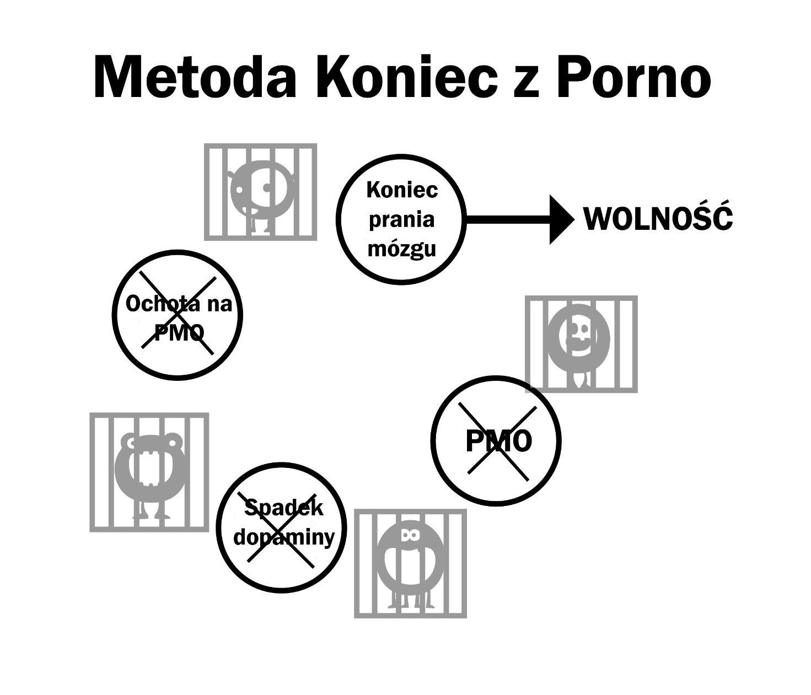

# Pranie mózgu i jego aspekty

Duży potwór pornografii kultywowany jest poprzez wiele aspektów, włączając siły społeczne, media, znajomych i własną narrację użytkownika. Nieumiejętność dekonstrukcji tych błędów myślowych, kiedy używamy metody siły woli, prowadzi do głodu, który wprowadza nas prosto w sidła pułapki. Rozebranie wyobrażonej wartości porno na czynniki pierwsze jest konieczne do sukcesu i pozwoli ci zobaczyć, gdzie leży problem.

Muszę też wspomnieć o połączeniu między strachem i praniem mózgu. To strach przed przyszłym głodem kreuje głód. Ten strach to właśnie głód. Pomyśl sobie o swoich objawach odstawienia – pocenie dłoni, problemy z oddychaniem, bezsenność i rozkojarzenie. Teraz przypomnij sobie inne sytuacje, kiedy te same symptomy występują: rozmowa o pracę, zdenerwowanie które czujesz obok atrakcyjnej osoby, publiczne wystąpienia... to te same odczucia niepewności które powoduje strach. Mówiąc prościej – jak fizyczny narkotyk może uzależniać wiele miesięcy po rzuceniu? To musi być problem z głową, prawda?

## Stres

Nie tylko duże problemy, ale też stresy dnia codziennego pchają użytkowników w zabronioną 'niebezpieczną' strefę. Takie stresy to socjalizacja, telefony, problemy młodego rodzica z dziećmi i wiele innych. Weźmy rozmowę telefoniczną jako przykład, szczególnie dla kogoś kto pracuje w biznesie. Większość telefonów nie pochodzi od zadowolonych klientów albo od szefa który chce ci pogratulować, zwykle telefon oznacza kłopoty. Powrót do domu do codziennego życia rodzinnego krzyczących dzieci i wymagań emocjonalnych partnera, powoduje, że użytkownik – jeśli tego już nie robi – fantazjuje o uldze związanej z pornografią. Podświadomie cierpi na męczący głód z osłabionym układem limbicznym niegotowym na dodatkowe obciążenie. Poprzez częściowe zaspokojenie głodu, który występuje razem z normalnym stresem, całkowity poziom się zmniejsza, a użytkownik dostaje chwilową ulgę. Ta ulga to nie iluzja, rzeczywiście czujemy się lepiej niż wcześniej, ale i tak jesteśmy bardziej spięci niż osoba nieużywająca pornografii.

Kolejny przykład nie ma służyć zszokowaniu cię, bo Koniec z Porno nie polega na takiej formie terapii, piszę to, żeby ci uświadomić, że pornografia niszczy twoje nerwy, a nie relaksuje.

Wyobraź sobie sytuację, w której nie osiągniesz podniecenia, nawet przy bardzo seksownej i atrakcyjnej partnerce. Na krótką chwilę wyobraź sobie życie, w którym kochana i słodka osoba musi konkurować z wirtualnymi gwiazdami porno, które należą do twojego haremu, żeby zyskać twoją uwagę. Wyobraź sobie myśli osoby, która, wiedząc o tym ostrzeżeniu, kontynuuje oglądanie porno i umiera nigdy nie trafiając do łóżka z tym cudownym partnerem. Łatwo oddalić tych ludzi jako dziwaków, ale te historie to nie ściemy, to bezpośredni efekt działania pornografii na twój mózg. Im dalej idziesz przez życie, tym bardziej twoja odwaga podupada, a tobie wmawia się, że pornografia to leczy.

Miałeś kiedyś moment paniki, kiedy nagle twoje połączenie internetowe przestaje działać albo jest zbyt wolne? Ludzie niekorzystający z pornografii nie mają tego problemu, bo to pornografia tworzy tę panikę. W trakcie twojego życia systematycznie niszczy twój spokój ducha i odwagę, pozostawiając DeltaFosB, które tworzy te mocne ścieżki i zjeżdżalnie, które powoli odbierają ci umiejętność powiedzenia NIE. Kiedy twoja jurność zostaje zniszczona, użytkownik wierzy, że pornografia to nowy partner i nie może bez niej żyć.

*Pornografia internetowa nie koi twoich nerwów, ona je niszczy*. Jedną z największych zalet oderwania się od uzależnienia jest powrót do twojej naturalnej pewności siebie i wiary.

Nie ma sensu oceniać się na podstawie swojej umiejętności zaspokajania partnera, to nie jest wolność. Ale tej wolności nie osiągniesz ciągle smarując swoją zjeżdżalnię dopaminy, która podcina twoje szczęście i libido poprzez powtarzanie tego samego, destrukcyjnego zachowania

## Nuda

Jak wiele osób, gdy tylko włazisz do łóżka, od razu wskakujesz na swoją ulubioną stronę z pornosami, nawet o tym nie myśląc. To jak druga natura. Pornografia jako pomoc na nudę to też kłamstwo, ponieważ nuda to stan umysłu; który osiągasz podczas głodu bądź prób rzucenia.

W rzeczywistości wygląda to tak: kiedy jesteś uzależniony od nadnaturalnych bodźców internetowego porno, a potem próbujesz przestać, to nagle czujesz jakby czegoś ci brakowało. A gdy masz coś, co ci zajmuje głowę przez większość czasu, możesz długo przeżyć bez narkotyku.

Więc gdy się nudzisz, nie ma nic czym się zajmujesz, co sprawia, że karmisz potwora. Kiedy się zabawiasz, nawet nie próbujesz przestać, włączenie trybu incognito jest podświadome. Rytuał jest automatyczny; Jeśli spróbujesz sobie przypomnieć swoje ostatnie kilka sesji, będziesz pamiętał tylko niewiele z nich, może tą jedną po długiej przerwie albo ostatnią.

Prawda jest taka, że pornografia zwiększa twoje poczucie nudy pośrednio, ponieważ orgazm sprawia, że czujesz się letargicznie i zamiast zabrać się za jakąś aktywność, użytkownik leży znudzony, myśląc o dalszym zaspokajaniu głodu. Walka z praniem mózgu jest ważna, ponieważ ludzie oglądają porno, gdy się nudzą, więc nasze mózgi interpretują je jako coś interesującego. Co ciekawe, zostaliśmy też okłamani, że seks, nawet zły seks, pomaga w relaksie.

Prawdą jest, że gdy jest smutno bądź stresująco, pary lubią uprawiać seks. Zauważ natomiast, wyłączając seks służący prokreacji i seks z miłości, jak szybko ludzie odsuwają się od siebie po obowiązkowym orgazmie. Jeśli tylko para zdecydowałaby się tylko przytulać, porozmawiać, a potem iść spać, dopiero wtedy poczuliby ulgę.

## Koncentracja

Masturbacja i seks wcale nie pomagają przy koncentracji - kiedy chcesz się skupić, automatycznie unikasz rozpraszaczy. Więc, kiedy użytkownik chce się skoncentrować, nawet nie myśli – odpala przeglądarkę, karmi małego potwora i częściowo zaspokaja głód. Następnie kontynuuje pracę, zapominając, że w ogóle oglądał pornografię. Po latach zalewania dopaminą, zmiany w mózgu wpływają na umiejętności takie jak dostęp do informacji, planowanie czy kontrola impulsów.

Masz też ochotę dostarczyć sobie czegoś nowego przy następnej sesji, bo te same filmy nie generują już wystarczająco dużo dopaminy i opioidów. Więc będziesz musiał siedzieć i szukać czegoś mocniejszego, walcząc, żeby nie przekroczyć czerwonej linii na niebezpieczne terytorium, co w rezultacie sprawia że czujesz się zestresowany i niespełniony, nawet gdy skończysz.

Koncentracja jest również niszczona ze względu na twoje receptory dopaminy, które przytłumione za sprawą wielkich fal, nie są w stanie odczytać małego przypływu z naturalnych przyjemności. Twoja koncentracja i inspiracja zwiększą się wielokrotnie, kiedy ograniczysz ten proces. Dla wielu to właśnie kwestia koncentracji, która uniemożliwia im sukces metodą na silną wolę – mogą sobie radzić ze złym humorem i zdenerwowaniem, ale to właśnie nieumiejętność skoncentrowania się na czymś trudnym ich łamie.

Strata koncentracji, na którą cierpią użytkownicy którzy próbują rzucić nie jest spowodowana brakiem seksu, a tym bardziej pornografii. Masz mentalne blokady kiedy jesteś uzależniony od czegoś, a kiedy masz mentalny blok to, co robisz? Odpalasz przeglądarkę – a ona nie leczy bloku – i co dalej? Zajmujesz się tym tak samo, jak ludzie, którzy nie używają, po prostu zmuszając się do tego.

Jako użytkownik nie oskarżasz o nic przyczyny, bo użytkownicy nigdy nie mają dysfunkcji seksualnej, tylko chwilowe problemy. W momencie, w którym przestajesz używać, wszystkie problemy zrzucasz na powód, dla którego przestałeś. Więc teraz, kiedy masz mentalny blok, zamiast po prostu zabrać się do roboty, myślisz sobie „*o gdybym tylko mógł zobaczyć co tam u mojego haremu, ten problem by zniknął*”. W ten sposób zaczynasz wątpić w swoją decyzję o rzuceniu niewolnictwa.

Jeśli wierzysz, że pornografia pomaga przy koncentracji, martwienie się tym zagwarantuje, że się nie skupisz. Wątpliwości, a nie fizyczny głód kreują problem. Pamiętaj, tylko uzależniony cierpi na głód, a nie osoba nieoglądająca porno.

## Relaks

Większość użytkowników myśli, że pornografia pomaga im się zrelaksować. Jednak paniczne szukanie kolejnej działki w ciemnych zaułkach Internetu i wewnętrzna ciągnięcie łańcucha w stronę czerwonej linii nie brzmi jak zbyt relaksująca aktywność.

Gdy przychodzi wieczór, po długim dniu albo w nowym miejscu, siadamy sobie żeby się zrelaksować, jemy dobry posiłek i gasimy pragnienie po czym czujemy się w pełni usatysfakcjonowani. Ale użytkownik ma jeszcze jeden problem, którym trzeba się zająć. Dla uzależnionego pornografia jest wisienką na torcie. Tak właściwie, jest to tylko ten mały potwór, którego trzeba nakarmić. Prawda jest taka, że uzależniony nigdy nie poczuje pełnego relaksu, a im dalej w las, tym będzie gorzej. Tutaj komentarz od osoby, która rzuciła porno:

> „*Wierzyłem, że miałem w sobie złego demona, wiedziałem że go mam, ale to nie był jakiś problem wbudowany we mnie, to był tylko ten mały potwór pornografii który wywoływał ten problem. W tamtym czasie wydawało mi się, że spotykają mnie wszystkie kłopoty tego świata, ale myślę o tym teraz, to zastanawiam się, gdzie był cały ten stres. Kontrolowałem każdy aspekt mojego życia, a mnie kontrolowało uzależnienie od pornografii. Smutne jest to, że dziś nie potrafię przekonać moich dzieci, że to właśnie to niewolnictwo sprawiło, że byłem taki drażliwy*”

Za każdym razem, kiedy słyszę uzależnionych tłumaczących swoje uzależnienie, mówią oni „*no tak, łatwiej mi się wtedy zrelaksować*”. Komentarz wyżej napisał ojciec, którego syn chciał z nim spać po zobaczeniu strasznego filmu, a ten musiał odmówić, bo chciał urządzić sobie kilkugodzinną sesję dochodzenia.

Kolejne porównanie do palenia, kilka lat temu rozmawiano o banie na adopcję dzieci dla osób palących. Dzwoni zdenerwowany facet „*nie macie racji*” mówi, „*pamiętam jako dziecko, kiedy miałem jakąś sprawę do mamy, czekałem z nią aż odpali papierosa, bo była wtedy bardziej zrelaksowana*”. Dlaczego nie rozmawiał z nią, kiedy nie paliła?

Dlaczego niektórzy użytkownicy są tak zestresowani, kiedy nie mogą zaspokoić głodu, nawet po prawdziwym seksie? Kolejna historia przeczytana online dotyczy gościa, który pracował w marketingu, który miał 9 i 10 gotowe na randki każdego dnia, ale stracił zainteresowanie chodzeniem na obiadki, bo pornografia była dużo łatwiejsza, nie musiał wydawać na nią pieniędzy i nie miał zagrożenia odrzucenia zalotów na koniec wieczoru. Po co się męczyć, gdy mały potworek pragnie tylko gwarantowanej, łatwej i przyjemnej nagrody, dostępnej w każdej chwili w zaciszu domowym?

Więc dlaczego niekorzystający z pornografii są zupełnie zrelaksowani? Dlaczego uzależnieni nie potrafią zrelaksować się bez zaspokojenia głodu przez jeden albo dwa dni? Poczytaj doświadczenie użytkownika, który przyrzekł abstynencję i rzucił pornografię i jakie pokusy czuł, będąc w stanie przeciwnym do relaksu, kiedy nie miał swojej 'jedynej przyjemności' która mu się 'należała'. Zapomniał, jak to jest być zupełnie zrelaksowanym. Pornografia może być przyrównana do muchy złapanej przez rosiczkę. Na początku to mucha wciąga słodki nektar, ale w pewnym momencie, to słodki nektar zaczyna zjadać muchę.

Najwyższy czas uciec z paszczy trującej rośliny!

## Energia

Większość użytkowników jest świadoma progresywnego efektu pornografii na układ nagrody w ich mózgu oraz ich satysfakcję seksualną, jednakże nie zdają sobie sprawy z jej wpływu na poziom energii ciała.

Jedną z subtelności pułapki pornografii jest fakt, że działa ona na nas, mentalnie i fizycznie, tak powoli i nieodczuwalnie, że nie mamy pojęcia o negatywnych skutkach uzależnienia i uważamy głód za normalny stan. Podobnie jest w przypadku złych nawyków żywieniowych, kiedy patrzymy na bardzo otyłych ludzi i zastanawiamy się jak mogli doprowadzić się do takiego stanu.

Wyobraźmy sobie, że taki stan osiągamy w jedną noc. Kładziesz się umięśniony i wysportowany, bez grama tłuszczu na ciele, a budzisz się gruby i ulany. Zamiast obudzić się świeżym i wyspanym, wstajesz zmęczony i nieszczęśliwy.

Nie ma co, dopadłaby cię panika, zastanawiałbyś się co to za okropna choroba, którą się zaraziłeś przez noc, a mimo to – choroba jest taka sama. To, że zajęło ci 20 lat żeby dojść do tego miejsca nie ma żadnego znaczenia. Pornografia jest dokładnie taka sama - gdyby dało się od razu przetransferować twoje ciało i umysł, żeby dać ci bezpośrednie porównanie z tym jak będziesz się czuł po odstawieniu porno na 3 tygodnie, to to by wystarczyło, żeby cię przekonać. Pytałbyś, czy naprawdę będziesz czuł się aż tak dobrze albo co to w ogóle znaczy, „czy ja naprawdę upadłem tak nisko?” Nie tylko poczułbyś się znacznie zdrowszy i pełen energii, ale promieniowałbyś pewnością siebie i koncentracją.

Brak energii, zmęczenie i wszystko, co się z tym łączy jest pięknie zamiatane pod dywan 'bycia coraz starszym'. Przyjaciele i znajomi, którzy również prowadzą siedzący tryb życia, prowadzą do dalszej normalizacji takich zachowań. Wiara w to, że energia jest ekskluzywnie przeznaczona dla dzieci i nastolatków, a starość zaczyna się kiedy masz 20 parę lat, jest kolejnym symptomem prania mózgu, tak jak twoja nieświadomość przyjemności ze zdrowego odżywiania i sportu, jest rezultatem twoich rosnących problemów z dopaminą.

Niedługo po rzuceniu porno, te mgliste i duszne uczucia cię opuszczą. Sprawa wygląda tak. Pornografia stale obciąża twoją energię, a w ten sposób igra z twoim układem limbicznym. W przeciwieństwie do rzucenia palenia, którego efekty są ujawniają się w długim okresie, rzucenie pornografii da ci wspaniałe rezultaty od pierwszego dnia. Zabicie małego potwora i zamknięcie zjeżdżalni zajmą trochę czasu, ale odzyskanie swojego mechanizmu nagrody nie ma nic wspólnego z powolnym zjazdem w dół zjeżdżalni. Jeśli przechodzisz przez traumę metody silnej woli, każdy zysk zdrowotny i energiczny będzie zniwelowany przez twoją depresję. Niestety, nie jestem w stanie przenieść cię trzy tygodnie w przyszłość, ale ty możesz. Wiesz instynktownie, że to co ci mówię to prawda, więc możesz sobie to **wyobrazić!**

## Wieczorne sesje przed imprezą

To jest dezinformacja, która wydaje się sensowna, ale nie jest. Żeby kontrolować swój apetyt, będziesz jadł w domu przed wyjściem do restauracji albo na imprezę? Dokładnie to robisz masturbując się przed wyjściem na miasto. Dodatkowo po sesji wyglądasz na zmęczonego i nie w najlepszym stanie! Szeroki wpływ kultury podrywu wytworzył ciśnienie na podejście i zaliczenie. A ty próbujesz zbić swoje motylki pornografią i innymi substancjami, które tylko pogarszają problem.

Osobiście lubię ten dreszczyk emocji który pozwala mi się skupić i zaangażować, a męczenie się mentalnie i fizycznie orgazmem w niczym nie pomaga.

Pornografia przed wydarzeniem społecznym jest motywowana naszymi standardowymi bodźcami. W tym wypadku to stres i relaks. To może wydawać się przeciwieństwem, ale każda forma socjalizacji może być stresująca – nawet z przyjaciółmi – kiedy chcesz być sobą i się zrelaksować. Przy wielu okazjach wiele bodźców pojawia się w tym samym momencie, weźmy na przykład prowadzenie samochodu, szczególnie, że prowadząc stawiasz swoje życie w niebezpieczeństwie. Czyli mamy stres i koncentrację, którą trzeba utrzymać przez dłuższy czas. Nie musisz być świadomy tych bodźców, bo twoja podświadomość otrzymuje wszystkie potrzebne informacje. W ten sam sposób, kiedy stoisz w korku albo jedziesz długo znudzony po autostradzie, cieszysz się wtedy na myśl o obiecanej sesji po powrocie do domu.

Innym dobrym przykładem jest pierwsza randka, kiedy twój umysł rzuca mnóstwo pytań o osobę, którą zaraz poznasz. Jeśli twój entuzjazm opadnie w trakcie spotkania, zaczniesz się czuć zrelaksowany i winny, że tak się czujesz. Rozpoczyna się wojna – dajcie mi seks albo stąd natychmiast uciekam – co przygotowuje cię do oglądania porno po randce.

Nawet jeśli randka poszła świetnie i kilka godzin później lądujesz u niej w domu, nieważne co się wydarzy, nie osiągniesz satysfakcji, jeśli twoim celem jest tylko orgazm. Kiedy indziej wracasz sam do domu, a w twojej głowie masz myśli tylko o swoim haremie, a nie o dumie, że dałeś z siebie wszystko. Założymy się, że ktoś w tej pozycji, kto odbędzie sesję PMO po powrocie do domu i po takiej nocy, obudzi się z uczuciem pustki to najbardziej będzie się bał tego właśnie uczucia po odstawieniu pornografii. Wydaje nam się, że życie już nigdy nie będzie takie przyjemne. A w rzeczywistości dalej działa ta sama zasada – sesje dostarczają ulgi od głodu, szczególnie w niektórych, cięższych momentach. A zjeżdżalnia jest naoliwiona na następny zjazd.

Uświadom to sobie – to nie pornografia i użytkownicy haremu są jacyś specjalni, to okazja są specjalne. Kiedy potrzeba oglądania porno się wyłączy, te okazje staną się przyjemniejsze, a stresujące sytuacje – mnie stresujące

