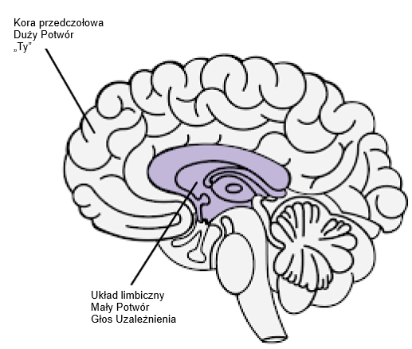

# Zasoby {-}

[Medytacje Uzależnionego od Porno](resources/meditations.pdf) - Guillaco

[Lista kontrolna stwierdzeń EasyPeasy](https://old.reddit.com/r/pmohackbook/comments/id6nie/easypeasy_statements_checklist/) - SWATxKATS

[9-minutowa Medytacja](https://www.youtube.com/watch?v=tw7XBKhZJh4) - Sam Harris

[Kurs Medytacji Waking Up](https://wakingup.com) - Sam Harris

[Wyjście z Nowoczesności](https://jdemeta.net/2019/09/15/exiting-modernity/) - Meta Nomad // ([pdf](https://jdemeta.net/wp-content/uploads/2019/09/Exiting-Modernity.pdf))

[List, który wysyłam do szkół](resources/principal.pdf)

[Wolność na Zawsze (PMO Hacknotes)](https://sites.google.com/view/freeforever/home)

[Dlaczego masz nawroty - u/Different_Guide_5205](https://old.reddit.com/r/pmohackbook/comments/mynwjl/why_youre_relapsing/)

[Przeciwdziałanie Strachowi - u/Different_Guide_5205](https://old.reddit.com/r/pmohackbook/comments/n5027n/countering_fear/)

## Stwierdzenia radzenia sobie REBT {-}

- „*Mogę przestać stosować PMO, nawet jeśli wydaje się to 'trudne'. To nie jest zbyt trudne, a niezależnie od tego, ile wysiłku to wymaga, warto!*"

- „*Jeśli będę ignorować i nigdy nie ulegać silnym pragnieniom PMO, coraz łatwiej będzie mi się im opierać.*"

- „*Mogę w pełni i bezwarunkowo zaakceptować siebie — tak, nawet ze wszystkimi moimi wadami i niedoskonałościami.*"

- „*PMO wydaje się szybko 'leczyć' moje problemy, ale w rzeczywistości je pogarsza.*"

- „*Czasami bardzo chciałbym utopić swoje problemy w PMO, ale to nigdy nie jest powód, by to robić.*"

- „*To bardzo niewygodne, gdy nie dostaję tego, czego naprawdę chcę. Ale to nie jest straszne ani okropne, chyba że wybiorę wiarę w to, a ja wybieram wiarę w coś bardziej realistycznego i pomocnego.*"

- „*Nigdy nie polubię niesprawiedliwego traktowania, ale mogę to znieść i być może planować, jak to powstrzymać.*"

- „*Nieważne, ile razy poniosę porażkę w tym ważnym dążeniu, moja porażka nigdy nie czyni mnie niekompetentnym łajdakiem. To tylko czyni mnie osobą, która mogła działać niekompetentnie w tym momencie.*"

- „*Nie potrzebuję absolutnie tego, czego chcę, ale nadal mogę być rozsądnie szczęśliwy, choć nie tak szczęśliwy, jak gdy tego nie dostanę.*"

- „*Bardzo chciałbym być wybitny w mojej pracy, ale nie muszę nim być. Szkoda, jeśli nie jestem, ale to nie czyni mnie gorszym. Zawsze mogę próbować robić lepiej, nie potrzebując robić lepiej.*"

- „*Wiele rzeczy może sprawić, że będę smutny i rozczarowany, ale kiedy żądam i nakazuję, aby te rzeczy nie istniały, wtedy wpędzam się w panikę, depresję i wściekłość.*"

- „*Tak, często nie robiłem tego, co obiecałem zrobić, ale to nie znaczy, że nie mogę lub nie będę realizować tej obietnicy.*"

- „*Nienawidzę być niespokojny i przygnębiony, ale nie muszę natychmiast rozpuszczać tych uczuć za pomocą PMO. Podczas PMO tymczasowo czuję się lepiej z moimi problemami, ale nie staję się lepszy. W dłuższej perspektywie PMO pogarsza je.*"

- „*Ludzie nie doprowadzają mnie do wściekłości, traktując mnie źle. To ja uparcie wybieram wściekać się na ich złe traktowanie, żądając i nakazując, aby zachowywali się lepiej.*"

## Łączenie EasyPeasy z Techniką Rozpoznawania Głosu Uzależnienia (AVRT) Jacka Trimpeya {-}

*Uznanie dla az#8773 na Discordzie*

To jest dla osób, które mają trudności z zastosowaniem metody Easyway Allena Carra do wyjścia z uzależnienia, mimo usunięcia prania mózgu. Zakładam, że każdy, kto to czyta, przeczytał którąś z książek Allena Carra i zrozumiał jego metodę Easyway (znaną również jako Easypeasy). Jeśli nie, gorąco to polecam. Pomocne byłoby również przeczytanie „Rational Recovery" Jacka Trimpeya. Jeśli tego nie czytałeś, to nie ma problemu, ponieważ omówię tu podstawy, ale i tak polecam przeczytać, gdyż zawiera znacznie więcej szczegółów niż ja tu przedstawię. To nie będzie skierowane do żadnego konkretnego uzależnienia i dlatego będzie miało zastosowanie do każdego uzależnienia. Celem tego tekstu jest porównanie Easyway z inną skuteczną metodą walki z uzależnieniem zwaną „Techniką Rozpoznawania Głosu Uzależnienia" (AVRT) i połączenie tych dwóch metod. Choć uważam, że Easyway jest zdecydowanie lepszy od wszystkich innych metod wychodzenia z uzależnienia, wierzę, że zrozumienie AVRT może być brakującym ogniwem dla wielu, którzy ponoszą porażkę stosując Easyway, mimo pokonania dużego potwora.

Istnieje wiele konkurencyjnych metod przezwyciężania uzależnienia, każda z różnym wskaźnikiem sukcesu. Nie będę wymieniać żadnej z nich, ponieważ większość z nich to strata czasu, a ja chcę zachować to jak najkrótsze. Jedyne metody, o których napiszę, to Easyway Allena Carra i AVRT Jacka Trimpeya (założyciela Rational Recovery). Obie metody mają niezwykle wysokie wskaźniki powodzenia, ale każda celuje w coś innego. Easyway i AVRT są podobne w tym, że Easyway dzieli uzależnienie na „Małego Potwora” i „Dużego Potwora”, a AVRT dzieli twój umysł na „Głos Uzależnienia” (znany też jako bestia) i „Ciebie”. Głos uzależnienia i mały potwór to to samo, a duży potwór (znany też jako pranie mózgu) to system przekonań, który sprawia, że myślisz, że twoje uzależnienie daje ci jakąś korzyść lub wsparcie. Easyway koncentruje się na wyeliminowaniu dużego potwora, prawie nie zwracając uwagi na małego potwora, podczas gdy AVRT skupia się na małym potworze, nie zwracając uwagi na dużego potwora. Podczas gdy Easyway niszczy uzależnienie psychologiczne, AVRT uczy cię rozpoznawać fizyczne uzależnienie maskujące się jako ty i oddzielać się od niego. Uważam za interesujące, że zarówno Easyway, jak i AVRT mają bardzo wysokie wskaźniki powodzenia, mimo że koncentrują się na przeciwnych rzeczach.

Choć uważam, że Easyway jest zdecydowanie lepszy od wszystkich innych metod wychodzenia z uzależnienia i polecam go ponad wszystko inne, mogę wskazać w nim dwie małe dziury. Po pierwsze, uważam, że niedocenia on małego potwora. Chcę uniknąć używania osobistych anegdot w tym tekście, ale z moich doświadczeń i doświadczeń innych wynika, że niektórzy z nas ponoszą porażkę z Easyway nie dlatego, że nie udało nam się całkowicie wyeliminować dużego potwora (chociaż to może się zdarzyć i zdarza się), ale dlatego, że nie doceniliśmy małego potwora. Mały potwór nie jest problemem dla większości ludzi, co wyjaśnia wysokie wskaźniki powodzenia Easyway, ale dla innych, w tym mnie, może być. Druga dziura polega na tym, że Easyway mówi, że wszystkie porażki są wynikiem albo nieprzestrzegania instrukcji, albo nieusunięcia dużego potwora.

Podstawowa istota Easyway jest taka. Uzależnienie ma dwa komponenty, fizyczne uzależnienie od dopaminy i psychologiczne uzależnienie składające się z przekonań (prania mózgu), że twoje uzależnienie daje ci jakąś przyjemność lub wsparcie. Są one nazywane odpowiednio małym i dużym potworem. Według Easyway mały potwór to nic więcej jak puste, lekko niepewne uczucie, które jest ledwo zauważalne. Gdy zabijesz dużego potwora, cofając pranie mózgu poprzez naukę, jak twoje uzależnienie nie ma żadnych korzyści i jak każda postrzegana przyjemność lub wsparcie jest tylko iluzją, a co równie ważne, jak nie ma się czego bać w życiu bez twojego uzależnienia, pragnienia znikają. Pragnienia wynikają z twojego strachu, że życie bez twojego małego wsparcia byłoby nie do zniesienia, co powoduje, że wątpisz w rzucenie, co jest pragnieniem. Pokonujesz strach, zdając sobie sprawę, o ile przyjemniejsze będzie twoje życie bez uzależnienia, i utrzymujesz to uczucie uniesienia.

Choć uważam, że jest to najlepsza metoda wychodzenia z uzależnienia, nie kładzie ona nacisku na małego potwora, ponieważ teoretycznie, gdy duży potwór zostanie pokonany, bezradny, bezsilny mały potwór po prostu zwiędnie i umrze sam z siebie, a i tak jest prawie niezauważalny, więc kogo to obchodzi. Mały potwór może być nieistotny dla wielu ludzi, ale z moich własnych doświadczeń i doświadczeń innych wynika, że nie zawsze tak jest. Kiedy ludzie ponoszą porażkę z Easyway, według Easyway, są tylko dwa możliwe powody: albo nie przestrzegałeś właściwie instrukcji, albo nie udało ci się usunąć dużego potwora. Uważam, że jest to szkodliwe i wyjaśnię, dlaczego później.

Technika Rozpoznawania Głosu Uzależnienia (AVRT) dzieli mózg na dwie części, niższy mózg (układ limbiczny), gdzie mieszka twoje uzależnienie, i wyższy mózg (kora przedczołowa), gdzie mieszkasz ty (a przynajmniej twoje myśli i ego). Jack Trimpey nazywa głos uzależnienia bestią, ponieważ mieszka on w zwierzęcej części naszego mózgu i zna tylko jedno: „CHCĘ TEGO I CHCĘ TEGO TERAZ”. Sam nie uważam za pomocne personifikowanie go jako bestii, ale przypuszczam, że jest to lepsze niż wierzenie, że to ty. Głos uzależnienia (AV, mały potwór) przejmie twój głos umysłu i użyje go przeciwko tobie, aby skłonić cię do oddania się twojemu uzależnieniu. Musi to robić, ponieważ sam nie może kontrolować twoich funkcji motorycznych. Możesz to sprawdzić teraz, podnieś rękę przed twarzą i poruszaj palcami. Teraz poproś swoje uzależnienie, aby zrobiło to samo. Nie może. To oznacza, że to ty ostatecznie masz tu kontrolę.

AV nie tylko przejmuje twój głos umysłu, ale też podstępnie ukrywa się za zaimkiem „ja”. Mówi „Naprawdę potrzebuję X właśnie teraz”, „Na pewno tęsknię za robieniem X”, „Czy nie byłoby miło zrobić X teraz, w końcu zasługuję na to po dzisiejszym dniu.” AVRT podkreśla fakt, że nie jesteś swoim głosem uzależnienia, tylko myślisz, że nim jesteś. Kiedy rozpoznasz AV jako 'nie ty' i powiesz mu nie, porzuca ono „ja” i zaczyna używać „ty”, „my” lub „nas”. To jest dowód, że to nie ty.

Kiedy mówisz „Nie” swojemu AV, dzieje się to:
„Naprawdę potrzebuję X właśnie teraz” staje się „Och, daj spokój, naprawdę potrzebujesz X teraz i dobrze o tym wiesz”. „Na pewno tęsknię za robieniem X” staje się „Och, daj spokój, na pewno tęsknisz za robieniem X, czy nie czujesz tego?” „Czy nie byłoby miło zrobić X teraz, w końcu zasługuję na to po dzisiejszym dniu.” staje się „Zasługujemy na to, żeby zrobić X teraz po tym wszystkim, co przeszliśmy, jak możesz nam tego odmówić?”

W tym momencie muszę coś wyjaśnić. To nie jest 'przeciąganie liny', o którym mówi Allen Carr. 'Przeciąganie liny' to dysonans poznawczy, który pojawia się, gdy masz co najmniej dwa sprzecznych systemów przekonań i jest wynikiem niezabicia dużego potwora. „Naprawdę nie chcę robić X z powodu tego negatywnego efektu, który mi daje, ale też sprawia, że jestem X, więc chcę to zrobić”. To jest przeciąganie liny i jest dziełem dużego potwora. Gdy duży potwór jest martwy poprzez usunięcie prania mózgu, jedyne głosy mówiące ci, żebyś zajął się swoim uzależnieniem, będą pochodzić od małego potwora (AV). Ponieważ AV używa zaimka „ja”, pojawia się możliwość pomylenia AV z dużym potworem.

Ważne jest też, aby zauważyć, że AV jest ogromnym kłamcą. Jego jedynym zmartwieniem jest zdobycie dopaminy za wszelką cenę. Twój AV będzie próbował przekonać cię do postawienia się w potencjalnie śmiertelnych sytuacjach, jeśli oznacza to zdobycie dawki.

Wcześniej powiedziałem: „Kiedy ludzie ponoszą porażkę z Easyway, według Easyway, są tylko dwa możliwe powody: albo nie przestrzegałeś właściwie instrukcji, albo nie udało ci się usunąć dużego potwora. Uważam, że jest to szkodliwe i wyjaśnię dlaczego później.” Uważam, że jest to szkodliwe, ponieważ nierozpoznanie AV doprowadziło mnie i innych, którzy używali Easyway, do fałszywego przekonania, że nie zabiliśmy w pełni dużego potwora, więc ponownie czytamy książkę, próbując ponownie zabić pranie mózgu, mimo że już to zrobiliśmy. Nierozpoznanie AV w połączeniu z przekonaniem, że 'jeśli poniosłeś porażkę z Easyway, oznacza to, że nie udało ci się zabić dużego potwora' spowoduje, że skupisz swoje wysiłki ponownie na dużym potworze, gdy już został pokonany. Możesz wpaść w cykl ponownego czytania książek Allena Carra, trwania przez jakiś czas, a następnie nawrotu, powtarzając to w kółko.

Kiedy AV mówi coś w stylu „Chcę teraz zrobić X, bo sprawia, że jestem X”, jeśli cofnąłeś pranie mózgu i usunąłeś dużego potwora, możesz pomyśleć „Ale wiem, że to nieprawda, więc dlaczego nadal w to wierzę? Czy nie udało mi się całkowicie cofnąć prania mózgu”. Prawda jest taka, że usunąłeś pranie mózgu, co potwierdza fakt, że wiesz lepiej niż to, co mówi ci twój AV, po prostu myślisz, że AV to ty, ponieważ użył zaimka „ja”. Rozpoznanie AV i zmuszenie go do ujawnienia się poprzez porzucenie „ja” na rzecz „ty”, „my” lub „nas” powinno potwierdzić, że to nie duży potwór, to mały potwór. Gdyby to rzeczywiście był duży potwór, nie zamieniłby „ja” na „ty”, „my” lub „nas”
.
Teraz, kiedy AV mówi „Proszę, czy możemy po prostu zrobić X jeszcze raz na pamiątkę starych czasów, tylko jeszcze raz?” i mówisz „Nie”, możesz poczuć emocjonalną reakcję. Możesz poczuć strach lub smutek. Niezwykle ważne jest, aby zdać sobie sprawę, że to uczucie nie pochodzi od ciebie, ale od niego. Jeśli nie jesteś w stanie rozpoznać AV, będziesz myślał, że ta emocja pochodzi od ciebie i będziesz bardziej skłonny do ulegania. Rozpoznaj AV i fakt, że emocje pochodzące od niego nie pochodzą od ciebie, a następnie ciesz się z tego.

Kiedy połączysz obie te metody (jeśli to konieczne, nie wszyscy ludzie wydają się mieć problem z małym potworem) i utrzymasz uczucie radości i uniesienia za każdym razem, gdy rozpoznasz AV, sukces jest twój.
