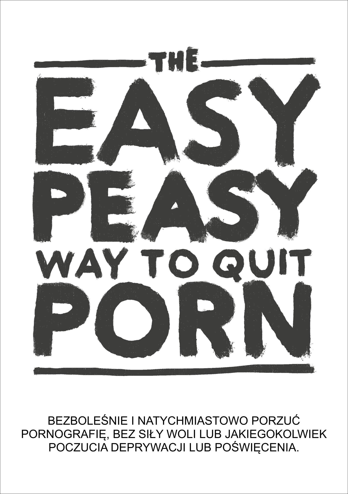

# Wstęp

{width=45% height=45%}

CZYTAJ PO KOLEI

Ta książka pomoże ci przestać oglądać pornografię szybko, bezboleśnie i na stałe, bez poczucia odstawienia czy poświęcenia. Nikt nie będzie cię oceniał, zawstydzał ani zmuszał do nieprzyjemnych rzeczy.

Właściwie to nie ma powodu, żebyś przestawał używać w trakcie czytania – oglądanie jest wręcz zalecane.

Możesz nie mieć za bardzo ochoty albo być jedną z [miliona](https://old.reddit.com/r/nofap) osób, które [aktywnie](https://old.reddit.com/r/pornfree) [próbują](https://rebootnation.org) [przestać](https://yourbrainrebalanced.com).
Jeśli tak jest, to może to, co właśnie przeczytałeś, kłóci się z tym, co słyszałeś, ale zadajmy sobie pytanie – czy inne metody zadziałały? Jeśli tak, to na pewno nie czytałbyś tej książki.

Kilka pytań na początek:
-   Spędzasz dużo więcej czasu na oglądaniu pornografii niż zakładałeś?
-   Nie potrafisz ograniczyć albo zaprzestać konsumpcji porno?
-   Oglądanie pornografii negatywnie wpłynęło bądź było ważniejsze niż twoje osobiste lub profesjonalne cele, zainteresowania czy związki?
-   Czy twoja konsumpcja pornografii jest sekretem? Usuwałeś kiedyś historię przeglądania?
-   Pornografia spowodowała poważne problemy w twoich intymnych związkach?
-   Doświadczasz cyklu podniecenia i szczęścia przed konsumpcją pornografii i wstydu, poczucia winy i żalu po skończeniu?
-   Często myślisz o pornografii, nawet kiedy jej nie oglądasz?
-   Czy oglądanie porno spowodowało jakieś negatywne konsekwencje w twoim życiu? (zaniedbywanie pracy, związków, problemy finansowe)

Jeśli używasz porno do masturbacji bądź do seksu z *jakiegokolwiek powodu* jedyne co musisz zrobić to czytać dalej. Jeśli jesteś tu dla kogoś, kogo kochasz, kto ma problem – musisz ich przekonać, żeby sami zabrali się za czytanie. Jeśli ci się to nie uda – przeczytaj książkę sam. Zrozumienie metody pomaga w rozmowie z uzależnionym i pomoże ci uniknąć problemu z twoimi dziećmi w przyszłości. Niech ci się nie wydaje, że nie mają dostępu do porno – wszyscy mają, zanim się uzależnią.

## O książce {-}

Ta książka jest przepisaną wersją książki *EasyWay to Quit Smoking* Autorstwa Allena Carra.
Jest darmowa i otwarta. Twój sukces zależy od tego, że będziesz

CZYTAŁ PO KOLEI

Kiedy otwierasz sejf, musisz wpisać cyfry kodu po kolei. Uzależnienie działa tak samo.

Osobiście, [oryginalna wersja z Google Sites](https://sites.google.com/site/hackbookeasypeasy) (której nie jestem autorem) zmieniła moje życie. Jeśli jesteś jak większość ludzi, odkryłeś pornografię jako młody człowiek i używasz jej regularnie od tego czasu. W pewnym momencie trafiłeś na jakieś historie albo obrazki w Internecie, które przestrzegały cię przed niebezpieczeństwem. I tak jak ja, pewnie udało ci się przestać na jakiś czas, ale za każdym razem uległeś zmyślonemu impulsowi. Z przyjemnością informuję, że ta metoda działa zupełnie inaczej i jest to jedyna metoda, która naprawdę mi pomogła.

Możliwe też, że ktoś ci wysłał tę książkę i podchodzisz do niej sceptycznie. Dzięki, że chociaż spojrzałeś. Zaraz to rozwinę, ale przypomnij sobie pierwszy raz, kiedy oglądałeś pornografię. Spodziewałeś się, że będziesz do tego wracał do końca życia? Patrząc na moje osobiste badania (czytaj – zmuszanie znajomych do czytania), Koniec z Porno działa tak samo wydajnie dla okazjonalnego użytkownika, jak i dla mocno uzależnionego. Książka nie jest też długa, a szanse na duży zysk są wysokie, więc proszę, kontynuuj czytanie.

Metoda opisana w tej książce jest:
-   natychmiastowa
-   tak samo wydajna dla zwykłego użytkownika, jak i dla mocno uzależnionej osoby
-   nie powoduje zespołu abstynencyjnego
-   nie wymaga żadnej siły woli
-   nie wymaga żadnej terapii szokowej, pomocy ani innych sztuczek
-   nie doprowadzi do zamiany jednego uzależnienia na inne
-   jest permanentna.

Brzmi niewiarygodnie, więc tutaj kilka komentarzy od ludzi, którzy skorzystali z tej pomocy:

> „*Ta książka to klucz do leczenia uzależnienia od pornografii*”
>
> --- Jakiś ziomek na reddicie

> „*Byłem uzależniony od porno przez 10 lat. Przez te 10 lat miałem depresję, wątpliwości, lęki i strach przed tym, że mój sekret wyjdzie na jaw. Po każdej sesji czułem do siebie nienawiść, a po każdej przerwie od porno – szybko z powrotem spadałem w odmęty szaleństwa. Ta książka pomogła mi przestać. Zawsze broniłem się przed pornografią. Teraz po dwukrotnej lekturze – jestem w ataku. Pornografia nie ma nade mną żadnej władzy, a moja przeszłość stała się smutnym żartem.*”
>
> --- u/DeepNewt

> „*Kilka dni temu były moje 20 urodziny. Po raz pierwszy od bardzo długiego czasu spędziłem je wolny od pułapki porno, a to wszystko dzięki tej książce, na którą natknąłem się przypadkiem kilka miesięcy temu. Wcześniej bardzo długo próbowałem przestać używając normalnych metod, co doprowadziło do wewnętrznego niepokoju i tego, że sam nazwałem się uzależnionym. Ta książka rozwiązała te problemy. Kiedy wcześniej bałem się, że nie mam nad sobą kontroli, nawet jeśli już pokonałem tego potworka, teraz czuję się dumny, bo nie muszę być dalej uzależniony. Nie mam powodu, żeby to pisać, po prostu czuję, że muszę to z siebie wyrzucić, bo cała ta sytuacja znaczy dla mnie bardzo dużo. Jeśli czytasz ten komentarz i myślisz o zabraniu się za książkę, bądź poleceniu jej komuś, uwierz mi, że ta książka działa lepiej niż jakakolwiek inna metoda. Moja porada – rób notatki. Może to brzmi śmiesznie, ale moje zapiski pozwoliły mi na zrozumienie pewnych konceptów.*”
>
> --- u/Suspicious_Web_4594

> "*baza*"
>
> --- anon, /fit/

## Ostrzeżenie

Jeśli spodziewasz się, że ta książka 'zastraszy' cię mówiąc o problemach zdrowotnych użytkowników, takich jak dysfunkcja seksualna (na przykład zaburzenia erekcji wywołane konsumpcją pornografii), zawodne podniecenie, strata zainteresowania prawdziwymi partnerami, hipofrontalność mózgu oraz tym, że to uzależnienie jest obrzydliwym, brudnym przyzwyczajeniem, a ty jesteś głupim, tchórzliwym przegrywem, to będziesz zawiedziony. Ta taktyka nigdy mi nie pomogła, a jakby miała pomóc ci – to już byś nie miał problemu.

Konwencjonalne metody odstawienia mówią o sile woli albo 'diecie' pornograficznej, czyli 'oglądaj tylko raz na x dni' i powoli ograniczaj spożycie. Niektóre strony internetowe wypisują artykuły naukowe o neuroprzekaźnikach i neuroplastyczności, i mimo tego, że te informacje są przydatne, wiele osób świadomych zagrożenia dla zdrowia, nadal nie przestaje oglądać pornografii. Koniec końców te metody nie działają, bo nie usuwają przyczyny. Zamiana pornografii w zakazany owoc nie jest drogą do wyleczenia uzależnienia

Ta metoda, zwana Koniec z Porno (z ang. EasyPeasy), działa inaczej. Niektóre z rzeczy, które przeczytasz, mogą wydawać się niewiarygodne, ale gdy skończysz czytać – nie tylko w nie uwierzysz, ale zaczniesz się zastanawiać, jak kiedyś mogłeś myśleć inaczej.

Mamy pewne błędne wyobrażenie, że my sami wybieramy oglądanie pornografii. Uzależnieni od porno (tak, uzależnieni) nie postanawiają oglądać pornografii, tak jak alkoholik nie postanawia zostać alkoholikiem i ćpun nie postanawia uzależnić się od heroiny. Prawdą jest, że to my 'wybieramy' uruchomienie smartfona czy komputera, potem przeglądarki i w końcu wejście na nasz ulubiony 'harem online'. Czasem mam ochotę iść do kina, ale na pewno nigdy nie postanowiłem spędzić całego mojego życia na fotelu w Heliosie. Pewnie, na początku ciekawość i ludzka natura doprowadziły mnie na strony porno, ale na pewno bym nie zaczął, gdybym wiedział, że po czasie moje zdrowie, szczęście i związki z ludźmi na tym ucierpią. *„Gdyby tylko ktoś mi powiedział o dysfunkcjach seksualnych podczas mojej pierwszej wizyty na stronie z pornografią!”*.

Zastanów się przez chwilę – czy podjąłeś kiedyś decyzję, że musisz mieć porno, żeby się masturbować? Albo, że powinieneś, czy musisz zrealizować fantazje wynikające z pornografii, by ulepszyć swoje życie seksualne? Albo czy był kiedyś taki okres w twoim życiu, że nie mogłeś się dobrze wyspać, albo zrelaksować po ciężkim dniu w pracy bez szukania pornosa? Albo nie umiałeś sobie poradzić ze stresem, albo skoncentrować bez tego? Kiedy zdecydowałeś, że potrzebujesz porno, że potrzebujesz go na stałe w twoim życiu, czując panikę i niepewność, kiedy nie masz dostępu do swojego haremu online?

Jak każdy inny użytkownik porno zostałeś zwabiony do najokrutniejszej i najsubtelniejszej pułapki zastawionej przez człowieka i naturę. Nie ma dziś ani jednej osoby na świecie, która używa porno bądź nie, której podoba się myśl o tym, że ich dzieci będą oglądały pornografię jako instrument radzenia sobie, albo przyjemności. To oznacza, że każdy uzależniony chciałby po prostu nigdy nie zacząć. I nie ma w tym nic dziwnego – nikt nie potrzebuje pornografii, zanim zacznie ją oglądać.

Ale i tak, każdy użytkownik chce dalej używać. Nikt nie zmusza nas do odpalenia przeglądarki w trybie incognito. Niezależnie czy przyczyna jest znana, to użytkownik sam decyduje, żeby zapukać do drzwi swojego haremu online.

Jeśli byłby gdzieś magiczny przycisk, który uzależniony mógłby wcisnąć, żeby obudzić się jakby nigdy nie otwarł swojej pierwszej tuby, jutro jedynymi uzależnionymi byliby nastolatkowie, którzy nadal 'eksperymentują'.

Jedyne co powstrzymuje nas od przestania jest **STRACH!** Strach wywołany wiarą, że musimy przetrwać długi czas nieszczęścia, wybrakowania i niezaspokojonego głodu, żeby uwolnić się od pornografii. Ten bierze się z nieracjonalnych przekonań, wyuczonych i nabytych takich jak:
-   Masturbacja albo seks zakończony orgazmem jest jedyną i najważniejszą rzeczą w życiu
-   pornografia jest bezpieczniejsza, gdyż porno nie może mnie odrzucić
-   pornografia jest pożyteczna i uczy
-   poczucie 'lepszego' spełnienia seksualnego
-   więcej = lepiej.

I te nieracjonalne wierzenia, powodują nieracjonalne konsekwencje:
-   Obsesja na punkcie idealnego 10/10
-   odbieranie siebie jako przegranego, gdy ominie cię seks, jakby to była najważniejsza rzecz w życiu człowieka
-   oczekiwanie na idealną 'dziesiątkę'
-   zbyt mocne ocenianie i krytyka wobec potencjalnych partnerów
-   zmuszanie się do relacji seksualnych czy tego chcesz, czy nie.

To strach przed spędzeniem nocy samemu, walcząc z niemożliwymi impulsami. Strach, że wieczór przed ważnym egzaminem będzie wieczorem bez pornografii. Strach przed tym, że nigdy nie będziesz się umiał skoncentrować, radzić ze stresem, albo być pewnym siebie, bez tego małego wsparcia, albo przed tym, że nasza osobowość i charakter zmienią się nie do poznania.

Ale przede wszystkim strach przed 'raz uzależniony, zawsze uzależniony' – nigdy nie będziesz całkowicie wolny i zawsze będziesz pragnął orgazmu przy oglądaniu porno. Jeśli, tak jak ja próbowałeś już konwencjonalnych metod rzucenia, i przeszedłeś przez nieszczęście i torturę metody na siłę woli, nie tylko będziesz nadal się bał, będziesz też przekonany, że nigdy tak naprawdę nie rzucisz.

Jeśli jesteś niechętny i panikujesz albo wydaje ci się, że to nie jest odpowiedni moment żeby z tym skończyć, zapewniam cię, że pornografia nie rozładowuje twojej niechęci i paniki – ona ją powoduje. Nie zdecydowałeś wejść do pułapki, ale tak jak każda dobra pułapka, pornografia jest tak skonstruowana, żebyś nie umiał z niej wyjść. Zadaj sobie pytanie – kiedy oglądałeś swoje pierwsze pornograficzne zdjęcia i filmy, zdecydowałeś, że będziesz je oglądał do końca swojego życia? Więc kiedy skończysz? Jutro? Za rok? Nie oszukuj się! Ta pułapka zatrzyma cię do końca życia. Dlaczego inni uzależnieni nie wychodzą z niej, zanim 'zniszczy' ich życie?

Pisałem wcześniej o magicznym przycisku. 'Koniec z Porno' działa jak taki przycisk. Oczywiście, ta książka to nie czary, ale dla mnie i innych, którzy łatwo i z przyjemnością skończyli ze swoim uzależnieniem, na pewno ociera się o magię.

Oto moje ostrzeżenie: mamy tu sytuację z kurczakiem i jajkiem – każdy uzależniony chce przestać i dla każdego uzależnionego będzie to łatwe i przyjemne. Jedynie **strach** powstrzymuje użytkowników przed próbą. Największym zyskiem z tego wszystkiego to właśnie pozbycie się tego strachu, ale nie pozbędziesz się go, zanim nie skończysz książki. Wręcz przeciwnie, twój strach może się zwiększyć w miarę czytania, co może doprowadzić do tego, że przestaniesz czytać. Oto komentarz od pewnej kobiety:

***„Właśnie skończyłam czytać 'Koniec z Porno'. Wiem, że minęły dopiero cztery dni, ale czuję się fantastycznie i wiem, że nigdy nie będę czuła potrzeby oglądania pornografii. Zaczęłam czytać twoją książkę pięć miesięcy temu, przeszłam przez połowę, ale spanikowałam. Wiedziałam, że jeśli będę dalej czytać, to będę musiała przestać. Czy to nie głupie?”***

Nie postanowiłeś wpaść w pułapkę, ale zrozum to: nie uciekniesz z niej, jeśli sam nie postanowisz uciec. Możliwe, że już ciągniesz za łańcuch, a możliwe, że nadal masz wątpliwości, niezależnie od powodu – **NIE MASZ NIC DO STRACENIA!**

Na końcu tej książki zdecydujesz sam czy nadal chcesz używać porno do masturbacji albo seksu i nikt cię przed tym nie powstrzyma. Nie musisz nawet przestawać podczas czytania, no i pamiętaj tutaj nie ma żadnej 'terapii wstrząsowej'. Wręcz przeciwnie, mam dla ciebie tylko dobre wieści. Możesz sobie wyobrazić jak Andy Dufresne czuł się uciekając z więzienia Shawshank? Tak właśnie czułem się, kiedy uciekłem z sideł pornografii i tak właśnie czują się czytelnicy tej książki. 
A gdy skończysz czytać – to ty tak się będziesz czuł!

## Na koniec... {-}

Każdy może odczuć przyjemność z odstawienia pornografii, ty też! Jedyne co musisz zrobić to przeczytać resztę tej książki z otwartym umysłem; im więcej zrozumiesz, tym będzie ci łatwiej. Nawet jeśli nie zrozumiesz ani słowa, jeśli będziesz podążał za wytycznymi – będzie ci łatwo. A najważniejsze jest to, że nie będziesz szedł przez życie myśląc o pornosach i na końcu będziesz się zastanawiał, dlaczego robiłeś to tak długo.

Koniec z Porno może się nie udać, jeśli:

**Nie będziesz wykonywał instrukcji.**
Niektórych z was będzie denerwowało, że książka jest tak dogmatyczna w pewnych kwestiach, na przykład, żeby nie odcinać używania, albo nie używać zamienników. Nie odmawiam, na pewno jest wiele osób, które w ten sposób się wyleczyły, ale oni przestali mimo tego, a nie przez to. Niektórzy mogą uprawiać seks stojąc na hamaku, ale to nie najłatwiejsza droga. Kod do otwarcia twojej klatki jest w tej książce, ale musisz go wpisać po kolei – więc czytaj rozdziały w kolejności, jeden za drugim.

**Brak zrozumienia.**
Nie wierz we wszystko, co czytasz i nie bój się krytyki nie tylko tej książki, ale również tego, w co ty wierzysz oraz tego, co społeczeństwo mówi ci o seksie, pornografii i uzależnieniu. Na przykład – dla tych którzy myślą, że to tylko przyzwyczajenie – dlaczego inne przyzwyczajenia, często przyjemne, są łatwe do odstawienia, a to przyzwyczajenie które sprawia że czujesz się źle, zabiera ci czas, energię i męskość jest takie trudne do odpuszczenia? Dla tych którzy myślą, że porno jest przyjemne – dlaczego jest tyle wielokrotnie przyjemniejszych rzeczy, które możesz robić bądź nie? Dlaczego musisz oglądać porno i panikujesz gdy go nie ma?

Koniec z Porno da ci wiedzę jak łatwo i przyjemnie zrezygnować z pornografii. Dla mnie i dla wielu innych, największym triumfem w życiu było uwolnienie się z pułapki pornografii. Nie bądź smutny – stawiasz pierwsze kroki do osiągnięcia czegoś, czego wszyscy pragną – **WOLNOSCI!**

**PAMIĘTAJ – NIE OMIJAJ ROZDZIAŁÓW**

I dwie definicje, zanim zaczniemy:
- **PMO** – cykl pornografii – porno, masturbacja, orgazm.
- **Harem online** – strony internetowe z pornografią.

## Rady i kilka dodatkowych informacji

**Nie czytaj tej książki jak normalnej książki.** Jest ona bardzo krótka, więc powinieneś skończyć w kilka godzin. Większość ludzi zaznacza i robi notatki i zaleca się ponowne czytanie, żeby odświeżyć wiedzę.

Dlaczego *Hackbook*? Allen Carr, autor oryginału, dawno temu zmarł, a instytucje, które on założył nie uwzględniają pornografii jako jednego z uzależnień które leczą. Ja nic na tym nie zarabiam, książka jest darmowa.

W tej książce, ja *Hackauthor* i Allen Carr jasno i przejrzyście przekażemy ci wyjątkową i przekonującą metodę rzucenia pornografii.

**Hackbook:** Książka oparta i zhakowana z innej książki. Oryginalny autor jest w pełni uhonorowany. 

Istnieje również wiele społeczności dla hackbooka, ale zalecamy sprawdzenie ich dopiero po przeczytaniu książki:
[urbit](https://urbit.org) - ~racnec-palren/hello | [coomer meme archive](https://coomer.org) ) | [discord](https://discord.com/invite/bCXEnf9) | [reddit](https://reddit.com/r/pmohackbook) | [feedback form](https://forms.gle/p7cTxowaNpKqgi5Z7)

Przypominam jeszcze raz: **NIE OMIJAJ ROZDZIAŁÓW**

**Życzyłbym ci szczęścia, ale szybko się przekonasz, że go nie potrzebujesz.**

Dobrych wibracji,

*Hackauthor² i tłumacz Żaba z Brązu*.

{width=88 height=31}

This work is licensed under a [Creative Commons Attribution-ShareAlike 4.0 International License](https://creativecommons.org/licenses/by-sa/4.0/). Code is [GPLv3](https://gitlab.com/snuggy/easypeasy/-/blob/master/LICENSE).
