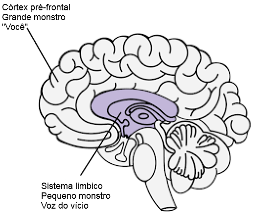

# Recursos (em inglês) {-}

[Meditações de um viciado em pornografia](resources/meditations.pdf) - Guillaco

[Lista de verificação de declarações EasyPeasy](https://old.reddit.com/r/pmohackbook/comments/id6nie/easypeasy_statements_checklist/) - SWATxKATS

[Meditação de 9 minutos](https://www.youtube.com/watch?v=tw7XBKhZJh4) - Sam Harris

[Curso de Meditação para Acordar](https://wakingup.com) - Sam Harris

[Saindo da Modernidade](https://jdemeta.net/2019/09/15/exiting-modernity/) - Meta Nomad // ([pdf](https://jdemeta.net/wp-content/uploads/2019/09/Exiting-Modernity.pdf))

[Carta que estou enviando às escolas](resources/principal.pdf)

[Liberdade para sempre (notas de hack do PMO)](https://sites.google.com/view/freeforever/home)

[Por que você está tendo uma recaída - u/Different_Guide_5205](https://old.reddit.com/r/pmohackbook/comments/mynwjl/why_youre_relapsing/)

[Combatendo o medo - u/Different_Guide_5205](https://old.reddit.com/r/pmohackbook/comments/n5027n/countering_fear/)

## Declarações de enfrentamento do REBT {-}

- *“Posso interromper o PMO, mesmo que pareça 'difícil' fazê-lo. Não é muito difícil e, por mais trabalhoso que seja, vale a pena!”*

- *“Se eu continuar ignorando e nunca cedendo aos meus poderosos impulsos de PMO, tornarei cada vez mais fácil resistir a eles.”*

- *“Posso me aceitar plena e incondicionalmente - sim, mesmo com todas as minhas falhas e falhas.”*

- *“O PMO parece ‘curar’ rapidamente meus problemas, mas na verdade os piora.”*

- *“Às vezes, gostaria muito de afogar meus problemas no PMO, mas isso nunca é motivo para fazê-lo.”*

- *“É muito desconfortável quando não consigo o que realmente quero. Mas não é horrível ou terrível, a menos que eu decida acreditar que é, e decida acreditar em algo mais realista e útil.”*

- *“Nunca vou gostar de tratamento injusto, mas posso muito bem suportá-lo e talvez conspirar e planejar para impedi-lo.”*

- * “Não importa quantas vezes eu falhe nesta importante busca, meu fracasso nunca me torna um piolho incompetente. Isso simplesmente faz de mim uma pessoa que pode ter agido de forma incompetente naquele momento.”*

- *“Eu não preciso absolutamente do que quero, mas ainda posso ser razoavelmente feliz, embora não tão feliz como quando não consigo.”*

- *“Prefiro fortemente ser excelente no meu trabalho, mas não preciso ser. É uma pena se não for, mas isso não me torna inferior. Posso sempre continuar tentando fazer melhor sem precisar fazer melhor.”*

- *“Muitas coisas podem ajudar a me deixar triste e desapontado, mas quando exijo e ordeno que essas coisas não devem existir, entro em pânico, deprimido e enfurecido.”*

- *“Sim, muitas vezes deixei de fazer o que prometi que faria, mas isso não significa que não posso ou não vou cumprir esta promessa.”*

- *“Eu odeio ficar ansioso e deprimido, mas não preciso dissolver imediatamente esses sentimentos com o PMO. Ao fazer PMO, sinto-me temporariamente melhor em relação aos meus problemas, mas não melhoro. No longo prazo, o PMO os torna piores.”*

- *“As pessoas não me enfurecem me tratando mal. Eu obstinadamente escolho me enfurecer com o mau tratamento deles, exigindo e ordenando que ajam melhor.”*

## Combinando EasyPeasy com a técnica viciante de reconhecimento de voz (AVRT) de Jack Trimpey {-}

*Crédito para az#8773 no Discord*

Isto é para pessoas que estão lutando para usar o método Easyway de Allen Carr para se recuperar de um vício, apesar de remover a lavagem cerebral. Presumo que qualquer pessoa que esteja lendo isso leu algum dos livros de Allen Carr e entendeu seu método Easyway (também conhecido como Easypeasy). Caso contrário, recomendo fortemente fazê-lo. Também ajudaria se você lesse ‘Rational Recovery’, de Jack Trimpey. Se você ainda não leu, não há problema, porque vou abordar o básico aqui, mas recomendo lê-lo de qualquer maneira, pois entrará em muito mais detalhes do que eu. Isto não se destina a nenhum vício específico e, portanto, será aplicável a qualquer vício. O objetivo deste artigo é comparar o Easyway com outro método bem-sucedido de dependência chamado 'Técnica de reconhecimento de voz viciante' (AVRT) e combinar os 2. Embora eu acredite que o Easyway seja de longe superior a todos os outros métodos de recuperação de dependência, acredito que compreender o AVRT também pode ser o elo perdido para muitos que falham no uso do Easyway, apesar de matarem o grande monstro.

Existem muitos métodos concorrentes para superar o vício, cada um com diferentes taxas de sucesso. Não vou mencionar nenhum deles porque a maioria deles é uma perda de tempo e quero ser o mais breve possível. Os únicos métodos sobre os quais escreverei são o Easyway de Allen Carr e o AVRT de Jack Trimpey (fundador da Rational Recovery). Ambos os métodos têm taxas de sucesso extremamente altas, mas cada um visa algo diferente. Easyway e AVRT são semelhantes no fato de que Easyway separa o vício em ‘Little Monster’ e ‘Big Monster’ e AVRT separa sua mente em ‘Addictive Voice’ (também conhecido como a fera) e ‘You’. A voz viciante e o monstrinho são a mesma coisa, e o grande monstro (também conhecido como lavagem cerebral) é o sistema de crenças que você mantém e que o faz pensar que seu o vício lhe dá algum tipo de benefício ou muleta. Easyway se concentra em eliminar o monstro grande com pouca consideração pelo monstro pequeno, enquanto AVRT se concentra no monstro pequeno sem se importar com o monstro grande. Enquanto o Easyway destrói o vício psicológico, o AVRT ensina você a reconhecer o vício físico que se disfarça como você e a se separar dele. Acho interessante que Easyway e AVRT tenham taxas de sucesso muito altas, apesar de focarem no oposto.

Embora eu acredite que o Easyway seja de longe superior a todos os outros métodos de recuperação de vícios, e embora o recomende acima de tudo, posso encontrar dois pequenos buracos nele. Em primeiro lugar acho que subestima o monstrinho. Quero evitar usar anedotas pessoais neste texto, mas pelas minhas experiências e pelas experiências de outros, parece que alguns de nós falhamos no Easyway não porque não conseguimos eliminar completamente o grande monstro (embora isso possa acontecer e aconteça), mas porque nós subestimou o monstrinho. O monstrinho não é um problema para a maioria das pessoas, o que explica as altas taxas de sucesso do Easyways, mas para outros, inclusive, pode ser. A segunda lacuna é que a Easyway diz que todas as falhas são resultado do não cumprimento das instruções ou da não remoção do grande monstro.

A essência básica do Easyway é esta. O vício tem 2 componentes, o vício físico em dopamina e o vício psicológico composto por crenças (lavagem cerebral) de que seu vício lhe dá algum tipo de prazer ou muleta. Estes são chamados de pequenos e grandes monstros, respectivamente. Segundo Easyway, o monstrinho nada mais é do que um sentimento de vazio, um pouco inseguro e quase imperceptível. Depois que você mata o grande monstro, desfazendo a lavagem cerebral, aprendendo como seu vício não traz benefícios e como qualquer prazer ou muleta percebido é apenas uma ilusão, e tão importante quanto, como não há nada a temer de uma vida sem seu vício, os desejos desaparecem. Os desejos decorrem do seu medo de que a vida sem a sua muleta seria insuportável, o que faz com que você duvide de desistir, que é o desejo. Você supera o medo ao perceber como sua vida será muito mais agradável sem o vício e mantém esse sentimento de euforia.

Embora eu acredite que este seja o melhor método para se recuperar de um vício, ele não coloca ênfase no monstrinho porque, em teoria, uma vez que o monstro grande for cuidado, o monstrinho indefeso e impotente simplesmente murchará e morrerá por conta própria. , e é quase imperceptível de qualquer maneira, então quem se importa. O monstrinho pode ser insignificante para muitas pessoas, mas pela minha própria experiência e de outras pessoas, parece que nem sempre é esse o caso. Quando as pessoas falham com o Easyway, de acordo com o Easyway, existem apenas 2 razões possíveis: ou você não seguiu as instruções corretamente ou não conseguiu remover o grande monstro. Acredito que isso é prejudicial e explicarei o porquê mais tarde.

A Técnica de Reconhecimento de Voz Viciante (AVRT) separa o cérebro em 2 partes, a parte inferior do cérebro (sistema límbico) onde reside o seu vício e o cérebro superior (córtex pré-frontal) onde você (ou pelo menos seus pensamentos e ego) reside. Jack Trimpey refere-se à voz viciante como a besta porque ela reside na parte animal do nosso cérebro e só sabe uma coisa: “EU QUERO E QUERO AGORA”. Eu mesmo não acho útil personificá-lo como uma fera, mas suponho que seja melhor do que acreditar que é você. A voz viciante (AV, monstrinho) irá sequestrar sua voz mental e usá-la contra você para fazer com que você se entregue ao seu vício. Ele tem que fazer isso porque não pode controlar sozinho as funções motoras. Você pode tentar fazer isso agora, levante a mão na frente do rosto e mexa os dedos. Agora peça ao seu vício para fazer o mesmo. Não pode. Isso significa que, em última análise, você é quem está no controle aqui.

O AV não apenas sequestra a voz da sua mente, mas também se esconde enganosamente atrás do pronome “eu”. Diz “Eu realmente gostaria de fazer X agora”, “Tenho muita falta de fazer X”, “Não seria bom fazer X agora, afinal eu mereço isso depois de hoje”. AVRT enfatiza o fato de que você não é sua voz viciante, você apenas pensa que é. Quando você reconhece o AV como ‘não você’ e diz não, ele abandona o “eu” e começa a usar “você”, “nós” ou “nós”. Esta é a prova de que não é você.

Quando você diz “Não” ao seu AV, isso acontece:
“Eu realmente gostaria de usar X agora” torna-se “Ah, vamos lá, você realmente poderia usar X agora e você sabe disso”. “Tenho certeza que sinto falta de fazer X” se torna “Ah, vamos lá, você definitivamente sente falta de fazer X, não consegue sentir?” “Não seria bom fazer X agora, afinal eu mereço isso depois de hoje.” torna-se “Merecemos fazer X agora, depois de tudo que passamos, como você pôde nos negar isso?”

Neste ponto tenho que esclarecer uma coisa. Este não é o “cabo de guerra” a que Allen Carr se refere. O ‘cabo de guerra’ é a dissonância cognitivae, que é onde você tem 2 ou mais sistemas de crenças conflitantes e é o resultado de não matar o grande monstro. “Eu realmente não quero fazer X por causa desse efeito negativo que isso me dá, mas também me torna X, então eu quero fazer”. Este é o cabo de guerra e é obra do grande monstro. Depois que o grande monstro morrer, removendo a lavagem cerebral, as únicas vozes que lhe dirão para se envolver no vício virão do pequeno monstro (o AV). Como o AV usa o pronome “eu”, confundir o AV com o grande monstro torna-se uma possibilidade.

Também é importante ressaltar que o AV é um grande mentiroso. A única preocupação é obter dopamina a qualquer custo. Seu AV tentará convencê-lo a se colocar em situações potencialmente mortais se isso significar uma solução.

Anteriormente eu disse “Quando as pessoas falham com o Easyway, de acordo com o Easyway, existem apenas 2 razões possíveis: ou você não seguiu as instruções corretamente ou não conseguiu remover o grande monstro. Acredito que isso é prejudicial e explicarei o porquê mais tarde.” Acredito que isso seja prejudicial porque a falha em reconhecer o AV levou a mim e a outros que usaram o Easyway a acreditar falsamente que não matamos totalmente o grande monstro, então relemos o livro para tentar acabar com a lavagem cerebral novamente, embora tenhamos já tem. A falha em reconhecer o AV combinada com a crença de que “se você falhou com o Easyway significa que você não conseguiu matar o grande monstro” fará com que você concentre seus esforços no grande monstro novamente quando ele já tiver sido derrotado. Você pode acabar em um ciclo de releitura dos livros de Allen Carr, que dura um pouco e depois recai continuamente.

Quando o AV diz algo como “Eu quero fazer X agora porque isso me torna X”, se você desfez a lavagem cerebral e removeu o grande monstro você pode pensar “Mas eu sei que isso não é verdade, então por que eu ainda acredita que é? Não consegui desfazer completamente a lavagem cerebral”. A verdade aqui é que você removeu a lavagem cerebral, evidenciada pelo fato de que você sabe melhor do que o seu AV está lhe dizendo, só que você pensa que o AV é você porque usou o pronome “eu”. Reconhecer o VA e forçá-lo a se revelar abandonando o “eu” de “você”, “nós” ou “nós” deve confirmar para você que não é o grande monstro aqui, é o monstrinho. Se fosse de fato o grande monstro, não substituiria o “eu” por “você”, “nós” ou “nós”.

Agora, quando o AV diz “Por favor, podemos fazer X mais uma vez, pelos velhos tempos, só mais uma?” e você disser “Não”, poderá sentir uma resposta emocional. Você pode sentir medo ou tristeza. É extremamente importante perceber que esse sentimento não vem de você, mas sim dele. Se você não conseguir reconhecer a VA, pensará que essa emoção vem de você e ficará mais inclinado a ceder. Reconheça a VA e o fato de que as emoções que vêm dela não vêm de você, então sinta alegria em esse.

Quando você junta esses dois métodos (se necessário, nem todas as pessoas parecem ter problemas com o monstrinho) e mantém um sentimento de alegria e euforia sempre que reconhece o AV, o sucesso é seu.