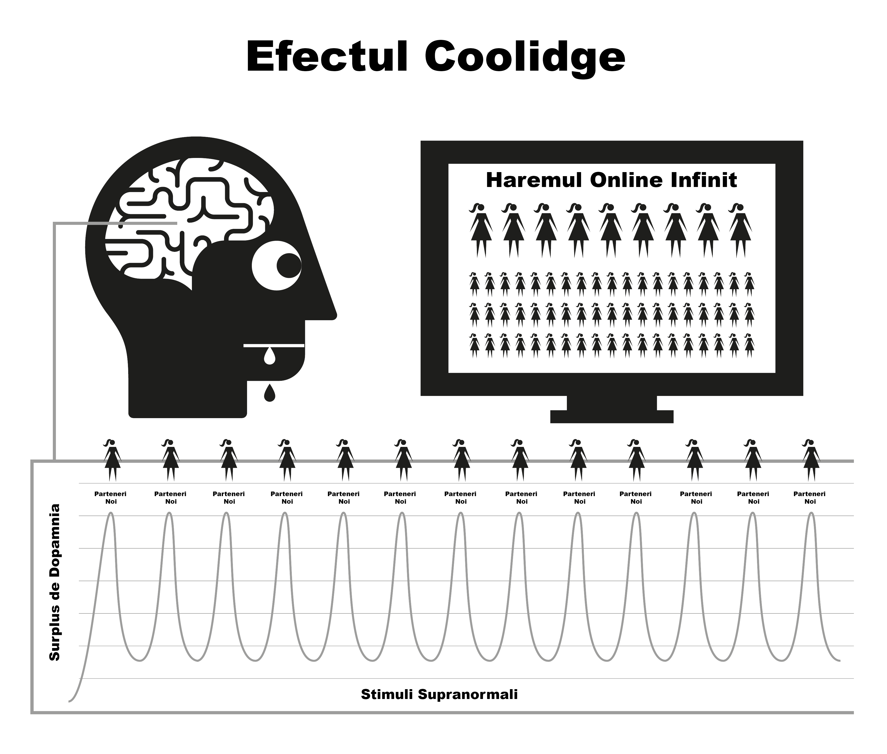

# Natura

Pornografia pe internet funcționează prin deturnarea mecanismelor naturale de recompensare concepute pentru a te menține în stare de reproducere cât mai mult timp posibil. Forma instantanee și extrem de accesibilă a pornografiei pe internet menține mecanismul de recompensă al creierului producând dopamină pentru o perioadă mult mai lungă decât ar fi posibil în mod normal. Din punct de vedere științific, acest lucru se numește efectul Coolidge, pe care probabil că îl cunoști deja.

Dopamina este un neurotransmițător asociat cu sentimentele de dorință, plăcerea reală fiind produsă de opioide. Mai multă dopamină, mai multe opioide și mai multă placere. Fără dopamină, acțiuni precum mâncatul nu se simt bine și nu sunt finalizate, alimentele bogate în grăsimi și zahăr producând cea mai mare eliberare chimică.

De asemenea, dopamina este eliberată ca răspuns la noutate. Cu o cantitate aparent infinită de pornografie disponibilă, aceasta inundă sistemul limbic (circuitul de recompensă), astfel încât prima dată când vedeți pornografie acționați, având orgasm și declanșând o altă inundație de opioide. Stimulat să obțină cât mai multă dopamină, creierul stochează acest lucru sub forma unui scenariu pentru o memorare facilă și întărește căile neuronale prin eliberarea unei substanțe chimice numite DeltaFosB. Acum, creierul apelează la aceste căi ca răspuns la indicii precum reclame sexy, timp de singurătate, stres sau chiar senzația de depresie și, dintr-o dată, sunteți gata să vă plimbați pe "toboganul cu apă". De fiecare dată când acest lucru se repetă, se eliberează mai mult DeltaFosB, astfel încât toboganul de apă este uns, viu și mai ușor de coborât data viitoare.

Sistemul limbic dispune de un sistem de autocorectare pentru a reduce numărul de receptori de dopamină și de opioide atunci când se detectează inundații frecvente și zilnice de dopamină. Din nefericire, acești receptori sunt, de asemenea, necesari pentru a ne menține motivați să facem față stresului vieții de zi cu zi. Cantitățile nominale de dopamină produse de recompensele naturale pur și simplu nu se compară cu pornografia și nu sunt absorbite la fel de eficient de receptorii diminuați, ceea ce vă face să vă simțiți mai stresat și mai iritat decât în mod normal. Acest proces este cunoscut sub numele de desensibilizare.

În acest ciclu, ați depășit "linia roșie" și ați declanșat emoții precum vinovăția, dezgustul, jena, anxietatea și frica, care, la rândul lor, cresc și mai mult nivelul de dopamină și determină creierul să interpreteze greșit aceste sentimente ca fiind excitare sexuală.

Pe măsură ce trece timpul, nu numai că creierul este desensibilizat la clipurile anterioare pe care le-a văzut, dar și la genuri similare și la nivelul de șoc. Această motivație mai scăzută declanșează sentimente de satisfacție mai scăzută, deoarece creierul nostru se angajează într-o evaluare constantă, împingându-vă să găsiți clipuri care să vă satisfacă foamea. Astfel, căutați mai multe noutăți, dând click pe clipul amator și șocant de pe pagina de start pe care ați spus cu încredere că nu o veți face la prima vizită.

> *“Căci în roua lucrurilor mărunte inima își găsește dimineața și se împrospătează"*
>
> --- Kahlil Gibran

Un sentiment trecător de siguranță este tot ceea ce este necesar pentru a trece peste un moment dificil din viață, dar va fi oare creierul tău desensibilizat capabil să capteze acea picătură de relaxare pe care creierul unui non-utilizator este capabil să o folosească?

Inundația de dopamină acționează ca un drog cu acțiune rapidă, scăzând rapid și inducând dureri de sevraj. Mulți utilizatori au iluzia că aceste dureri sunt trauma teribilă pe care o suferă atunci când încearcă sau sunt forțați să se oprească. De fapt, ele sunt în primul rând mentale, deoarece utilizatorul se simte privat de plăcerea sau sprijinul lor.

## Micul Monstru

Sevrajul chimic real al pornografiei este atât de subtil încât majoritatea utilizatorilor au trăit și au murit fără să realizeze că sunt dependenți de droguri. Mulți utilizatori au o teamă de droguri, și totuși, exact asta sunt, dependenți de droguri. Din fericire, este un drog ușor de abandonat, dar mai întâi trebuie să accepți că ești, de fapt, dependent. Sevrajul de la pornografie nu provoacă nicio durere fizică și este doar un sentiment de gol, de neliniște, de lipsă a ceva, motiv pentru care mulți cred că are legătură cu dorința sexuală. Prelungit, acest sentiment devine nervozitate, nesiguranță, agitație, încredere scăzută și iritabilitate. Este ca foamea, pentru o otravă.

În câteva secunde de la implicarea într-o sesiune, dopamina este furnizată și pofta se termină, rezultând un sentiment de împlinire în timp ce vă dați pe toboganul de apă al dependentei. În primele zile, durerile de sevraj și ameliorarea lor ulterioară sunt atât de ușoare încât nu suntem conștienți de ele. Atunci când devenim consumatori obișnuiți, credem că este pentru că am ajuns să ne placă sau am intrat în "obișnuință". Adevărul este că suntem deja dependenți, dar nu ne dăm seama de asta. Micul monstruleț se află deja în creierul nostru, așa că, din când în când, facem excursii pe toboganul cu apă pentru a-l hrăni.

Toți utilizatorii încep să caute porno din motive iraționale. *Singurul* motiv pentru care cineva continuă să folosească pornografia, indiferent dacă este un utilizator ocazional sau excesiv, este de a hrăni acel mic monstru. Întreaga enigmă este o serie de pedepse crude și derutante, dar poate că cel mai patetic aspect este sentimentul de plăcere pe care îl are un utilizator în urma unei sesiuni, încercând să se întoarcă la sentimentul de pace, liniște și încredere pe care corpul lor îl avea înainte de a deveni dependent în primul rând.

## Alarma Enervanta

Cunoașteți sentimentul acela când alarma vecinului a sunat toată ziua - sau o altă problemă minoră persistentă - apoi zgomotul încetează brusc și vă cuprinde un sentiment minunat de pace și liniște? Aceasta nu este cu adevărat pace, ci sfârșitul unei neplăceri. Înainte de a începe următoarea sesiune, corpul nostru este complet, dar apoi începem să ne forțăm creierul să pompeze dopamină, iar când terminăm și aceasta începe să plece, suferim de senzația de sevraj. Acestea nu sunt dureri fizice, ci doar o senzație de gol. Nici măcar nu suntem conștienți că există, dar este ca un robinet care picură în interiorul corpului nostru.

Mintea noastră rațională nu o înțelege, dar nici nu are nevoie să o înțeleagă. Tot ce știm este că ne dorim pornografie și când ne masturbăm, pofta dispare. Cu toate acestea, satisfacția este trecătoare, deoarece pentru a ușura pofta este nevoie de mai mult porno. De îndată ce ai orgasm, pofta începe din nou și capcana continuă să te țină. O buclă de feedback, dacă nu o întrerupi!

Capcana pornografică este similară cu purtatul unor pantofi strâmți doar pentru a obține plăcerea de a-i da jos. Există trei motive principale pentru care utilizatorii nu o pot vedea astfel.

1.  De la naștere, am fost supuși unor cantități masive de spălare a creierului care ne spune că pornografia pe internet este pur și simplu o altă dezvoltare modernă care a înlocuit versiunea tipărită a porno. Această eroare este împachetată cu adevărul că masturbarea nu este dăunătoare, așa că de ce nu ar trebui să-i credem?

2.  Deoarece sevrajul fizic dat de dopamină nu implică nicio durere reală, ci doar un sentiment de nesiguranță gol, inseparabil de foame și de stresul normal, acest sentiment se manifestă într-o sesiune PMO, deoarece tocmai acele momente sunt cele în care avem tendința de a căuta porno pe internet. Avem tendința de a considera acest sentiment ca fiind normal.

3.  Cu toate acestea, principalul motiv pentru care utilizatorii nu reușesc să vadă pornografia pe internet în adevărata sa lumină este din cauza faptului că lucrează din spate în față. Este atunci când * nu * îl consumați * că suferiți sentimentul de gol. Deoarece procesul de a deveni dependent este incredibil de subtil și gradual în primele zile, sentimentul de gol este considerat normal și, prin urmare, nu este blamat pe sesiunea anterioară. În momentul în care browserul este pornit și începi sesiunea, primești un impuls imediat și devii mai puțin nervos sau mai relaxat, așa că pornografia pe internet primește creditul.

Acest proces invers "de la spate în față" face ca toate drogurile să fie greu de eliminat. Imaginați-vă starea de panică a unui dependent de heroină fără heroină; acum imaginați-vă bucuria totală a acestuia atunci când, în sfârșit, își poate înfige un ac în venă. Oamenii care nu sunt dependenți de heroină nu suferă de acest sentiment de panică.

Heroina nu ameliorează acest sentiment, ci îl provoacă. În mod similar, cei care nu sunt consumatori nu suferă de sentimente goale de nevoie de pornografie pe internet, sau de panică atunci când sunt offline. Neutilizatorii nu pot înțelege cum este posibil ca utilizatorii să obțină plăcere din videoclipuri bidimensionale cu sunete în surdină și proporții corporale anormale. În cele din urmă, nici utilizatorii nu pot înțelege.

Vorbim despre pornografia pe internet ca fiind relaxantă sau satisfăcătoare, dar cum poți fi satisfăcut dacă nu ai fost nemulțumit în primul rând? Un non-utilizator nu suferă de această stare de nemulțumire, complet relaxat după o întâlnire fără sex, în timp ce utilizatorul nu este până nu și-a satisfăcut "micul monstru".

## O placere sau un ajutor?

O mențiune importantă - principalul motiv pentru care consumatorilor le este greu să renunțe se datorează convingerii că renunță la o plăcere reală sau la o cârjă(metoda de sustinere). Este esențial să înțelegeți că nu renunțați la *absolut nimic*. Cel mai bun mod de a înțelege subtilitățile capcanei pornografice este compararea acesteia cu mâncarea. Obiceiul meselor periodice ne face să nu simțim foame între ele, conștientizând foamea doar dacă masa este întârziată. Nu există durere fizică, doar un sentiment de nesiguranță gol recunoscut ca foame. Procesul de satisfacere a foamei noastre este o experiență foarte plăcută.

Pornografia pare a fi aproape identică, dar nu este. La fel ca foamea, nu există durere fizică și mecanismul de recompensă se comportă în moduri similare, dar această asemănare cu mâncatul este cea care îl păcălește pe utilizator să creadă că există o plăcere autentică sau o cârjă. Deși mâncatul și pornografia par a fi foarte asemănătoare, în realitate sunt exact opuse.

- Mănânci pentru a supraviețui și pentru a-ți energiza viața, în timp ce pornografia îți diminuează și îți taie mojo-ul.

- Mâncarea este cu adevărat gustoasă, iar mâncatul este o experiență cu adevărat plăcută de care ne bucurăm de-a lungul vieții. Pornografia implică autosabotajul receptorilor de fericire și, astfel, distruge șansele de a face față și de a te simți fericit.

- Mâncatul nu creează foamea și o ameliorează în mod real, în timp ce prima sesiune pornografică declanșează pofta de dopamină și fiecare sesiune ulterioară. Departe de a o ameliora, aceasta asigură suferința pentru tot restul vieții tale. 

Este mâncatul un obicei? Dacă așa credeți, încercați să vă rupeți complet de el! A descrie mâncatul ca fiind un obicei ar fi ca și cum ai descrie respirația ca fiind un obicei - ambele sunt esențiale pentru supraviețuire. Este adevărat că oamenii au obiceiul de a-și satisface foamea în momente diferite, cu diferite tipuri de alimente, dar mâncatul în sine nu este un obicei. Nici pornografia nu este un obicei. Singurul motiv pentru care un utilizator pornește browserul este încercarea de a pune capăt sentimentelor de gol pe care le-a creat sesiunea anterioară, în momente diferite, cu genuri diferite, mai intense.

Pe internet, pornografia este frecvent menționată ca fiind un obicei și, pentru comoditate, EasyPeasy se referă, de asemenea, la "obicei". Cu toate acestea, fiți în permanență conștienți de faptul că pornografia nu este un obicei, este **dependență de droguri!** Când începem să folosim pornografia, trebuie să ne forțăm să facem față. Înainte să ne dăm seama, escaladăm în pornografie din ce în ce mai bizară și mai șocantă. Emoția este în vânătoare, nu în ucidere, dopamina părăsind rapid corpul după orgasm, explicând de ce utilizatorii doresc să "se "limiteze" (întârzierea orgasmului) prin trecerea de la o fereastră de browser la alta și de la o filă la alta.

## Trecerea peste "Linia Rosie"

Ca în cazul oricărui alt drog, organismul tinde să dezvolte imunitate la efectele acelorași clipuri vechi, creierul nostru dorind mai multa pornografie sau alt gen nou de pornografie. După perioade scurte de vizionare a aceluiași clip, acesta încetează să mai amelioreze complet senzația de sevraj pe care a creat-o sesiunea anterioară. În acest paradis al pornografiei are loc un război de tras de mânecă: vrei să rămâi de partea sigură a "liniei tale roșii", dar creierul tău îți cere să dai clic pe clipul cu fructul interzis.

Te simți mai bine după ce te-ai implicat în această sesiune porno, dar ești mai nervos și mai puțin relaxat decât cineva care nu a început niciodată, chiar dacă trăiești într-un presupus paradis porno. Această poziție este chiar mai ridicolă decât purtarea de pantofi strâmți, deoarece, pe măsură ce treci prin viață, o cantitate din ce în ce mai mare de disconfort rămâne după ce te descalți. Pentru că utilizatorul știe că micul monstruleț trebuie hrănit, el însuși decide momentul, care tinde să fie la patru tipuri de ocazii sau o combinație a acestora:

Plictiseală / Concentrare - Două lucruri complet opuse!  

Stres / Relaxare - Două complete opuse! 

Ce medicament magic poate inversa brusc efectul pe care l-a avut cu câteva minute înainte? Adevărul este că pornografia nu ameliorează plictiseala și stresul și nici nu promovează concentrarea și relaxarea. Dacă te gândești bine, ce alte tipuri de ocazii există în viața noastră, în afară de somn? Dacă aveți idei de trecere la alte tipuri de genuri de pornografie "realiste" sau "soft", vă rugăm să rețineți că conținutul acestei cărți se aplică tuturor genurilor de pornografie - print, camere web, pay-per-view, chat, spectacole în direct etc. Corpul uman este cel mai sofisticat obiect de pe planetă, dar nicio specie, chiar și cea mai mică amibă sau vierme, nu supraviețuiește fără să cunoască diferența dintre hrană și otravă.

Prin selecție naturală, mințile și corpurile noastre au dezvoltat tehnici de recompensare a acțiunilor care înmulțesc și susțin umanitatea. Ele nu sunt pregătite pentru stimuli supranormali care sunt mai mari, mai luminoși și mai tranșanți decât orice se găsește în natură, deoarece chiar și cea mai discretă imagine bidimensională ne provoacă excitare. Dar dacă priviți în mod repetat aceeași imagine, nu veți mai fi. În viața reală, mecanismele de control și echilibrare vă asigură că veți face altceva, dar pornografia pe internet nu are un astfel de limitator, făcându-vă să vă petreceți viața într-un harem virtual! 

Este o iluzie faptul că persoanele slabe din punct de vedere fizic și mental devin consumatori, norocoșii fiind cei care au găsit respingătoare prima instanță și s-au vindecat pe viață. Alternativ, aceștia nu sunt pregătiți din punct de vedere mental să treacă prin procesul de învățare dificil de a se lupta pentru a deveni dependenți, de teama de a fi "prinși" sau de faptul că nu sunt suficient de tehnici pentru a opera setările de confidențialitate ale browserului. Poate că partea cea mai tragică a întregii întreprinderi se referă la adolescenți - pricepuți în a găsi materiale și a-și acoperi urmele - care încep în număr tot mai mare.

Bucuria de pornografia pe internet este o iluzie. Sărind de la un gen la altul, menținând pur și simplu dorinta noastra de noutate noastre în limitele "liniei roșii" a genurilor pornografice "sigure" pentru a obține doza noastră de dopamină. La fel ca dependenții de heroină, tot ceea ce ne bucură cu adevărat este ritualul de ușurare a acestor dureri.

## Placerea din jurul "Liniei Rosii"

Chiar și cu singurul clip, utilizatorii se învață în mod constant să filtreze părțile rele și urâte ale clipului porno. Chiar dacă este vorba de un solo, ei tot filtrează pe părțile corpului care îi atrag cel mai mult. De fapt, unii simt plăcere în acest dans în jurul liniei roșii, găsind scuze pentru a declara că le plac "lucrurile moi" și că nu sunt dependenți de stimuli supranormali. Dar întrebați un utilizator care crede că se limitează la un anumit actor sau gen: *"Dacă nu puteți obține genul dvs. normal de porno și puteți obține doar un gen nesigur, încetați să vă masturbați? "*.

În niciun caz! Un utilizator se va masturba la orice, diferențe de orientare sexuală, interpreți care seamănă cu persoane cunoscute, cadre periculoase, relații șocante, orice pentru a satisface micul monstru. La început au un gust îngrozitor, dar, cu suficient timp, vei învăța să te bucuri de ele. Utilizatorii căuta o satisfacție deșartă după ce au făcut sex adevărat, după o zi lungă de muncă, febră, răceală, gripă, dureri de gât și chiar în timpul internării în spitale.

Plăcerea nu are nimic de-a face cu asta; dacă sexul este dorit, nu are sens să fie cu laptopul. Pentru unii consumatori este alarmant să realizeze că sunt dependenți și cred că acest lucru va face și mai dificil să se oprească. De fapt, aceasta este o veste bună din două motive importante.

1.  Motivul pentru care cei mai mulți continuă să folosească este pentru că, deși știm că dezavantajele depășesc cu mult avantajele, credem că există ceva în pornografie care chiar ne place sau că acționează ca un fel de sprijin. Ne facem iluzia că după ce ne oprim din consum va exista un gol, anumite situații din viața noastră nefiind niciodată la fel. De fapt, pornografia nu numai că nu oferă nimic, ci și sustrage.

2.  Deși pornografia pe internet este cel mai puternic declanșator al noutății și al influxului de dopamină bazat pe sex, din cauza vitezei cu care devii dependent, nu ești niciodată rău de tot dependent. Durerile reale de sevraj sunt atât de ușoare încât majoritatea utilizatorilor au trăit și au murit fără să-și dea seama că le-au suferit.

Atunci de ce este atât de dificil pentru mulți consumatori să se oprească, trecând prin luni de tortură și petrecându-și restul vieții tânjind după ea în momente ciudate? Răspunsul este al doilea motiv, spălarea creierului. Dependența de neurotransmițător este ușor de înfruntat, majoritatea utilizatorilor petrecând zile întregi fără pornografie online în timpul călătoriilor de afaceri sau al călătoriilor, nefiind afectați de durerile de sevraj. Micul lor monstruleț este în siguranță, știind că vor deschide laptopul imediat ce se vor întoarce în camera de hotel. Poți supraviețui clientului tău nesuferit și managerului tău megaloman, știind că soluția este acolo pentru tine.

## Analogia cu fumătorii

O bună analogie este cea a fumătorului de țigări. Dacă ar sta zece ore pe zi fără o țigară, și-ar smulge părul din cap. Mulți fumători își vor cumpăra o mașină nouă și se vor abține să fumeze în ea. Mulți vor vizita teatre, supermarketuri, biserici, iar faptul că nu pot fuma nu le creează probleme. Chiar și în trenuri și avioane nu au existat revolte. Fumătorii sunt aproape încântați ca cineva sau ceva să îi oprească să fumeze.

Utilizatorii se vor abține în mod automat de la utilizarea pornografiei pe internet în casa părinților lor în timpul reuniunilor de familie și a altor evenimente, fără prea mult disconfort. De fapt, majoritatea utilizatorilor au perioade îndelungate în care se abțin fără efort. Micul monstruleț neurologic este ușor de înfruntat chiar și atunci când ești încă dependent. Există milioane de consumatori care rămân consumatori ocazionali toată viața și sunt la fel de dependenți ca și consumatorii înrăiți. Există chiar și consumatori grei care au renunțat la dependență, dar care aruncă câte o privire ocazională, ungând toboganul de apă pe care îl vor coborî la următoarea depresie.

Așa cum am spus anterior, dependența pornografică reală nu este principala problemă, ci pur și simplu acționează ca un catalizator pentru a ne menține mințile confuze cu privire la adevărata problemă - spălarea creierului. Totuși, nu credeți că efectele negative ale pornografiei pe internet sunt exagerate; în orice caz, ele sunt din păcate subestimate. Ocazional, circulă zvonuri conform cărora căile neuronale create sunt acolo pentru toată viața, cu amestecul potrivit de șansă și stimulente care te trimit din nou pe toboganul care îți distruge viața, dar acestea sunt neadevărate. Creierul și corpul nostru sunt mașini miraculoase, care se refac în câteva săptămâni.

Nu este niciodată prea târziu să te oprești! O scurtă navigare în comunitățile online vă va arăta oameni de toate vârstele care își restartează viața (și pe cea a partenerilor lor). Ca în orice lucru, unii trec la nivelul următor, practicând retenția de spermă, Karezza și, prin diversificarea aspectelor senzoriale și de propagare a sexului, își fac partenerii mai fericiți ca niciodată.

Poate fi o consolare pentru utilizatorii de o viață și pentru cei care consumă mult, faptul că pentru ei este la fel de ușor să se oprească ca și pentru utilizatorii ocazionali și, într-un mod ciudat, este mai ușor. Cu cât te trage mai mult în jos, cu atât mai mare este ușurarea. Când m-am oprit, am plecat direct de la *zero* și nu am avut nici măcar o senzație de disconfort. De fapt, procesul a fost chiar plăcut și în timpul perioadei de sevraj.

Dar mai întâi, trebuie să eliminăm spălarea creierului.
