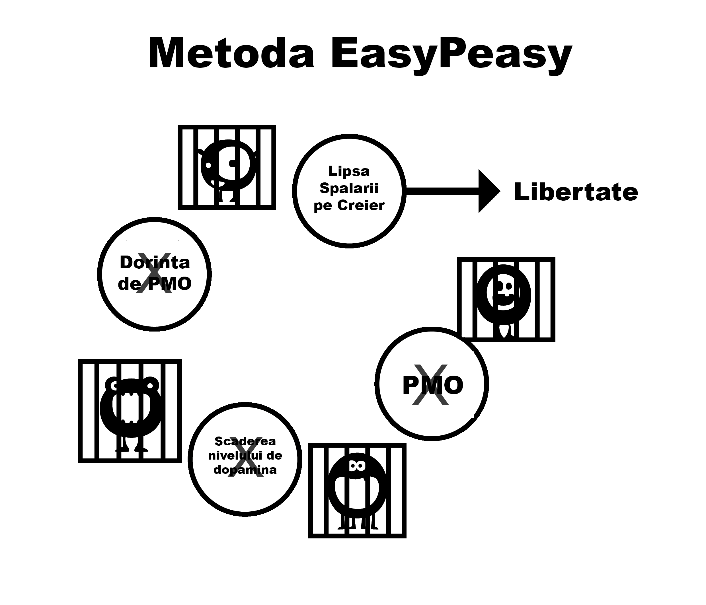

# Aspecte de spălare a creierului

Marele monstru al capcanei pornografice este generat prin culminarea mai multor aspecte, inclusiv forțele societății, reprezentările din mass-media, colegii și propria narațiune internă a utilizatorului. Eșecul de a deconstrui aceste falsuri în timp ce se folosește metoda voinței duce în cele din urmă la sentimente de privare, conducând utilizatorul înapoi în capcană. Deconstrucția valorii imaginate a pornografiei este crucială pentru succes și vă permite să vedeți de ce sunteți jefuit!

Este important de reținut legătura dintre spălarea creierului și frică. Este frica de a simți *** viitoarele dureri de sevraj*** care creează durerile. Frica este durerea însăși. Gândiți-vă la momentele în care ați avut simptome de sevraj, cum ar fi transpirația palmelor, dificultăți de respirație, probleme de somn și incapacitatea de a gândi limpede. Acum gândiți-vă la situații similare când ați avut aceste senzații: interviuri de angajare, nervi în preajma unei persoane atractive, vorbit în public etc. Acestea sunt aceleași sentimente de anxietate pe care le provoacă frica. Pur și simplu, cum poate un drog fizic să mai capteze oamenii la câteva luni după ce s-a oprit? Trebuie să fie din motive mentale, corect?

## Stres

Nu doar marile tragedii din viață, ci și stresul mărunt îi determină pe utilizatori să intre în zona interzisă "nesigură", până acum exclusă. Printre stresuri se numără socializarea, apelurile telefonice, neliniștile gospodinei cu copii mici și multe altele. Să luăm ca exemplu convorbirile telefonice, în special pentru un om de afaceri. Cele mai multe apeluri nu sunt de la clienți mulțumiți sau de la șeful tău care te felicită, ci există un fel de agravare. Venirea acasă la viața de familie banală, cu copii care țipă și solicitările emoționale ale partenerului, determină utilizatorul - dacă nu o face deja - să aibă fantezii despre ușurarea oferită de pornografie promisă în acea seară. În mod inconștient, ei suferă de dureri de sevraj, destresori naturali slăbiți și nepregătiți pentru o agravare suplimentară. Ameliorând parțial durerile în același timp cu stresul normal, totalul este redus și utilizatorul primește un impuls temporar. Stimularea nu este o iluzie, utilizatorul se simte cu adevărat mai bine decât înainte, dar este mai tensionat decât ar fi în cazul unui neutilizator.

Exemplul următor nu este conceput pentru a vă șoca - EasyPeasy nu promite un astfel de tratament - ci pentru a sublinia faptul că pornografia vă distruge nervii, în loc să-i relaxeze.

Încercați să vă imaginați că ați ajuns în stadiul în care nu mai puteți fi excitat, chiar și cu un partener foarte sexy și atractiv. Pentru un moment, faceți o pauză și încercați să vizualizați viața în care o persoană foarte drăguță și fermecătoare trebuie să concureze și să eșueze cu vedetele porno virtuale care vă ocupă "haremul" pentru a vă atrage atenția. Imaginați-vă starea de spirit a unei persoane care, atunci când i se transmite acest avertisment, continuă să se consume și moare fără să aibă vreodată relații sexuale reale cu acest partener fermecător și dispus. Este ușor să-i respingem pe acești oameni ca fiind ciudați, dar poveștile de acest gen nu sunt false - asta este ceea ce noutatea îngrozitoare a drogului pornografic face creierul tău. Cu cât treci mai mult prin viață, cu atât mai mult curajul este diminuat și cu atât mai mult ești amăgit să crezi că pornografia face contrariul.

Ați fost vreodată cuprins de panică atunci când, din senin, WiFi-ul nu mai funcționează sau este prea lent? Neutilizatorii nu suferă de acest lucru, deoarece pornografia pe internet *cauzează* acest sentiment. Pe măsură ce treceți prin viață, vă distruge sistematic nervii și curajul, lăsând DeltaFosB să formeze puternice tobogane neuronale de apă în urma sa, distrugându-vă progresiv capacitatea de a spune nu. Până în stadiul în care virilitatea a fost ucisă, utilizatorul crede că pornografia este noul său partener și este incapabil să facă față vieții fără ea.

*Pornografia de pe internet nu-ți ușurează nervii, ci îi distruge încet-încet*. Unul dintre marile câștiguri ale ruperii de dependență este revenirea încrederii și a siguranței de sine naturale.

Nu este nevoie să te evaluezi în funcție de capacitatea ta de a satisface un partener - asta nu este libertate. Dar această libertate nu poate fi obținută continuând să ungi toboganul de apă cu dopamină în moduri care îți subminează fericirea și libidoul prin repetarea aceluiași comportament distructiv.

## Plictiseala

Dacă sunteți ca majoritatea oamenilor, de îndată ce vă urcați în pat, sunteți deja pe site-ul porno preferat. A devenit o a doua natură. În mod similar, pornografia care ameliorează plictiseala este o altă minciună, deoarece plictiseala este o stare de spirit, care apare atunci când ați fost privați pentru o lungă perioadă de timp sau încercați să reduceți PMO.

Situația reală este ca atunci când sunteți dependent de atracția supranormală a pornografiei pe internet și apoi încercați să vă abțineți, vă simțiți ca și cum ar lipsi ceva. Dacă aveți ceva care să vă ocupe mintea care nu este stresant, puteți rezista perioade lungi de timp fără a fi deranjat de absența drogului. Cu toate acestea, atunci când ești plictisit, nu ai nimic care să-ți ia mintea de la el, așa că hrănești monstrul. Atunci când vă răsfățați și nu încercați să vă opriți sau să reduceți consumul, chiar și pornirea navigării private devine subconștientă. Acest ritual este automat; dacă utilizatorul încearcă să își amintească sesiunile din ultima săptămână, nu reușește să își amintească decât o mică parte dintre ele, cum ar fi ultima sau sesiunea de după o lungă abstinență.

Adevărul este că pornografia sporește plictiseala în mod indirect, deoarece orgasmele te fac să te simți letargic și, în loc să întreprindă o activitate energică, utilizatorii tind să prefere să lenevească, să se plictisească și să își ușureze senzația de sevraj. Contracararea spălării creierului este importantă, deoarece utilizatorii tind să vizioneze filme porno atunci când se plictisesc, creierul nostru fiind cablat să interpreteze pornografia ca fiind interesantă. În mod similar, am fost, de asemenea, spălați pe creier să credem că sexul - chiar și sexul prost - ajută la relaxare. Este un fapt că, atunci când sunt triste sau stresate, cuplurile doresc să facă sex. În lipsa unei discriminări între sexul tantric și sexul propagandistic, urmăriți cât de repede vreți să vă îndepărtați unul de celălalt după atingerea orgasmului obligatoriu. Dacă cuplul ar fi decis să se îmbrățișeze, să vorbească sau să se îmbrățișeze și să se culce, s-ar fi simțit ușurat.

## Concentrare

Masturbarea și sexul nu ajută la concentrare - atunci când încerci să te concentrezi, încerci automat să eviți distragerile. Prin urmare, atunci când un utilizator vrea să se concentreze, nici măcar nu se gândește - deschide automat browserul, hrănind micul monstruleț și punând capăt parțial poftei. Aceștia se apucă de treabă, uitând deja că au vizionat materiale pornografice. După ani de inundare cu dopamină, modificările neurologice afectează abilități precum accesul la informații, planificarea și controlul impulsurilor.

Sunteți, de asemenea, determinat să asigurați noutatea pentru următoarea sesiune, deoarece același material nu mai generează suficientă dopamină și opioide. Așa că va trebui să cutreierați ulițele internetului în căutare de noutăți, luptând cu atracția de a trece linia spre materiale șocante, ceea ce, la rândul său, generează mai mult stres și vă lasă neîmplinit după ce terminați.

Concentrarea este, de asemenea, afectată în mod negativ, deoarece receptorii de dopamină sunt sacrificați din cauza toleranței naturale la valurile mari, reducând beneficiul unor creșteri mai mici de dopamină de la destresoarele naturale. Concentrarea și inspirația dvs. vor fi mult îmbunătățite pe măsură ce acest proces este redus. Pentru mulți, aspectul concentrării este cel care îi împiedică să reușească cu metoda voinței: ar putea suporta iritabilitatea și temperamentul prost, dar eșecul de a se concentra asupra unui lucru dificil odată ce cârja lor este îndepărtată îi ruinează pe mulți.

Pierderea capacității de concentrare pe care o suferă utilizatorii atunci când încearcă să evadeze nu se datorează absenței sexului, cu atât mai puțin a pornografiei. Atunci când ești dependent de ceva, ai blocaje mentale, iar când ai un blocaj mental, ce faci? Pornești browserul - ceea ce nu vindecă blocajul - și atunci ce faci? Faci ceea ce trebuie să faci, astfel incat sa nu recurgi la PMO. 

Atunci când ești utilizator, nimic nu este pus pe seama cauzei: utilizatorii nu au niciodată *disfuncții sexuale*, ci doar perioade de indisponibilitate ocazionale. În momentul în care încetezi să mai folosești, tot ceea ce nu merge bine este pus pe seama motivului pentru care te-ai oprit. Acum, când ai un blocaj mental, în loc să te apuci de treabă, începi să spui: "*Dacă aș putea să-mi verific haremul acum, mi-ar rezolva toate problemele*". Apoi începi să îți pui la îndoială decizia de a renunța și de a scăpa de sclavie.

Dacă credeți că pornografia este un ajutor real pentru concentrare, îngrijorarea cu privire la aceasta vă va garanta că nu vă veți putea concentra. Îndoiala, nu durerile fizice de sevraj, creează problema. Amintiți-vă întotdeauna, utilizatorul este cel care suferă de dureri, nu non-utilizatorii.

## Relaxare

Majoritatea utilizatorilor cred că pornografia îi ajută să se relaxeze. Nu este adevărat. Căutarea frenetică pentru a obține doza în acele "alei întunecate ale internetului" și lupta internă de a incerca sa eviti a trece linia roșie cu siguranță nu *sună* ca o activitate foarte relaxantă.

Când se lasă noaptea după o călătorie într-un loc nou sau după o zi lungă, ne așezăm să ne relaxăm, ne alinăm foamea, setea și suntem complet satisfăcuți. Utilizatorul nu este, deoarece are o altă foame de satisfăcut. Utilizatorii se gândesc la pornografie ca la cireașa de pe tort, dar, de fapt, este "micul monstru" care trebuie hrănit. Adevărul este că dependentul nu poate fi niciodată complet relaxat și, trecând prin viață, devine exponențial mai rău. Să luăm un comentariu online de la un fost utilizator:  

> "* Am crezut cu adevărat că am avut un demon rău în alcătuirea mea, acum știu că am avut, cu toate acestea, nu a fost un defect inerent în caracterul meu, ci micul monstru porno pe internet care a creat problema. În acele vremuri am crezut că am avut toate problemele din lume, dar când mă uit înapoi la viața mea mă întreb unde a fost tot stresul mare. În orice altceva în viața mea am fost în control, singurul lucru care mă controla era sclavia porno. Cel mai trist lucru este că nici astăzi nu-mi pot convinge copiii că sclavia a fost cea care m-a făcut să fiu atât de irascibil.*"

De fiecare dată când aud că dependenții de porno încearcă să-și justifice dependența, mesajul este: "*mă ajută să mă relaxez.*" Luați de exemplu, contul online al unui tată singur al cărui fiu de șase ani a vrut să împartă patul cu el în timpul nopții după un film de groază, dar tatăl ar fi refuzat pentru ca el să poată avea sesiunea sa. 

Iată o altă analogie legată de fumat, în urmă cu câțiva ani, autoritățile de adopție au amenințat că vor împiedica fumătorii să adopte copii. Un bărbat a sunat, furios. "*Sunteți complet greșit*", a spus el, "*Îmi amintesc că atunci când eram copil, dacă aveam o problemă controversată de discutat cu mama mea, așteptam până își aprindea o țigară, pentru că atunci era mai relaxată*". De ce nu putea bărbatul să vorbească cu mama sa atunci când aceasta nu fuma o țigară?

De ce sunt unii consumatori atât de stresați atunci când nu-și iau doza, chiar și după sexul adevărat? O poveste online detaliază un bărbat care lucrează în domeniul publicității și care avea oricând fete frumoase disponibile pentru întâlniri, dar și-a pierdut interesul de a le scoate la cină, deoarece pornografia pe internet era mult mai ușoară, nu implica cheltuieli la restaurant și nu avea posibilitatea unui "nu" din partea partenerei sale la sfârșitul unei seri. De ce să se deranjeze când micul său monstru îl ține cu poftă de schema cu risc scăzut și recompensă mare la îndemână când ajunge acasă?

Atunci de ce sunt complet relaxați non-utilizatorii? De ce nu se pot relaxa utilizatorii fără o sesiune pentru o zi sau două? Citiți despre experiența unui consumator care depune jurământul de abstinență și renunță și veți observa lupta cu tentațiile: în mod clar nu este deloc relaxat atunci când nu mai are voie să aibă "singura plăcere" de care are "dreptul să se bucure". Au uitat cum este să fie complet relaxați. Pornografia poate fi asemănată cu o muscă prinsă într-o plantă carnivora, la început musca mănâncă nectarul, dar la un moment dat, într-un stadiu imperceptibil, planta începe să mănânce musca.

Nu este timpul să ieșiți din plantă carnivora?

## Energie

Cei mai mulți utilizatori sunt conștienți de efectele progresive pe care căutarea noutății și a escaladării pornografice le are asupra sistemelor de recompensă și sexuale ale creierului lor. Cu toate acestea, ei nu sunt conștienți de efectul pe care îl are asupra nivelului lor de energie.

Una dintre subtilitățile capcanei pornografice este că efectele pe care le are asupra noastră, atât fizic, cât și mental, se întâmplă atât de treptat și imperceptibil încât rămânem inconștienți de ele și, în schimb, considerăm sevrajul ca fiind normal. Efectul este similar cu cel al obiceiurilor alimentare proaste: ne uităm la persoanele care sunt extrem de supraponderale și ne întrebăm cum de și-au permis să ajungă în această stare. Dar să presupunem că s-a întâmplat peste noapte - v-ați culcat zvelt, cu mușchi și nici un gram de grăsime pe corp - și v-ați trezit să vă găsiți gras, umflat și burtos. În loc să vă treziți cu un sentiment de odihnă deplină și plin de energie, vă simțiți mizerabil, letargic și abia dacă sunteți în stare să deschideți ochii.

Ai fi cuprins de panică, întrebându-te ce boală îngrozitoare ai contractat peste noapte, și totuși boala este exact aceeași. Faptul că ți-a luat douăzeci de ani să ajungi acolo este irelevant. Pornografia este la fel: dacă ar fi posibil să vă transferați imediat mintea și corpul pentru a vă oferi o comparație directă cu modul în care v-ați simți după ce ați oprit pornografia timp de doar trei săptămâni, asta este tot ce ar fi necesar pentru a vă convinge. V-ați întreba dacă v-ați simți cu adevărat atât de bine, sau ceea ce înseamnă cu adevărat: "*Am coborât cu adevărat atât de jos?*" Nu te-ai simți doar mai sănătos, cu mai multă energie, ci și cu mult mai încrezător și cu o capacitate sporită de concentrare.

Lipsa de energie, oboseala și tot ceea ce este legat de ea este frumos ascunsă sub preșul "îmbătrânirii". Prietenii și colegii care duc, de asemenea, un stil de viață sedentar, agravează și mai mult normalizarea acestui comportament. Convingerea că energia este apanajul exclusiv al copiilor și adolescenților și că bătrânețea începe la douăzeci de ani este un alt simptom al spălării creierului, la fel ca și ignorarea obiceiurilor de alimentație și de exerciții fizice, ca urmare a efectelor agravante ale desensibilizării dopaminei.

La scurt timp după ce ați încetat cu pornografia, senzația de greutate la concentrare vă va părăsi. Ideea este că, cu pornografia, vă debitați mereu energia și, în acest proces, vă manipulați chimia sistemului limbic. Spre deosebire de renunțarea la fumat, unde revenirea sănătății fizice și mentale este doar treptată, renunțarea la pornografie vă oferă rezultate excelente din prima zi. Uciderea "micului monstru" și închiderea toboganelor de apă necesită puțin timp, dar recuperarea centrului de recompensă nu se compară cu alunecarea lentă în groapa dependentei. Dacă treceți prin trauma metodei puterii de voință, orice câștiguri de sănătate sau de energie vor fi șterse de depresia prin care veți trece. Din păcate, nu este posibil ca EasyPeasy să te transfere imediat în mintea ta în trei săptămâni, dar tu poți! Știi instinctiv că ceea ce ți se spune este corect, tot ce trebuie să faci este să îți **folosești imaginația!**.

## Sesiunile din cadrul noaptilor sociale

Aceasta este o dezinformare care pare să aibă sens, dar nu are. Pentru a vă controla pofta de mâncare,mâncați acasă înainte de a pleca la un restaurant sau la o petrecere? exact asta faci cu ședințele de dinaintea serilor sociale, arătând obosit și nefiind la nivelul tău cel mai bun. Adoptarea pe scară largă a tehnicilor de pick-up a introdus presiunea de a performa, de a ridica și de a înscrie. Încercarea de a vă îneca fluturii de emotie cu porno și substanțe nu va face decât să înrăutățească problema pe termen lung. Personal, îmi place un pic de anxietate pentru a mă menține concentrat și implicat și obosirea mentală și fizică din cauza orgasmului nu vă va ajuta.

Pornografia de noapte socială este ocazionată de două sau mai multe dintre motivele noastre obișnuite de căutare a plăcerii / plăcerii, funcțiile sociale în esența lor fiind atât stresante, cât și relaxante. Acest lucru ar putea părea o contradicție, dar orice formă de socializare poate fi stresantă - chiar și cu prietenii - dorind să fii tu însuți și complet relaxat. Există multe ocazii care au mai mulți factori prezenți la un moment dat, luați ca exemplu condusul, deoarece, la urma urmei, viața dumneavoastră este în joc. Stresant, cu concentrare necesară pentru perioade susținute de timp. Nu trebuie să fii conștient de acești factori, subconștientul tău primind deja mesajul. În aceeași ordine de idei, atunci când vă aflați blocați în ambuteiaje sau vă plictisiți în timpul unor lungi drumuri pe autostradă, promisiunea unei ședințe după ce ajungeți acasă vă ocupă mintea.

Un alt exemplu bun este acela de a merge la o primă întâlnire, mintea ta punând întrebări despre persoana pe care urmează să o întâlnești. Apoi, dacă entuziasmul tău începe să se estompeze la întâlnirea cu persoana în carne și oase, vei începe să te simți prea relaxat, apoi vinovat că te simți astfel. A început războiul din mintea ta: "*Vreau sex sau scoate-mă de aici cât mai repede*", pregătindu-te pentru sesiunea de PMO de după întâlnire.

Chiar dacă întâlnirea a decurs bine și câteva ore mai târziu te întorci la ei acasă, indiferent cum se va termina, nu vei fi satisfăcut dacă singurul tău scop este căutarea orgasmului. Alteori, conduci singur spre casă, singurul tău gând fiind haremul tău online, în loc să te feliciți pentru eforturile depuse. Poți paria că cineva în această poziție va avea o sesiune la ajungerea acasă, și de multe ori după nopți ca acestea - trezirea pentru a simți un gol neliniștitor - sunt cele de care ne va lipsi cel mai mult atunci când ne gândim să oprim pornografia. Ne gândim că viața nu va mai fi niciodată la fel de plăcută. De fapt, este același principiu la locul de muncă: sesiunile oferă pur și simplu o ușurare de la durerile de sevraj, în unele momente având nevoi mai mari decât altele, ungând toboganul de apă pentru următorul tac.

Să fie clar - nu pornografia de pe internet și haremurile sunt speciale, ci ocazia. Odată ce nevoia de porno este eliminată, astfel de ocazii vor deveni mai plăcute și situațiile stresante mai puțin stresante.

