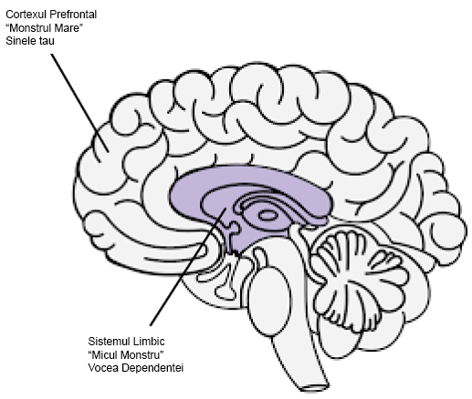

# Resurse {-}

[Meditații ale unui dependent de pornografie](../resources/meditations.pdf) - Guillaco

[Lista de verificare a declarațiilor EasyPeasy](https://old.reddit.com/r/pmohackbook/comments/id6nie/easypeasy_statements_checklist/) - SWATxKATS

[9 Minute de meditație](https://www.youtube.com/watch?v=tw7XBKhZJh4) - Sam Harris

[Curs de meditație de trezire](https://wakingup.com) - Sam Harris

[Exiting Modernity](https://jdemeta.net/2019/09/15/exiting-modernity/) - Meta Nomad // ([pdf](https://jdemeta.net/wp-content/uploads/2019/09/Exiting-Modernity.pdf))

[Scrisoare pe care o trimit în școli](../resources/principal.pdf)

[Freedom Forever (PMO Hacknotes)](https://sites.google.com/view/freeforever/home)

[De ce recidivezi - u/Different_Guide_5205](https://old.reddit.com/r/pmohackbook/comments/mynwjl/why_youre_relapsing/)

[Contracararea fricii - u/Different_Guide_5205](https://old.reddit.com/r/pmohackbook/comments/n5027n/countering_fear/)

## REBT Afirmații de coping {-}

- *"Pot să mă opresc din PMO, chiar dacă pare "greu" să fac acest lucru. Nu este prea greu și, indiferent de cât de mult va dura, merită!"* *.

- *"Dacă voi continua să ignor și să nu cedez niciodată la impulsurile mele puternice de a face PMO, îmi va fi din ce în ce mai ușor să le rezist. "*
- *"Mă pot accepta pe deplin și necondiționat - da, chiar și cu toate defectele și neajunsurile mele. "*

- *"PMO pare să-mi "vindece" rapid problemele, dar de fapt le înrăutățește. "*

- *"Uneori, mi-ar plăcea foarte mult să-mi înec problemele în PMO, dar acesta nu este niciodată un motiv pentru a face acest lucru. "*

- *"Este cel mai incomod atunci când nu obțin ceea ce îmi doresc cu adevărat. Dar nu este îngrozitor sau teribil decât dacă aleg să cred că este, iar eu aleg să cred ceva mai realist și mai util. "* *

- *"Niciodată nu-mi va plăcea tratamentul nedrept, dar îl pot suporta și poate că pot complota și plănui să îl opresc." *

- *"Nu contează de câte ori eșuez în această importantă încercare, eșecul meu nu mă face niciodată un păduche incompetent. Mă face doar o persoană care poate a acționat incompetent în acel moment. "* *.

- *"Nu am nevoie în mod absolut de ceea ce vreau, dar pot fi totuși rezonabil de fericit, deși nu la fel de fericit ca atunci când nu-l obțin. "*

- *"Prefer cu tărie să fiu remarcabil în munca mea, dar nu trebuie să fiu. Păcat dacă nu sunt, dar asta nu mă face inferior. Pot să continui să încerc mereu să fac mai bine fără să am nevoie să fac mai bine. "* *.

- *"Multe lucruri mă pot ajuta să mă întristez și să mă dezamăgesc, dar când cer și ordon ca aceste lucruri să nu existe, mă fac să mă panichez, să mă deprim și să mă înfurii. "*

- *"Da, de multe ori am eșuat să fac ceea ce am promis că voi face, dar asta nu înseamnă că nu pot sau nu vreau să duc la îndeplinire această promisiune. "*

- *"Urăsc ca naiba să fiu anxios și deprimat, dar nu trebuie să dizolv imediat aceste sentimente cu PMO. Când fac PMO, mă simt temporar mai bine în legătură cu problemele mele, dar nu mă simt mai bine. Pe termen lung, PMO le înrăutățește. "* *.

- *"Oamenii nu mă înfurie tratându-mă rău. Eu aleg cu încăpățânare să mă înfurii pe mine însumi din cauza tratamentului lor rău prin faptul că le cer și le ordon să se poarte mai bine. "* *.

## Combinând EasyPeasy cu Tehnica de recunoaștere a vocii dependente (AVRT) a lui Jack Trimpey {-}

*Credit pentru az#8773 pe Discord* 

Aceasta este pentru persoanele care se străduiesc să folosească metoda Easyway a lui Allen Carr pentru a se vindeca de o dependență, în ciuda înlăturării spălării creierului. Voi presupune că oricine citește acest lucru a citit oricare dintre cărțile lui Allen Carr și a înțeles metoda sa Easyway (AKA Easypeasy). Dacă nu, recomand cu tărie să o facă. De asemenea, ar fi de ajutor dacă ați citi "Rational Recovery" de Jack Trimpey. Dacă nu ați citit-o, atunci nu este nicio problemă, deoarece voi acoperi aici elementele de bază, dar vă recomand să o citiți oricum, deoarece va intra în mult mai multe detalii decât o voi face eu. Aceasta nu va viza o anumită dependență și, prin urmare, va fi aplicabilă oricărei dependențe. Scopul acestei scrieri este de a compara Easyway cu o altă metodă de succes a dependenței, numită "Tehnica de recunoaștere a vocii de dependență" (AVRT) și de a combina cele 2. Deși cred că Easyway este de departe superioară tuturor celorlalte metode de recuperare a dependenței, cred că înțelegerea și a AVRT ar putea fi veriga lipsă pentru atât de mulți care eșuează folosind Easyway, în ciuda faptului că au ucis monstrul mare.

Există multe metode concurente pentru depășirea dependenței, fiecare cu rate de succes diferite. Nu am de gând să menționez niciuna dintre ele, deoarece majoritatea sunt o pierdere de timp și vreau să fiu cât mai scurt posibil. Singurele metode despre care voi scrie sunt Easyway a lui Allen Carr și AVRT a lui Jack Trimpey (fondatorul Rational Recovery). Ambele metode au rate de succes extrem de ridicate, dar fiecare vizează un lucru diferit. Easyway și AVRT se aseamănă prin faptul că Easyway separă dependența în "Micul Monstru" și "Marele Monstru", iar AVRT separă mintea ta în "Vocea Adictivă" (alias bestia) și "Tu". Vocea dependenței și monstrul mic sunt același lucru, iar monstrul mare (alias spălarea creierului) este sistemul de credințe pe care îl ai și care te face să crezi că dependența ta îți oferă un fel de beneficiu sau o cârjă. Easyway se concentrează pe eliminarea monstrului mare, fără să țină cont de monstrul mic, în timp ce AVRT se concentrează pe monstrul mic, fără să țină cont de monstrul mare. În timp ce Easyway distruge dependența psihologică, AVRT te învață să recunoști dependența fizică care se deghizează în tine și să te separi de ea. Mi se pare interesant faptul că atât Easyway, cât și AVRT au rate de succes foarte mari, deși se concentrează pe lucruri opuse.

Deși cred că Easyway este de departe superioară tuturor celorlalte metode de recuperare a dependenței și o recomand mai presus de orice, pot găsi 2 mici lacune în ea. În primul rând mi se pare că subestimează micul monstru. Vreau să evit să folosesc anecdote personale în această scriere, dar, din experiențele mele și ale altora, se pare că unii dintre noi eșuează la Easyway nu pentru că nu au reușit să elimine complet monstrul mare (deși acest lucru se poate întâmpla și se întâmplă), ci pentru că au subestimat monstrul mic. Monstrul mic nu este o problemă pentru majoritatea oamenilor, ceea ce explică ratele ridicate de succes la Easyway, dar pentru alții, inclusiv pentru mine, poate fi o problemă. A doua gaură este că Easyway spune că toate eșecurile sunt rezultatul fie că nu am urmat instrucțiunile, fie că nu am îndepărtat monstrul mare.

Ideea de bază a Easyway este următoarea. Dependența are 2 componente, dependența fizică de dopamină și dependența psihologică compusă din convingeri (spălare a creierului) că dependența îți oferă un fel de plăcere sau o cârjă. Acestea se numesc monstrul mic și, respectiv, monstrul mare. Potrivit Easyway, monstrul mic nu este altceva decât un sentiment de gol, ușor nesigur, care este abia perceptibil. Odată ce îl omori pe monstrul cel mare prin anularea spălării creierului, învățând cum că dependența ta nu are niciun beneficiu și cum orice plăcere sau cârjă percepută este doar o iluzie și, la fel de important, cum că nu ai de ce să te temi de o viață fără dependență, poftele dispar. Poftele provin din teama că viața fără micul tău sprijin ar fi insuportabilă, ceea ce te face să te îndoiești de renunțare, ceea ce reprezintă pofta. Învingeți teama realizând cât de mult mai plăcută va fi viața dumneavoastră fără dependență și vă mențineți acest sentiment de exaltare.

Deși cred că aceasta este cea mai bună metodă de recuperare dintr-o dependență, nu pune accentul pe micul monstru, deoarece, în teorie, odată ce monstrul mare este rezolvat, micul monstru neajutorat și neputincios se va ofili și va muri de unul singur, iar acesta este aproape imperceptibil oricum, așa că cui îi pasă. Monstrul mic poate fi nesemnificativ pentru o mulțime de oameni, dar, din experiența mea și a altora, se pare că nu este întotdeauna așa. Atunci când oamenii eșuează cu Easyway, conform Easyway, există doar 2 motive posibile, fie nu ați urmat instrucțiunile corect, fie nu ați reușit să îndepărtați monstrul mare. Eu cred că acest lucru este dăunător și voi explica mai târziu de ce.

Tehnica de recunoaștere a vocii de dependență (AVRT) separă creierul în 2 părți: creierul inferior (sistemul limbic), unde se află dependența, și creierul superior (cortexul prefrontal), unde te afli tu (sau cel puțin gândurile și ego-ul tău). Jack Trimpey se referă la vocea dependenței ca fiind bestia, deoarece aceasta rezidă în partea animală a creierului nostru și știe un singur lucru: "VREAU ȘI VREAU ACUM". Eu însumi nu consider că este util să o personificăm ca pe o fiară, dar presupun că este mai bine decât să crezi că ești tu. Vocea dependenței (AV, micul monstru) îți va deturna vocea minții și o va folosi împotriva ta pentru a te face să te complaci în dependență. Trebuie să facă acest lucru pentru că nu vă poate controla singură funcțiile motorii. Puteți încerca asta acum, ridicați mâna în fața feței și mișcați-vă degetele. Acum cereți-i dependenței dvs. să facă același lucru. Nu poate. Acest lucru înseamnă că, în cele din urmă, tu ești cel care deține controlul aici.

AV nu numai că îți deturnează vocea minții, dar se ascunde în mod înșelător în spatele pronumelui "eu". Acesta spune: "Mi-ar prinde bine X chiar acum", "Cu siguranță îmi lipsește să fac X", "Nu ar fi frumos să fac X chiar acum, la urma urmei o merit după ziua de azi". AVRT subliniază faptul că nu sunteți vocea care vă creează dependență, ci doar credeți că sunteți. Atunci când recunoașteți că AV nu este "tu" și îi spuneți nu, aceasta renunță la "eu" și începe să folosească "tu", "noi" sau "noi". Aceasta este o dovadă că nu ești tu.

Atunci când spui "Nu" AV-ului tău, se întâmplă acest lucru:
"Mi-ar prinde bine X chiar acum" devine "Oh, haide, ți-ar prinde bine X chiar acum și știi asta". "Cu siguranță îmi lipsește să fac X" devine "Oh, haide, cu siguranță îți lipsește să faci X, nu simți asta?". "Nu ar fi frumos să facem X chiar acum, la urma urmei merit asta după ziua de azi." devine "Merităm să facem X chiar acum după tot ce am trecut, cum poți să ne refuzi asta?".

În acest moment trebuie să clarific ceva. Nu este vorba de "războiul de tracțiune" la care se referă Allen Carr. "Războiul de tracțiune" este disonanța cognitivă, care este atunci când ai 2 sau mai multe sisteme de credință conflictuale și este rezultatul faptului că nu ai ucis monstrul cel mare. "Chiar nu vreau să fac X din cauza acestui efect negativ pe care mi-l dă, dar mă face și pe mine X, așa că vreau să o fac". Acesta este războiul încrâncenat și este fapta monstrului mare. Odată ce monstrul mare este mort prin eliminarea spălării creierului, singurele voci care vă vor spune să vă angajați în dependență vor veni de la monstrul mic (AV). Deoarece AV folosește pronumele "eu", confundarea AV cu monstrul mare devine o posibilitate.

De asemenea, este important de subliniat că AV este un mincinos masiv. Singura sa preocupare este să obțină dopamină cu orice preț. AV va încerca să vă convingă să vă puneți în situații potențial mortale dacă asta înseamnă să obțineți o doză.

Mai devreme am spus "Când oamenii eșuează cu Easyway, conform Easyway, există doar 2 motive posibile, fie nu ați urmat instrucțiunile corect, fie nu ați reușit să eliminați monstrul mare. Eu cred că acest lucru este dăunător și voi explica mai târziu de ce." Cred că acest lucru este dăunător pentru că eșecul de a recunoaște AV-ul m-a determinat pe mine și pe alții care au folosit Easyway să credem în mod fals că nu am ucis complet monstrul mare, așa că recitim cartea pentru a încerca să ucidem din nou spălarea creierului, chiar dacă am făcut-o deja. Nerecunoașterea AV combinată cu convingerea că "dacă ai eșuat cu Easyway înseamnă că nu ai reușit să omori monstrul mare" te va face să îți concentrezi din nou eforturile asupra monstrului mare, când acesta a fost deja învins. S-ar putea să sfârșești într-un ciclu de relectură a cărților lui Allen Carr, care durează o vreme, apoi recidivează iar și iar.

Atunci când AV spune ceva de genul "Vreau să fac X acum pentru că mă face să fiu X", dacă ai dezlegat spălarea creierului și ai îndepărtat monstrul mare, te poți gândi "Dar știu că acest lucru nu este adevărat, așa că de ce mai cred că este? Am eșuat să anulez complet spălarea creierului?". Adevărul aici este că ai înlăturat spălarea creierului, fapt dovedit de faptul că știi mai bine decât ceea ce îți spune AV-ul tău, doar că tu crezi că AV-ul ești tu pentru că a folosit pronumele "eu". Recunoașterea AV-ului și forțarea lui să se dezvăluie prin renunțarea la "eu" pentru "tu", "noi" sau "noi" ar trebui să vă confirme că nu este vorba de monstrul cel mare aici, ci de monstrul cel mic. Dacă ar fi fost într-adevăr monstrul mare, nu ar fi înlocuit "eu" cu "tu", sau sa foloseasca "noi".

Acum, când AV spune "Te rog, putem să mai facem X încă o dată de dragul vremurilor trecute, doar încă o dată?" și tu spui "Nu", poți simți un răspuns emoțional. Este posibil să simțiți teamă sau tristețe. Este extrem de important să realizați că acest sentiment nu vine de la dumneavoastră, ci de la el. Dacă nu ești capabil să recunoști AV, vei crede că această emoție vine de la tine și vei fi mai înclinat să cedezi. Recunoașteți AV-ul și faptul că emoțiile care provin de la el nu vin de la voi, apoi simțiți bucurie în acest sens.

Atunci când puneți aceste două metode împreună (dacă este necesar, nu toți oamenii par să aibă o problemă cu micul monstru) și mențineți un sentiment de bucurie și euforie ori de câte ori recunoașteți AV-ul, succesul este al dumneavoastră.
