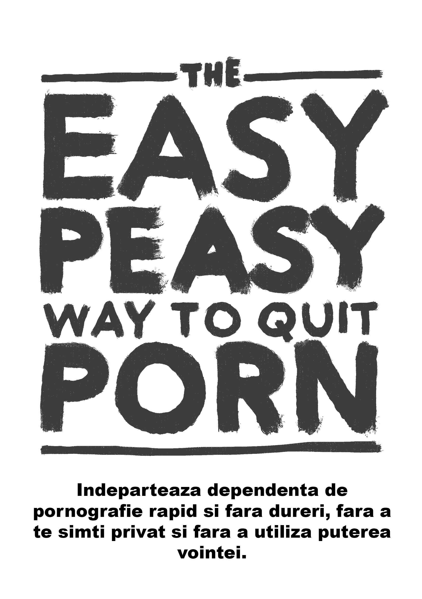

# Introducere

{width=45% height=45%}

NU TRECETI PESTE CAPITOLE

Aceasta carte Open-Source iti va permite sa incetezi din a folosi pornografia imediat, fara dureri si permanent, fara a utiliza puterea vointei sau a avea orice sentiment de privare sau sacrificiu. Aceasta metoda nu te va face sa te simtiti judecat, jenat sau sub presiune. 

Nu este necesar sa te opresti sau sa raresti vizionare ponrografiei cat timp citesti. In acest moment, opritul sau raritul obiceiului de a viziona pornografie este daunator.  

Este posibil sa fii ingrozit la gandul de a renunta la pornografie, sau sa te afli printre milionele de oameni care incearca sa se opreasca. Daca te afli printre oamenii din ultima categorie, atunci poate tot ce ai citit pana acum este impotriva a ceea ce ai citit sau ai auzit pana acum, dar intreaba-te daca lucurile auzite pana acum te-au ajutat sa te opresti. Daca te-ar fi ajutat atunci nu te-ai fii aflat aici.  

Poate te identifici in urmatoarele intrebari: 

- Petreci mult mai mult timp uitandu-te la pornografie decat iti doresti? 

- Iti este greu sa opresti sau limitezi consumul de pornografie? 

- Timpul petrecut in fata pornografiei a interferat (sau a fost prioritizat) cu viata ta personala, hobbiurile, relatiile si responsabilitatiel tale? 

- Incerci din rasputeri sa mentii un secret obiceiurile tale de a viziona pornografie?  (ex: stergi istoria browerului, minti despre obiceiurile tale de vizionare) 

-  A cauzat vizionarea porografiei probleme in relatiile tale intime? 

- treci printr-un ciclu de excitare si placere inainte si in timpul consumarii de pornografie, ca mai apoi sa simti vina, regret si rusine? 

- Petreci o cantitate semnificativa de timp gandindu-te la pornografie chiar daca nu o vizionezi la momnetul respectiv?  

- Ti-a cauzat utilizarea pornografiei conecinte negative in viata personala si profesionala? ( nu ai ajuns la timp al munca, performanta slaba la munca, neglijarea relatiilor, probleme financiare? 

Daca esti un utilizator care depinde the porno pentru a se masturba sau inainte de a face sex, tot ce trebuie sa faci este sa continui sa citesti 

Daca te afli aici pentru cineva drag tie, tot ce trebuie sa faci este sa-i convingi sa citeasca aceasta carte.  

Daca nu poti sa-i convingi, citeste singur cartea. Prin intelegerea mesajului putem facilita raspandirea mesajului si chiar sa prevenim oamenii tineri din a incepe utilizarea pornografiei. Nu te pacali singur, faptul ca s-ar putea sa nu aibe acces la pornografie in acest moment nu-i va descuraja mai incolo. 

## Despre aceasta carte {-}

Aceasta carte este o versiune rescrisa a unei [rescrieri](https://sites.google.com/site/hackbookeasypeasy) a Metodei usoare de a te lasa de fumat de Allen Carr, dar adaptata la pornografie. Cartea este gratuita si open source si licentiata sub CC-BY-SA. Succesul tau se bazeaza pe:

A CITI FIECARE CAPITOL LA RAND

Atunci cand deschizi un lacat, trebuie sa introduci fiecare cifra in ordinea corecta. Dependenta nu este deloc diferita. 

Personal, cartea the [original Google Sites version](https://sites.google.com/site/hackbookeasypeasy) (aceaasta carte nu a fost scrisa de mine) mi-a schimbat viata. Daca esti ca ceilalti atunci ai descoperit pornografia de tanar si ai te-ai folosit de ea incontinuu de atunci. La un anumit moment ai dat peste literatura de soc care te-a educat cu privirea la problemele utilizarii pornografiei. Ca si mine, probabil ai reusit sa te lasi pentru diferite perioade de timp, dar intotdeauna ai picat prada iluziilor poftelor.  Sunt bucuros sa va anunt ca prin aceasta metoda care functioneaza complet diferit de celelalte, am reusit sa renunt complet la pornografie. 
 
Daca ai ajuns sa citesti aceste pasaje dupa ce ai fost adus aici de un prieten si esti scheptic,in primul rand iti multumesc ca ai citit pana aici. O sa scriu mai multe detalii mai tarziu, dar pentru un moment, te rog sa ti aduci aminte de prima data cand te ai uitat la porno. In acel moment te-ai gandit ca o sa te reintorci aici pentru restul vietii tale? Asa cum am aflat prin a-mi sacai prietenii sa citeasca aceasta carte, EasyPeasy are un efect la fel de puternic pentru utilizatorul casual cat si pentru cei mai inratiti utilizatori. Cartea nu este foarte lunga si avand in vedere sansele mari de reusita, te rog frumos sa continui sa citesti.
 
Metoda descrisa in „hackbook” este: 

- instantanee 

- are un efect la fel de puternic pentru un utilizator inrait cat si pentru unul casual. 

- nu cauzeaza sevraj 

- nu ai nevoie de puterea vointei  

- nu este un tratement de soc, nu ai nevoie de alte obiecte sau circumstante ajutatoare 

- nu te va face sa inlocuiesti aceasta dependenta cu altele, cum ar fi mancatul in exces, fumatul sau bautul. 

- metoda este permanenta. 

- Poate ti se va parea greu de crezut, dar acest sentiment este impartasit de multi oameni 

> *"Aceasta este piatra de temelie prin care putem sa intelegem dependenta de  pornografie "*
>
> --- o persoana de pe Reddit spune:

> "*Am fost dependent timp de 10 ani. In acei 10 ani am fost urmarit de vina, neincredere, anxietate si frica ca cineva sa nu afle ca ma masturbez la pornografie.Dupa fiecare sesiune ma uram, si dupa fiecare data cand imi promiteam ca o sa renunt, recidivam.Partea buna e ca aceasta carte m-a ajutat sa renunt.In trecut tindeam sa apar utilizarea pornografiei, dar dupa ce am citit aceasta carte am ajuns sa o condamn. Pornografia nu mai are nicio putere asupra mea si acum mi se pare o simpla gluma*”
>
> --- u/DeepNewt

> "* In urma cu cateva zile am implinit 20 de ani. Pentru prima data in mult timp, mi-am petrecut ziua de nastere liber din capcana pornografiei si asta doar pentru ca am dat din greseala peste aceasta carte acum cateva luni. Inainte de asta am petrecut foarte mult timp incercand sa renunt la pornografie prin metode traditionale, dar dupa multe incercari m-am declarat ca fiind un dependent incurabil. Cartea aceasta a rezolvat totul pentru mine. Unde inainte imi era teama ca nu ma pot controla, chiar si cand fara voia mea am reusit sa infrunt „micul monstru”, acum ma mandresc ca nu mai sunt dependent de porno.*
> 
> * Nu am vreun motiv sa postez asta, dar am simtit ca trebuie sa scriu experienta mea si aici pentru ca a insemnat foarte mult pentru mine. Daca citesti asta si te gandesti sa citesti sau sa recomanzi cartea, asculta-ma pe mine cand iti spun ca merge mai bine decat orice alta metoda incercata de mine. Cel mai bun sfat pe care ti-l pot da este sa faci notite, suna amuzant, dar acest lucru m-a ajutat cel mai mult sa mi solidific anumite idei.*"
> 
> --- u/Suspicious_Web_4594

> "*bazat*"
>
> --- anon, /fit/

## Atentie
Daca te astepti ca aceasta carte sa te sperie si sa te faca sa te lasi de pornografie pentru toate motivele legate de sanatate precum disfunctie erectila, probleme cu excitarea, pierderea interesului intr-un partner adevarat, hipofrontalite si pur si simplu nivelul de dezgustare creat de utilizarea pornografiei, atunci vei fi dezamagit. Aceste tactici si informatii nu m-au ajutat sa renunt si daca te-ar fi ajutat pe tine nu ai mai fii fost aici. 
 
Metodele conventionale de stopare se bazeaza pe puterea vointei, pe „diete de porno” si pe metode de subtituire precum utilizarea odata la „n” zile. Cateva siteuri listeaza cercetari publicate despre neurotransmitatori si neuroplasticitate, si desi aceste siteuri sunt utile, multi inteleg deja aceste probleme, dar aleg sa nu faca nimic in privinta asta. Aceste informatii sunt ineficiente deoarece ele nu ajuta la intelegerea si inlaturarea motivului pentru care utilizezi pornografia. Transformand ceva intr-un „fruct interzis” nu este o metoda buna de tratare a dependentei.
 
Metoda „EasyPeasy” functioneaza diferit. Anumite idei din carte pot parea greu de crezut, dar in timp ce vei citi nu doar ca le vei intelege, dar te vei si intreba cum de ai putut sa te lasi spalat pe creier atata timp.
Exista o neintelegere comuna a motivlui pentru care noi alegem sa ne uitam la porno. Dependentii de pornografie(da, dependentii) nu aleg sa devina dependenti la fel cum nici alcoolici nu aleg sa devina alcoolici. Este adevarat ca noi deschidem telefonul sau laptoptul, dupa dam click pe browser si alegem site-ul potrivit, dar ocazional mergem si la cinema si cu toate acestea nu alegem sa ne petrecem toata viata in cinema. La inceput, curiozitatea si natura umana ne-au condus catre siteurile porno, dar daca am fi stiut cat de dependenti vom deveni si cat de multe vom avaea de pierdut pe planul sanatatii, al feiciriii si al relatiilor nu am fi inceput niciodata. „cat de mult imi doresc sa fi auzit de disfunctie erectila prima data cand am vizitat un site porno...” 

Pentru un moment gandeste-te: ai facut vreodata constient alegerea ca ai nevoie de porno pentru a te masturba? Sau ca ai nevoie de fantezii pornografice pentru a te bucura de sex impreuna cu partenerul tau? Sau ca la un anumit moment din viata ta nu ai putea dormi decat daca te uiti la porno? Ca nu ai putea sa termini o zi grea de munca fara putni ajutor din partea pornografiei? Sau ca nu ai putea sa te concentrezi sau sa faci fata stresului fara pornografie? In ce moment al vietii tale te-ai hotarat ca ai nevoie permanenta de pornogarfie in viata ta, simtiindu-te nesigur, panicat daca nu poti sa beneficiezi de haremul tau online? 
 
Ca orice alt utilizator de pornografie, ai fost atras in cea mai sinistra si subtila capcana conceputa de om si natura. Nu exista o persoana, utilizator sau nu, care sa incurajeze copii sa utilizeze pornografia pentru placere sau pentru a face fata stresului. Asta ne face sa intelgem ca utilizatorii isi doresc ca ei sa nu fi inceput niciodata. Acest fapt nu este surprinzator: nimeni nu are nevoide de pornografie ca sa se bucure de viata sau sa faca fata stresului inainte sa devina dependenti.
 
In acelasi timp, utilizatorii doresc sa folosesasca pornografia in continuare. Pana la urma nimeni nu ne obliga sa deschidem browserul si sa intram pe modul ingonito. Fie ca inteleg motivul din spatele dependetei sau nu, numai utilizatorii pot decide daca vor sau nu sa se bucure de haremul online. 
Daca ar exista un buton magic a carui apasare sa te faca sa te trezesti a doua zi ca si cum nu ai fi accesat niciodata siteurile de porno, singurii utilizatori ar ramane oamenii tineri care inca „experimenteaza”.
 
Singurul lucru care sta intre noi si renuntarea la porno este **FRICA!**. Frica cauzata de ideea ca noi v-a trebui sa trecem printr-o perioada lunga de deprivare, pofte si necaz ca sa putem fi liberi cu adevarat. Aceasta idee da nastere la alte idei irationale precum: 

- orgasmul atins prin masturbare sau sex este *singurul* si cel mai *important* aspect al vietii. 

- pornografia este mai sigura decat sexul in viata reala deoarce pornografia nu-mi poate spune nu.  

- pornografia este educativa si folositoare 

- pornografia inseaman o experienta superioara de sex 

-mai mult este intotdeauna mai bine 

Aceste idei irationale dau nastere la consecinte irationale precum: 
- obsesia asupra unei persoane „perfecte” un „10/10”  

- perceptia ca esti un ratat daca nu faci sex, ca si cum sexul ar fi cel mai important aspect al experientei umane 
 
- asteptand toata viata pentru un om perfect 10/10  

- a fi foarte critic si a-i judeca pera mult pe potentialii parteneri  

- forteaza-te sa faci sex cat mai mult chiar daca nu vrei 

Frica despre care am vorbit mai sus se erzuma la firca ca o noapte petrecuta singura va fi una mizerabila, petrecuta in lupta importiva impulsurilor greu de controlat. Frica ca noaptea de dinaintea unui examen va fi iadul pe pamant fara porno. Frica ca nu vei mai putea sa te concentrezi, sa faci fata la stres or sa fi la fel de increzator in tine fara „micul ajutor” . Frica ca pesonalitatea si caracterul tau se vor schimba.  

Poate cea mai amenintatoare frica este cea care spune ca ”daca acum sunt dependent, voi fi asa pentru toata viata. Nu voi putea niciodata sa fiu liber.” Aceasta frica ne spune ca ne vom petrece tot restul vietii poftind dupa ocazionalul orgasm rezultat din utilizarea pornografiei. Daca ai incercat ca si mine sa te lasi de porno prin metodele conventionale, atunci stii ca tortura „metodei vointei” nu numai ca nu a functionat, dar a si reusit sa te convinga ca nu vei putea in veci sa renunti la porno.  

Daca simti ca nu acum este momentul potrivit sa renunti, daca simti panica si oarecum vrei sa te distantezi de aceasta metoda, trebuie sa stii ca frica si panica sunt create de pornografie. Nu tu ai decis sa cazi in aceasta capcana, dar ca toate capcanele, este conceputa sa te tina blocat. Intreaba-te daca atunci cand ai vizionat pornografie pentru prima data ai decis sa te intorci la ea fiecare zi din viata ta. Cand crezi ca vei renunta? Maine? Anul viitor? Nu te mai mintii singur! Capcana este facuta sa te tina sub pres pentru restul vietii tale. De ce altefel crezi tu ca ceilalti dependenti nu renunta pana cand pornografia le-a distrus vietile? 

Acum cateva paragrafe am adus vorba despre un buton magic. EasyPeasy functioneza in mare parte ca un buton magic. Ca sa fiu foarte clar, EasyPeasy nu este magie, dar eu impreuna cu ceilalti cititori am gasit foarte usor sa trecem peste dependenta noastra de pornografie, si desi nu este magie, pentru noi cu sigurnata s-a simtit ca atare! 

Atentie: 

Fiecare utilizator vrea sa treaca peste dependenta de pornografie si fiecare utilizator este mai mult decat capabil sa faca asta, fara suferinta. Doar **frica** te poate opri din a renunta la pornografie. Cea mai mare resuita a ta va fi sa scapi de aceasta frica, dar nu vei putea face asta pana nu termini de citit restul cartii. Din contra, este posibil ca frica sa creasca pe masura ce citesti si din aceasta cauza sa nu mai termini cartea.  
 
Mai jos am un comentariu relevant: 

***“ Am terminat de citit EasyPeasy. Stiu ca au trecut numai 4 zile, dar ma simt foarte bine si sunt sigura ca nu voi mai folosi pornografia. Prima data am inceput sa citesc cartea acum 5 luni, am ajuns la jumatate si m am panicat. Stiam ca daca voi continua sa citesc va terbui sa ma opresc din a utiliza pornografia.Realizez ca am gresit si acest gest a fost stupid.”*** 

Nu ai ales sa vazi in aceasta capcana, dar sa fie clar ca nu vei reusi sa scapi din ea decat daca vei lua decizia de a o face. Nu conteaza daca nu ai de gand sa te lasi, sau daca deja nori de nerabdare sa renunti, tine minte ca prin a citi cartea si a renunta la pornografie ** NU AI NIMIC DE PIERDUT!** 

Daca la finalul cartii decizi ca vrei sa folosesti in continare pornografia pentru a te masturba sau a face sex, nimic nu te poate opri. Nu trebuie sa raresti sau sa te opresti din sesiunile de masturbare la porno in timp ce citesti cartea. Tine minte ca aceasta metoda nu este un tratament de soc, din potriva. Imagineaza-te in locul lui Andy Dufresne cand a reusit sa scape din inchisoarea Shawshank. Asa te vei simti si tu cand vei scapa din capcana pornografiei.  

## In final... {-} 

Oricine poate reusi sa se lase de pornografie si sa se si simta bine in acelasi timp. Tot ce trebuie da faci este sa citesti aceasta carte cu mintea deschisa pentru ca totul va deveni mai usor pe masura ce intelegi diferitele idei prezentate aici. Chiar daca nu totul va fi clar la inceput, trebuie sa stii ca atat timp cat vei urma instructiunile, renuntarea la porno va fi simpla. Cel mai important aspect este ca nu vei trece prin viata cu pofte de a te uita la porno, sau simtindu-te rau ca nu poti sa te uiti.  La sfarsitul cartii singurul mister va fi motivul pentru care ti a luat atat sa renunti la porno. 
EasyPeasy are doar doua motive principale de nereusita: 

**Nerespectarea instructiunilor.** 

Unii dintre voi pot avea impresia ca anumite pasaje din carte au recomandari foarte stricte, cum ar fi sa nu gasim alternative de porno si sa nu incercam sa reducem cantitatea de porno pe care o vizionam. Nu neg ca sunt si utilizatori care au reusit sa renunte folosind metodele de mai sus, dar ei au reusit din pur noroc, nu din cauza metodelor. Unii oameni oameni pot face sex in timp ce atarna de un hamac, asta nu inseamna ca este si cea mai simpla metoda de a face sex. Combinatia potrivita pentru a deschide si cerceta „lacatul” acestei dependente se afla in carte. Dar ca sa ajungem la desfacerea lacatului trebuie sa urmarim ordinea capitolelor, fara sa le sarim. 
 
**Esecul de a intelege metoda.** 

Nu lua nimic ca atare, pune tot ce ai fost invatat cat si propriile opinii sub lupa. Cerceteaza atent ce ai invatat despre sex, porno si dependenta din societate. Spre exemplu de ce cei care cred ca este un simplu obicei, gasesc oprirea din acest obicei asa de grea atunci cand alte obiceiuri pozitive din viata noastra sunt asa de usor de uitat si de lasat in urma? De ce trebuie sa te uiti la porno pentru ca altel te panichezi? 

EasyPeasy doreste sa ti ofere informatia despre aceasta dependenta si o cale usoara si nedureroasa de a trece peste ea. Ca si altii, unul dintre cele mai mari reusite ale mele a fost sa trec peste dependenta de pornografie. Nu ai niciun motiv sa te simti trist, depresiv, ba dipotriva, esti pe cale sa atingi un rezultat la care viseaza toti utilizatorii, **LIBERTATEA!** 

**NU TRECE PESTE CAPITOLE!.**

Cativa termeni inainte sa incepem: 

***PMO***: Ciclul de Porno, Masturbare, Orgasm 

***Harem Online ***:Websiteuri cu continut pornografic.

## Sfaturi pentru citit si alte notite

**Nu citi cartea asta ca pe una normalaeste foarte scurta si poti sa o termin in cateva ore. Majoritatea oamenilor beneficieaza de *luarea de notite *, si recomanda de obicei**recitirea** cartii de cateva ori pentru a solidifica notiunile.  

De ce acest hackbook? Pentru ca Allen Carr a plecat de mult de pe acest pamant si institutiile formate de el nu listeaza pornografia ca o dependenta tratabila in incita lor. Nu primesc bani de la nimeni, totul este din efortul meu propriu.  

In cadrul cartii, eu, hackautorul si Alle vom aparea cu sfaturi ca sa te ghidam in calatoria ta si sa te ajutam sa depasesti aceasta dependenta usor si fara durere. 
**Hackbook:**o carte bazata pe alta carte.Autorul original este citat in intergime in pasajele relevante. 

Exista un numar de comunitati in limba engleza:
[urbit](https://urbit.org) - ~mislyr-midnyt/coomer (now actually working!! best possible contact method, use this pls) | [coomer meme archive](https://coomer.org) | [analytics](https://plausible.io/easypeasymethod.org) | [matrix](https://matrix.to/#/!xmJZznbJXuwzEGSEti:matrix.org?via=matrix.org) | [discord](https://discord.com/invite/bCXEnf9) | [reddit](https://reddit.com/r/pmohackbook) | [feedback form](https://forms.gle/p7cTxowaNpKqgi5Z7)

Atentie: **NU TRECE PESTE CAPITOLE, CITESTE TOT! **

In mod normal ti-as ura succes, dar asa cum vei vedea, nu vei avea nevoie de el!
Good vibes,

Hackauthor²

{width=88 height=31}

This work is licensed under a [Creative Commons Attribution-ShareAlike 4.0 International License](https://creativecommons.org/licenses/by-sa/4.0/). Code is [GPLv3](https://gitlab.com/snuggy/easypeasy/-/blob/master/LICENSE). 

