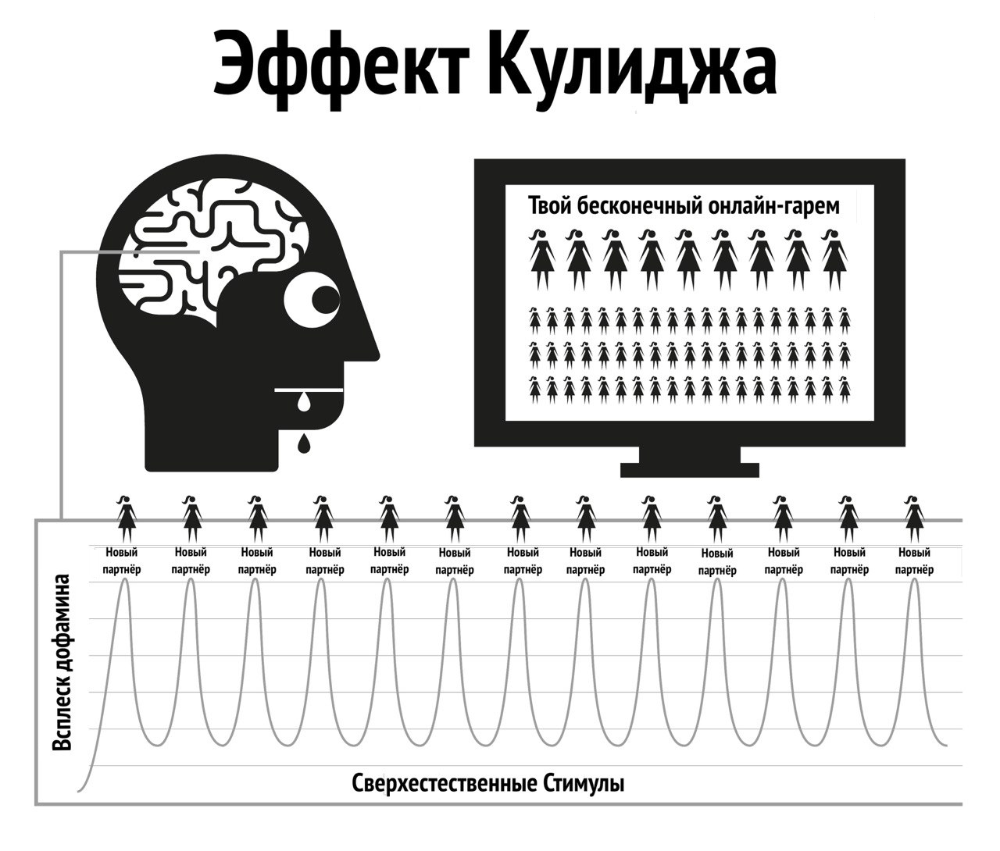

# Природа человека

Интернет-порно действует путем взлома естественных механизмов вознаграждения, отвечающих за то, чтобы вы как можно дольше продолжали размножаться. Мгновенная и очень доступная форма интернет-порно заставляет механизм вознаграждения мозга вырабатывать дофамин значительно дольше и больше, чем обычно. С научной точки зрения это называется эффектом Кулиджа, о котором вы, вероятно, уже знаете.

Дофамин -- это нейромедиатор, связанный с чувством желания и предвкушения цели, а фактическое удовольствие вызывают опиоиды. Больше дофамина, больше опиоидов и больше действий. Без дофамина такие действия, как прием пищи, не приносят удовольствия и не завершаются, причем продукты с высоким содержанием жира и сахара вызывают сильный выброс дофамина.

Дофамин также выделяется в ответ на новизну. При кажущемся бесконечном количестве доступной порнографии это наводняет лимбическую систему (систему вознаграждения), поэтому при первом просмотре порно вы действуете, испытывая оргазм и вызывая очередной прилив опиоидов. Стимулируемый получать как можно больше дофамина, мозг сохраняет это в виде сценария для легкого запоминания и укрепляет нейронные пути посредством выделения химического вещества под названием DeltaFosB. Теперь мозг вызывает эти пути в ответ на такие сигналы, как сексуальная реклама, одиночество, стресс или даже чувство подавленности, и внезапно вы уже готовы прокатиться на "водной горке". Каждый раз, когда это повторяется, высвобождается больше DeltaFosB, благодаря чему водная горка смазывается и оживает, в следующий раз с неё будет легче скатиться.

Лимбическая система имеет самокорректирующуюся систему для уменьшения количества дофаминовых и опиоидных рецепторов при частом и ежедневном наводнении дофамином. К сожалению, эти рецепторы также необходимы нам для поддержания мотивации, чтобы справляться с ежедневными жизненными стрессами. Номинальное количество дофамина, получаемое в результате естественного вознаграждения, просто не идет ни в какое сравнение с порнографией и не так эффективно поглощается рецепторами с ослабленной чувствительностью, что приводит к тому, что вы чувствуете себя более напряженным и раздраженным, чем обычно. Этот процесс известен как десенсибилизация.

В цикле ПМО вы уже пересекали "красную черту" и вызвали у себя такие эмоции, как чувство вины, отвращение, смущение, тревога и страх, которые, в свою очередь, ещё больше повышают уровень дофамина и заставляют мозг неправильно интерпретировать эти чувства как сексуальное возбуждение. То есть ваш мозг начинает вырабатывать внутреннюю химию для ПМО каждый раз, когда вы испытываете сильные эмоции или стресс. Вы ошибочно начинаете принимать тревогу и стресс за сексуальное возбуждение.

Со временем мозг становится десенсибилизирован не только к предыдущим просмотренным клипам, но и к похожим жанрам и уровню шока. Снижение мотивации приводит к снижению чувства удовлетворённости, поскольку наш мозг всё постоянно оценивает, он подталкивает вас к поиску клипов, чтобы утолить "голод". Поэтому вы ищете больше новизны, нажимая на любительский, вызывающий шок клип на главной странице, о котором, при первом посещении, вы уверенно говорили себе, что никогда не будете такое смотреть.

> *"В росе мелочей сердце находит свое пробуждение и обновляется."*
>
> --- Халиль Джебран

Мимолетное чувство безопасности -- это все, что порой нужно, чтобы пережить трудный момент в жизни, но сможет ли ваш десенсибилизированный мозг уловить и использовать ту толику веществ-антистрессоров, которую вырабатывает мозг.

Заливание себя в дофамином действует как быстродействующий наркотик, быстро снижая эффект и вызывая абстинентный синдром. У многих пользователей есть иллюзия, что эти муки -- это ужасная травма, которую они испытывают, когда пытаются или вынуждены остановиться. На самом деле, муки в первую очередь психические, поскольку пользователь чувствует себя лишенным удовольствия или опоры.

## Маленький монстр

Химическая ломка от порно настолько тонкая, что большинство пользователей живут и умирают, не подозревая, что они наркоманы. Многие потребители боятся наркотиков, но это именно то, чем они являются -- наркоманами. К счастью, это легкий наркотик, но сначала нужно признать, что вы действительно зависимы. Отказ от порнографии не вызывает физической боли, это просто пустое, беспокойное ощущение чего-то недостающего, поэтому многие считают, что это связано с сексуальным желанием. При длительном существовании это чувство превращается в нервозность, неуверенность, возбуждение, снижение уверенности и раздражительность. Это голодание по яду.

Через несколько секунд после начала сеанса происходит выделение дофамина, и тяга прекращается, что приводит к ощущению удовлетворения, когда вы с визгом скатываетесь с водной горки. В первые дни абстинентный синдром и его последующее облегчение настолько незначительны, что мы их не замечаем. Когда мы становимся постоянными потребителями, мы считаем, что это происходит потому, что нам стало нравиться или мы вошли в "привычку". На самом деле мы уже подсели, но не осознаем этого. Маленький монстр уже сидит в нашем мозгу, поэтому время от времени мы спускаемся с водной горки, чтобы покормить его.

Все пользователи начинают искать порно по иррациональным причинам. *Единственная* причина, по которой кто-то продолжает использовать порно, будь то случайный или заядлый пользователь, -- это желание накормить этого маленького монстра. Вся эта запутанная история представляет собой серию жестоких и непонятных наказаний, но самым жалким аспектом является чувство удовольствия, которое пользователь получает от сеанса, пытаясь вернуться к ощущению мира, спокойствия и уверенности, которое было в его теле до того, как он впервые подсел на порно.

## Раздражающий звон

Вам знакомо это чувство, когда соседская сигнализация звонит весь день -- или какое-либо другое мелкое постоянное раздражение -- а потом шум внезапно прекращается, и вас охватывает удивительное чувство мира и спокойствия? Но это не внутренний покой, это прекращение раздражения. Перед началом следующего сеанса наши тела полностью восстановились, но затем мы начинаем заставлять наш мозг чрезмерно вырабатывать дофамин, и когда мы заканчиваем и он начинает уходить, мы испытываем абстинентный синдром. Это не физическая боль, а ощущение пустоты. Мы даже не осознаем, что оно есть, это как капающий кран внутри нашего тела -- постоянный, медленный процесс раздражения, который влияет на нас.

Наш рациональный ум не понимает этого, ему это и не надо. Всё, что мы знаем, это, что мы хотим порно, и когда мы мастурбируем, тревога проходит. Однако удовлетворение мимолетно, и для того, чтобы облегчить тревогу, нужно ещё больше порнографии. Как только вы достигаете оргазма, тяга возникает снова, и ловушка продолжает удерживать вас. Это петля обратной связи, она будет существовать, пока вы не разорвете её!

Порноловушка -- это как ношение тесной обуви только для того, чтобы разуваясь получить удовольствие снятия. Есть три основные причины, по которым пользователи не могут посмотреть на порно иначе.

1.  С самого рождения нас подвергали массированному промыванию мозгов, говоря нам, что интернет-порно -- это просто очередное проявление прогресса, заменившее печатную версию порнографии. Это заблуждение сопровождается словами о том, что мастурбация не вредна, так почему же мы не должны им верить?

2.  Поскольку физическая дофаминовая абстиненция не сопровождается болью, а лишь пустым чувством неуверенности, неотличимым от голода или обычного стресса, такое чувство выливается в порносеанс, так как именно в эти моменты мы склонны искать порно в Интернете. Мы склонны считать это чувство нормальным.

3.  Однако основная причина, по которой пользователи не видят интернет-порно в истинном свете, заключается в том, что с порно всё устроено совершенно наоборот. Именно когда вы *не* потребляете порно, вы испытываете чувство пустоты. Поскольку процесс привыкания в первые дни невероятно тонкий и постепенный, ощущение пустоты считается нормальным и не принято винить в нем предыдущий сеанс. Как только запускается браузер и вы начинаете сеанс, вы получаете мгновенный заряд бодрости, становитесь менее нервным и более расслабленным, кажется, что это явная заслуга интернет-порно.

Из-за "обратного" устройства зависимости все наркотики трудноизлечимы. Представьте себе состояние паники героинового наркомана без героина, а теперь представьте его безмерную радость, когда он наконец-то может воткнуть иглу в вену. Люди, не страдающие героиновой зависимостью, не испытывают такого чувства паники.

Героин не снимает это чувство, он его вызывает. Аналогично непользователи не испытывают пустоты и потребности в интернет-порно и не паникуют, когда находятся оффлайн. Непользователи не могут понять, как пользователи могут получать удовольствие от двухмерного видео с приглушенными звуками и ненормальными пропорциями тела. Хотя пользователи тоже этого не понимают.

Мы говорим, что интернет-порно расслабляет или удовлетворяет, но как вы можете быть удовлетворены, если изначально вы не были неудовлетворены? Непользователь не страдает от этого неудовлетворенного состояния, он полностью расслаблен даже после свидания без секса, а пользователь, пока не удовлетворит своего "маленького монстра", находится в напряжении.

## Удовольствие и поддержка?

Важное напоминание: основная причина, по которой пользователям трудно бросить порно, заключается в убеждении, что они отказываются от истинного удовольствия или поддержки. Важно понимать, что вы не отказываетесь *абсолютно ни от чего*. Лучший способ понять тонкости порноловушки -- сравнить ее с приемом пищи. Привычка регулярно принимать пищу заставляет нас не чувствовать голода в промежутках между приемами пищи, мы испытываем голод только в случае задержки приёма пищи. Физической боли нет, есть только пустое неуверенное чувство, которое распознается как голод. Процесс удовлетворения голода -- это очень приятный опыт.

Порнография кажется почти идентичной, но это не так. Как и в случае с голодом, здесь нет физической боли, и механизм вознаграждения ведет себя схожим образом, но именно это сходство с приемом пищи обманывает пользователя, заставляя поверить, что он получает истинное удовольствие или поддержку. Хотя еда и порнография кажутся очень похожими, в действительности они прямо противоположны.

-   Вы едите, чтобы выжить и наполнить свою жизнь энергией, в то время как порнография приглушает и сокращает ваши жизненные силы.

-   Еда действительно приятна на вкус, и прием пищи -- это действительно приятный опыт, которым мы наслаждаемся на протяжении всей жизни. Порно включает в себя самосаботаж рецепторов счастья и тем самым уничтожает ваши шансы справляться с жизненными ситуациями и чувствовать себя счастливым.

-   Прием пищи не вызывает голода и действительно уталяет его, в то время как первый сеанс порнографии запускает тягу к дофамину и каждому последующему сеансу. Это не избавляет от голода, а обеспечивает страдания на всю оставшуюся жизнь.

Является ли прием пищи привычкой? Если вы так думаете, попробуйте полностью отказаться от неё! Назвать прием пищи привычкой -- это то же самое, что назвать привычкой дыхание: и то, и другое необходимо для выживания. Это правда, что у людей есть привычка утолять голод в разное время разными видами пищи, но сам прием пищи не является привычкой. Так же как и порнография. Единственная причина, по которой пользователь открывает браузер, -- это попытка покончить с пустотой, которую создал предыдущий сеанс, причем в разное время и с разной степенью эскалации жанров.

В Интернете порно часто называют привычкой, и для удобства EasyPeasy также называет его "привычкой". Тем не менее, постоянно отдавайте себе отчет в том, что порно -- это не привычка, а **наркотическая зависимость!** Когда мы начинаем использовать порно, нам приходится заставлять себя справляться с этим. Мы не успеваем оглянуться, как переходим ко все более странному и шокирующему порно. Кайф -- в охоте, а не в убийстве: дофамин быстро покидает организм после оргазма, что объясняет, почему пользователи хотят "отвлечь себя" (отсрочить оргазм), переключаясь между многочисленными окнами и вкладками браузера.

## Пересечение красной линии

Как и в случае с любым другим наркотиком, у организма вырабатывается иммунитет к воздействию одних и тех же старых клипов, наш мозг хочет больше или чего-то другого. После короткого периода просмотра одного и того же ролика он перестает полностью снимать ломку, которую вызвал предыдущий сеанс. В этом порнораю происходит перетягивание каната: вы хотите остаться на безопасной стороне вашей "красной линии", но ваш мозг просит вас кликнуть на клип с запрещёнкой.

После участия в порносеансе вы чувствуете себя лучше, но даже если вы живете в предполагаемом порнораю, вы всё равно более нервный и менее расслабленный, чем тот, кто никогда не начинал смотреть порно. Эта ситуация ещё более нелепа, чем ношение тесной обуви, потому что в случае с порно по мере того, как вы движетесь по жизни, все большее количество дискомфорта ощущается даже после снятия давящей обуви. Поскольку пользователь знает, что маленького монстра нужно кормить, он сам определяет время, которое, как правило, приходится на четыре типа случаев или их комбинацию:
Скука / Концентрация - две полные противоположности!  
Стресс / Расслабление - две полные противоположности!

Что за волшебное лекарство такое, что оно внезапно отменяет тот эффект, который оно оказало несколько минут назад? Правда в том, что порно не избавляет от скуки и стресса и не способствует ни концентрации ни расслаблению. Если задуматься, какие ещё виды отдыха есть в нашей жизни, кроме сна? Если вы собрались переключиться на другие виды "реалистичного" или "мягкого" порно, пожалуйста, обратите внимание, что данная книга относится ко всему порно, печатному, рисованному, анимированному, вебкаму, платному контенту, чатам, прямым эфирам и т.д. Человеческое тело -- самый сложноустроенный объект на планете, но ни один вид, даже самая низшая амеба или червь, не выживет, если не будет понимать, в чём разница между пищей и ядом.

Благодаря естественному отбору наши ум и тело выработали методы поощрения действий, которые умножают и поддерживают человечество. И они не приспособлены к сверхнормальным стимулам, которые гораздо больше, ярче и острее, чем всё, что можно найти в природе, поскольку даже самое приглушенное двухмерное изображение вызывает у нас возбуждение. А многократный просмотр одного и того же изображения не вызывает возбуждения. В реальной жизни система сдержек и противовесов гарантирует, что вы займетесь чем-то другим, кроме размножения, но у интернет-порно нет такого ограничителя, что обрекает вас провести всю жизнь в виртуальном гареме!

Ошибочно предполагать, что физически и психически слабые люди становятся пользователями. На самом деле те, кому первый раз показался отталкивающим, являются настоящими счастливчиками, они излечились на всю жизнь. Либо они психологически не готовы пройти через тяжелый процесс "обучения", чтобы подсадить себя, либо боятся "попасться", либо не обладают достаточными техническими знаниями, чтобы разобраться с настройками конфиденциальности браузера. Возможно, самая трагическая часть всего этого связана с подростками -- умельцами находить материал и заметать следы -- коих становится все больше.

Наслаждение от порно -- это иллюзия. Прыгая из жанра в жанр, мы просто удерживаем нашу жадную до новизны внутреннюю обезьяну в пределах красной линии "безопасных" порножанров, чтобы получить дофаминовую дозу. Как героиновые наркоманы, у которых всё, чем они наслаждаются на самом деле, -- это ритуал облегчения этих страданий

## Кайф от танца у красной линии

Даже если один ролик сохранился в любимых надолго, всё равно пользователь постоянно приучивает себя отсеивать плохие и уродливые моменты. Даже если это соло, он все равно отфильтровывает те части тела, которые привлекают больше всего. На самом деле, некоторые получают удовольствие от этого танца у красной черты, находя оправдания, чтобы заявить, что им нравятся "нежные вещи" и они не испытывают привыкания к сверхнормальным стимулам. Но спросите пользователя, который считает, что придерживается определенного актера или жанра: *"Если вы не можете получить доступ к своему обычному типу порно и есть только 'небезопасный' жанр, перестанете ли вы мастурбировать?"*

Нет! Пользователь будет мастурбировать на всё, что угодно: эскалация жанров, различия в сексуальной ориентации, похожие друг на друга исполнители, опасная обстановка, шокирующие отношения, все, что угодно, лишь бы насытить маленького монстра. Поначалу они ужасны на вкус, но через некоторое время вы научитесь получать удовольствие и от них. Пользователи будут искать пустого удовлетворения после реального секса, после долгого рабочего дня, при лихорадке, простуде, гриппе, боли в горле и даже во время госпитализации в больницах.

Наслаждение не имеет к этому никакого отношения; если хочется секса, то нет смысла заниматься им с ноутбуком. Некоторые пользователи считают, что осознание, своей наркомании, вызывает тревогу, и полагают, что это еще больше затруднит процесс отказа. На самом деле, это хорошая новость по двум важным причинам.

1.  Причина, по которой большинство продолжает употреблять порно, такова: не смотря на то, что мы знаем, что недостатки намного превосходят преимущества, мы верим, что в порно есть что-то, что нам действительно нравится, или что оно действует как некая помощь. Мы тешим себя иллюзией, что после прекращения употребления наступит пустота, что определенные ситуации в нашей жизни никогда не будут прежними. На самом же деле порно не только ничего не дает, но и многое отнимает.

2.  Хотя интернет-порно является самым мощным триггером новизны и сексуального дофаминового наводнения, из-за молниеносности, с которой вы попадаете на крючок, вы никогда не попадаете на крючок очень сильно. Фактически, абстинентный синдром настолько слаб, что большинство пользователей живут и умирают, даже не подозревая об этом.

Почему же тогда многим пользователям так трудно остановиться, они проходят через месяцы мучений и проводят остаток жизни, тоскуя по порно в самые неподходящие моменты? Ответ заключается во второй причине -- промывание мозгов. С нейромедиаторной зависимостью легко справиться, большинство пользователей обходятся без порно в Интернете в течение нескольких дней во время командировок или путешествий, не испытывая синдрома отмены. Их маленький монстр в безопасности, зная, что вы откроете свой ноутбук, как только вернетесь в гостиничный номер. Вы можете пережить несносного клиента и менеджера с манией величия, зная, что всё это можно будет исправить после.

## Аналогия с курильщиками

Хорошая аналогия -- курильщик сигарет. Если бы они десять часов в день провели без сигареты, они бы рвали на себе волосы, но многие курильщики покупают новую машину и воздерживаются от курения в ней. Многие посещают театры, супермаркеты, церкви, и невозможность покурить не вызывает у них никаких проблем. Даже в поездах и самолетах не было бунтов. Курильщики почти рады, если кто-то или что-то может помешать им курить.

Пользователи автоматически и без особого дискомфорта воздерживаются от использования интернет-порно в доме своих родителей во время семейных собраний и других мероприятий. На самом деле, у большинства пользователей есть длительные периоды, в течение которых они воздерживаются без усилий. С этим неврологическим маленьким монстром легко справиться, даже если вы всё ещё зависимы. Есть миллионы пользователей, которые остаются нерегулярными пользователями порно всю свою жизнь, но они так же зависимы, как и заядлые пользователи. И есть даже тяжелые случаи -- они покончили с зависимостью, но время от времени всё равно поглядывают, смазывая водную горку, чтобы скатиться вниз при очередном падении настроения.

Как уже говорилось ранее, порнозависимость не является главной проблемой, она просто действует как катализатор, чтобы держать наши умы в замешательстве относительно настоящей проблемы -- промывания мозгов. Не думайте, однако, что плохие последствия интернет-порно преувеличены; наоборот, они зачастую преуменьшены. Время от времени распространяются слухи о том, что созданные нейронные пути остаются на всю жизнь, и при правильном сочетании случайностей и стимулов вы снова скатываетесь с губительной для жизни водной горки, но это неправда. Наш мозг и тело -- это чудесные машины, которые восстанавливаются в течение нескольких недель.

Никогда не поздно остановиться! Быстрый просмотр онлайн-сообществ покажет вам людей всех возрастов, перезагружающих свою жизнь (и жизни своих партнеров). Как и в любом деле, некоторые поднимаются на новый уровень, практикуя сохранение спермы, метод Karezza и разделяя чувственную и детородную стороны секса, делают своих партнеров счастливее, чем когда-либо прежде.

Возможно, пожизненных и тяжелых пользователей утешит то, что им так же легко бросить, как и случайным пользователям, и в некотором смысле даже легче. Чем сильнее тянет вниз, тем больше облегчение. Когда я завязал, я сразу вышел в ноль и не испытал ни одного неприятного ощущения. На самом деле, процесс был приятным даже в период ломки.

Но сначала мы должны устранить промывку мозгов.