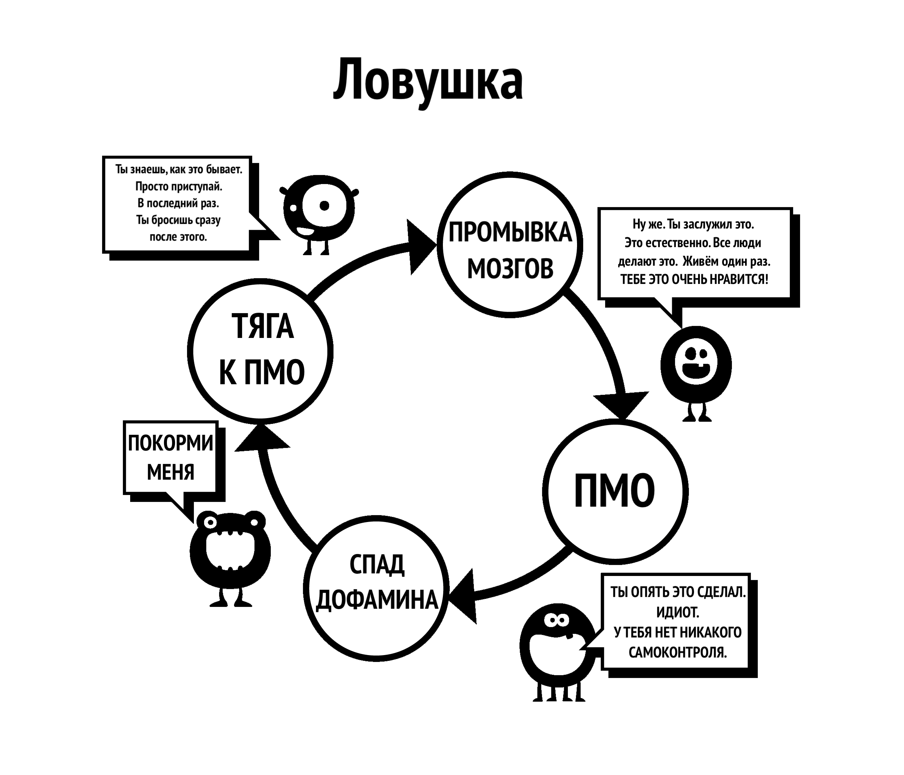

# Промывание мозгов

Это вторая причина, по которой мы начинаем пользоваться порно. Для полного понимания этого промывания мозгов нам необходимо сначала изучить мощное воздействие сверхнормальных стимулов. Наш мозг просто не готов к созданию "онлайн-гарема", позволяющего нам за пятнадцать минут переключиться между большим количеством потенциальных партнеров, чем наши предки могли увидеть за несколько жизней.

В прошлом было много ошибочных советов, одним из примеров которых было то, что мастурбация приводит к слепоте. С этим, наряду с другими тактиками запугивания, явно переборщили. Подобные заблуждения должны были опровергнуты наукой. Хотели как лучше, а получилось как всегда; с самого раннего возраста наше подсознание подвергается бомбардировке сексуальными сообщениями и образами, журналы и реклама полны намеков. Некоторые поп-клипы чрезвычайно навязчивы, но не отчаивайтесь, превратите это в игру определение, какие компоненты они используют для манипуляции -- шок, новизну, цвет, размер, табу, ностальгию и т. д. Такой игре можно научить даже подростков в качестве воспитательного средства.

Суть транслируемого поп-культурой месседжа такова: "Самой ценной вещью на этой земле, самой важной моей мыслью и действием является оргазм". Разве это преувеличение? Посмотрите любой сюжет на телевиденье или в кино, и вы увидите коктель из различных составляющих секса. Воздействие этого не фиксируется в нашем сознании, но подсознание успевает всё впитывать.

## Научная аргументация

Есть и общеизвестные вещи в другом направлении: страх сексуальной дисфункции, потеря мотивации, предпочтение виртуального порно реальным девушкам, YourBrainOnPorn.com и различные интернет-субкультуры, но эти движения не останавливают людей от употребления. По логике вещей, они должны были бы остановить людей, но реальность заключается в том, что людей это не останавливает. Даже риски для здоровья, перечисленные в рецензируемых исследованиях на сайте YourBrainOnPorn.com, не могут остановить подростка от просмотра порно.

Как ни странно, самой мощной движущей силой в создании заблуждений является сам пользователь. Это неправда, что потребители -- слабовольные или физически слабые люди. Нужно быть физически сильным, чтобы продолжать разрушать себя зависимостью даже после того, как вы узнали о всех последствиях. Возможно, самый болезненный аспект в этом во всём -- это, что многие считают себя неудачниками и невыносимыми интровертами. Вполне вероятно, что ваш друг мог бы быть более интересным человеком, если бы не принижал и пристыжал себя за стремление к самоудовлетворению.

## Проблемы с использованием силы воли  

Пользователи, бросающие с помощью метода силы воли, обвиняют себя в отсутствии силы воли и разрушают свой покой и счастье. Одно дело неудачи в самодисциплине, а ненависть к себе -- это совсем другое. В конце концов, нет такого закона, который бы требовал, чтобы перед сексом у вас всегда был мощный стояк, и вы были бы готовы всеми способами удовлетворить своего партнера. Мы работаем с зависимостью, а не с привычкой, вы никогда не уговариваете себя бросить такую привычку, как игра в гольф, но то же самое делать с порнозависимостью -- это нормально, почему?

Постоянное воздействие сверхнормальных стимулов перестраивает ваш мозг, поэтому очень важно выработать устойчивость к промывке мозгов, как при покупке автомобиля у продавца подержанных машин - вежливо кивать, но не верить ни единому слову. Поэтому не думайте, что вы должны иметь как можно больше секса, причем исключительно хорошего, а в его отсутствие использовать порнографию.

Не играйте в безопасное порно; ваш маленький монстр придумал эту игру, чтобы заманить вас. Сертифицировано ли любительское порно какой-либо организацией? Порносайты собирают данные от своих пользователей и используют их для удовлетворения своих потребностей, и если они видят подъем в определенной категории, они сосредоточатся на ней и выложат контент как можно скорее. Не обманывайтесь образовательными целями или "безопасными" роликами, предназначенными для женщин. Начните спрашивать себя: *"Зачем я это делаю? Действительно ли мне это нужно?"*

**Нет, конечно, не нужно!**

Большинство пользователей клянутся, что смотрят только статичное и мягкое порно и поэтому всё в порядке, хотя на самом деле они натягивают поводок, борясь со своей силой воли, чтобы не поддаться соблазнам. Если это делать слишком часто и долго, это значительно истощает их силу воли, и они начинают терпеть неудачи в других жизненных проектах, где сила воли имеет большое значение, таких как физические упражнения, диета и т.д. Неудачи в этих областях заставляют их чувствовать себя несчастными и виноватыми, что приводит к повторному употреблению порнографии. А если этого не сделать, они выплеснут свой гнев и депрессию на близких.

Как только вы становитесь зависимым от интернет-порно, начинается усиленная промывка мозгов. Ваше подсознание понимает, что маленького монстра нужно кормить, блокируя все остальное. Именно страх удерживает людей от отказа от порнографии, страх перед тем пустым, неуверенным чувством, которое они испытывают, когда перестают подпитывать свой мозг дофамином. Если вы не осознаете его, это не значит, что его нет. Вам не нужно осознавать это, как кошке не нужно понимать, где находятся трубы с горячей водой: кошка просто знает, что если она сидит в определенном месте, то чувствует тепло.

## Пассивность

Пассивность нашего разума и зависимость от авторитетов, ведущая к промывке мозгов, является основной трудностью в отказе от порнографии. Наше воспитание в обществе, усиленное промыванием мозгов нашей собственной зависимостью в сочетании с самыми влиятельными факторами -- нашими друзьями, родственниками и коллегами. Фраза "отказаться от порно" -- классический пример промывания мозгов, подразумевающий подлинное самоотречение. Прекрасная правда заключается в том, что отказываться не от чего, напротив, вы освобождаетесь от страшной болезни и достигаете чудесных положительных результатов. Мы начнем устранять это промывание мозгов прямо сейчас, начиная с того, что больше не будем говорить "отказаться", а будем говорить "остановиться", "прекратить" или, что, пожалуй, будет точнее -- **освободиться!**

Одна из причин, почему мы в принципе начинаем использовать порно, -- это, что другие люди так делают, и мы чувствуем, что что-то упускаем. Мы прилагаем все усилия, чтобы попасть "на крючок", но так и не находим того, чего нам не хватало. Каждый раз, когда мы видим очередной ролик, мы начинаем верить, что в этом что-то есть, иначе люди не делали бы этого, и всё это занятие не имело бы такой значимости. Даже отказавшись от привычки, бывшие потребители чувствуют себя обделенными, когда на вечеринках или светских раутах заходит разговор о сексуальной знаменитости, певце или даже порнозвезде. *"Должно быть, они хороши, если все мои друзья говорят о них, верно? А есть в Интернете их бесплатные фотографии ?"* Сейчас они чувствуют себя в безопасности, но им достаточно один раз заглянуть туда сегодня вечером, и не успеют они оглянуться, как снова окажутся на крючке.

Промывка мозгов чрезвычайно мощна, и вы должны знать о её последствиях. Технологии продолжают развиваться, и будущее принесет экспоненциально более быстрые сайты и методы доступа. Порноиндустрия инвестирует миллионы в виртуальную реальность, чтобы она стала следующей лучшей новинкой. Мы не знаем, куда мы идем, и не готовы справиться ни с нынешними технологиями, ни с тем, что нас ждет в будущем.

Мы собираемся устранить это промывание мозгов. Тот, кто не пользуется порно, ничего не лишается, а тот, кто пользуется, лишается всей жизни:

-   Здоровье

-   Энергия

-   Богатство

-   Душевное спокойствие

-   Уверенность

-   Мужество

-   Самоуважение

-   Счастье

-   Свобода

Что они получают в результате такой внушительной жертвы? **АБСОЛЮТНО НИЧЕГО**, кроме иллюзорной попытки вернуться к состоянию мира, спокойствия и уверенности, которым всегда наслаждается человек, не зависимый от порно.

## Ломка

Как объяснялось ранее, пользователи считают, что используют порнографию для получения удовольствия, расслабления или какого-то самообразования. На самом деле причина заключается в облегчении абстинентного синдрома. Наше подсознание начинает считать, что порнография в Интернете и мастурбация в определенное время доставляют удовольствие. Чем больше мы подсаживаемся на наркотик, тем сильнее становится потребность в снятии абстинентного синдрома и тем дальше затягивает вас эта тонкая ловушка. Этот процесс происходит настолько медленно, что вы даже не осознаете его, большинство молодых потребителей не понимают, что у них зависимость, пока не попытаются остановиться, и даже тогда многие не признаются в этом.

Взять хотя бы этот разговор, который психотерапевт провел с сотнями подростков:

>**Терапевт:** "*Вы понимаете, что интернет-порно -- это наркотик, и единственная причина, по которой вы употребляете его, заключается в том, что вы не можете остановиться.*"
>
>**Пациент:** "*Дичь! Мне это нравится, если бы не нравилось, я бы перестал.*"
>
>**Терапевт:** "*Просто остановитесь на неделю, чтобы доказать мне, что вы сможете, если захотите.*"
>
>**Пациент:** "*Нет необходимости, мне это нравится. Если бы я захотел прекратить, я бы прекратил.*" 
>
>**Терапевт:** "*Просто остановитесь на неделю, чтобы доказать себе, что вы не подсели.*"
>
>**Пациент:** "*В чем смысл? Мне это нравится."*

Как уже говорилось, пользователи обычно снимают ломку в моменты стресса, скуки, сосредоточенности или их комбинаций. В следующих главах мы рассмотрим разные аспекты промывки мозгов.
