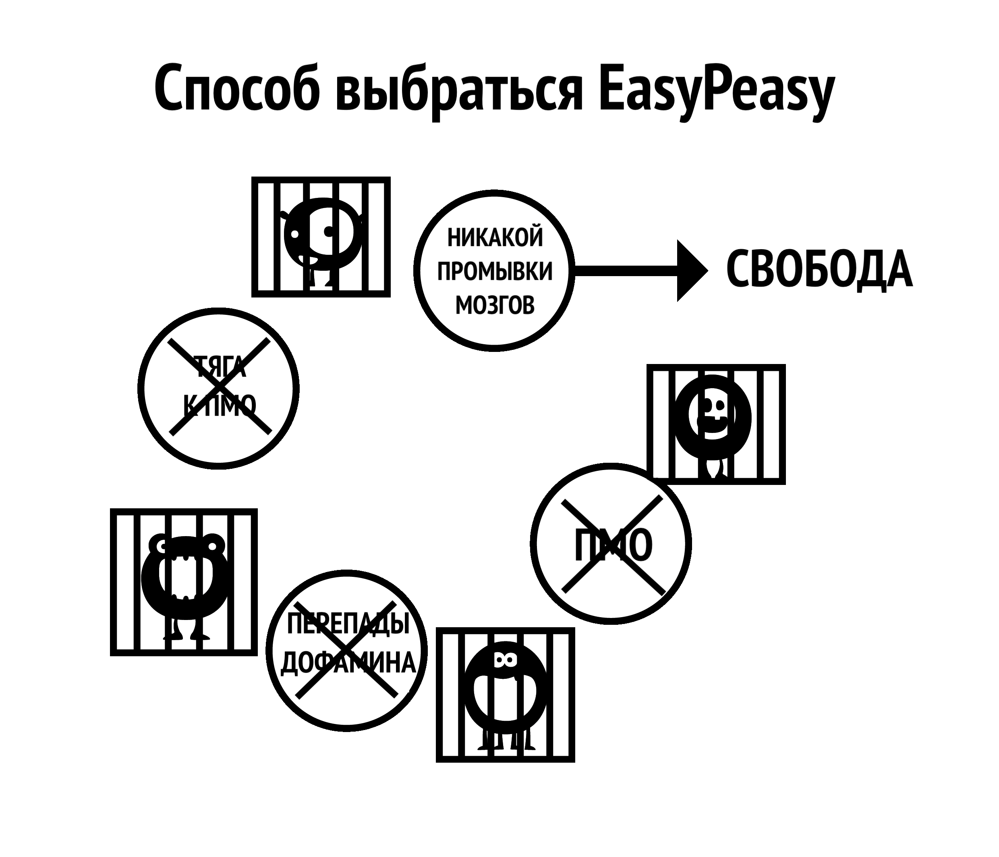

# Аспекты промывки мозгов

Большой монстр порноловушки порожден совокупностью многих факторов, включая общественные: огласка в СМИ, сверстников и мышление самого пользователя. Неспособность деконструировать эти заблуждения при использовании метода силы воли в конечном итоге приводит к чувству лишения, что снова загоняет пользователя в ловушку. Деконструкция воображаемой ценности порнографии имеет решающее значение для успеха и позволяет увидеть, где вас обкрадывают!

Важно увидеть связь между промыванием мозгов и страхом. Именно страх перед будущей **ломкой от абстинентного синдрома** порождает эту ломку. Страх -- это сам страх. Вспомните, когда у вас были симптомы абстиненции, такие как потные ладони, одышка, проблемы со сном и неспособность мыслить здраво. Теперь подумайте о похожих ситуациях, когда вы испытывали подобные чувства: собеседование при приеме на работу, нервное напряжение рядом с привлекательным человеком, публичное выступление и т.д. Это те же самые тревожные чувства, которые вызывает страх. Проще говоря, разве физический наркотик может действовать на человека спустя несколько месяцев после прекращения употребления? Должно быть, это психологические причины, верно?

## Стресс

Не только большие трагедии в жизни, но и незначительные стрессы приводят пользователей в запретную, ранее исключенную "небезопасную" зону. К стрессам относятся общение, телефонные звонки, переживания домохозяйки из-за маленьких детей и многое другое. Возьмем в качестве примера телефонные звонки, особенно для бизнесмена. Большинство звонков -- это не довольные клиенты или поздравления вашего босса, это всегда какой-то кризис. Возвращение домой к обыденной семейной жизни, состоящей из криков детей и требований эмоционального партнера, заставляет пользователя, если он ещё этого не делал, делать то, что он делает -- фантазировать об облегчении от порно, обещанном этой ночью. Они бессознательно страдают от абстинентного синдрома, их способность к расслаблению ослаблена и одни не готовы к дополнительному обострению внутреннего состояния. Частичное снятие острых ощущений одновременно с обычным стрессом приводит к снижению общего стрессового фона, и пользователь получает временный заряд бодрости. Это не иллюзия, пользователь действительно чувствует себя лучше, чем раньше, но всё равно он более напряжен, чем если бы он не был пользователем.

Следующий пример не для того, чтобы шокировать вас -- EasyPeasy не об этом -- но он нужен, чтобы подчеркнуть, что порно именно разрушает ваши нервы, а не расслабляет их.

Попробуйте представить, что вы дошли до стадии, когда не можете возбудиться даже с очень сексуальным и привлекательным партнером. На мгновение сделайте паузу и попытайтесь представить себе жизнь, в которой очень милый и обаятельный человек, чтобы привлечь ваше внимание, вынужден соревноваться с виртуальными порнозвездами из вашего "гарема" и терпеть поражение. Представьте себе душевный настрой человека, который, получив такое предупреждение, продолжает употреблять и умирает, так и не занявшись настоящим сексом с этим очаровательным и готовым к этому партнером. Легко счесть таких людей чудаками, но подобные истории не вымысел -- это то, что ужасная новизна порнонаркотика делает с вашим мозгом. Чем дальше вы идете по жизни, тем больше мужества высасывается из вас и тем больше вы заблуждаетесь, полагая, что порно делает все наоборот.

Вас когда-нибудь охватывала паника, когда ни с того ни с сего переставал работать или слишком медленно работал WiFi? Аналогичное чувство паники испытывают пользователи порно когда к нему нет доступа, в то время как непользователи не страдают, потому что это чувство паники как раз порно и вызывает. По мере того как вы идете по жизни, оно систематически разрушает ваши нервы и мужество, оставляя DeltaFosB формировать мощные нейронные водные горки, постепенно уничтожая вашу способность сказать "нет". На стадии, когда мужественность убита, пользователь считает порно своим новым партнером и не может смотреть на жизнь без него.

*Интернет-порно не расслабляет ваши нервы, а медленно разрушает их*. Одним из главных преимуществ избавления от зависимости является возвращение вашей естественной уверенности в себе и своих силах.

Не нужно оценивать себя по способности удовлетворить партнера -- это не свобода. Но эту свободу нельзя получить, продолжая смазывать дофаминовую водную горку способами, которые подрывают ваше счастье и либидо, повторяя одно и то же деструктивное поведение.

## Скука

Если вы такой же человек, как и многие другие, то стоит вам забраться в постель, позабыв обо всём на свете, вероятно, вы уже находитесь на своем любимом порносайте. Это вошло в привычку. Собственно говоря, то, что порнография избавляет от скуки -- это ещё одно заблуждение, потому что скука -- это состояние ума, возникающее, когда вы долгое время были лишены секса или пытаетесь от него воздерживаться.

На самом деле ситуация такова: когда вы зависимы от сверхнормальной тяги интернет-порно, а затем пытаетесь воздерживаться, возникает ощущение, что чего-то не хватает. Если у вас есть чем занять ум, что не вызывает стресса, вы можете долгое время не беспокоиться об отсутствии наркотика. Однако когда вам скучно, и вам нечем отвлечься, вы кормите монстра. Когда вы потакаете себе и не пытаетесь остановиться или сократить употребление, даже открытие браузера в режиме инкогнито становится подсознательным. Этот ритуал происходит автоматически; если пользователь попытается вспомнить сеансы за последнюю неделю, он сможет вспомнить лишь небольшую их часть, например, самый последний или сеанс после длительного воздержания.

Правда в том, что порно косвенно усиливает скуку, потому что после оргазма вы испытываете вялость, и вместо того, чтобы заняться энергичной деятельностью, пользователи предпочитают бездельничать, скучая и снимая абстинентный синдром. Противодействие промыванию мозгов очень важно, потому что пользователи склонны смотреть порно, когда им скучно, наш мозг настроен на то, чтобы воспринимать порно как что-то интересное. Точно так же нам промыли мозги, внушив, что секс -- даже плохой -- помогает расслабиться. Об этом уже упоминалось в главе о природе человека, вы помните? Часто, когда парам грустно или они находятся в состоянии стресса, они хотят заняться сексом. После обычного секса понаблюдайте, как быстро вы захотите отстраниться друг от друга после достижения принудительного оргазма. Если бы пара просто решила обняться, поговорить или поваляться-пообниматься и лечь спать, они бы почувствовали большее облегчение и связь.

## Концентрация

Мастурбация и секс не способствуют концентрации -- когда вы пытаетесь сосредоточиться, вы автоматически пытаетесь избежать отвлекающих факторов. Поэтому, когда пользователь хочет сосредоточиться, он даже не думает -- автоматически открывает браузер в режиме инкогнито, кормит маленького монстра и частично избавляется от тяги. Он продолжает заниматься текущими делами, уже забыв о том, что смотрели порно. После нескольких лет заливания дофамином неврологическим изменениям подверглись такие способности, как работа с информацией, планирование и контроль импульсов.

Вы также вынуждены обеспечивать новизну для следующего сеанса, поскольку один и тот же материал уже не вызывает достаточного количества дофамина и опиоидов. Поэтому вам придется бродить по закоулкам Интернета в поисках новизны, борясь с тягой к шокирующим материалам, что, в свою очередь, вызывает еще больший стресс и оставляет вас неудовлетворенным после завершения.

На концентрацию внимания также негативно влияет то, что дофаминовые рецепторы истощаются из-за естественной толерантности к большим всплескам, снижая эффект от меньших дофаминовых всплесков от естественных триггеров. Ваш уровень концентрации и вдохновения значительно повысится, так как это влияние уменьшится. Для многих именно аспект концентрации мешает им добиться успеха с помощью метода силы воли: они могут смириться с раздражительностью и плохим настроением, но неспособность сосредоточиться на чем-то важном после того, как их костыль убран, губит многих.

Потеря концентрации, которую испытывают пользователи при попытке освободиться от зависимости, не связана с отсутствием секса, тем более порно. Когда вы зависимы от чего-то, у вас возникают ментальные блоки, а когда у вас возникает психологический барьер, что вы делаете? Вы открываете браузер (что не убирает барьер) и что вы делаете потом? Вы возвращаетесь к тому, что и должны были делать, просто продолжая, как это делают те, кто не употребляет.

Если вы являетесь пользователем, скорее всего вы с этим ничего не связываете: у пользователей никогда не бывает *сексуальной дисфункции*, только периодические простои. Как только вы прекращаете использовать порно, во всем, что идет не так, вы вините, именно прекращение. Теперь, когда у вас возникает психологический барьер, вместо того, чтобы просто взяться за дело, вы начинаете говорить: "Если бы я только мог наведаться в свой гарем сейчас, это решило бы все мои проблемы". Затем вы начинаете сомневаться в своем решении освободиться от рабства зависимости, бросив порно.

Если вы верите, что порнография действительно помогает сосредоточиться, беспокойство по этому поводу гарантирует, что вы не сможете сосредоточиться. Именно сомнение, а не физическая ломка, создает проблему. Всегда помните, что страдает именно пользователь, а не непользователь.

## Релаксация

Большинство пользователей считают, что порнография помогает им расслабиться. Это не так. Бешеный поиск удовольствия в "темных закоулках интернета" и внутренняя борьба за то, чтобы не сорваться с цепи и не перейти красную черту, совсем *не похожи* на расслабляющее занятие.

Когда наступает ночь после поездки в новое место или долгого дня, мы садимся отдохнуть, утоляем голод, жажду и полностью удовлетворены. А вот пользователь -- нет, поскольку у него есть ещё один голод, который нужно утолить. Пользователи считают порнографию глазурью на торте, но на самом деле это "маленький монстр", которого нужно кормить. Правда в том, что наркоман никогда не может быть полностью расслаблен, а в его жизни всё становится хуже. Возьмем один комментарий в Интернете от бывшего пользователя:  

> "*Я действительно верил, что в меня вселился злой демон, теперь я знаю, что так оно и было, однако это был не какой-то врожденный изъян в моем характере, а маленький монстр интернет-порно, который создавал проблему. В те времена я думал, что на меня свалились все проблемы в мире, но когда я оглядываюсь назад на свою жизнь, я удивляюсь, где был весь этот большой стресс. Всё остальное в моей жизни было под моим контролем, единственное, что контролировало меня, -- это порнографическое рабство. Самое печальное, что даже сегодня я не могу убедить своих детей, что именно рабство было причиной моей раздражительности.*"

Каждый раз, когда я слышу, как порнозависимые люди пытаются оправдать свою зависимость, они говорят: "*О, это помогает мне расслабиться*". Возьмите интернет-рассказ отца-одиночки, чей шестилетний сын после страшного фильма на ночь хотел побыть с папой и лежать с ним в кровати, но отец отказался, потому что ему нужно было провести порносеанс и расслабиться на несколько часов.

Вот еще одна аналогия с курением: пару лет назад органы по усыновлению пригрозили запретить курильщикам усыновлять детей. Один мужчина позвонил и возмутился. "*Вы совершенно не правы*, -- сказал он, -- *я помню, как в детстве, если мне нужно было обсудить с матерью спорный вопрос, я ждал, пока она закурит сигарету, потому что тогда она была более расслабленной*". Почему же тогда мужчина не хотел говорить с матерью, когда она не курила?

Почему некоторые пользователи испытывают такой стресс, что им не удается получить удовольствие даже после реального секса? В одной из историй, опубликованных в Интернете, рассказывается о мужчине, работающем в сфере рекламы, у которого в любое время были открыты 9-ки и 10-ки для свиданий, но он потерял интерес к тому, чтобы приглашать их на ужин, поскольку интернет-порно было намного проще, не требовало расходов на ресторан и не было возможности получить "нет" от своей спутницы в конце вечера. Зачем беспокоиться, если его маленький монстр постоянно жаждет схем с низким риском и высоким вознаграждением, которые находятся у него под рукой по возвращении домой?

Почему тогда непользователи полностью расслаблены? Почему пользователи не могут расслабиться без наркотика в течение дня или двух? Почитайте об опыте пользователя, давшего клятву воздержания и бросившего, и вы заметите, как он борется с искушениями: он явно не расслабляется, когда ему больше не позволяют получать "единственное удовольствие", которым он "имеет право наслаждаться". Они забыли, что такое быть полностью расслабленными. Порно можно сравнить с мухой, попавшей в кувшинку: сначала муха питается нектаром, но на каком-то этапе растение незаметно начинает поедать муху.

Не пора ли вам вылезти из мухоловки?

## Энергия

Большинство пользователей знают о связанной с поиском новизны и эскалации прогрессирующем воздействии порнографии на систему вознаграждения и сексуальную систему их мозга. Однако они не знают, как это влияет на их уровень энергии.

Одна из тонкостей порноловушки заключается в том, что её воздействие на нас, как физическое, так и психическое, происходит настолько постепенно и незаметно, что мы не осознаем этого и считаем отказ от нее нормальным явлением. Это похоже на расстройства в питании: мы смотрим на людей с огромным избыточным весом и удивляемся, как они могли позволить себе дойти до такого состояния. Это не так, но представим, что это могло произойти за одну ночь: вы легли спать подтянутым, с накачанными мышцами, ни унции жира на теле, а проснувшись, обнаружили себя толстым, пузатым и заплывшим жиром. Вместо того чтобы проснуться отдохнувшим и полным энергии, вы чувствуете себя несчастным, вялым и едва можете открыть глаза.

Вас охватит паника, вы будете гадать, какой ужасной болезнью вы заразились за одну ночь, а ведь болезнь точно такая же. Тот факт, что вам потребовалось двадцать лет, чтобы добраться до текущего момента, не имеет никакого значения. С порно всё то же самое: если бы можно было немедленно перенести ваш разум и тело в другое место, чтобы вы могли напрямую сравнить, как бы вы себя чувствовали, прекратив заниматься порно всего на три недели, это было бы всё, что нужно, чтобы убедить вас. Вы бы спросили себя, действительно ли вам будет так хорошо, или, что на самом деле равносильно вопросу: "Неужели я опустился так низко?". Вы почувствовали бы себя не только более здоровым, с большим количеством энергии, но и более уверенным в себе и с повышенной способностью к концентрирации.

Отсутствие энергии, усталость и всё, что с этим связано, с удовольствием замалчивается как "старение". Друзья и коллеги, которые также ведут малоподвижный образ жизни, ещё больше усугубляют нормализацию такого поведения. Вера в то, что энергия -- исключительная прерогатива детей и подростков, а старость начинается в двадцать лет, -- ещё один симптом промывания мозгов, равно как и неосведомлённость о правильном питании и культуре физических упражнений в результате усугубляющего воздействия десенсибилизации дофамином.

Вскоре после освобождения от порнографии туманное и удушливое состояние покинет вас. Дело в том, что с порнографией вы постоянно расходуете свою энергию и в этом процессе нарушаете химию своей лимбической системы. В отличие от отказа от курения, где восстановление физического и психического здоровья происходит лишь постепенно, отказ от порно дает отличные результаты с первого дня. Убийство "маленького монстра" и закрытие водных горок занимает немного времени, но восстановление центра вознаграждения не сравнится с медленным скатыванием в яму. Если вы пойдёте путём силы воли, вы обрекаете себя на травму, любой прирост здоровья или энергии будет сведен на нет депрессией, через которую вы пройдете. К сожалению, EasyPeasy не может мгновенно перенести вас в свое сознание через три недели, но вы можете! Вы инстинктивно понимаете, что всё, что вам говорят, правильно, вам нужно только **использовать свое воображение!**

## Сессии перед выходом в социум

Это дезинформация, которая вроде бы имеет смысл, но на самом деле не имеет. Для того чтобы контролировать свой аппетит, вы будете есть дома, прежде чем отправиться в ресторан или на вечеринку? Именно так вы поступаете с сеансами перед светскими вечерами, выглядя там усталым и не на высоте. Повсеместное распространение техники пикапа привело к тому, что на вас стало оказываться давление, заставляющее вас выступать, пикапить и набирать очки. Попытки заглушить свою неуверенность порнографией только усугубят проблему в долгосрочной перспективе. Лично мне нравится легкое беспокойство, чтобы оставаться сосредоточенным и вовлеченным, а изнурение себя умственно и физически с помощью оргазма никак не поможет.

Просмотр порно перед важными встречами или событиями обусловлен двумя или более из наших обычных причин поиска удовольствия/размножения, а социальные функции по своей сути являются одновременно стрессовыми и расслабляющими. Это может показаться противоречием, но любая форма общения может быть стрессовой, даже с друзьями, когда хочется быть самим собой и полностью расслабиться. Существует множество случаев, когда одновременно присутствует несколько факторов, возьмем, к примеру, вождение автомобиля, ведь, в конце концов, на кону стоит ваша жизнь. Это стресс, требующий концентрации внимания в течение длительного времени. Вам не нужно осознавать эти факторы, ваше подсознание уже получило сообщение. Точно так же, когда вы застреваете в пробках или скучаете во время долгой езды по шоссе, вас занимает обещание провести сеанс, когда вы доберетесь до дома.

Другой хороший пример: вы идете на первое свидание, и ваш разум задаётся вопросами о человеке, с которым вы собираетесь встретиться. Затем, если ваш энтузиазм начнет угасать при встрече с человеком во плоти, вы начнете чувствовать себя слишком расслабленным, а затем испытывать вину за то, что так себя чувствуете. Начинается перетягивание каната: "*Я хочу секса или заберите меня отсюда как можно скорее*", подталкивая вас к использованию порнографии после свидания.

Даже если свидание прошло хорошо и через несколько часов вы поехали к нему/к ней, как бы всё ни прошло, вы не будете удовлетворены, ведь ваша главная цель -- оргазм. Иной раз вы едете домой в одиночестве, и вместо того чтобы поздравить себя за усилия, вы думаете о своём онлайн-гареме. Можете не сомневаться, у кого-то в подобной ситуации по приезде домой точно будет порносеанс. И часто, именно после таких ночей, по которым кто-то будет скучать больше всего, мы, просыпаясь с ощущением тревожной пустоты, задумываемся о прекращении порнографии. Мы думаем, что жизнь уже никогда не будет приятной. На самом деле, работает тот же принцип: сеансы просто обеспечивают облегчение абстинентного синдрома, каждый раз смазывая водные горки для следующего раза.

Четко уясните себе: особенными являются не интернет-порно и обитатели гаремов, а события в вашей жизни. Когда потребность в порно будет устранена, такие моменты станут более приятными, а стрессовые ситуации -- менее напряженными.

