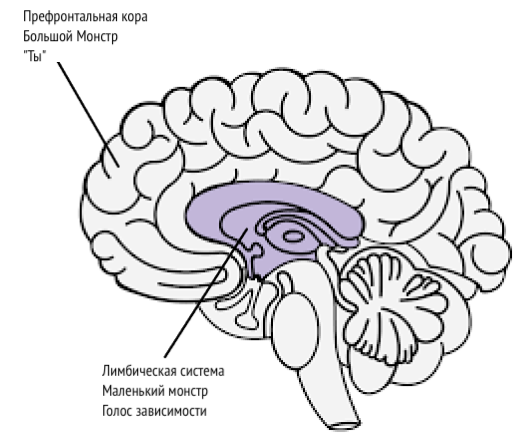

# Источники {-}

[Meditations of a Porn Addict](../resources/meditations.pdf) - Guillaco

[EasyPeasy Statements Checklist](https://pastebin.com/dybv6qkD) - SWATxKATS

[9 Minute Meditation](https://www.youtube.com/watch?v=tw7XBKhZJh4) - Sam Harris

[Waking Up Meditation Course](https://wakingup.com) - Sam Harris

[Exiting Modernity](https://meta-nomad.net/exiting-modernity) - Meta Nomad

[Letter I'm sending to schools](../resources/principal.pdf)

[Freedom Forever (PMO Hacknotes)](https://sites.google.com/view/freeforever/home)

[Why you're relapsing - u/Different_Guide_5205](https://old.reddit.com/r/pmohackbook/comments/mynwjl/why_youre_relapsing/)

[Countering Fear - u/Different_Guide_5205](https://old.reddit.com/r/pmohackbook/comments/n5027n/countering_fear/)

## Помогающие установки из рационально-эмоционально-поведенческой терапии {-}

- *"Я могу прекратить ПМО, даже если это кажется "трудным". Это не очень сложно, и сколько бы трудностей ни было, это того стоит!"

- *"Если я буду продолжать игнорировать и не поддаваться своим позывам к ПМО, мне будет всё легче и легче противостоять им".

- *"Я могу полностью и безоговорочно принять себя -- да, даже со всеми моими недостатками и неудачами."*

- *"ПМО, кажется, быстро облегчает мои проблемы, но на самом деле делает всё ещё хуже".

- *"Временами мне очень хочется утопить свои проблемы в ПМО, но это никогда не является хорошим поводом, как и не является решением проблем".

- *"Самое неприятное -- когда я не получаю, чего я очень хочу. Но это не ужасно и не страшно, если я не буду верить, что это так, я выбираю верить во что-то более реалистичное и полезное".

- *"Мне никогда не понравится несправедливость, но я, черт возьми, смогу это вынести и, возможно, буду строить планы и схемы, чтобы остановить её".

- *"Неважно, сколько раз я потерплю неудачу в этом важном деле, моя неудача никогда не сделает меня бездарной блохой. Это просто делает меня человеком, который, возможно, использовал не те методы".

- *"Я хочу быть выдающимся в своей работе, но я не обязан быть таким. Жаль, если это не так, но это не делает меня неполноценным. Я всегда могу продолжать стараться делать лучше просто так".

- *"Многие вещи могут вызвать во мне сожаление и разочарование, но когда я требую, чтобы этих вещей не существовало, я ввергаю себя в панику, гнев и депрессию".

- *"Да, мне часто не удавалось сделать то, что я обещал, но это не значит, что я не смогу или не захочу выполнить обещание на этот раз".

- *"Я чертовски ненавижу быть тревожным и подавленным, но я не буду и не обязан немедленно избавляться от этих чувств с помощью ПМО. Когда я занимаюсь ПМО, я временно ошибочно чувствую себя лучше, но лучше мне не становится. В долгосрочной перспективе ПМО делает все проблемы только хуже".

- *"Люди не злят меня тем, что плохо ко мне относятся. Я идиот, если разрешаю им выводить меня из себя плохим обращением, я идиот, если в своей голове требую от них лучшего поведения, они ведут себя наилучшим образом, на который способны".

## Сочетание EasyPeasy с методом Jack'a Trimpey Техника Распознавания Голоса Зависимости (AVRT) {-}

*Credit to az#8773 on Discord*

Эта статья для тех, кто терпит неудачу в использовании метода Аллена Карра "Easyway" для выздоровления от зависимости, несмотря на полное устранение промывания мозгов. Я собираюсь предположить, что все, кто читает эту статью, читали книги Аллена Карра и поняли его метод Easyway (он же Easypeasy). Если нет, я настоятельно рекомендую это сделать. Вам также будет полезно прочитать "Рациональное восстановление" Джека Тримпи (‘Rational Recovery’ by Jack Trimpey). Если вы ещё не читали эту книгу, никаких проблем, сейчас я расскажу об основах метода, но я все равно рекомендую прочитать её, потому что в ней будет гораздо больше подробностей, чем у меня. Эта статья не направлена на какую-то одну конкретную зависимость и поэтому может быть применима к любой зависимости. Цель этой статьи -- сравнить Easyway с другим успешным методом борьбы с зависимостями, который называется "Техника Распознавания Голоса Зависимости" (AVRT), и объединить эти два метода. Хотя я считаю, что Easyway намного превосходит все другие методы избавления от зависимостей, я верю, что понимание AVRT также может стать недостающим звеном для тех, кто терпит неудачу, используя Easyway, несмотря на успешное убийство большого монстра.

Существует множество конкурирующих методов преодоления зависимости, каждый из которых имеет разный процент успеха. Я не буду упоминать ни один из них, потому что большинство из них -- пустая трата времени, я хочу сделать эту книгу как можно короче. Единственные методы, о которых я собираюсь написать, это Easyway Аллена Карра и AVRT Джека Тримпи (основателя Rational Recovery). Оба метода имеют чрезвычайно высокий процент успеха, но каждый из них направлен на разные вещи. Easyway и AVRT похожи тем, что Easyway разделяет зависимость на "маленького монстра" и "большого монстра", а AVRT разделяет ваш разум на "голос зависимости" (он же "зверь") и "вас". Голос зависимости и маленький монстр -- это одно и то же, а большой монстр (он же промывание мозгов) -- это система убеждений, которой вы придерживаетесь и которая заставляет вас думать, что ваша зависимость дает вам какое-то преимущество или поддержку. Easyway фокусируется на устранении большого монстра, не обращая внимания на маленького монстра, в то время как AVRT фокусируется на маленьком монстре, не обращая внимания на большого монстра. В то время как Easyway уничтожает психологическую зависимость, AVRT учит вас распознавать физическую зависимость, маскирующуюся под вас, и отделять себя от нее. Мне кажется интересным, что и Easyway, и AVRT имеют очень высокий процент успеха, несмотря на то, что нацелены на противоположные вещи.

Хотя я верю, что Easyway намного превосходит все другие методы избавления от зависимости, и хотя я рекомендую его в первую очередь, я могу найти в нем два небольших изъяна. Во-первых, я считаю, что маленький монстр недооценивается. Я хочу избежать использования личных примеров в этой статье, но из моего опыта и опыта других людей кажется, что некоторые из нас терпят неудачу в Easyway не потому, что мы не смогли полностью избавиться от большого монстра (хотя это может случиться и случается), а потому, что мы недооценили маленького монстра. Маленький монстр не является проблемой для большинства людей, что объясняет высокий процент успеха Easyways, но для других, в том числе и для меня, он может стать проблемой. Вторая проблема заключается в том, что Easyway утверждает, что все неудачи являются результатом того, что мы либо не следуем инструкциям, либо не убиваем большого монстра.

Основная суть Easyway заключается в следующем. Зависимость состоит из двух компонентов: физическая зависимость от дофамина и психологическая зависимость, состоящая из убеждений (промывание мозгов), что ваша зависимость дает вам какое-то удовольствие или костыль. Эти компоненты называются "маленький" и "большой" монстры соответственно. Согласно Easyway, маленький монстр -- это пустое, слегка неуверенное чувство, которое едва ощутимо. Как только вы уничтожите большого монстра, отменив промывание мозгов и узнав, что ваша зависимость не имеет никаких преимуществ, что любое мнимое удовольствие или костыль - это всего лишь иллюзия, и, что не менее важно, что нет ничего страшного в жизни без вашей зависимости, тяга исчезнет. Тяга возникает из-за вашего страха, что жизнь без вашего маленького костыля будет невыносимой, что заставляет вас сомневаться в том, что вы бросите, что и является тягой. Вы преодолеваете страх, осознавая, насколько приятнее будет ваша жизнь без зависимости, и сохраняете это чувство восторга.

И хотя я считаю, что это лучший метод для избавления от зависимости, он не делает акцент на маленьком монстре, потому что в теории, когда о большом монстре позаботятся, беспомощный бессильный маленький монстр просто увянет и умрет сам по себе, и в любом случае он почти незаметен, так что кого это волнует. Маленький монстр может быть незначительным для многих людей, но, судя по моему собственному опыту и опыту других людей, это не всегда так. Когда люди терпят неудачу с Easyway, согласно Easyway, есть только 2 возможные причины: либо вы не следовали инструкциям должным образом, либо вы не смогли убить большого монстра. Я считаю, что это неправильно, и позже объясню почему.

Техника распознавания аддиктивного голоса (AVRT) разделяет мозг на две части: нижний мозг (лимбическая система), где находится ваша зависимость, и высший мозг (префронтальная кора), где находитесь вы (или, по крайней мере, ваши мысли и эго). Джек Тримпи называет голос зависимости "звериным", потому что он живет в животной части нашего мозга и знает только одно: "Я ХОЧУ ЭТО И ХОЧУ ЭТО СЕЙЧАС". Я сам не считаю полезным представлять его в виде зверя, но, полагаю, это лучше, чем верить, что это вы. Голос зависимости (AV, маленький монстр) перехватывает ваш мысленный голос и использует его против вас, чтобы заставить вас потакать своей зависимости. Ему приходится так делать, потому что он не может сам контролировать ваши двигательные функции. Попробуйте сделать это прямо сейчас: поднимите руку перед лицом и пошевелите пальцами. Теперь попросите свою зависимость сделать то же самое. Она не сможет. Это означает, что в действительности вы контролируете ситуацию.

AV не только перехватывает ваш мысленный голос, но и обманчиво прячется за местоимением "я". Он говорит: "Мне бы сейчас не помешало Х", "Я скучаю по Х", "Разве не было бы здорово сделать Х прямо сейчас, ведь я заслужил это после сегодняшнего дня". AVRT подчеркивает тот факт, что вы не являетесь вашим голосом, вызывающим зависимость, просто вам так кажется. Когда вы распознаете AV как не себя и скажете ему "нет", он перестанет говорить "я" и начнет использовать "ты", "мы" или "мы". Это доказательство того, что это не вы.

Когда вы говорите "Нет" своему AV, происходит следующее:
"Мне бы сейчас не помешал Х" превращается в "Да ладно, тебе бы сейчас не помешал Х, и ты это знаешь". "Мне определенно не хватает Х" превращается в "Да ладно, тебе определенно не хватает Х, разве ты не чувствуешь?". "Разве не было бы здорово сделать Х прямо сейчас, в конце концов, я заслужил это после сегодняшнего дня" превращается в "Мы заслужили сделать Х прямо сейчас после всего, через что мы прошли, как ты можешь отказывать нам в этом?".

На этом этапе я должен кое-что прояснить. Это не то "перетягивание каната", о котором говорит Аллен Карр. Перетягивание каната" -- это когнитивный диссонанс, когда у вас есть две или более противоречивые системы убеждений, и это результат того, что вы не убили большого монстра. "Я действительно не хочу делать Х из-за негативного эффекта, который он мне дает, но в то же время я хочу сделать Х, потому что X мне что-то даёт". Это перетягивание каната и есть действия большого монстра. Как только большой монстр будет убит путем устранения промывания мозгов, единственные голоса, говорящие вам заниматься своей зависимостью, будут исходить от маленького монстра (AV). Поскольку AV использует местоимение "я", становится возможным спутать AV с большим монстром.

Также важно отметить, что AV -- большой лжец. Его единственная забота -- получить дофамин любой ценой. Ваш AV попытается убедить вас подвергать себя потенциально смертельно опасному риску, если это позволит получить дофамин.

Ранее я говорил: "Когда люди терпят неудачу с Easyway, согласно Easyway, есть только 2 возможные причины: либо вы не следовали инструкциям должным образом, либо вы не смогли избавиться от большого монстра. Я считаю, что это неправильно, и позже объясню почему". Я считаю, что это вредно, потому что неспособность распознать AV привела меня и других, кто использовал Easyway, к ложному убеждению, что мы не полностью убили большого монстра, поэтому мы перечитываем книгу, чтобы попытаться убить промывание мозгов на этот раз окончательно, хотя мы это уже сделали. Неспособность распознать AV в сочетании с убеждённостью в том, что если мы потерпели неудачу с Easyway, значит, мы не смогли убить большого монстра, заставит снова направить усилия на большого монстра, хотя он уже побежден. Вы можете попасть в цикл повторного чтения книг Аллена Карра, продержаться некоторое время, а затем снова и снова срываться.

Когда AV говорит что-то вроде "Я хочу сейчас сделать X, потому что это даст мне Y", если вы устранили промывание мозгов и избавились от большого монстра, вы можете подумать: "Но я знаю, что это неправда, так почему же я все ещё об этом думаю? Неужели я не смог полностью избавиться от промывания мозгов". Правда в том, что вы устранили промывание мозгов, о чем свидетельствует факт, что вы прекрасно понимаете, что ваш AV говорит вам абсолютную чушь, просто вы думаете, что AV -- это вы, потому что он использует местоимение "я". Распознавание AV и принуждение его раскрыться, отказавшись от "я" в пользу "вы", "мы" или "нас", должно подтвердить вам, что это не большой монстр, а маленький монстр. Если бы это был действительно большой монстр, он не стал бы заменять "я" на "вы", "мы" или "нас".

Теперь, когда AV говорит: "Пожалуйста, можно мы просто сделаем Х еще раз, только еще один?", а вы отвечаете "Нет", вы можете почувствовать эмоциональную реакцию. Вы можете почувствовать страх или печаль. Очень важно понять, что это чувство исходит не от вас, а от него. Если вы не сможете распознать AV, вы будете думать, что эта эмоция исходит от вас, и будете более склонны уступить. Признайте AV и тот факт, что эмоции, исходящие от него, исходят не от вас, хотя вы их тоже чувствуете, затем почувствуйте радость от этого.

Если вы соедините оба этих метода вместе (при наличии такой необходимости, потому что не все люди испытывают проблемы с маленьким монстром) и будете поддерживать чувство радости и восторга всякий раз, когда распознаете AV, успех вам обеспечен.
