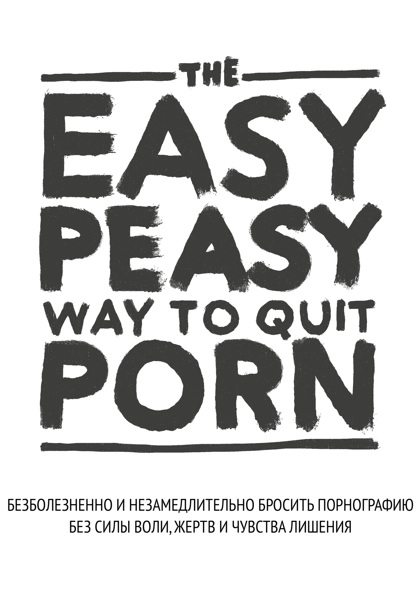

# Предисловие

{width=45% height=45%}

НЕ ПЕРЕПРЫГИВАЙТЕ ЧЕРЕЗ ГЛАВЫ

Эта книга с открытым исходным кодом поможет вам немедленно, безболезненно и навсегда перестать использовать порнографию, без силы воли, чувства лишения или жертв. Она не будет осуждать, причинять неловкость или давление на принятие болезненных мер.

Вообще говоря, нет никакой необходимости сокращать или уменьшать использование во время чтения; сокращение на самом деле вредно.

Вероятно, вы испытываете беспокойство от одной только мысли о прекращении использования порнографии или входите в число [миллионов](https://old.reddit.com/r/nofap) людей, которые активно [пытаются](https://old.reddit.com/r/pornfree) [бросить](https://yourbrainrebalanced.com) порнографию. Если это так, то то, что вы только что прочитали, противоречит всему, что вам когда-либо говорили. Однако, задайте себе вопрос: если бы то, что вам советовали, работало, читали бы вы вообще эту книгу?

Возможно, вы уже задавались следующими вопросами:

-   Тратите ли вы гораздо больше времени на просмотр порно, чем планировали изначально?

-   Удается ли вам прекратить или ограничить потребление порнографии?

-   Мешает ли просмотр порно, вашим личным или профессиональным обязательствам, увлечениям или отношениям?

-   Делаете ли вы всё возможное, чтобы скрыть своё потребление порнографии (например, удаляете историю браузера, лжете о просмотре порно)?

-   Просмотр порнографии вызывал серьезные проблемы в интимных отношениях?

-   Вы испытываете цикл возбуждения и удовольствия перед и во время просмотра порнографии, а затем чувства стыда, вины и раскаяния после?

-   Проводите ли вы значительное количество времени, думая о порнографии, даже когда не смотрите её?

-   Вызвало ли просмотр порнографии какие-либо другие негативные последствия в вашей личной или профессиональной жизни (например, невыполненная работа, плохая производительность, запущенные отношения, финансовые проблемы)?

Если вы пользователь порно и зависите от него *в любой мере*, используете его для мастурбации или секса или *по любой другой причине*, всё что вам нужно, это читать дальше.
Если вы здесь ради близкого человека, вам нужно убедить его прочитать эту книгу.
Но если вам не удастся убедить их, прочитайте книгу сами. Понимание метода поможет донести мысль и предотвратить начало зависимости у ваших детей. Не обманывайтесь тем, что у них нет доступа к порно сейчас -- у всех был доступ, прежде чем попасть на крючок.

## Об этой книге {-}

Эта книга является переработанной версией [издания](https://sites.google.com/site/hackbookeasypeasy
) книги *Allen Carr's EasyWay to Smoking* для порнографии, она является бесплатной и свободной и лицензирована под CC-BY-SA. Ее успех основан на том, что вы:

НЕ ПРОПУСКАЕТЕ ГЛАВЫ

Чтобы открыть кодовый замок, нужно ввести цифры в правильном порядке. Зависимость ничем не отличается.

А лично мне первоначальная версия [Google Sites](https://sites.google.com/site/hackbookeasypeasy) (написанная не мной) изменила жизнь. Если вы похожи на большинство людей: вы познакомились с порнографией в относительно молодом возрасте и с тех пор спокойно пользовались ею, пока не наткнулись на огромное количество -- правда, несколько отцензурированной -- литературы, предупреждающей об опасности. Как и я, вы, вероятно, преуспели в периодах воздержания разной продолжительности, но в конечном итоге всегда поддавались иллюзорным влечениям. Я рад сообщить, что этот метод работает совершенно иначе, и это единственный метод, который сработал.

Или, может быть, вы получили ссылку на эту книгу от заинтересованного лица и настроены скептически. Во-первых, спасибо, что вы хотя бы взглянули на нее. В ближайшее время мы расскажем об этом подробнее, но, пожалуйста, вспомните, когда вы впервые посмотрели порнографию. Ожидали ли вы, что будете возвращаться к порно всю оставшуюся жизнь? Согласно моим собственным неофициальным исследованиям по этому вопросу (я уговаривал друзей прочитать эту книгу), EasyPeasy одинаково эффективен как для нерегулярных пользователей порно, так и для людей с сильной зависимостью. Книга не очень длинная, но даёт высокий шанс на серьёзное приобретение, поэтому прошу вас, продолжайте читать.

Метод, описанный в этой книге, таков:

-   Он мгновенный.

-   Одинаково эффективен как для тяжелых, так и для случайных пользователей.

-   Не вызывает неприятных ощущений при абстиненции.

-   Не требует силы воли.

-   Не требует шоковой терапии, вспомогательных средств или уловок.

-   Не заставит вас заменить эту зависимость другими зависимостями, такими как переедание, курение или пьянство.

-   Навсегда.

Вам возможно будет невозможно поверить, но это мнение разделяют многие люди.

> *"Это основополагающий труд о порнозависимости"*
>
> --- Какой-то парень на reddit, которого я не могу найти, не думаю, что каламбур был намеренным ("seminal" -- по-английски означает и "основополагающий", и "сперматический").

> "*Я был зависим в течение 10 лет. Эти 10 лет я был искалечен депрессией, сомнениями, тревогой и страхом, что мой секрет раскроется. После каждого сеанса я ненавидел себя, а после каждого раза, как я сажал себя на порно-диету, я всё равно в мгновение ока скатывался вниз, как с водной горки. И всё же эта книга помогла мне остановиться. В прошлом я всегда оборонялся против порнографии. Теперь, после того как я дважды прочитал эту книгу, я перешел в наступление. Порно не имеет надо мной власти и теперь кажется нелепой шуткой.*"
>
> --- u/DeepNewt

> "*Несколько дней назад мне исполнилось 20 лет. Впервые за очень долгое время я провел свой день рождения свободным от ловушки порно, и все благодаря этой книге, на которую я случайно наткнулся всего несколько месяцев назад. До этого я потратил очень много времени, пытаясь завязать с порно традиционными способами. Я пережил столько внутренних потрясений и навсегда заклеймил себя как зависимого человека. Эта книга решила все эти проблемы. Если раньше я боялся, что не могу контролировать себя, даже победив маленького монстра, то теперь я могу гордиться, что мне больше не нужно быть зависимым.*
>
> *У меня нет причин писать это, просто я почувствовал, что мне нужно озвучить это где-то, кроме своей головы, потому что это так много для меня значит. Если вы читаете это и думаете о том, чтобы прочитать или порекомендовать эту книгу, поверьте мне, она работает лучше, чем любой другой метод. Мой главный совет -- делать заметки; звучит смешно, но это действительно помогло мне закрепить некоторые идеи.*"
>
> --- u/Suspicious_Web_4594

> "*база*"
>
> --- anon, /fit/

## Предупреждение

Если вы ожидаете, что в этой книге будут приведены различные проблемы со здоровьем, и они должны "напугать" вас так, что вы бросите (сексуальная дисфункция, включая эректильную дисфункцию, вызванную порнографией, ненадежное возбуждение, потеря интереса к реальным сексуальным партнерам, гипофронтальность мозга и ослепляющее обвинение в том, что это грязная, отвратительная привычка, а вы - глупая, бесхребетная, слабовольная медуза). Вы будете жестоко разочарованы. Эти тактики никогда не помогали мне бросить, и если бы они помогли вам, вы бы уже бросили.

Традиционные методы отказа от порнографии предполагают использование силы воли или методы замещения, так называемая "порно-диета", например "смотреть порно только раз в n дней" и другие варианты сокращения потребления. На некоторых сайтах перечисляются рецензируемые исследования о нейротрансмиттерах и нейропластичности, и несмотря на то, что эти сайты информативны, многие знают о риске для здоровья и предпочитают ничего не делать, хотя обычно избегают таких материалов. В конечном счете, они одинаково неэффективны, так как не устраняют причины, побуждающие к просмотру порнографии. В конечном счете, превращение чего-то в запретный плод - это не способ лечения зависимости.

Этот метод называется EasyPeasy, и он работает иначе. В некоторые вещи, о которых сейчас пойдет речь, возможно, трудно поверить, но к тому времени, когда вы закончите эту книгу, вы не только поймёте эти вещи, но и удивитесь, как вам вообще могли промыть мозги, заставив верить в обратное.

Существует распространенное заблуждение, что мы сами выбираем смотреть порно. Порнозависимые (да, именно зависимые) выбирают просмотр порно не больше, чем алкоголики выбирают стать алкоголиками или героиновые наркоманы выбирают стать героиновыми наркоманами. Это правда, что мы выбираем включить ноутбук или смартфон, запустить браузер и посетить наш любимый "онлайн-гарем". Время от времени я выбираю поход в кино, но я точно не выбирал провести всю свою жизнь в кинотеатре. Изначально меня привело туда любопытство и человеческая природа, но я бы не начинал, если бы знал, что стану зависимым, и это приведет к ухудшению моего здоровья, счастья и отношений. "*Ах, если бы я только узнал о сексуальной дисфункции во время моего первого посещения этого порносайта!"*

Подумайте, принимали ли вы когда-нибудь 'положительное' решение о том, что вам нужно/необходимо порно для мастурбации? Или что вам обязательны/необходимы вызванные порнографией фантазии, чтобы разнообразить секс с вашим партнером? Или что в отдельные периоды вашей жизни вы не можете наслаждаться хорошим сном или  просто провести вечер после рабочего дня без просмотра порно? Или что без него вы не можете сосредоточиться или справиться со стрессом? На каком этапе вы решили, что вам нужно порно, что оно постоянно присутствует в вашей жизни, что вы чувствуете себя неуверенно, даже панически боитесь остаться без порно, без вашего онлайн-гарема?

Как и любого другого пользователя порнографии, вас заманили в самую зловещую и изощренную ловушку, которую когда-либо придумывали человек и природа. Нет ни одного человека на свете, будь он сам пользователем или нет, которому бы нравилась мысль о том, что его дети используют порно для того, чтобы справляться с проблемами или получать удовольствие. Это означает, что все зависимые хотели бы никогда и не начинать. Это неудивительно: никому не нужно порно, чтобы наслаждаться жизнью или справляться со стрессом, пока он не подсел на него.

В то же время все пользователи хотят продолжать пользоваться. В конце концов, никто не заставляет нас запускать режим инкогнито в браузере. Понимают они причину или нет, но только пользователи решают постучаться в двери своих онлайн-гаремов.

Если бы существовала волшебная кнопка, нажав на которую пользователь мог бы проснуться на следующее утро, как будто он никогда не заходил на свой первый порносайт, единственными наркоманами были бы молодые люди, которые все еще 'экспериментируют'.

Единственное, что мешает нам бросить порнографию, -- это **СТРАХ!** Страх неизвестности, вызванный убеждением, что нам придется пережить неопределенный период страданий, лишений и неудовлетворенных желаний, чтобы освободиться от порно. Это порождается иррациональными убеждениями, как выученными, так и приобретенными, такими как:

-   Мастурбация или секс, приводящий к оргазму, -- *единственное* и *самое* важное в жизни.

-   Порно 'безопаснее', чем секс в реальной жизни, потому что порно не может меня отвергнуть.

-   Порно -- это познавательно и полезно.

-   Порно -- это получение "превосходного" сексуального опыта.

-   Больше -- лучше.

Эти иррациональные убеждения, если поступать в соответствии с ними, порождают иррациональные последствия:

-   Поклонение и одержимость, когда найдена девушка 'идеал 10/10'.

-   Восприятие себя как неудачника, если вы упускаете секс, как будто это самое важное в человеческом опыте.

-   Мысленное цепляние за идею идеальной девушки-10-ки.

-   Быть чрезмерно оценочным и критичным по отношению к потенциальным партнерам.

-   Заставлять себя заниматься сексом, вне зависимости от наличия желания.

Это страх, что ночь в одиночестве будет несчастной, будет проведена в борьбе с неконтролируемыми импульсами. Страх, что ночь перед экзаменами станет адом без порно. Страх, что мы никогда не сможем сосредотачиваться, справляться со стрессом или быть уверенными в себе без этого маленького костыля, что наша личность и характер поменяются.

Но более всего мы боимся того, что 'один раз наркоман -- навсегда наркоман': что мы никогда не будем полностью свободны и всю оставшуюся жизнь будем жаждать периодических оргазмов, вызванных порнографией. Если вы, как и я, уже испробовали все традиционные способы бросить порно и прошли через страдания и пытки 'метода силы воли', вы не только будете испытывать этот страх, но и будете убеждены, что никогда не сможете бросить.

Если вы боитесь, паникуете или чувствуете, что еще не пришло время бросить, позвольте вас заверить, ваши беспокойство и тревога не снимаются порнографией - они вызваны ею. Вы не решали попасть в порноловушку, но, как и все ловушки, она создана для того, чтобы вы в ней оставались. Спросите себя, когда вы смотрели первые порнографические фотографии и видео, решили ли вы тогда возвращаться к просмотру этих материалов всю оставшуюся жизнь? Когда же вы бросите? Завтра? В следующем году? Перестаньте обманывать себя! Ловушка создана для того, чтобы удерживать вас всю жизнь. Как вы думаете, почему все остальные наркоманы не бросают до того, как их 'убьёт' такой стиль жизни?

Я уже говорил о волшебной кнопке; EasyPeasy работает точно так же, как эта волшебная кнопка. Позвольте мне пояснить, что EasyPeasy -- это не волшебство, но для меня и для других людей, которые обнаружили, что бросить порно легко и приятно, это ощущалось именно так!

Предупреждение заключается в следующем:
Это парадокс курицы и яйца: каждый наркоман хочет бросить, и каждый наркоман может найти легкий и приятный способ бросить. Только **страх** мешает пользователям попытаться бросить. Самое большое достижение -- избавиться от этого страха, но вы не избавитесь от него, пока не закончите книгу. Напротив, ваш страх может усилиться по мере того, как вы будете продолжать читать, что может помешать вам дочитать книгу до конца. Вот комментарий одной женщины.

***"Я только что закончила читать книгу EasyPeasy. Я знаю, что прошло только четыре дня, но я чувствую себя так замечательно, я знаю, что мне больше никогда не понадобится использовать порно. Я начала читать вашу книгу пять месяцев назад, дошла до половины и запаниковала. Я знала, что если продолжу читать, то должна буду бросить. Это ли не глупость?"***

Вы не сами решили попасть в эту ловушку, но четко осознайте: вы не выберетесь из нее, пока не примете твердое решение сделать это. Возможно, вы уже рвётесь в бой, чтобы скорей бросить порно, или вас пугает сама мысль об этом, но в любом случае имейте в виду: **ВАМ НЕЧЕГО ТЕРЯТЬ!**

Если в конце книги вы решите, что хотите продолжать использовать порно для мастурбации или секса, никто не помешает вам это сделать. Вам даже не придется сокращать или прекращать использование порнографии во время чтения книги, и помните, что у нас здесь нет никакого шокового лечения. Наоборот, у меня для вас только хорошие новости. Можете ли вы представить, как чувствовал себя Энди Дюфрейн, когда наконец-то сбежал из Шоушенка? Именно так чувствовал себя я, когда вырвался из порноловушки, и именно так чувствуют себя бывшие пользователи, которые воспользовались методом EasyPeasy. К концу книги так будете чувствовать себя и вы! Дерзайте!

## И наконец... {-}

Каждый может легко и с удовольствием отказаться от порнографии, в том числе и вы! Все, что вам нужно сделать, это прочитать остальную часть этой книги с открытым сердцем; чем больше вы поймете, тем легче вам будет. Даже если вы не поймёте ни слова, но будете следовать инструкциям, вам будет легко. Самое главное, вы не будете всю жизнь корить себя за порнографию или чувствовать себя лишённым, а к концу книги единственной загадкой будет, почему же вы так долго этим занимались.

С EasyPeasy есть только две причины неудачи.

**Невыполнение инструкций.**
Некоторым покажется раздражающим, что книга так догматична в отношении некоторых рекомендаций, например, не пытаться сократить потребление или не использовать заменители. Я, конечно, не отрицаю, что есть много людей, которым удалось перестать пользоваться такими уловками, но они добились успеха вопреки, а не благодаря им. Некоторые люди могут заниматься любовью, стоя в гамаке, но это не самый простой способ. Правильный код для открытия кодового-замка этой ловушки есть в этой книге, но цифры нужно вводить в правильном порядке: переходя от одной главы к другой, ничего не пропуская.

**Непонимание.**
Не принимайте ничего на веру, подвергайте сомнению не только то, что вы прочтёте, но и свои собственные взгляды и то, что общество говорит вам о сексе, интернет-порно и зависимости. Например, те, кто считает, что это просто привычка, спросите себя, почему от других привычек -- некоторые из которых доставляют удовольствие -- легко отказаться, а от привычки, которая вызывает ужасные ощущения, тратит много энергии, времени и мужества, так трудно отказаться. Те, кто считает, что вам нравится порно, спросите себя, почему другие активности, бесконечно более приятные, вы можете принять или отказаться от них. Почему вам обязательно нужно порно, почему вы впадёте в панику, если у вас его не будет?

EasyPeasy собирается дать вам ответы на то, как легко и приятно бросить порно. Как и многие другие, одним из моих величайших жизненных триумфов стало избавление от порнографической ловушки. Не нужно чувствовать себя подавленным, наоборот, вы собираетесь получить то, чего хотел бы иметь каждый пользователь на планете: **СВОБОДУ!!**

**ПОМНИТЕ, НЕ ПРОПУСКАЙТЕ ГЛАВЫ.**

Некоторые термины перед тем, как начать:

***ПМО***: цикл порнографии, мастурбации и оргазма.
***Онлайн-гарем***: Сайты с порно при высокоскоростном Интернете.
***Пользователь порно***: В рамках этой книги -- человек, который смотрит порно.
***Промывание мозгов***: Убеждения, навязанные человеку обществом или придуманные самим человеком, которые приводят к заблуждениям и ошибочным мнениям. Авидья :)
***AV***: Addictive Voice -- голос зависимости.

## От переводчика

Оригинал этой книги пока что не очень хорошо структурирован, поэтому порой текст может действительно казаться непоследовательным, но это встречается только в паре мест, где объясняются конкретные примеры. Все важные идеи расписаны явно и точно. 

Главное, чтобы вы были открыты и восприняли все основные идеи.

Автор использует термин "porn user" для обозначения людей, смотрящих порно. По-русски мы могли бы сказать "любитель порно" или "человек, который смотрит порно", но это звучит коряво и не всегда точно передаёт суть. Поэтому, для большей конкретики, намеренно используется именно буквальный перевод: "пользователь порно".

"Brainwashing" -- это убеждения, навязанные человеку обществом или придуманные самим человеком, которые приводят к заблуждениям и ошибочным мнениям. "Промывание мозгов" -- дословный перевод этого термина, реже используемый на русском языке, чаще говорят "манипулирование сознанием" или "зомбирование". Кому-то более подходящими могут показаться слова "невежество", "непонимание", "иллюзия", "неведение", "недостаток понимания", "незнание истины", "неосознанность", "омрачённость сознания", "Авидья" в конце концов :)

Пока я переводил эту книгу, мне пришлось прочитать её 6 раз. И вы не поверите, но каждый раз я открывал для себя что-то новое. Совет перечитывать и делать заметки даётся не просто так. Буквально выписывайте важные моменты, формулируйте своими словами, сделайте всё, чтобы идеи из этой книги плотно обосновались у вас в голове, возможно для вас это сыграет решающую роль.

## Советы по чтению и небольше заключительные замечания

**Не читайте эту книгу как обычную книгу**, она очень короткая, и вы сможете закончить ее за пару часов. Большинству людей полезно *выделять или делать заметки*, и обычно рекомендуется **перечитать** ее несколько раз, чтобы полностью усвоить уроки.

Почему "Хакбук"? Потому что Аллен Карр давно ушел из жизни, а созданные им учреждения не лечат от порнозависимости. Я не получаю от этого никакой денежной или иной выгоды.

На протяжении всей этой книги я, автор оригинальной книги Hackauthor и Аллен Карр будем появляться в явном виде, чтобы предоставить вам уникальный и убедительный метод, позволяющий легко и безболезненно бросить порно.

**Хакбук:** Книга, основанная и взломанная на основе другой книги. Автор оригинала полностью признан. 

Для hackbook также существует ряд сообществ, но я бы рекомендовал заглянуть в них только после того, как вы закончите читать книгу.

[urbit](https://urbit.org) - ~mislyr-midnyt/coomer (now actually working!! best possible contact method, use this pls) | [coomer meme archive](https://coomer.org) | [analytics](https://plausible.io/easypeasymethod.org) | [matrix](https://matrix.to/#/!xmJZznbJXuwzEGSEti:matrix.org?via=matrix.org) | [discord](https://discord.com/invite/bCXEnf9) | [reddit](https://reddit.com/r/pmohackbook) | [feedback form](https://forms.gle/p7cTxowaNpKqgi5Z7)

Напоминание: **НЕ ПЕРЕСКАКИВАЙТЕ ГЛАВЫ**

Я бы пожелал вам удачи, но, как вы скоро узнаете, она вам не нужна. 

Good vibes,

Hackauthor²

{width=88 height=31}

This work is licensed under a [Creative Commons Attribution-ShareAlike 4.0 International License](https://creativecommons.org/licenses/by-sa/4.0/). Code is [GPLv3](https://gitlab.com/snuggy/easypeasy/-/blob/master/LICENSE).
