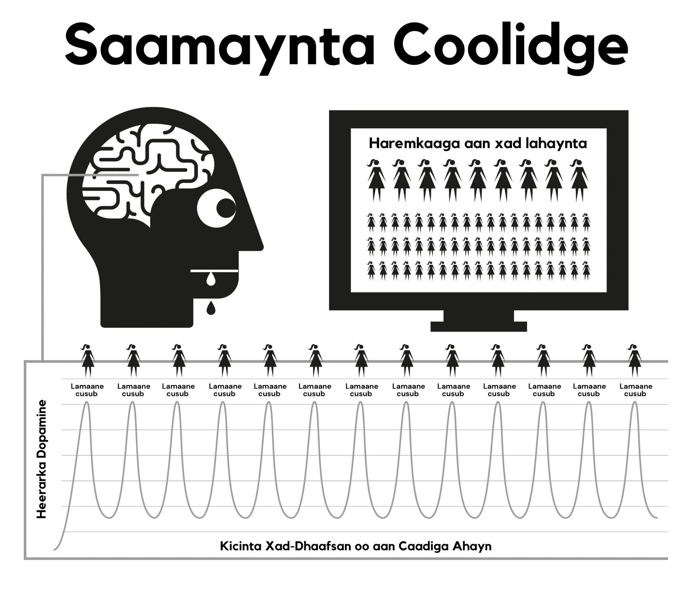

# Dabeecadda Porn

Porn waxay ku shaqaysaa afduubta nidaamyada abaalmarinta dabiicida maskaxdaada oo loogu talagalay inaad sii taranka ila iyo inta suurtogalka ah. Qaabka porn oo degdega ah oo aadka loo heli karo wuxuu ilaaliyaa nidaamka abaalmarinta maskaxda in oo soo saara dopamine si aad uga dheer inta caadiga oo suurtogalka ah. Cilmi ahaan, tan waxaa loo yaqaanaa *Saameynta Koolidge (Coolidge Effect),* oo laga yaabo inaadba ka warqabto.

Dopamine waa neurotransmitter oo ku xiran dareenka rabitaanka, isagoo opioids-ka soo saaraayo dareenka raaxada. Dopamine badan wuxuu keenaa opioids badan, iyo [opioids badan waxay keentaa] ficil badan. Dopamine la'aanteed, ficillada sida cunista uma dareemayaan inay raaxo leeyihiin, iyo taas waxay u horseedisaa in ficilka aan la dhammaystirin, iyadoo cuntooyinka dufanka oo sokorta badan ay so dayaan dopamine-ka ugu badan.

Laakin maskaxda waxay sidoo kale u soo daysaa dopamine-ka jawaab ahaanta wax cusub. Iyadoo porn-ka la heli karo ay u muuqta inay xaddi aan xad-lahayn tahay, tani waxay ku daadataa *nidaamka limbic-ga (wareegga abaalmarinta maskaxda)*, iyo sidaas darteed marka ugu horeya ee aad porn aragto, ficil ayaad sameynaysaa, adigoo orgasmgaraysid oo aad kicisid daadasho kale oo opioids ah. Iyadoo maskaxdaada ku dhiirigalinsan inay dompamine-ka ee suurtogalka ah ay hesho, maskaxda waxay script (qoraal) ahaan u kaydinay si ay si fudud u xasuusato, iyo waxay ku xoojinaysaa waddooyinka neerfaha sii daynta kiimiko oo loo yaqaano DeltaFosB. Hadda oo waddooyinka la xoojiyay, maskaxdu waxay jawaab ahaan u wacdaa waddooyinkaan tilmaamaha ay ka mid yihiin xayaysiisyada kacsi leh, waqti kaligaaga tihid, walbahaarka ama xataa dareenka inaad wax yar oo hoos u dhac ah, oo markaas si lama filaan ah aad diyaar u tahay inaad hoos u raacdo 'simbiriiriixanta biyaha'. Mar walba oo tan lugu cel-celiyo, DeltafosB ayaa si ka badan u soo daysmayso, oo markaas simbiriiriixanta biyaha oo inta ka badan nolol iyo simbiran u yeelanayso, iyadoo ka fudud badan inaad hoos u raacdo marka xigta.

Nidaamka limbic-ga wuxuu leeyahay nidaam is-saxid ah si loo yareeyo tirada daawadayaasha dopamine-ka iyo opioid-ka markuu dopamine-daadasho joogta ah oo maalinle ah uu ogaado. Nasiib darro, daawadayaashaan dopamine-ka ayaa sidoo kale loo baahan yahay si ay noogu dhiirigaliyaan si aan u xamilno culaysyada nolol maalmeedka. Tirrada dopamine-ka oo abaalmarinnada dabiiciga ah ay soo saarto looma barbardhigi karo tirrada oo porn keeni karto, iyo hadda daaweeyayaasha dopamine-ka oo yaraadeen si ka hufan uma nuugi karin, iyadoo u horseediso inaad sii aad inta caadi ahayn u dareentid walbahaar iyo xanaajis badan. Habkaan waxaa loo yaqaanaa **desensitization (dareen-yareesmo).**

Wareegaan gudahiis, waxaad ka gudubtay 'khadka caska' oo aad kicisay shucuur ay ka mid yihiin dembi, ceeb, karaahiyo, walwal iyo cabsi, taas oo kor u sii qaadaysa heerarka dopamine inta ka sare waxayna keentaa in maskaxda ay si khaldan dareenkaan u fasirto kacsiga galmada.

Waqtiga markuu dhaafo, ma aha oo kaliya in maskaxda ay ku dareen-yareesmato muuqaaladii hore ee la arkay, laakin sidoo kale waxay u dareen-yareesmanay noocyada porn oo la mid ah iyo heerarka naxtinta la mid ah. dhiirigalintaan oo ka hoose waxay kicisaa dareenka qanacsanaanta hoose iyadoo maskaxdeena ay ku hawlan tahay qiimeyn joogto ah, taasoo kugu riixaysa inaad hesho muuqaalada oo aad ku qanciso gaajadaa. Markaa waxaad raadisaa wax cusub, adigoo ku dhufanaysa muuqaalkaas naxdinta leh oo homepage-ka ku yeelo ee aad si kalsooni leh u sheegtay inaadan imaan doonin booqashadaada ugu horeysa. 

> *"Waayo, gudaha sayaxa waxyaalaha yaryarta, qalbiga waxay heshaa subaxnimadeed iyo way soo cusboontaa."*
>
> --- Kahlil Gibran

Dareen ammaan oo degdeg ah ayaa ah waxa kaliya ee loo baahan yahay si looga gudbo meel rafaadsan oo nolosha ah, laakin maskaxdaada oo dareen-yareesantay ma awoodi doontaa inay qabato dhibicda walbahaar-yareenta oo maskaxda qofka aan isticmaaleynin ay awood u leedahay inay isticmaasho?

Daadashada dopamine waxay la mid tahay daroog degdeg ah u waxaqabato, oo degdeg hoos u dhacdo iyadoo keento xanuun ka-noqosho. Isticmaalayaal badan waxay haystaan dhalanteedka in xanuunkaan uu yahay dhaawaca xun oo ay ka dhibaatoodaan markii la isku dayo ama lagu qasbaayo inay joojiyaan. Dhab ahaantii, xanuunka waxay ugu horeyn tahay maskaxiyan maadaama uu isticmaalaha dareemaayo in raaxadiis ama taageertiisa laga qaaday.

## Shaydaanka Yar

Ka-noqoshada kiimikada dhabta ah ee porn waa mid oo aad u qarsoodisan ee isticmaalayaasha intooda badani aya noolaayeen oo ay dhinteen iyagoo ogayn inay ahaayeen dad oo balwad leh. Isticmaalayaal badan waxay ka baqayaan daroogada, laakin taasi waa isla wixii oo ay yihiin, balwadaha daroogada. Nasiib wanaag, waa daroog oo fududaysan in la iska saaro, laakin waxaad kowdi u baahan tahay inaad aqbasho inaad, dhab ahaantii, tahay qof oo balwad leh. Ka-noqoshada porn ma keento wax oo xanuun jireed ah, waxayna kaliya tahay dareen maran, dareen nasasho la'aan in wax ay maqan tahay, taas oo ah sababta oo ay dad badan u aaminsan yihiin inay tahay wax oo ku xiran rabitaanka galmada. Isagoo dib u dhigan, dareenkaan wuxuu noqdaa walwal, kalsooni darro, kacsanaan, kalsooni hoose iyo xanaajin. Waxay la mid tahay qof oo sun u gaajo leh.

Ilbiriqsiga gudahiisa oo aad fadhi ka qayb qaadatid, dopamine ayaa la keenaa iyo damacaaga wuu dhammaadaa, taas oo keento dareen-fulin markaad hoos ugu sii dhacayso simbiriiriixanta biyaha. Maalmihii hore, xanuunada ka noqoshada iyo nafiskooda ku xiga waxay yihiin kuwa oo aad u yar ee ayaanan ka warqabin. Laakin runta waxay ahayd inaan awalba balwad noqonay laakin ma ogayn. Shaydaanka yar ayaa horeyba maskaxdeena ku dhex jiray, markaa mar iyo waqti ayaanu safar ku qaadanaynay simbiriiriixanta biyaha si aan u quudino.

Isticmaalayaasha oo dhan waxay u bilaabaan raadinta porn sababo oo caqli-gali ahayn. Sababta *kaliya* ee qof kastaa u sii wado isticmaalka porn, hadday ka mid yihiin isticmaalayaasha caadiga ah ama kuwa culusta, waa inay quudiyaan shaydaankaas yar. Wareerka dhan waa taxnee oo ciqaabo naxriis darro ah oo jahawareer leh, laakin waxaa laga yaabaa in dhinada ugu murugata badan ay tahay dareen-raaxaysiga ee isticmaalaha uu ka helo fadhiga porn, usaga oo isku dayaya inuu dib ugu soo laabto dareen-nabada, xasilloonida iyo kalsooniga oo jirkoodu haayay ka hore intaysan awalba la qabatimin.

## Buuqqa Dhib Badan

Ma ogtahay dareenka marka qaylo-dhaanta guriga ee deriska ay yeerayso maalintii oo dhan - ama dhib yar oo joogto ah - oo ay ka dib qaylada si lama filaan u joogsata oo aad dareento nabad iyo xasilooni oo kugu soo qulqulaya? Tani dhab ahaantii dareen nabad ma aha, laakin waa dhammaadka xanaajin. Intaanan fadhiga xiga bilaabin, jirarkeena way dhamaystiran yihiin, laakin waxaan markaas bilaabaynaa inaan maskaxdeena ku qasabno inay isku shubto dopamine iyo markaan dhammeeyno oo uu dopamine-ka bilaabo inuu naga baxo, waxaan la kulannaa xanuunada ka-noqoshada. Mar labaad, tani ma aha xanuun jireed, waa dareen maran kaliya. Xataa ma ogno inay jirto laakin waxay la mid tahay tubba oo gudaha jirkeena ku dhex dhibcayso. 

Maskaxdeenna oo caqli-galiga ah ma fahmayaan, laakin uma baahna. Waxa kaliya oo aan ognahay waa inaan porn rabno iyo markaan siigaysano, damaca oo nagu dheggan wuu naga tagaa. Si kastaba ha ahaatee, qanacsanaanta waxay tahay mid gaaban waayo in damaca la yareeyo, waxaa loo bahan yahay porn oo ka sii badan. Isla markii oo aad orgasmgaraysid, damacaaga ayaa mar kale soo bilaabma iyo dabinka wuu ku sii haysan doonaa. Waa wareeg, ilaa aad iska jebisid!

Dabinka porn wuxuu la mid yahay xirashada kabo ciriiri si aad kaliya u hesho raaxada iska-siibta. Waxaa jira saddex sababood oo asaasiga ah oo ay isticmaalayaasha sidaan u arki karin.

1.  Tan iyo dhalashada, waxaa nala soo mariyay xaddi badan oo maskax-xadasha ah oo noo sheegaysa inay porn tahay kobcin kale oo casri ah oo beddelay nooca daabacaadda ee porn. Khaladkaan waxaa lagu soo xiray runta in siigaysashada ay waxyeello lahayn, markaas maxaan (balwad ahaan) u aamini waynay?

2. Maadaama ay ka-noqoshada dopamine-ka ku lug lahayn xanuun jireed oo dhab ah, oo ay kaliya leedahay dareen maran oo kalsooni daran oo aan laga sooci karin gaajada iyo walbahaarka caadiga ah, dareenkaani wuxuu isku beddelaa fadhi porn maadaama kuwaan ay yihiin waqtiyada oo aan ujeedno inaan porn raadinno. Waxaan u aragnaa inaan u tixgelinno dareenkaan mid caadi ah.

3. Sababta ugu weyn oo isticmaalayaasha ay porn ugu arki karin sida oo ay runtii tahay waa sida ay ka shaqeysa gadaasha ilaa xagga hore. Waa *markaadan* isticmaalaynin oo aad ku dhibaatoonayso dareenka maran. Maadaama uu habka qabatinka yahay mid oo aad u qarsodisan oo tartiib tartiib ah maalmaha hore, dareenka maranka waxaa loo tixgeliyaa inuu yahay mid caadi ah iyo markaas ma lugu eedo fadhigii porn oo hore. Iyo isla markiiba oo browserka la kiciyo oo aad fadhigaaga bilowdo, waxaad helaysaa horumarin oo degdeg ah waxaana noqotaa qof oo ka walaac yar ama oo ka nasasho badan, marka porn ayaa helaysa ammaanta dhamaanteed. 

Nidaamkaan oo ‘gadaasha ilaa xagga horeyda’ wuxuu daroogooyin walba ka dhigaayaa inay adag yihiin in la iska saaro. Bal qiyaas xaaladda argagaxa ee balwadaha heroin-ka markuusan lahayn wax oo heroin ah; haddanna qiyaas farxaddiisa oo buuxda ah markuu ugu dambeyntii irbad xididkiisa ka geli karo. Dadka oo heroin-ka balwad u lahayn ma la kulmaan dareenkaas oo argagaxsan.

Heroin-ka ma nafiso dareenka, way keentaa. Sidoo kale, dadka oo isticmaalayaasha ahayn ma la kulmaan dareen maran ah ee u baahnaanta porn, mana dareemaan argagax markaysan online ahayn. Dadka oo isticmaalayaasha ahayn ma fahmi karaan sida oo ay isticmaalayaasha suurtogal u tahay inay raaxo ka helaan muuqaalaha laba-geesoodka ah oo dhawaaqyada aamusan leh iyo saamiga jirka oo caadiga ahayn. Ugu dambeyntii, isticmaalayaasha sidoo kale ma fahmi doonaan.

Waxaan ka hadalnaa in porn ay tahay wax oo lagu nasto ama lagu qanco, laakin sideed qanci kartaa haddii aadan markii hore qanacsanayn? Qofka oo isticmaale ahayn kuma dhibaatodo xaaladaan oo qanacsanaan la'aanta, isagoo si buuxda u nasan shukaansi oo galmo la'aan ka dib, halkii uu isticmaalaha sidaas ahayn ilaa uu iska qanciyo 'shaydaankiisa yar'.

## Raaxo ama taageero?

Xasuusin muhiim ah - sababta ugu weyn oo ay isticmaalayaasha ugu adag tahay inay joojiyaan waxaa sabab u ah aaminsanaanta inay ka tanaasulayaan raaxo dhab ah ama taageero. Waxaa muhiim ah in la fahmo inaanad **gabi-ahaan waxba** ka tanaasulaynin. Habka ugu fiican oo lagu fahmi karo qarsoodiga dabinka porn waa in loo barbardhigo cunista. Caadada cuntada caadiga ah waxay keentaa inaan gaajo dareemin inta u dhaxaysa, oo aan kaliya gaajada ka warqabno haddii aan cuntada dib u dhigo. Ma jiro xanuun oo jireed ah, waxaa kaliya jirto dareen ammaan darro oo maran oo gaajada loo aqoonsaday. Habka qancinta gaajadeena waa waayo-aragtinimo oo aad u raaxo badan.

Porn waxay u muuqdaa inay u dhowdahay inay la mid tahay, laakin ma la mid aha. Sida gaajada, ma jiro xanuun jireed iyo nidaamka abaalmaarinta maskaxda wuxuu u dhaqma siyaalo oo la mid ah, laakin waa la mid-ahaantaan ee cunista oo isticmaalayaasha khiyaamaya inay aaminaan inay jirto raaxo ama taageero oo dhab ah. In kasta oo cunista iyo porn ay u muuqdaan inay isku mid yihiin, waxay dhab ahaantii yihiin laba oo isku soo horjeedaan.

-   Waxaad wax u cuntaa si aad u noolaato oo aad u tamar-siisid noloshaada, halka oo ay porn tamartaada daciifiso oo ay hoos u jarto.

-   Cuntada si dhab ah ayay u dhadhamaysaa, cunistaduna waa waayo-aragnimo oo farxad run leh oo aan ku raaxaysanno inta aan noolnahay. Porn, dhanka kale, waxay ku lug leedahay is-burburinta daaweeyayaasha dopamine-ka oo farxadda keenayso, oo ay sidaas darteed baabi'iso fursadahaaga inaad nolosha la qabsato oo aad farxad dareento.

-   Cunista ma abuurto gaajada waxayna si dhab ah u nafisaa, halkii uu fadhiga porn oo ugu horreyay uu bilaabo damaca dopamine-ka iyo fadhi walba oo ka xigga. Iyadoo aad uga fogsan tahay inay damaca nafiso, waxay hubinaysaa inaad silic dareento inta noloshaada ka haray.

Cunista caado may tahay? Haddii aad sidaas u maleynayso, isku day inaad si buuxda u jebiso! Ku sifaynta cunista inay caado tahay waxay la mid tahay in neefsashada lagu sifo inay caado tahay,  labadaba waxay lagama maarmaan u yihiin noolaanta. Waa run in dadka ay caado u leeyihiin inay gaajada ku qanciyaan waqtiyo kala duwan iyagoo cunaya noocyo kala duwan oo cunto ah, laakin cunista naftigeeda caado ma aha. Porn-kuna sidoo kale ma aha. Sababta kaliya ee uu isticimaale u kiciyo browserka waa inuu isku dayo inuu iska saaro dareen maranka oo fadhigii hore abuuray, waqtiyo kala duwan oo leh noocyo kala duwan oo sii kordhayaan.

Inta la isticmaalo internet-ka, waxaa porn inta badan loogu tilmaamaa caado iyo ku habboonaanta darteed, EasyPeasy wuxuu sidoo kale ugu tilmaamayaa 'caadada.' Si kastaba ha noqotee, si joogto ah uga digtoonow in porn aysan caado ahayn, **waa balwad!** Markaan bilowno isticmaalka porn, waa inaan nafteena ku qasabno inaan isticmaalno si aan nolosheena ula qabsano. Ka dib, intaanan ogaanin ka hore, waxaan u sii kordhaynaa porn oo ka sii yaab iyo naxtin badan. Xamaasada waxay ku jirta ugaarsiga, ma ku jirto dilka, isagoo dopamine uu si degdeg ah uga baxo jirka ka dib markaad orgasmgaraysid. Tani waxay sharraxaysaa sababta oo ay isticmaalayaasha u rabaan inay 'edge-gareeyaan' (dib u dhigaan orgasm-ka) iyagoo u dhexeynaya tabs-ka iyo browserada badan.

## Ka-gudubka khadka cas

Sida daroog kasta oo kale, jirka wuxuu u janjeeraa inuu horumariyo xasaanada saameynta muuqaalada hore, iyadoo maskaxdeena rabto wax oo ka sii badan ama wax kale. Muddo gaaban oo ka dib markii la daawado isla muuqaalkii, wuu joogsanaa inuu si buuxda u nafiso xanuunada ka noqoshada oo uu fadhigii hore abuuray. Waxaa jira dagaal is jiid-jiid oo ka dhacaya jannadaan oo porn: waxaad rabtaa inaad ku sii jirto dhinaca nabda ee 'khadkaaga caska' laakin maskaxdaada waxay ku weydiinaysaa inaad ku-dhufatid muuqaalka miraha la mamnuucay.

Waxaad dareemeysaa fiicnaan ka dib markaad ku lug yeelato fadhigaan porn, laakin waxaad ka walwalsan tahay oo aad ka raaxo yar tahay qof oo weligiisa bilaabin, in kasta oo aad ku nooshahay janno porn la moodo. Booskaan waxay ka sii qosol badan tahay markii loo fiiriyo xirashada kabada oo ciriiriga ah waayo markaad nolosha ku jirto, waxaa haraaya xad sii kordhaya oo raaxo la'aan markaad kabaha iska siibto ka dib. Maadaama uu isticmaalaha ogyahay in shaydaanka yar uu u bahan yahay in la quudiyo, isaga naftigiisa ayaa go'aaminaya waqtiga fadhiga, taasi oo u janjeerto inay tahay afar nooc oo dhacdooyin ah ama isku darkood:

Caajisnimo / Diirad-saarid - Laba oo si buuxda iskaga soo horjeedaan!

Walbahaarka / Nasashada - Laba oo si buuxda iskaga soo horjeedaan!

Waa maxay nooca daroogada sixirka oo si lama filaan u beddeli karta saameyntii oo ay daqiiqadaha hore lahayd? Runta waxay tahay in porn ay yareeynin caajiska iyo walbahaarka oo ay korna u qaadin xogga-saarta iyo nasashada. Haddii aad ka fikirto, waa maxay noocyada dhacdooyinka kale oo ka jira nolosheena, oo aysan ku jirin hurdada? Haddii aad haysato fikrad inaad hoos ugu dhigto noocyada porn kale oo ‘ka waaqiciga badan ah' ama nocyada porn oo 'jilicda ah', fadlan la soco in nuxurka buugaan uu khuseeyo porn walba oo dhan - kuwa daabacaadda, kuwa kamaradaha webka, kuwa lacag-ku-bixinta, kuwa sheekaysiga, kuwa bandhigyada tooska ah, iwm. Jirka bini'aadamka waa shayga oo meeraha dhan ugu casrisan, laakin ma jiro nooc-nafley ah, oo xataa ay ku jirin amoeba ama dirxiga ugu hooseeya, oo noolaada iyagoon kala ogayn farqiga u dhexeeya cuntada iyo sunta. 

Xulashada dabiiciga ah darteed, maskaxdeenna iyo jirkeena waxay horumariyeen farsamooyin oo lagu abaalmariyo ficilada oo taranta iyo sii wada bini-aadmiga. Maskaxdeena diyaar uma aha kicinta oo aan caadiga ahayn oo ka sii weyn oo ka sii iftiimaya oo ka sii naxtin badan wax kasta oo dabeecadda laga heli karo, maadaama ay xataa sawirka laba-geesoodka ah oo ugu aamusan noo keento inaan kacsi galmo yeelano. Laakin si isdaba joogto ah u fiiri sawirka markaas kacsiga ma haysan doontid. Nolosha dhabta ah, wax walbaa waxay leeyihiin dheelitirnaan oo hubinaya inaad sameyso wax kale laakin porn ma qabo xaddidaad oo sidaan oo kale, taasi oo kuu keenaysa inaad noloshaada ku qaadato harem oo virtual ah!

Waa khalad in la dhoho in dadka oo jir-ahaan iyo maskax-ahaanba ka daciifsan ay isticmaalayaal noqdaan, kuwa nasiibka leh oo ah kuwa oo booqashadooda ugu horeysay u arkeen inay tahay wax oo laga xumaado oo ay sida markaas u ahaadaan dad oo bogsan noloshooda oo dhan. Taasi lidkeeda, [dadka oo isticmaalayaasha ahayn] diyaar uma yihiin, maskax ahaan, inay maraan habka waxbarashada oo daran ee dagaalka inay naftooda balwad ka dhigaan, ka cabsashada 'in la qabto' ama inay noqdaan qof oo farsamo ku filan leh ee ka shaqeesyada goobaha gaarka ah ee browserka. Waxaa laga yaabaa in qaybta ugu murugta badan ee arrinta dhan ay la xiriirto dhalinyarta -- kuwa oo xirfada u leh raadinta agab iyo daboolida raadkooda -- ee tiradooda bilaabato inay bataan.

Ku raaxaysiga porn waa dhalanteed. Anagoo nooc ilaa noc uga boodboodna, oo aan kaliya ku hayno cusubta-'danyeerta' gudaha 'khadka cas' ee noocyada porn 'ammaan' si aan u helno hagaajinteena dopamine. Sida balwadaha heroin-ka, waxa kaliya ee ay runtii ku raaxaystaan waa caadada iska-nafisada xanuunada.

## Ka-ciyaarka agagaarka khadka cas

Xataa iyadoo hal muuqaal u daaran, isticmaalayaasha waxay si joogto ah is-baraan si ay u shaandheeyaan qaybaha xun iyo kuwa foosha xun ee muuqaalaha porn. Xataa haddii uu hal qof ku jira muuqaalka porn, waxay weli shaandheeyaan qaybaha jirka oo iyaga soo jiidanaaya. Dhab ahaantii, qaar ayaa ku raaxaysanaya qoob ka ciyaarka agagaarka khadka cas, iyagoo raadinaya cudurdaar si ay u dhahaan inay kaliya jecel yihiin 'muuqaalaha jilicsan' oo aysan balwad u lahayn kicinta xad-dhaafsan oo aan caadiga ahayn. laakin weydii isticmaale oo aaminsan inuu ku dheggi karo hal atariisha ama hal nooc porn, *"Haddii aadan heli karin astaantaada caadiga ah ee porn oo aadan heli karin nooc amaan leh, ma joojisaa siigaysashada?"*

Ma dhici karto! Isticmaalaha wax walba uu arko ayuu ku siigaysanayaa, noocyada porn sii oo kordhaaya, kala duwanaanshaha hanuuninta-jinsiga, kuwa isku ek, goobaha khatarta ah, xiriirada naxdinta leh, wax walba oo ay sameynayaan si ay u qanciyaan shaydaanka yar. Markaad bilawdo, dhadhamkood waa mid oo aad u xun, laakin haddii waqti oo ku filan lugu siiyo, waad u baran doontaa inaad ku raaxaysato. Isticmaalayaasha waxay porn ka raadsan doonaan fulin maran ee galmo dhab ah ka dib, maalin shaqo dheer ka dib, qandho, hargab, dhuun xanuun iyo xataa intay isbitaalka ku jiraan.

Raaxada waxba kuma laha; haddii galmada la doonayo, macno ma sameyyso inaad la joogto laptop-kaaga. Isticmaalayaasha qaarkood waxay u arkaan wax laga naxo inay garwaaqsadaan inay yihiin balwad-daroogaha oo ay aaminaan ​​in garwaaqsada xaqiiqadaan ay ka dhigayso mid aad u adag in la joojiyo. laakin xaqiiqadaan waxay u war wanaagsan tahay laba sababood oo muhiim ah.

1. Sababta oo ay intooda badan u sii wataan isticmaalka waa maadaama in kasta oo aan ognahay in faa'iido darrooyinka ay aad uga misaan badan yihiin faa'iidooyinka, waxaan aaminsanahay inay jiraan wax oo porn ku jira oo aan dhab ahaantii ku raaxaysanayno ama inuu u dhaqmayo sida nooc oo taageer ah. Waxaan ku jirnaa dhalanteedka in markaan isticmaalka ka dib joojino, oo ay jiri doonto dareen maran, ama in xaaladaha qaarkooda ee nolosheena ay weligooda sidii hore ahaan doonin. Dhab ahaantii, ma aha kaliya inaysan porn waxba ku siinaynin, laakin waxay sidoo kale noloshaada ka jaray.

2.  In kasta oo porn ay tahay kicinta ugu xoogga badan ee cusaybta iyo daadashada dopamine oo galmada-ku-salaysan, waayo xawaaraha oo aad ula qabatimayso, weligaaga si xun ugu ma qabatimsan tihid. Xanuunada dhabta ee ka-noqoshada waxay yihiin kuwa oo aad u qarsoodisan oo isticmaalayaasha intooda badan ay noolaayeen oo ay dhinteen iyagoosan ogayn inay ka dhibaatoodeen.

Marka maxay tahay sababta oo ay isticmaalayaasha intooda badan ugu adag tahay inay joojiyaan, iyagoo dhex maraya bilo cadaabsan oo ay inta noloshooda ka haray ku qaadanayaan iyagoo porn u mugugaysan waqtiyaal oo caadi ahayn? Jawaabta waa sababta labaad: maskax-xadashada bulshada. Balwadda neurotransmitter-ka way fudud tahay in lala qabsado, iyagoo isticmaalayaasha intooda badan joogaan maalmo iyagoo porn la'aan intay ku jiraan safarrada ganacsiga ama safarrada caadiga iyagoo ku dhibaatoonin xanuunada ka-noqoshada. Shaydaankooda yar wuxuu ku badbaadsan yahay ogaanshaha inaad mar dhow furayso laptop-kaaga markaad ku noqoto qolkaaga huteelka. Waxaad ka badbaadsan kartaa xanaaqyada sida macmiilkaaga oo doqonka ah ama maamulahaaga oo kibirka ka batay adigoo og in hagaajinta dopamine-ka ay diyaar kuu tahay inaad qaadato.

## Isbarbardhigga Qofka oo Sigaarka Cabba

Isbarbardhig oo wanaagsan waa kan oo sigaarka cabba. Haddii ay toban saacadood maalintii sigaar la'aan joogi lahaayeen, timahooda ay iska jeexjeexi lahaayeen, laakin dad badan oo sigaar cabba waxay gadanayaan baabuur cusub iyo markaas si fudud ayay iska ilaalin karaan inay ku dhex cabbaan. Kuwo badan ayaa booqan doonaan shineemooyinka, suuqyada waaweyn, masaajidyada iyo inay awoodi waayeen inay sigaar cabbaan wax dhibaato ah uma keento. Xataa tareenada iyo diyaaradaha ma jiraan wax rabshado ah oo ka imaaday siyaasadaha ka hortagga sigaarka. Dadka sigaarka cabba waxay u muuqdaan inay faraxsan yihiin markii qof ama shay inay ka celiyaan sigaarka.

Isticmaalayaasha waxay si toos ah uga fogaadaan isticmaalka porn markay guriga waalidkooda joogaan inta shirarka qoyska lagu iyo dhacdooyinka kale iyagoo dhib lahayn. Dhab ahaantii, isticmaalayaasha intooda badan waxay leeyihiin waqtiyo aad u dheer oo ay si dadaal la'aan uga fogaadaan. Tani waxay muujinaysaa in shaydaanka neerfaha uu fudud yahay in lala tacaalo xataa markaad weli balwad tahay. Waxaa jira malaayiin oo isticmaalayaal ah oo ku haraan iyagoo ah isticmaalayaasha iska caadiga ah noloshooda oo dhan, balwadooduna waxay isla mid tahay balwadda isticmaalaha culus. Xataa waxaa jira isticmaalayaal culus oo iska saareen balwadda laakin waxay marmar fiiriyaan, iyagoo saliidaynayaan simbiriiriirxanta biyaha si ay hoos ugu dhacaan dareen niyad-hooska xiga.

Sida hore loo sheegay, balwadda porn oo dhabta aha ma aha dhibaatada ugu weyn, waxay u dhaqantaa sida kicin oo lugu talagalay inay maskaxdeena ka wareeriso dhibaatada dhabta ah - maskax-xadashada. laakin ha isku malaynin in saameynta xun ee porn la buunbuuniyay, haddiiba wax jiraan, si murug badan ayaa loo dhayalsaday. Mararka qaarkood, xan ayaa wareegta in waddooyinka neerfaha oo [balwada laga] abuuray ay nolosha dhan u jiri doonaan, iyo in isku dhafka saxda ah ee fursadda iyo kicinta ay mar kale kuu soo diri karaan simbiriiriixanta biyaha oo nolol-halaagta, laakin kuwaani waa been. Maskaxdeenna iyo jirkeena waa mashiinno oo mucjiso leh, oo ku soo kabanayaan dhowr toddobaadyo gudahood.

Marna aad uma daahdo in la joojiyo! Baaritaanka degdega ah ee bulshooyinka online-ka ayaa ku tusi doona dad oo da' kasta leh oo dib u soo habeeynayaan noloshooda (iyo nolosha lamaanahooda). Sida wax kasta, qaarkooda waxay u qaadaan heerka xiga, iyagoo ku dhaqmayaan xajinta shahwada, Karezza (galmo oo biyo-bax lahayn), iyo, iyagoo isticmaalaayaan kala duwananaanshaha dhinacyada dareenka galmada iyo faafinta galmada, waxay lamaanayaashooda ka dhigaan farxad oo sidii hore ka badan.

Waxaa laga yaabaa inay qalbi qaboojin u tahay isticmaalayaasha nololeed iyo kuwa culus inay iyaga uga sii fududahay inay joojiyaan isticmaalayaasha oo iska caadiga ah, oo ayna qaab gaar ahaan ugu fududahay. Inta ka hoose ay kuu soo jiidayso, inta ka badan ay nafisada sii weynaan doonta markaad joojiso. Markaan joojiyay, waxaan si toos [isticmaalkayga] *eber* ka dhigay xanuuna ima qababnin. Dhab ahaantii, habka wuxuu ahaayay mid oo lugu raaxaysan karo xataa inta lagu jiro xilliga ka-noqoshada.

laakin kowdi, waa inaan meesha ka saarno maskax-xadashada.
