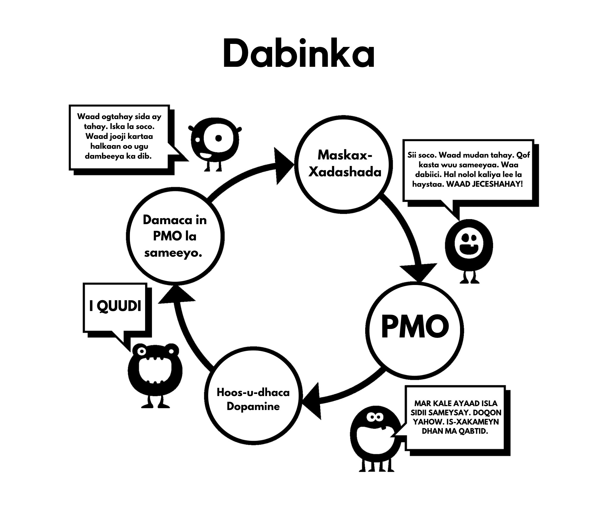

# Maskax-xadashada

Tani waa sababta labaad ee aan u bilowno isticmaalka. Fahamka maskax-xadashadaan waxay si buuxda nooga baahan tahay inaan koowdi baarno saameynta xoogga leh ee kicinta xad-dhaafsan oo aan caadiga ahayn. Maskaxdeena uma diyaarsanayn abuurista ‘harem’ taas oo noo ogolaanaysa inaan shan iyo toban daqiiqo gudaheed ku dhex rogrogno lammaane badan oo suurtagal ah markii loo eego nolosha dhowr awoowayaasheena isku darkood.

Waxaa jiray talooyin badan oo la marin habaabiyay waagi hore, hal tusaale oo ah in siigaysashada ay keento indho la'aan. Waxaa cad ah in tan iyo xeeladaha cabsiga kale oo la socdo ay xad-dhaafeen. Waxaa sax ahaayay in cilmigu uu fikradahaan khaldanka oo kale afgembiyo. Laakin cunuga waxaa lala tuuray biyaha qabeyska; markii sannadaheena ugu horrayeen laga bilaabo, maskaxdeenna miyir-daboolanka ah ayaa lagu soo qulqulay farriimaha iyo sawirada galmada, joornaalada iyo xayeysiisyada oo soo jeedinta galmada ku raran. Muuqaalaha muusiga pop-ka qaarkood aad bay u soo jeedinayaan, laakin ha rajo-dhumin, ciyaar ka dhig si aad u aqoonsato qaybaha ay isticmaalaan si ay dadka ku soo jiitaan — miiyaa qiimaha naxdinta leh, cusaybnimada, midabka, cabbirka, taboo-ga, nostalgia-da, iwm. Waxaa xataa ciyaar oo noocaan oo kale la bari karaa dhalinyarada sida hab oo wax lugu baro. 

Fariinta dhexaad waa: *"Waxa ugu qiimeysan aduunkaan, fikradayda iyo ficilkayga ugu dambeeyay, waa orgasm."* Tan buunbuunin may tahay? U-firso duluc walba oo TV ama filim ah waxaadna arki doontaa isku dhafka dareenka (taabashada, urista, codka) iyo qaybaha faafinta (orgasm-ahaan) ee galmada. Saameynta tani kama diiwaan gashanayso miyirkeena, laakin miyir-daboolanka ayaa haysta waqti uu ku dhuuqo.

## Sababo Cilmiyeesan

Waxaa jira sumcad si kale: cabsi-gelinta cillada galmada, khasaarada dhiirigalinta, ka doorbidida gabdhaha muuqaalaha porn ee kuwa dhabta ah, mareegta YourBrainOnPorn, iyo bulshooyinka internetka oo kala duwan. laakin kooxahaan kama caawiyaan dadka inay isticmaalka joojiyaan. Markii loo eego dhinaca macquulka ah, hababkuwaas waa inay shaqeeyaan, laakin dhab ahaantii ma shaqeeyaan. Xataa khataraha caafimaadka ee ku liis gareeyeen daraasadaha oo dib loo eegay mareegta YourBrainOnPorn kuma filna inay ka celiso qof oo dhalinyar ah inuusan bilaabin.

Midda qososha leh waa in awooda ugu xoogga badan ee wareerkaan uu yahay isticmaalaha naftigiisa. Waa khalad in loo maleeyo in isticmaalayaasha ay yihiin dad oo rabitaan-daciifsan ama inay jir-ahaan u daciif yihiin. Lidkeeda, waa inaad jir-ahaan xoog u yeelato si aad wax uga qabato balwadda ka dib markaad ogaato inay jirto. Waxaa laga yaabaa in dhinaca ugu xanuunka badan ay tahay inay naftooda ku calamayneeyaan dad oo khasaaroyaal ah iyo dad oo si aan loo adkeysan karin u af gaaban. Waxay u badan tahay in saaxiib uu [balwadaha] ula noqon karo mid oo aad u xiiso badan shaqsi ahaan hadduu [balwadaha] naftiisa hoos u dhigin ‘raaxays-raadinta’ darteed.

## Dhibaatooyinka Isticmaalka Awood-Rabitaan

Isticmaalayaasha oo isticmaalayaan habka awooda-rabitaanka, waxay eedaan awood-rabitaan la’aantood markaysan joojin karin, iyagoo nabadood iyo farxadood duminayaan. Laakin waa hal shay in laga guul dareysto is-edbinta iyo mid kale in la is-nacaybo. Ka dib oo dhan, ma jiro sharci oo u baahan inaad kacsi ahaato waqti kasta oo galmada ka hor, adigoo si habboon u kacsanaanto oo awooda u leh inaad qanciso lammaantaada. Waxaan ka shaqaynayna balwad - caado ma aha. Marnaba lama doodid naftaada inaad joojiso caado sida ciyaarta golf, laakin waxaa caadi laga dhigayaa in isla sidii lala sameeyo balwadda porn. Maxaa?

Soo-gaadhista joogtada ah ee kicinta xad-dhaafsan oo aan caadiga ahayn waxay dib u soo habeeysaa maskaxdaada, marka waxaa muhiim ah in la dhiso iska caabinta maskax-xadashadaan, sida markaad baabuur ka gadanayso iibiye baabuur: si asluub ​​leh ayaad madaxa u luxluxdaa, laakin hal kelmad oo uu ninka sheegaya ma ka aamintid. Marka ha aaminin inay lagma maarmaan kuu tahay inaad galmo sameyso intii aad awooddo, iyagoo dhammaantooda yihiin kuwa oo si gaar ah u wanaagsan, adigoo porn isticmaalaysa maqnaanshihiisa.

Hana dheelin ciyaarta porn ammaanka; shaydaankaagii yar ayaa ciyaartaas allifay sida uu kugu soo jiito. Porn-ka oo xirfada lahayn maamuul muu shahaado ka soo helay? Mareegaha porn waxay xog ka ururiyaan isticmaalkooda waxayna u isticmaalaan inay daboolaan baahidooda, haddii ay arkaan kor-u-kaca daawashada nooc oo gaar ah, noocaas ayay diirada saari doonaan waxayna waxyaabahaas sida ugu dhakhsashada badan oo suurtogalka ah u soo saari doonaan. Ujeedada waxbarashada ama muuqaalaha porn ‘ammaansan’ oo naagaha suuq-geeynayaan yee ku khiyaamin. Bilow inaad is weydiiso: *"Maxaan u samaynayaa? Ma u baahanahay?"*

**Maya! Dabcan uma baahnid!**

Isticmaalayaasha intooda badan waxay dhaaranayaan inay kaliya daawadaan porn oo static ah (sawiradda) ama porn oo jilicsan, iyo inay, sidaas darteed, u fiican yihiin, markay dhab ahaantii xarigga la jiitamayaan, iyagoo awooda-rabitaankooda ku dagaallamayaan inay iska caabiyaan jirrabadooda. Haddii la sameyo marar badan iyo waqti oo aad u dheer, aad ayay awood-rabitaankooda u yareenaysaa waxayna bilaabayaan inay ku guul dareystaan mashaariicda kale ee nolosha halkaasi oo awooda-rabitaanka ay qiimo weyn leedahay, sida jimicsiga, cunto caadasha nidaamsan (diet)-ka, iwm. Guul darada aagaggaas waxay ka dhigtaa inay dareemaan darxumeysi iyo dembi, iyadoo dib ugu soo tuuraysa isticmaalka porn. Haddii tan aysan dhicin, xanaaqooda iyo niyad-jabkooda ayay ku muujinayaan kuwa oo ay jecel yihiin.

Mar haddii aad porn balwad u yeelato, maskax-xadashada ayaa kordhayso. Maskaxdaada oo miyir-daboolanka way ogtahay in shaydaanka yar uu u baahan yahay in la quudiyo, iyadoo markaas wax kasta oo kale ka hor istaagayso. Waa cabsi kaliya waxa oo dadka ka celinaysa inay joojiyaan, cabsida inay maran dareemayaan, iyo kalsooni darrada oo ay helaan markay daadashada dopamine oo xad-dhaafsan maskaxdooda ka joojiyaan. Maadaama aadan ka warqabin, ma aha inaysan halkaas joogin. Uma baahnid inaad wax dheeraad ah uga fahanto inta mukulaasha ay u baahan tahay inay fahanto meesha tubada ay biyaha ka kulushahay: Mukulaasha waxay kaliya ogtahay haddii ay meel gaar ah fariisato, inay dareemayso diirimaadka.

## Dadbanaanta

Dadbanaanta maskaxdeena iyo ku-tiirsanaanta maamulka oo u horseedisa maskax-xadashada waa dhibaatada aasaasiga ee *ka tanaasulida* porn. Barbaarinteena bulshada dhexdeeda, oo lagu xoojiyay maskax-xadashada balwaddeena ayaa lagu daray maskax-xadashada ugu awooda badan: asxaabta iyo qaraabada. Odhaahda 'ka tanaasulidda' waa tusaale oo caadi ah oo maskaxda lagu xado, iyadoo tilmaamaysa inuu balwadaha bixinayo hurid oo dhab ah. Laakin runta oo quruxda badan waa inaysan jirin wax oo la iska tanaasulo; Taas lidkeeda, waxaad naftaada ka xorayn doontaa cudur xun oo aad gaarayso guulo wanaagsan oo cajiib ah. Waxaan hadda ka bilaabi doonaa inaan meesha ka saarno maskax-xadashadaan, anagoo ka bilaabayna anagoo tixraacaynin 'ka tanaasulidda' laakin joojinta, jebinta, ama booska oo runta ah: **ka baxsashada!**

Waxa kaliya oo kowdi nagu qanciya inaan isticmaalno waa in dadka kale ay sameyaan, anagoo dareemayno inaan wax ka maqan nahay. Aad ayaan ugu dadaalnaa inaan ula qabatimno, welina ma helno waxa oo aan ka maqan nahay. Mar walba oo aan aragno muuqaal kale waxay noo xaqiijinaysaa inuu ahaado inuu wax ku jira, haddii kale dadka ma samayn lahayeen, iyo ganacsiga porn ma noqon lahayn mid oo sidaas u weyn. Xataa markuu balwadda iska saaro, isticmaalihii hore wuxuu dareemaa in wax laga qaatay markay dadka ka hadlayaan jilayaal oo maaweelo kacsi leh, heesaayay, ama xataa jilayaal porn inta lagu jiro xafladaha ama hawlaha bulshada. *"Waa inay wanaagsan yihiin haddii saaxibadayda dhamaantood ay iyaga ka hadlayaan, sax? Ma haystaan sawirro online oo lacag la'aan ah?"* Waxay dareemayaan ammaannimo, waxayna qaadan doonaan hal fiirsi caawada iyo ka hor intaysan ogaanin, mar kale ayay ula qabatimeen.

Maskax-xadashada aad ayay u awood badan tahay, waxaanad u baahan tahay inaad ka warqabto saameynteeda. Tiknoolajiyada way sii socodaan inay koraan, mustaqbalkuna waxay keeni doonaan mareego iyo hababka gelitaanka oo aad u xawaare badan. Warshadaha porn ayaa malaayiin ku maalgashanaya *virtual reality-ga* si ay u noqoto waxa xiga ugu fiican oo soo socda. Ma naqaano halka oo aan u socono, mana u qalabaysan inaan la tacaalno tignoolajiyada oo hadda socdo ama waxa oo soo socda.

Waxaan u dhownahay inaan meesha ka saarno maskax-xadashadaan. Ogow inuu ahayn kan oo aan isticmaalaha ahayn kan oo dareemayo in wax laga qaatay, balse waa isticmaalaha kan oo cimrigiisa ka qaadayo: 

-   Caafimaadka

-   Tamarta

-   Maalka

-   Nabadda Maskaxda

-   Kalsoonida

-   Geesinimada

-   Is-ixtiraamka

-   Farxadda

-   Xoriyada

Muxuu ka helayaa huridkaan oo aadka u weyn? **GABI AHAAN WAXBA**, markii laga reebo dhalanteedka in la isku dayo inuu dib ugu soo laabto xaaladdii nabadda, xasilloonida iyo kalsoonida oo qofka aan isticmaalin mar walba ku raaxaysanayo.

## Xanuunada Ka Noqoshada

Sida hore loo sharaxay, isticmaalayaasha waxay aaminsan yihiin inay porn u isticmaalaan baashaal, nasasho, ama nooc oo waxbarashada ka mid ah. Laakin sababta dhabta ah waa inay iska nafisaan xanuunada ka noqoshada. Maskaxdeena oo miyir-daboolanka ah waxay bilaabataa inay barato in porn iyo siigaysashada waqtiyada qaarkood ay u janjeeraan inay noqdaan kuwa oo raaxo leh. Markaan si kordhaysa ugu sii qabatimno daroogada, inta ka weyn ay baahida in la yareeyo xanuunada ka-noqoshada ay noqonayso, inta ka badan uu dabinka qarsoodisan hoos kuu jiidaaya. Habkaan wuxuu u dhacaa si tartiib tartiib ah oo aadan xataa ka warqabin. Isticmaalayaasha oo da'da yar intooda badan xataa ma ogaadaan inay la qabatimeen ilaa ay isku dayaan inay joojiyaan, iyo xataa markay heerkaas gaaraan, qaar badan ma qirid doonaan.

Tusaale ahaan, u fiirso wada-hadalkaan oo daaweeyaha la yeeshay boqolaal oo dhallinyaro ah:

>**Daaweeyaha:** "*Waad ogaatay inay porn daroogo tahay iyo in sababta kaliya ee aad weli u isticmaalayso ay tahay inaadan joojin karin.*"
>
>**Bukaanka:** "*Taas waa wax aan jirin! Waan ku raaxaystaa, haddii aanan ku raaxaysanaynin, waan iska joojin lahaayay.*"

>**Daaweeyaha:** "*Waayahay, marka hal toddobaad kaliya lee jooji si aad iigu caddeyso inaad joojin karto haddii aad rabto.*"
>
>**Bukaanka:** "*Waxaas dhan looma baahna, waan ku raaxaystaa. Haddii aan rabi lahaayay inaan joojiyo, mar hore ayaan sameyn lahaayay.*" 
>
>**Daaweeyaha:** "*Hal toddobaad kaliya lee jooji si aad naftaada u caddeyso inaadan la qabatimin.*"

>**Bukaanka:** "*Maxaa dan ah? Waan ku raaxaystaa."*

Sida hore loo sheegay, isticmaalayaasha waxay u janjeeraan inay iska yareeyaan xanuunada ka-noqoshadooda ee waqtiyada walbahaarka, caajiska, xogga-saarnaanta ama isku darkood. Cutubyada oo soo socda, waxaan beegsan doonaa dhinacyadaan oo maskax-xadashada.
