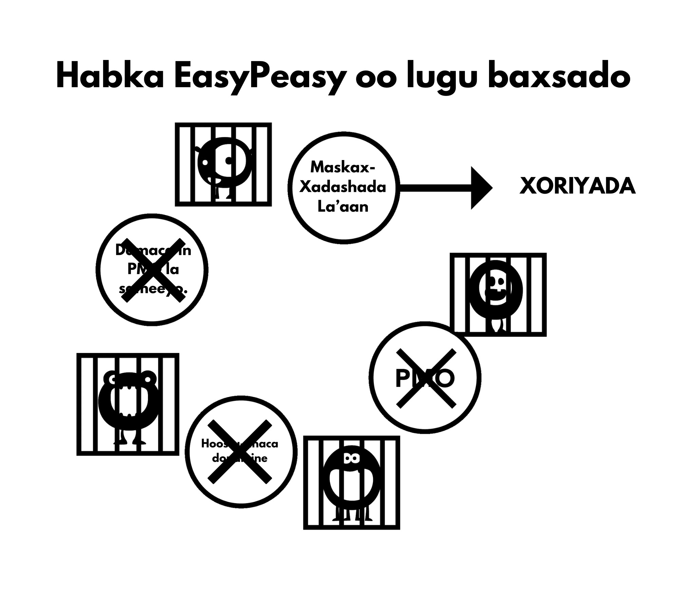

# Dhinacyada Maskax-Xadashada

Shaydaanka weyn ee dabinka porn waxaa laga abuuraa isku-darka dhinacyo badan, oo ay ku jiraan saameynta bulshada, sawirka warbaahinta, saaxibaha, iyo isticmaalaha sheekadiis gudaha. Guul dareysiga in la dumiyo khaladaadkaan iyadoo la isticmaalayo habka awooda-rabitaanka wuxuu ugu dambeyntii keenaayaa dareen in wax lagaa qaatay, taasi oo isticmaalaha u keenaysa inuu dib ugu laabto dabinka. Dumiska qiimaha oo porn laga mala awaalay ayaa guusha u muhiim ah waxayna kuu ogolaanaysaa inaad aragto halka oo lagaa dhacaayo!

Waxaa muhiim ah in la ogaado xiriirka oo ka dhexeeya maskax-xadashada iyo cabsida. Waa cabsida in la dareemaayo ***xanuun ka-noqosho oo mustaqbal ah*** oo xanuunka abuuraayo. Cabsida naftigeeda ayaa xanuunka ah. Ka fikir markaad isku aragtay calaamadaha ka-noqoshada sida calaacalaha dhididsan, neefta oo kugu yaraysan, dhibaatooyinka hurdada, iyo awood la'aanta inaad si toos ah u fikirto. Hadda ka fikir xaalado oo la mid ah markaad kuwaas dareentay: waraysiyo shaqo, neerfaha agagaarka qof oo soo jiidasho leh, fagaare ka hadalka, iwm. Kuwaan waa dareen-walaaca isku midda ah oo ay cabsida keento. Markii si fudud loo dhigo: sidee daroog oo jireed ah uu weli dadka u qabsan karaa biloyin ka dib markii la joojiyay? Waa inay maskax-ahaan noqota, sax?

## Walbahaarka

Ma aha masiibooyinka waaweynka ee nolosha kaliya, laakin walbahaarada yaryar ayaa sidoo kale isticmaalayaasha ku riixaya aagga 'khatarta' ee mamnuuca ah oo hore laga saaray. Walbahaarada waxaa ka mid ah is dhex galka oo bulsho ah, wicitaanada telefoonka, walwasha xaaska guriga ee carruurta yaryar, iyo kuwo kale oo badan. Aan tusaale ahaan ka soo qaadanno wicitaanada taleefoonada, gaar ahaan qofka oo ganacsadaha ah. Wicitaanada intooda badan ma ahaan kuwa oo ka yimaadaan macaamiil qanacsan ama madaxaaga oo ku hambalyeeynaaya, waxaa jira nooc oo ka mid ah xaalad oo xanaajin leh. Imaatinka guriga nolosha qoyska oo xiiso darada ah ee carruurta qaylinayaan iyo dalabaadka shucuureeda lammaanahiisa wuxuu isticmaalaha u keenaa - haddii uusan horeyba sidaas sameyaynaynin - inuu u khiyaaliyo 'nafisada' porn-ka uu habeenkaas iska ballanqaaday. Wuxuu si miyir la'aan ah ula kulmaaayaa xanuun ka-noqoshada, iyagooo cadaadis-dejinta ay daciifsan oo ay diyaar u ahayn in xanaajin oo dheeraad ah. Iyadoo qayb ahaan u nafisayso xanuunka isla mar ahaantaana walbahaarka caadiga ah, wadarta guud ay dhimaysaa isticmaalahuna wuxuu helaayaa kor-u-kac oo ku meel gaar ah. Kor-u-kaca dhalanteed ma aha, isticmaalaha si dhab ah ayuu u dareemaayaa si ka fiican sidii hore, laakiin wuxuu ka sii walaacsan yahay sidii uu ahaan lahaayay haddii uusan isticmaale ahayn.

Tusaalaha soo socda looguma talagalin inuu kaa nixiyo, EasyPeasy wuxuu kaa balan qaaday inuusan isticmaalaynin xeeladaha oo noocaas oo kale, laakiin waa inuu xooga saaro in porn ay baabi'iso neerfahaaga halkii ay ka dejin lahayd.

Isku day inaad ka fikirto inaad gaartay marxalad oo aadan awoodin inaad kacsi yeelato, xataa markaad la joogto lamaane oo aad u kacsi badan iyo soo jiidasho badan. Muddo yar, jooji ee isku day inaad sawirto nolol oo halkaas qof aad u jeceel leh oo soo jiidasho leh ay tahay inay la tartanto jilayaasha porn oo 'haremkaaga' ku jira oo ay ku guul dareysato inay fiiriskaaga hesho. Hadda qiyaas xaalada maskaxeed ee qofka, markii digniintaas loo soo saaro, uu sii wado isticmaalka ilaa dhimashadiisa isagoon weligiisa galmo dhab ah la sameynin lamaanahaan soo jiidashada leh ee diyaarka ah. Way fududahay in dadkaan la iska eryo sidii wax oo aan caadi ahayn, laakiin sheekooyinka oo noocan oo kale ah ma aha kuwo been abuur ah, tani waa waxa oo cusubnaanta daroogada porn ay maskaxdaada ku sameyso. Inta badan ee aad nolosha dhex marto, inta ka badan ay geesinnimada kaa baab'aayo, iyo inta ka badan oo lagugu khiyaaliyo inaad aaminto in porn ay lidkeeda sameynaysa.

Weligaaga argagax mu ku qabsaday markuu, si lama filaan ah, WiFi-ga joojiyo inuu shaqayo ama markuu noqdo si aad u tartiibsan? Dadka oo isticmaalayaasha ahayn waxaas kuma dhibaatoodaan, maadaama ay porn dareenkaas *sababto*. Adigoo nolosha dhex marayso, waxay si nidaamsan u baabi'isaa neerfahaaga iyo geesinimadaada, taasi oo u oggolaanaysa in DeltaFosB ay sameysato simbiriiriixanaha biyaha oo neerfa ah, iyadoo si tartiib tartiib ah u baabi'inaysa awoodaada inaad maya dhahdo. Markii la gaaro maraxladda oo ragganimada la dilay, isticmaalaha wuxuu aaminaa in porn ay tahay lammaanahiisa cusub iyo inuuysan awoodi karin inuu nolosha la kulma la'aanteed.

*Porn neerfahaaga ma nafisayso, waxay si tartiib ah u baabi'inaysaa*. Mid ka mid ah faa'iidooyinka ugu waaweyn ee jebinta balwada waa soo noqoshada kalsoonidaada dabiiciga ah iyo isku balan-qaadshadaa.

Looma baahna inaad naftaada ku qiimeeyso kartidaada inaad lamaane qancin karto, taas xoriyad ma aha. Laakin xoriyadaan laguma heli karo in la sii wado saliidaynta simbiriiriixanta biyaha ee dopamine siyaabaha hoos u dhigaya farxaddaada iyo rabitaan-galmadaada adigoo isla hab-dhaqankii burburay ku celcelinaysa.

## Caajisnimada

Haddii aad la mid tahay dad badan, isla marka oo aad sariirta fuusho, waxaad horeyba ku jirtaa mareegta porn oo aada ugu jeceshahay, oo laga yaabo inaad hilmaantay ilaa ay wax kaa xasuusiso. Waxay noqotay dabeecadaada oo labaad. Sidoo kale, fikrada in porn ay yareyso caajisnimada waa khaldan kale waayo caajisnimada waa maskaxeed, oo dhacaya markaad muddo dheer wax lagaa qaaday ama aad isku dayeyso inaad wax iska yareeso.

Xaaladda dhabta ah waa tan: markaad la qabsato jiidashada ee kicnta xad-dhaafsan aan caadiga ahayn ee porn oo ka dibna aad isku daydo inaad iska ilaaliso, waxay u dareemeysaa in wax ay kaa maqan tahay. Haddii aad haysato shay aad maskaxdaada ku mashquuliso ee aan walbahaar lahayn, waxaad tagi kartaa waqti dheer adigoon ku dhibaataysanin ee maqnaanshaha darooga. Laakiin markaad caajisto, ma jiraan wax oo dareenkaas maskaxdaada ka saaraya, markaas shaydaanka aad quudisaa. Markaad is dhex gelisid oo aanad isku dayin inaad joojiso ama aad gooyso, xataa kicinta browser oo khaaska ah ayaa miyir-daboolan noqda. Dhaqankaan waa mid iswaddo; haddii uu isticmaalaha isku dayo inuu xasuusto fadhiyada toddobaadyada oo la soo dhaafay, wuxuu kaliya awoodaa inuu xasuusta ​​qaar yar oo iyaga ka mid ah, sida kii ugu dambeeyay ama fadhiga oo ka-caagid dheer ka dib. 

Runta waxay tahay in porn ay caajisnimada si aan toos ahayn u kordhisa waayo orgasmka waxay kaa dhigayaan qof daalan, oo halkii ay samayn lahaayeen waxqabad tamar leh, isticmaalayaasha waxay doorbidaan inay meelaha iska jiifaan, iyagoo caajisan, oo ay iska yareeyaan xanuunada ka noqoshada. Ka hortagga maskax-xadashada waa muhiim waayo isticmaalayaashu waxay u janjeeraan inay porn fiiriyaan markay caajisaan, maskaxdeenna waxay u xiran tahay inay porn u tarjumaan mid xiiso leh. Sidoo kale, maskaxda ayaa nalaga xaday si aan u aamino in galamada - xataa galmada xun - ay nasashada caawisa. Waa xaqiiqo in markay murugeysan yihiin ama ay walbahaar ku jiraan, lamaanayaasha ay rabaan inay galmo sameyaan. Maqnaanshaha takoorka u dhexeeya galmada tantric iyo faafinta, u fiirso sida ugu dhakhshada badan ee aad rabto inaad midba midka kale uga fogaato ka dib markii la gaaro orgasmka oo qasabka ah. Haddii lammaanaha go'aansan lahaayeen inay isku duubaan, hadlaan, ama koolkooliyaan oo ay isla seexdaan, nafis ayay dareemi lahaayeen.

## Diirad Saarida

Siigaysashada iyo galmada ma kaa caawiyaan diirad saarida. markaad isku dayayso inaad xooga saarto, waxaa si toos ah ayaa isku daydaa oo iska ilaalisaa waxyaabaha jeedinaya. Sidaas darteed, markuu isticmaalaha rabo inuu diirad saaro, xataa ma fikiro -- isagoo si toos ah u furaya browserka, oo quudinaya shaydaanka yar oo qayb ahaan u soo joojiyo rabitaanka. Wuxuu la socdaa arrinta jirta, isagoo horeyba u hilmaamay inuu porn daawaday. Sannado badan oo daadashada dopamine ka dib, isbeddelada neerfaha waxay saameeyaan awoodaha sida helitaanka macluumaadka ee maskaxda, qorsheynta, iyo iska-xakamaynta rabitaan-degdega.

Midda kale oo ku waddo waa inaad wax cusub keento fadhiga soo socda maadaama walxaha la midka ahaayay aanay soo saareynin dopamine iyo opioids ku filan. Markaa waa inaad ku dhex mushaaxaysaa jidadka internetka si aad u heshid wax cusub, adigoo la dagaallamaya jiidista si aad khadka caska uga gudubto walxaha naxdinta leh, taas oo iyaduna keenta walbahaar badan oo kaa dhigaysa mid aan ku fulin ka dib markaad dhammayso.

Diirad saarida ayaa sidoo kale si xun u saamaysa maadaama daawadayaasha dopamine-ka la dilay waayo dhisidda dabiiciga ee dulqaadka qulqulka weyn, taas oo yaraynaysa faa'iidada dopamine yar yar oo laga helo waxqabadyada dabiiciga ah ee yareeya walbahaarka. Diirad saaridaada iyo dhiirigalintaada ayaa si weyn kor loogu qaadi doonaa marka habkan la yareeyo. Dibaatada oo dadka badan u diidaysa inay habka awooda-rabitaanka ku guuleystaan waa dhincada xooga saarida: waxay u dulqaadan karaan xanaajinta iyo xanaaqa xun, laakiin guul darada inay diirad saaraan shay adag mar alla markii 'taageeratooda' la gooyo ayaa qaar badan burburiso.

Khasaarada diirad saarida oo isticmaalayaasha ku dhacdo markay isku dayayaan inay baxsadaan--maqnaanshaha galmada darteed ma aha, porn iska daa. Markaad balwad tahay, waxaad qabtaa xannibmo oo maskaxeed ah, iyo markaad xannib maskaxeed qabtid, maxaad sameysaa? Browserka ayaad kicinay - kaas oo xannibka daawaynaynin - markaas maxaad samayneysaa? Waxaad samaysaa waxa ay tahay inaad samayso, adigoo la wada sii socoto sida kuwa isticmaalayaasha ahayn ay sameyan. 

Markaad isticmaale tahay, waxba luguma eeddo sababta dhibaatada: Isticmaalayaashu weligood *cillad galmo* ma yeeshtaan--waa "waqtiyo oo dareen hoose lee" kaliya. Isla marka oo aad joojiso isticmaalka, wax kasta oo qaldama waxaa lagu eedayn doonaa sababta aad u joojisay. Hadda markaad leedahay xannibaad maskaxeed, halkii aad iska sii soco lahayd, waxaad bilaabaysaa inaad dhahdo: "*Haddii aan kaliya hubin kari haremkayga, waxay xallin lahayd dhibaatooyinkayga dhamaantood.*" Markaas waxaad bilaabaysaa inaad su'aal ka waydiiso go'aankaaga inaad ka tagto oo aad ka baxsato addoonsiga.

Haddii aad aamminsan tahay in porn ay gargaar dhab ah u tahay diirad saarida, ka walwalidda waxay dammaanad qaadi doontaa inaadan awoodin inaad diirad saarto. Waa shaki, ma aha xanuunada ka-noqoshada ee jirka, oo dhibaatada abuurto. Had iyo jeer xasuuso: waa isticmaalaha kan oo xanuun dareemo, ma aha isticmaalayaasha.

## Nasashada

Isticmaalayaasha intooda badan waxay u maleeyaan in porn ay nasashada ka caawiso. Sidaas ma sameyso. Raadinta waalan in hagaajinta laga dhex helo 'luuqaha mugdiga oo internetka' iyo halganka gudaha ee xarigga lala jiitamayo in laga gudbo khadka cas hubaal uma *muuqdo* hawl oo nasasho badan leh.

Markuu habeenka soo galo safar meel cusub ama maalin dheer ka dib, waan fadhiisanaa si aan u nasano, anagoo gaajadeena iyo oomkeena iska nafisno, waxaana si buuxda u qanacsannahay. Laakin isticmaalaha kuma qanacsana, maadaama uu qabo gaajo kale oo qancis u baahan. Isticmaalayaasha waxay porn u arkaan sida dusha doolshada, laakiin dhab ahaantii waxay tahay 'shaydaankii yar' oo quudin u baahan. Runta waxay tahay in qof oo balwad leh uu weligiisa si buuxda nasashada u dareemi karin iyo, markuu nolosha dhex marayo, si kordhisan ayay uga sii darraysaa. Tusaale ahaan, ka soo qaado faalladaan ee isticmaale hore:

> "*Waxaan dhab ahaantii aaminsanahay inuu jinni dabeecadeyda ku jiray, waxaan hadda ogahay inay sidaas i haysay, laakiin inay ahayn nooc cillad ee dabeecaddayda, oo uu shaydaanka porn ahaayay kan oo dhibaatadaa abuuraayay. Muddada waqtiyadaas waxaan isku maleeyay inaan dhibaatooyinka adduunka oo dan haysto, laakiin markaan dib u milicsado noloshayda, waxaan la yaabanahay halka ay ka jireen walbahaarada weyn. Wax walba oo kale oo noloshayda ah ayaan gacanta ku haayay, waxa kaliya i xukumaayay wuxuu ahaayay addoonsiga porn. Waxa murugta leh waa inaan maanta xataa carruurtayda ka dhaadhicin karin inay addoonsiga ahayd kan oo xanaaqa iga keenaayay.*"

Mar walba oo aan maqlo balwadaha porn oo isku dayaya inay qiil u yeelaan balwaddooda, fariinta waa, "*Waxay iga caawisaa nasashada.*" Ka soo qaado warbixinta onlinka ee aabe oo doob oo wiilkiisa lix jirka uu rabay inuu sariirtiisa la wadaago habeen oo filin cabsi ka dib, laakiin aabaha wuu diidi jiray si uu fadhigiisa porn u haysto oo saacado badan u siigaysto.

Halkaan waa isbarbardhig kale oo sigaar-cabitaanka ah: dhowr sano ka hor, maamulka korsashada waxay ku hanjabeen inay ka hortagayaan sigaar cabbayaasha inay caruur korsadaan. Markaas nin baa soo wacay isagoo xanaaqsan. "*Gabi ahaan ayaad u qaldantiin,*" uu yiray, "*Waxaan xasuusan karaa markaan cunug ahaayay, haddii aan lahaayay arrin oo muran badan inaan hooyadayda la kala hadlo, waxaan sugi jiray intay sigaar shidato waayo ay markaas ahayd qof oo ka nasasho badan.*" Muxuu ninka hooyadiis ula hadli waayay markaysan sigaar cabbaynin?

Maxay isticmaalayaasha qaarkood u walaacsan yihiin markaysan hagaajintooda helaynin, xataa galmada dhabta ka dib? Hal sheeko online ah ayaa ka sharaxay nin oo ka shaqeeynaayay goobta xayaysiiska isagoo haysto naago 9/10 iyo 10/10 oo waqti kasta shuukaansi u furan, laakiin xiisaha ayaa ka dhumay inuu casho ula kaxo waayo ay porn aad uga fududaysan tahay: kuma jirto kharashka makhaayad mana haysato wax oo suurtogal ah ee inay naag 'maya' dhahdo fiidka dhamaatkiis. Muxuusan shukaansiga isku dhibaa markuu shaydaankiis yar ay ku hayso inuu u damaco beddelka halista yar, oo abaalmarinta sare markuu guriga gaaro?

Marka maxay kuwa isticmaalayaasha ahayn si buuxda u nasan yihiin? Maxay isticmaalayaasha u awoodi waayeen inay hal ama laba maalin nastaan hagaajin la'aanteed? Ka akhriso khibradda ee isticmaale oo qaadanaya dhaarta ka-foognaanshaha oo joojinaayo, iyo waxaad arki doontaa halganka ee jirrabaadda: si cad uma nasanayaan gabi ahaan markii oo mar dambe loo oggolaanin inay helaan 'nasashada oo kaliya ah' oo ay 'xaq u leeyihiin inay ku raaxaystaan.' Waxay hilmaameen sida oo ay u dareento in si buuxda loo nasto. Porn waxa loo barbardhigi karaa dukhsiga oo dhirka oo dabin leh lagu qabto. Kowdi, dukhsiga wuxuu bilaaba inuu cuno nectar-ka (biyaha dhirka) laakiin markii oo marxalad aan la fahmi karin la gaaro, dhirka wuxuu bilaabaa inuu dukhsiga cuno.

Ma joognoo waqtigii oo aad dhirka ka soo bixi lahayd?

## Tamarta

Isticmaalayaasha intooda badan way ka warqabaan saameynta cusaybta porn iyo kordhayn-raadinta ay ku leeyihiin nidaamyada abaalmarinta iyo galmada ee maskaxdooda. Sidaasba ha ahaatee, kama warqabaan saameynta ay ku leedahay heerka tamartood.

Mid ka mid ah khiyaanada dabinka porn ayaa ah in saameynta ay jir-ahaan iyo maskax-ahaanba nugu leedahay, ay u dhacaan si tartiib tartiib ah iyo si aan la fahmi karin oo aan joogno anagoo ka warqabin, oo aan beddelkeeda xanuunka u tixgelino inay caadi tahay. Saameynta waxay la mid tahay caadooyinka cunto-cunidda xun: waxaan fiirinaa dadka oo aadka u cayilsan, waxaana la yaabanahay sida ay suurtogal u tahay inay naftooda ugu oggolaadaan inay heerkaas gaaraan. Laakin ka soo qaad in taasi ay hal habeen gudihiisa dhacday -- waxaad aaday sariirta adigoo dhisan, oo aad muruqyo badan tihid, oo aan xataa hal wiqiyad oo dufan ah ku lahayn jirkaaga -- oo aad markaas soo kacdo adigoo garwaaqsado inaad buuran tahay, bararsan tahay, oo aad calool weyn tahay. Halkii oo aad soo kici lahayd adigoo dareemaya nasasho buuxda iyo tamar buuxda, waxaad dareemaysaa darxumeysnimo, caajisnimo, oo aad si dirqin u awoodid inaad indhahaaga furto.

Waad argagaxi lahayd, adigoo la yaaban cudurka xun ee kugu dhacay habeen gudihiis, haddana saameynta cudurka waxay isku mid tahay kuwa oo dadka caayilsan ee haystaan. Xaqiiqda ah inay qaadatay labaatan sano in halkaas la yimaado waa wax aan khusayn. Porn waa isku mid: haddii ay suurtagal ahaan lahayd in isla markiiba la kala wareejiyo maskaxdaada iyo jirkaaga si ay kuu siiso isbarbardhig toos ah oo ku saabsan sida aad u dareemi lahayd haddii aad porn iska joojisay saddex toddobaad oo kaliya, taas waxay ahaan lahayd waxa dhan loo baahnaan lahaayay in lagugu qanciyo inaad joojisid. Waxaad is weydiin lahayd, run ahaan may sidaan oo wanaagsan u dareemi doontaa, ama waxa ay run ahaan macnaheed u noqonayso: "*Run ahaan maa sidaan hoos u dhacay?*" Caafimaad kaliya ma dareemi doontid, adigoo tamar badan haysato, laakiin sidoo kale waxaa kaa soo baxayo kalsooni oo aad u badan iyo karti sare inaad diirad saarto.

Balwad ahaan, tamar la'aanta iyo daasha iyo wax walba oo la socota ayaa si aamusan lugu xaaqaa rooga 'sii weynaanta' hoostiis. Saaxiibada sidoo kale oo ku nool qaab-nololeed oo fadhiidnimo ah ayaa hab-dhaqankan sii xoojiyaan. Aaminsanaanta in tamarta ay tahay xuquuq gaar ah oo carruurta iyo dhalinyarta leeyihiin iyo in da'da weynta ay labaatanaadyadaada bilaabato waa calaamad kale oo maskax-xadasha, si la mid ah in ka warqabin la'aantaada caadooyinka cunista iyo jimicsiga ay tahay natiijada saameyn isku dhafan ee dareen-yareesmada dopamine.

Wax yar ka dib ee joojinta porn, dareemada ceeriyaamada iyo cufanta ayaa kaa tagi doona. Arrinta oo ah, adigoo porn isticmaalaysid waxaad had iyo jeer iska saaraysaa tamartaada, habkaas oo ay faragalinayso kiimikada nidaamkaaga limbic-ga. Si ka duwan joojinta sigaarka, halkaas oo soo noqoshada caafimaadkaaga jireed iyo maskaxeed ay tahay mid tartiib tartiib ah, joojinta porn waxay ku siinaysaa natiijooyin oo aad u fiican si maalinta kowaad laga bilaabo. Dilka 'shaydaanka yar' iyo xiritaanka simiriiriixanta biyaha waxay qaadanaysa waqti yar, laakiin soo kabashada xaruntaada abaalmarinta ma aha wax oo simrriiriixanta tartiib-tartiibta ee godka la mid ah. Haddii aad dhex marayso dhaawaca habka awooda-rabitaanka, wixii faa'iido caafimaad ama tamar ayaa u burburayso niyad-jabka aad la kulmi doonto darteed. Nasiib darro, suurtagal uma aha in EasyPeasy uu isla markiiba ku gayo maskaxdaada ee saddex toddobaad ka dibka, laakiin adiga ayaa sameyn karto! Waxaad si dareen u garanaysaa in waxa laguu sheegayo ay sax yihiin, waxa kaliya ee aad u baahan tahay inaad samayso waa inaad **male-awaalkaaga isticmaashid!**

## Fadhiyaha Porn Habeen-Bulsheed

Tan waa macluumaad khaldan oo u muuqda inay macno leehdahay, laakiin aan lahayn. Si aad cunto-rabitaanka u xakamto, wax maa guriga ku cuni doontaa ka hor intaanad makhaayad ama xaflad aadin? Tan waa waxa aad ku samaynayso fadhiyada porn ee habeennada bulsheeda ka hor, adigoo u ekta qof daalan oo aan aad sidaada ugu fiicnayn. Dhaqangelinta baahsan ee farsamooyinka soo-qaadiska ee shukaansiga ayaa keentay cadaadis in la fulino, soo-qaado, iyo in dumarka lala dhibc-dhaliyo. Isku dayga inaad walaacaaga porn ku qarqiso iyo walaxa kale waxay kaliya dhibaatada ka dhigi doona wax oo ka sii darran muddada dheer ee mustaqbalka. Shaqsi ahaan, waan iska jeclahay walaac yar si aan shuukaansigayga xooga u saaro oo aan ku hawlo, iyo ku-daalinta naftaada maskax-ahaan iyo jir-ahaan ee orgasm-ka ma caawin doonto.

Porn habeen-bulsheed waxaa sabab u ah laba ama in ka badan oo ka mid ah sababahayadeena caadiga ah ee raadinta raaxada / taageera: xafladaha bulsheed way wada walbahaarsan iyo nasoshan yihiin. Tan waxay u muuqan kartaa mid iska hor imanaysa laakiin nooc kasta oo bulsheeda ka mid ah ayaa walbahaarsan noqon karta - xataa kuwa saaxiibada - adoo rabtid inaad naftaada noqoto oo aad si buuxda u nasato. Waxaan jira marar badan oo arrimo badan ay hal mar wada jiraan: tusaale ahaan ka soo qaado baabuur-wadista, maadaama ay noloshaada khatar ku jirto. Baabuur-wadista waa mid oo walbahaar badan, iyadoo loo baahan waqtiyo diirad saarida oo muddooyin joogto ah. Uma baahnid inaad ka warqabto arrimahan: maskaxdaada miyir-daboolanka ayaa horeyba fariinta helay. Sidoo kale, markaad ku xayirto saxmadda taraafigga ama aad ka caajisto wadiiqooyinka dhaadheer, ballanqaadka fadhiga porn markaad guriga gaarto ayaa maskaxdaada mashquulisa.

Tusaale kale oo wanaagsan waa shukaansigaaga ugu horeysa aad gasho, maskaxdaada oo ka fikiraya siduu noqonaayo qofka aad la kulmi doonto. Markaas, haddii ay xamaasaddaada bilaabato inay hoos u dhacdo markaad qofka la kulanto, waxaad bilaabi doontaa inaad dareento inaad aad u dabacsan tahay, ka dibna aad dambiile dareento inaad sidaan dareentay. Dagaalka is jiid jiida maskaxeeda ayaa bilaabmay: "*Galmo ayaan rabaa haddii kale halkaan sida ugu dhaqsashada badan iga saar*", adigoo kuu diyaarinaya ee porn sukaansi-kadambeedka.

Xataa haddii shukaansiga ay si fiican u dhacday oo saacado ka dib aad ku soo laabatay meeshooda, si kasta oo ay u socoto, kuma qanci doontid haddii ujeedadaada kaliya ay orgasm tahay. Marmar kale, kaligaaga ayaa baabuurka guriga u wadaysaa [ee shukaansiga ka dib], isagoo fikirkaaga kaliya ah haremkaaga onlineka halkii oo aad naftaada ugu hambalyeyn lahayd dadaalkaaga. Waxaad sharad ku geli kartaa in qof oo booskaan jooga uu fadhi yeelan doono markuu guriga yimaado, waana badanaa habeennadan oo kale ka dib - halkaas oo aan ka soo kacno subaxda dambe si aan u dareenno maran walwalsan - kuwa oo aan (balwad ahaan) aad u xiisino markaan ka fikirno joojinta porn. Dhab ahaantii, waa isla mabda'a oo shaqaynooso: fadhiyada waxay kaliya nafis ka siiyaan xanuun ka-noqoshada, mararka qaarkoodna ay baahi oo ka weyn ka qabaan mararka kale, iyagoo u saliidayaan simiriiriixanta ee kicinta ku xiga.

Tan maskaxdaada ku caddey - ma aha dadka oo porn iyo haremka isticmaalaan kuwa oo gaarka ah, waa dhacdada. Mar haddii baahida porn meesha laga saaro, dhacdooyinka oo noocaan oo kale waxay noqon doonaan kuwa oo aad uga raaxaysan iyo xaaladaha walbahaarka waxay noqon doonaan kuwa oo ka walbahaar yar. 

