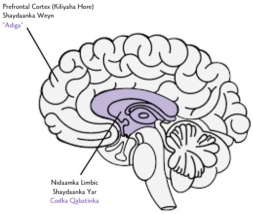

# Kheyraadka {-}

**Fiiro gaar ah: Kheyraadka waxay ku qoran yihiin luqadda Ingiriisiga.**

[Meditations of a Porn Addict](../resources/meditations.pdf) - Guillaco

[EasyPeasy Statements Checklist](https://pastebin.com/dybv6qkD) - SWATxKATS

[9 Minute Meditation](https://www.youtube.com/watch?v=tw7XBKhZJh4) - Sam Harris

[Waking Up Meditation Course](https://wakingup.com) - Sam Harris

[Exiting Modernity](https://meta-nomad.net/exiting-modernity) - Meta Nomad

[Letter I'm Sending to Schools](../resources/principal.pdf)

[Freedom Forever (Qoraalada PMO)](https://sites.google.com/view/freeforever/home)

[Why you're relapsing - u/Different_Guide_5205](https://old.reddit.com/r/pmohackbook/comments/mynwjl/why_youre_relapsing/)

[Countering Fear - u/Different_Guide_5205](https://old.reddit.com/r/pmohackbook/comments/n5027n/countering_fear/)

## Odhaahyada Laqabsiga ee REBT {-}

- “*PMO waan jooji karaa, in kasta oo ay u muuqdo inay ‘adag’ tahay in la sameeyo. Aad uma adag, si kasta oo ay qaadato, way u qalantaa!*”

- “*Haddii aan sii waddo inaan iska dhega tiro oo aan weligayga u tanaasulin damacayada aad u xoog badan inaan PMO sameyo, waxaan ka dhigi doonaa si ka fudud badan inaan iyaga iska caabiyo.*”

- “*Waxaan si buuxda iyo si aan shuruud lahayn isku aqbali karaa — haa, in kasta oo aan leeyahay cilladahayga iyo guul daradayda.*”

- “*PMO waxay u muuqdaa inuu si dhakhsasho badan u ‘daaweeyso’ dhibaatooyinkayga, laakin waxay dhab ahaanti ka dhigtaa sii ka darran.*”

- “*Waqtiyada qaarkood, waxaan jeclaan lahaayay inaan dhibaatooyinkayga PMO iskaga qarqiyo, laakin taasi weligeeda sabab uma aha in la sameeyo.*”
 
- “*Waxay uga raaxo la’aan tahay markaanan heli karin wixii oo aan runtii rabay. Laakin aad uma xuma ilaa aan ka aamino inay sidaas tahay, waxaana doortay inaan aamino wax oo ka macquul badan iyo caawin badan.*”

- “*Weligayga ma jeclaanaayi in si xaqdaro ah liila dhaqmo, laakin waxaan si hubaal u ogahay inaan u adkeysan karo oo laga yaabo inaan ka qorsheyn karaa inaan xaqdarada joojiyo.*” 

- “Si kasta oo aan ku guul dareysto ujeedadaan oo muhiimka ah, guul daradayda weligeeda igama dhigto qof oo karti oo qiimo lahayn. Wuxuu kaliya iga dhigaayaa qof oo laga yaabo in waqtigaas uu qof oo si karti lahayn u dhaqmay.*” 

- “*Gaba ahaan lagama maarmaan ii ma aha inaan helo wixi oo aan rabo, laakin waxaan si macquul ah u ahaan karaa faraxsan, in kasta oo aan faraxsan u ahaan lahayn sida markaan helin.*”

- “*Aad ayaan u door bidayaa inaan ahaado heersare ee shaqadayda, laakin lagama maarmaan ma aha inaan ahaado. Way iska xun tahay haddii aanan ahayn, laakin igama dhigto heer hoose. Had iyo jeer ayaan iska sii wadi karaa inaan isku dayo inaan si fiican sameyo anigoo u baahnayn inaan si fiican sameyo.*”

- “*Waxyaalo badan ayaa iga caawin karaan inay iga dhigaan qof murugaysan oo niyad jabsan, laakin markaan dalbado oo amro inay tahay inaysan waxyaalahaan jirin, waxaan markaas iska dhigaa qof argagaxsan, niyab jaban, oo xanaaqsan.*”

- “*Haa, waxaan badanaa ku guul darreystay inaan sameyo wixii oo aan balan qaaday inaan sameyo, laakin taasi macnaheeda ma ahan inaanan sameyn karin ama inaanan sameyn doonin.*”

- “*Aad ayaan u nacybanahay ahaanshaha walwalsan iyo niyad jabsan, laakin lagama maarmaan ii ma aha inaan isla markiiba dareemankuwaan iskaga milmo PMO. Markaan PMO sameynaayo, waxaan si ku meel gaar ah u dareemaa si ka fiican uga dareemaa dhibaatooyinkayga, laakin [dhab ahaantii] ma noqdo si ka fiican. Muddada dheer, PMO waxay ka dhigtaa si ka darran.*”

- “*Dadka igama xanaajiyaan markay si xun ii la daqmaan. Aniga ayaa si doqon ah u doorto inaan iska xanaajiyo ee daqan xunkooda markaan dalbado oo amro inay si ka fiican u dhaqmaan.*”

## Isku Darka Habka EasyPeasy ee Xeelada Jack Trimpey ee Garashada Codka Qabatinka (XGCQ) {-}

*Amaanta waxaa leh az#8773 ee app-ka Discord*

Tan waxaa loogu talo galay dadka oo ku dhibaatoodeen inay isticmaalaan Habka EasyPeasy ee Allen Carr si ay balwad ka soo kabtaan in kasta oo ay maskax-xadashada iska saareen. Waxaan ka soo qaadayaa in dad kasta oo tan akhirnayaan ay mar hore akhriyeen mid ka mid ah buugaagta Allen Carr oo ay fahmeen Habkiisa Fudud (oo sidoo kale loo yaqaan EasyPeasy). Haddii aadan akhrinin, waxaan aad kuugu talinayaa inaad sidaas sameyso. Waxaa sidoo kale caawinaya inaad akhriso [‘Rational Recovery’](https://g.co/kgs/UgSRxA) ee Jack Trimpey. Haddii aadna taasi akhrinin, dhib ma leh waayo anigaa ayaan halkaan assasiga ku sharaxi doona, laakin waan kuu talinayaa inaad akhriso si kastaba maadaama waxay galaysaa faafaahin oo ka badan wixii oo aan aniga gali doono. Tan loolama jeedo mid ka mid balwad gaar ah waxaana sidaas darteed lugu dabaqi karaa balwad walba. Ujeedada qoraalkaan waa in EasyPeasy loo barbardhigo hab kale oo guuleysan ee [jebinta] balwada oo la dhoho ‘Xeelada Garashada Codka Qabatinka’ (XGCQ) oo markaas labadba la isku daro. In kasta oo aan aaminsanahay inay EasyPeasy ka sareysan tahay hababka kale ee ka soo kabashada balwada ilaa hadda, waxaan aaminsanahay in fahamka XGCQ ay noqon karto waxa oo ka maqan dadka oo guul dareystaan markay isticmaalaan EasyPeasy in kasta oo ay maskax-xadashada iska saareen.

Waxaa jira habab badan oo isla tartamayaan oo laga adkaan karo balwad, mid kasta oo qabo heerar guuleysi oo kala duwan. Midkoodna ma sheegi doono waayo badankooda waxay yihiin waqti dhumis, waxaana rabaa inaan tan gaabiyo intii suurtogal ah. Hababka kaliya oo aan ka qori doono waa Habka Fudud ee Allen Carr iyo XGCQ-ga Jack Trimpey (aasaasiyaha Rational Recovery). Labada habab waxay qabaan heerar guuleysi oo aad u sareysa, laakin mid kasta waxay bartilmaameedsanayaan arrin oo kala duwan. Habka Fudud iyo XGCQ waxay isla mid yihiin xaqiiqda in Habka Fudud uu balwada u kala qaybiyo ‘Shaydaanka Yar’ iyo ‘Shaydaanka Weyn’ oo ay XGCQ maskaxdaada u kala qaybiso ‘Codka Qabatinka’ (oo sidoo kale loo yaqaan Bahalka) iyo ‘Adiga’. Codka Qabatinka iyo Shaydaanka Yar way isku mid yihiin, iyo Shaydaanka Weyn (oo sidoo kale loo yaqaan Maskax-Xadashada) waa nidaamka aaminsan oo aad haysato oo ka dhigto inaad u maleyso inay balwadaada ku siiso nooc faa’iido ama taageer. Habka Fudud wuxuu xoogi saaraa ka saarida Shaydaanka Weyn oo uu tixgelin yar u leehyahay Shaydaanka Yar iyo XGCQ ay xoogi saarto Shaydaanka Yar oo ayba tixgelin u lahayn Shaydaanka Weyn. In kasta oo uu Habka Fudud burburiyo balwada nafsiyeeda, XGCQ waxay ku bartaa inaad garwaaqsato markuu balwada jireedka adiga iskaa dhigaayo, oo aad markaas naftaada ka goyso. Waxaan u arkaa mid xiiso leh inay Habka Fudud iyo XGCQ ay haystaan heerar guuleysi oo aaf sareysan in kasta oo ay xoogi saaraan waxyaala oo iska soo hor jeedaan.

In kasta oo aan aaminsanahay in *Habka Fudud* ay ka sareeysan tahay hababka kale ee ka soo kabashada balwada ilaa hadda, iyo in kasta oo aan ku taliyo in ka sareeysan waxyaalaha kale oo dhan, waxaan ka soo qaadan karaa laba ciladood. Kowdi waxaan arkay inuu  shaydaanka yar dhayalsanayo. Waxaan doonaya inaan ka foogado isticmaalka sheekooyin shaqsiyeed qoraalkaan gudahiis, laakin markii laga soo qaado waayo-aragtinmadayda iyo waayo-aragtinimada dadka kale waxay u muuqdaa inay ahayn inay qaar naga mid ah ay EasyPeasy ku guul darreysteen waayo aan ku guul darreysanay inaan shaydaanka weyn iska saarno (in kasta oo ay tan dhici karto oo ay dhacdo) oo laakin ay tahay waayo aan dhayalsanay shaydaanka yar. Shaydaanka yar dhib uma aha dadka badankooda taas oo sharaxayso heerarka guulka oo sarreeyaan, laakin dadka kale oo aniga ka mid ah way ahaan kartaa. Cilada labaad waa in Habka Fudud uu dhoho guul darada oo dhan ay natiijo ahaan ka yimaadaan ee in la raacin tilmaamaha mise in la iska saarin shaydaanka weyne.

Soo koobida aasaasiga ah ee *Habka Fudud* waa tan: balwada waxay qabtaa laba qaybo, balwadda jireedka dopamine iyo balwadda nafisyeedka oo ka kooban aaminsanaanaha (maskax-xadasho) inay balwadaada ku siiyso nooc raaxo ama taageero. Kuwan waxaa loo yaqaanaa shaydaanka yar iyo shaydaanka weyn siday u kala horreeyaan. Sida laga soo xigtay Habka Fudud, shaydaanka yar ma aha wax oo ka weyn dareen maran oo kistoo kalsooni darran oo si dhib ah lugu fahmi karo. Mar haddii aad disho shaydaanka weyne adigoo dib u habeynayso maskax-xadashada oo aad barato sida oo ay balwadaada faa’iido lahayn oo ay raaxo ama taageero walba oo la dareemo ay dhalanteed yihiin, iyo isla sidii u muhiimsan sida ay waxba jirin oo laga cabsado ee nolol oo balwadaada la’aanteed, damaca way bixi doonaan. Damaca waxay ka yimaadaan cabsidaada inay nolosha, taageertaada la’aanteed, ay noqonayso wax oo aan loo adkeysan karin, taas oo kaa dhigto inaad joojinta ka shakiso, taas oo naftigeeda damaca tahay. Cabsida waxaad uga adkaan doontaa garwaaqsashada sida oo ka raaxo badan ay noloshaada noqonayso balwadaada la’aanteed, waxaana ilaalin doontaa dareenkaas farxada. 

In kasta oo aan aaminsanahay inay tan tahay habka uga fiican in balwad laga soo kabto, xoog ma saarto shaydaanka yar waayo aragti ahaan mar haddii shaydaanka weyn la xaliyo, shaydaanka yar oo tabcaanka iyo daciifka ah ayaa kaligiisa baaba’i doona oo dhimanaya, wuxuuna si kastaba u dhow yahay mid oo aan la fahmi karin marka yaa dan ka leh. Waxaa laga yaaba in shaydaanka yar uu dad badan ula yahay wax oo macno lahayn, laakin markii loo fiiriyo waayo-aragtinimadayda iyo kuwa dadka kale, waxay u muuqdaa inay arrinta sidaan ahayn had iyo jeer. Markay dadka ku guul darreystaan Habka Fudud, sida laga soo xigtay Habka Fudud, waxaa kaliya jira laba sababood oo suurtogal ah, ama si fiican uma raacin tilmaamaha ama waad ku guul darreysatay inaad shaydaanka weyne iska saarto. Waxaan aaminsanahay in [fikradaan] ay aad u waxyeello leedahay, hadhowti ayaan sharaxi doonaa.

*Xeelada Garashada Codka Qabatinka* (XGCQ) waxay maskaxda u kala qaybisaa laba qaybood: maskaxda hoose (nidaamka limbic-ga) meeshi oo balwadaada joogto, iyo maskaxda sare (kiliyaha hore) meeshi oo aad Adiga (ama ugu yaraan fikradahaaga) ay joogaan. Jack Trimpey wuxuu u tixraacayaa codka qabatimsan sida bahalkii waayo wuxuu ku jira qaybta xaywaansan ee maskaxda oo uu kaliya hal shay lee og, “WAAN RABAA WAXAANA RABAA HADDA”. Aniga naftigayga uma arki inay waxtar leedahay in loo shaqsiyadeeyo sida bahal laakin waxaan mudaa inay ka fiican tahay aaminsanaanta inay adiga tahay. Codka qabatimsan (CQ, Shaydaanka Yar) wuxuu afduubaa codka maskaxdaada si uus kugu isticmaalo si aad u dhex gasho balwadaada. Waa inuu sidaan sameyo waayo uu naftigiisa xakamayn karin hawlkaaga motorka. Haddaba ayaad tijaabi kartaa, gacantaada kor u qaad wajigaaga hortiisa iyo farahaaga lul. Markaas balwadaada weydii haddii ay isla sidaas sameyn karto. Ma sameyn karto. Tan macnaheeda waa inaad halkaan tahay midda oo ugu dambeyntii xakameynta haysto.

Ma aha in Codka Qabatinka uu kaliya afduubo codka maskaxdaada, laakin wuxuu sidoo kale si khiyaano leh ugu dhuuntaa gadaasha magac-u-yaalka “Aniga”. Wuxuu dhahaa, “Waxaan runtii jeclaan lahaayay inaan hadda X haysto”, “Waxaan runtii u xiisay inaan X sameyo”, “Ma fiicnaan lahaynoo inaan hadda X sameyo, ka dib oo dhan, waan u mudanahay maanta ka dib.” XGCQ wuxuu xoogi saaraa xaqiiqda inaadan ahayn codkaaga qabatimsan, oo aad kaliya isku maleeyso. Markaad Codka Qabatinkaaga u garwaaqsato sida ‘aan adiga ahayn’ oo aad maya u sheegto, wuxuu daynaa “aniga” wuxuuna bilaabaa inuu isticmaalo “adiga” iyo “anaga”. Tani waa caddeynta inaysan [codkaas] adiga ahayn.

Markaad “maya” u sheegto Codkaaga Qabatinka, tan ayaa dhici doonto: “Waxaan runtii jeclaan lahaayay inaan hadda X haysto” wuxuu noqonayaa “Alla, soo soco, runtii waxaad jeclaan lahayd inaad hadda X xaysato waana og tahay.” “Waxaan runtii u xiisay inaan X sameyo” wuxuu noqonayaa “Alla, soo soco, hubaal waad u xiistaa inaad x sameyso, ma dareemi kartidoo?” “Ma fiicnaan lahaynoo inaan hadda X sameyo, ka dib oo dhan, waan u mudanahay maanta ka dib” wuxuu noqonayaa “Waan u mudanahay wax kasta oo aan dhex marnay ka dib, sidee tan noogu diidi kartaa?” 

Halkaan markay marayso waa inaan wax caddeyo. Tan ma aha ‘dagaalka is jiid jiida’ oo uu Allen Carr tilmaamaayo. ‘Dagaalka is jii jiida’ waa *cognitive dissonance*, taasi oo ah markaad haysato laba ama ka badan nidaamya aaminsan oo iska soo horjeedaan, waxayna tahay natiijada markaan shaydaanka weyne dilin. “Runtii ma rabi inaan X sameyo waayo cawaaqibkaan xunka ay i siiso, laakin sidoo kale X ay iga dhigtaa, marka waan rabaa inaan sameyo.” Tani waa ‘dagaalka is jii jiida’ waxayna tahay falalka shaydaanka weyne. Mar haddii uu shaydaanka weyne dhinto markaad maskax-xadashada iska saarto, codadka kaliya oo kuu sheegaya inaad balwadaada ka qaybqaadato waxay ka imaanayaan shaydaanka yar (Codka Qabatinka). Maadaama uu Codka Qabatinka isticmaalo magac-u-yaalka "Aniga", suurtogal ay noqon kartaa in Codka Qabatinka lugu khaldo shaydaanka yar. 

Waxaa sidoo kale muhiim ah in la sheego in Codka Qabatinka uu yahay beenaale oo aad u weyn. Shaqadiisa kaliya waa helitaanka dopamine ee qiime kasta. Codka qabatinka wuxuu isku dayaa inuu kaa dhaadhiciya inaad is geliso xaalado dilaa oo suurtogal ah haddii ay la macno tahay helitaanka hagaajin [dopamine].

Hadda ka hor waxaan dhehey: “Markay dadka ku guul darreystaan Habka Fudud, sida laga soo xigtay Habka Fudud, waxaa kaliya jira laba sababood oo suurtogal ah, ama si fiican uma raacin tilmaamaha ama waad ku guul darreysatay inaad shaydaanka weyne iska saarto. Waxaan aaminsanahay in [fikradaan] ay aad u waxyeello leedahay, hadhowti ayaan sharaxi doonaa.” Waxaan aaminsanahay inay waxyeello leedahay waayo guul darada in Codka Qabatinka la fahmo ay u horseedisay aniga iyo dadka kale oo Habka Fudud isticmaalaan inay si khaldan u aaminaan inaanan si buuxda u dilin shaydaanka weyne, markaas waxaan dib u akhrinaa inaan mar kale maskax-xadashada dilno in kasta oo aan mar hore sameynay. Guul darada in la garwaaqsado Codka Qabatinka oo lagu darray aaminsanaanta in ‘haddii aad Habka Fudud ku guul darreysatay, waxay la macno tahay inaad ku guul darreysatay inaad shaydaanka weyne disho’ waxay kuu keenaysaa inaad mark kale dadaalkaaga ku xoog saarto ee shaydaanka weyne markii mar horeyba laga adkaaday. Waxaa laga yaabaa inaad gasho meerto ee akhrinta buugaagta Allen Carr, taas oo muddo joogto oo aad markaas [dib porn u] ugu soo noqoto marar badan. 

Markuu Codka Qabatinka dhoho wax oo la mid ah: “Waxaan rabaa inaan hadda X sameyo waayo uu X iga dhigo”, haddii aad kala furtay oo aad iska saartay shaydaanka weyne waxaa laga yaabaa inaad fikirto: “Laakin waan ogahay inaysan tan run ahayn, marka maxaan weli u aaminsanahay inay weli run tahay.” Runta halkaan waa inaad iska saartay maskax-xadashada, taasi oo laga cadeeya xaqiiqada inaad si ka fiican uga og tahay Codka Qabatinka ee wuxuu kuu sheegaya, waa kaliya inaad Codka Qabatinka u maleeyso inuu adiga yahay waayo uu isticmaalay magac-u-yaalka “Aniga”. In la garwaaqsado Codka Qabatinka oo lagu qasbo inuu is muujiyo isagoo iska deeyo “Aniga” ee “Adiga” mise “Anaga” dartood, waa inuu kuu xaqiijiyo inaysan halkaan shaydaanka weyne ahayn, waa shaydaanka yar. Haddii ay shaydaanka weyne ahaan lahayd, uma beddeli lahayn “Aniga” ee “Adiga” mise “Anaga” dartood.

Hadda markuu Codka Qabatinka dhoho: “Fadlan, hal mar kale X ma sameyn karnaa old time darteed, hal mar kale lee kaliya?” oo aad  “Maya” dhahdo, waxaa laga yaabaa inaad haysato jawaab oo qiiro leh. Waxaa laga yaabaa inaad cabsi ama murug dareento. Waxaa aad u muhiimsan in la garwaaqsado in dareenkaan uu adiga kaa imaanaynin, Codka Qabatinka ayuu ka imaanayaa. Haddii aadan karti u lahayn inaad Codka Qabatinka garwaaqsato, waxaad u maleeynaysaa in qiirada ay adiga kaa imaanooso iyo waxaa u badanay inaad ka tanaasusho. [Waa inaad] garwaaqsato Codka Qabatinka iyo xaqiiqda in qiirada oo isaga ka imaanayaan ay adiga kaa imaanoonin, oo aad markaas ka faraxdo.

Markaad labadaan habab isku dartid (haddii ay lagama maarmaan kuu tahay, dadka oo dhan uma muuqdaan inay dhib ku qabaan shaydaanka yar) oo aad ilaaliso dareenka farxada mar kasta oo aad garwaaqsato Codka Qabatinka, guusha adigaa leh.
