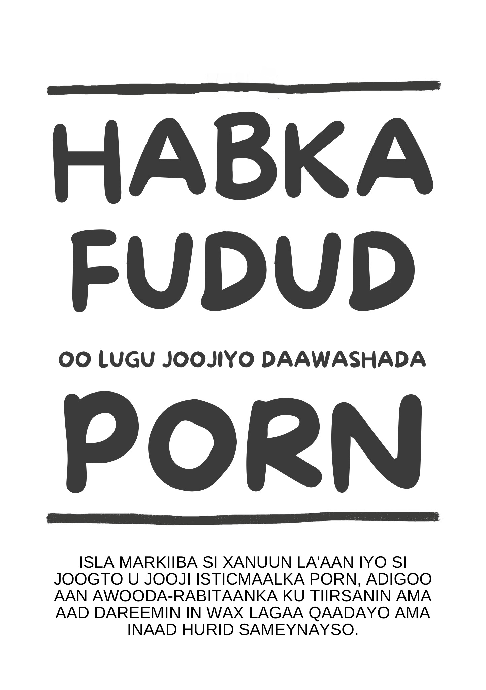

# Hordhac

{width=45% height=45%}

HA CUTUB-BOODIN

Buugaan oo open-source-ka ah wuxuu awood kugu siin doonaa inaad isla markiiba si xanuun la'aan iyo si joogto u joojiso isticmaalkaaga porn, adigoo aan awooda-rabitaanka ku tiirsanin ama aad dareemin in wax lagaa qaadayo ama inaad hurid sameynayso. Ma jiri doono xukun, ceebees, ama cadaadis inaad marto talaabooyin oo xanuun badan.

Dhab ahaantii, xataa looma baahna inaad isticmaalkaaga iska dhimtid markaad buugaan akhrinayso: in sidaas la sameyo waxay dhaawac ku noqonay soo kabashadaada.

Waxaa laga yaabaa in adiga, ama [malaayiinka](https://old.reddit.com/r/nofap) oo kale oo [isku](https://old.reddit.com/r/pornfree) [dayayaan](https://rebootnation.org) inay [joojiyaan](https://yourbrainrebalanced.com), aad ka walwalsan tihiin fikrada sii waddida isticmaalka porn. Haddii ay sidaas tahay, waxa oo aad hadda akhrisay waxay lid ku tahay wax walba oo laguu soo sheegay. Laakin is weydii haddii wixii oo laguu soo sheegay ay shaqayeen. Haddii ay sidaas ahaan lahayd, ma akhrin lahaydeen buugaan.

Waxaa laga yaabaa inaad isku garato su'aalaha soo socda:

-   Waqti ka badan maad ku qaadataa daawashada porn intaad markii hore ugu talagashay?

-   Ma ku guul dareysatay dadaalkaaga inaad joojisid ama xaddiidid isticmaalkaaga porn?

-   Waqtiga daawashada porn ma farageliyay ama mudnaan ka qaatay ballanqaadyada shaqsi ahaaneed ama xirfadeed, hiwaayadaha, ama xiriirka noloshaada?

-   Ma dadaashaa inaad isticmaalkaaga porn qariso (tusaale: tirtirida taariikhda browserka ama ka been sheegida daawashada porn)?

-   Daawashada porn ma kuu keentay dhibaatooyin la taaban karo intaad ku jirto xiriirada hoose?

-   Ma la kulantaa wareeg oo kacsi iyo raaxaysi ah ka hore iyo intaad porn isticmaalayso, oo kaasi ku xigo dareeman oo ceeb, dembi, iyo qoomamo ah ka dib?

-   Ma ku qaadataa waqti badan adigoo porn ka fikirayso, xataa markaanad daawanaynin?

-   Daawashada porn ma kuu keentay cawaaqib xumo oo kale ee noloshaada shaqsi ahaaneed ama xirfadeed (tusaale: shaqo laga seegtay, waxqabad liidata, xiriirada la dayacay, dhibaatooyinka dhaqaale)?

Haddii aad tahay isticmaale oo porn ku tiirsan siigaysashada ama galmada dartood ama sababo kale *oo dhan*, waxa kaliya ee aad u baahan tahay waa inaad sii waddo akhrinta. Haddii aad halkaan u joogto qof oo aad jeceshahay, waxa kaliya ee aad u baahan tahay waa inaad ku qanciso inay buugaan akhriyaan. Laakin haddii aadan ku qancin karin, adiga naftigaaga akhri buuga. Fahamka habka waxay ka caawisaa gudbinta fariinta, waxayna ka hortagtaa carruurtaada inay isticmaalka porn bilaabin. Ha ku kadsoomin xaqiiqda inaysan hadda porn heli karin - dhammaantooda ayaa ku kadsooma ka hor intaysan la qabatimin.

## Warbixin oo ku saabsan buuga {-}

Buugaani waa nooc oo dib laga qoray buugga Allen Carr: *The EasyWay to Stop Smoking* oo loo habeeyay balwadda porn. Waa lacag la'aan iyo open source, waxaana shati siiyey CC-BY-SA. Guusheeda waxay ku xiran tahay aasaasiga inaadan:

CUTUB-BOODIN

Markaad furayso quful oo isku dhafka ah, waa inaad si saxsan u gelisa lambarada. Balwadduna waxba kama duwana.

Shaqsi ahaan, [nooca Google Sites-ka oo asalka ah](https://sites.google.com/site/hackbookeasypeasy) (oo aan aniga qorin) ayaa noloshayda beddelay. Haddii aad la mid tahay dadka intooda badan, waxaad porn heshay markaad yar-yareed iyo sida markaas ayaa iska isticmaalaysi. Taasi waxay ahayd ilaa aad la kulantay suugaanta xad-dhaafka ah - oo weli faafreebka ah - oo ka digaysa khataraha. Sida anigoo kale, waxaa laga yaabaa inaad ku guuleysatay ilaaliska xariijimaha dheerarka oo kala duwan, laakin had iyo jeer waxaad ugu dambeyntii u tanaasulaysi damacyo oo dhalanteed ah. Waxaan ku faraxsanahay inaan sheego in habkaani uu si ka duwan u shaqeeyo, iyo inuu ahaayay habka kaliya oo shaqeeya. 

Mise waxaa laga yaabaa in qof oo adiga kaa danqanaayey uu ku siiyay linkiga buugaan, oo aad ka shakisan tahay inuu shaqayn doono. Kowdi, waad ku mahadsan tahay ugu yaraan fiirinta buuga. Tani waa la faah-faahin doonaa muddo gaaban, laakin fadlan si kooban u xasuuso markii ugu horeysay oo aad porn daawatay. Ma filaysay inaad ku noqon doonto inta noloshaada ka haray? Sida laga soo xigtay daraasaddayda oo rasmiga ahayn ee arrinta (ku cadaadiska saaxibadayda inay buugaan akhriyaan), EasyPeasy wuxuu si la mid ah waxtar ugu leeyahay isticmaalaha caadiga ah sida uu ugu leeyahay balwadaha culus. Aad uma dheera, wuxuuna leeyahay fursad sarreysan ee faa'iidooyin waaweyn. Marka waxaan kaa baryayaa inaad sii akhriso.

Habka oo buugaan lagu sifeeyay waa:

-   Mid deg-deg ah.

-   Mid oo si la mid ah waxtar u leh isticmaalayaasha oo culuska ah iyo kuwa oo iska caadiga ah.

-   Mid aan keenin xanuun ka-noqosho xun.

-   Mid oo loo baahnayn awooda-rabitaan.  

-   Mid oo loo baahnayn daaweyn oo naxdin leh, ama xeelado oo doqonimo ah.

-   Mid oo keenaynin inaad ku beddesho balwaddaan balwadaha kale (tusaale: cunista xad dhaafka ah, sigaarka, ama khamriga).

-   Mid joogto ah.

Waxaa laga yaabaa inaad u aragto middaan inay suurtagal ahayn in la aamino, laakin dareenkaan waa wax oo dad badan ka dhawaajiyeen:

> *"Buugaani waa shaqo oo aad u saamaynaysa oo ku saabsan balwadda porn."*
>
> --- Nin aan Reddit ka heli karin. Uma maleynaayo in kaftanka uu ahaa mid ula kac ah.

> "*Toban sano ayaan balwad u lahaayay. Tobankaas sano waxaa i curyaamiyey niyad-jab, shaki, walaac, iyo cabsi in sirtayda ay soo baxdo. Fadhi kasta ka dib, naftayda dhan aan nacaybi jiray, iyo porn-qaadashada nidaamsan walba ka dib, waxaan is arkay aniga oo si deg-deg u dib-siibtay simbiriirixanta biyaha. laakin buugaani wuxuu iga caawiyay joojinta. Waagii hore, waxaan had iyo jeer ku jiray difaaca ka dhanka ah porn-ka. Hadda ka dib, markaan laba jeer akhriyay buugaan, waxaan ku socdaa weerarka. Porn xukun iguma hayso, iyo hadda waxay u dareemaysaa kaftan oo murug leh.*"
>
> --- u/DeepNewt

> "*Maalmo ka hor, waxaan noqday 20 jir. Markii ugu horeysay muddo aad u dheer, waxaan ku qaatay dhalashadayda anigoo porn xor ka ah, waana mahad dhammaantiis buugaan oo aan si kadis ah ula kulmay dhowr bilood ka hor. Inta ka hor, waqti badan ayaan isku dayaayay inaan joojiyo anigoo isticmaalaya qaab dhaqameed, waxaanan la kulmay khalkhal badan oo gudaha ah waxaanan naftayda ugu calaamadiyay balwad joogto ah. laakin buugga intaas oo dhan ayuu ii xalliyay. Meeshii aan markii hore ka baqaayay inaanan naftayda xukumi-karin, xataa markaan garan waayay inaan horeyba ka guuleystay shaydaanka yar, waxaan hadda ku faani karaa inaan garwaaqsado inaanan u baahnayn inaan sii ahaado qof oo balwad leh.*
>
> *Run ahaantii ma hayo sabab oo aan ku dhejiyo arrintaan, waxaan dareemaayay inaan u baahanahay inaan meel kale oo madaxayga ahayn ku dhejiyo arrintaan, waayo macno weyn ayay ii la tahay. Haddii aad tan akhrinayso oo aad ka fikirayso inaad buuga akhriso ama aad ku taliso, iga qaado inuu ka fiican yahay hababka kale oo jiraan. Taladayda ugu weyn waa qaadashada qoraalka, taas oo u muuqda mid oo qosol leh, laakin waxay iga caawisay inaan [maskaxdayda ku] adkeeyo fikradaha qaarkood.*"
>
> --- u/Suspicious_Web_4594

> "*based*"
>
> --- anon, /fit/

## Digniin

Haddii aad filayso in buugaani uu kaa "cabsiiyo" inaad joojisid isagoo isticmaalaya arrimaha caafimaadka oo kala duwan (oo ay ku jiraan kacsi-la'aanta oo porn keento), kacsi-galmo aan la isku halayn karin, dhuminta xiisaha lammaanaha galmada dhabta ah, ama hypofrontality, mise eedaynta inay tahay dhaqan oo wasakh ah iyo inaad doqon tahay oo uu rabitaankaaga daciif yahay, aad ayaad u niyad jabi doontaa. Xeeladahaas weligooda igama caawinin inaan joojiyo iyo haddii ay adiga kaa caawin lahaayeen, mar horeyba ayaad iska joojin lahayd.

Hababka caadiga oo joojinta waxay u doodaan isticmaalka awooda-rabitaanka, ama hababka beddelkood ee "porn-qaadashada la nidaamay" sida "isticmaalka hal mar dhowrki maalmood" ama isku dayga in si tartiib-tartiib loo yareeyo isticmaalka. Mareegaha qaar ayaa liis gareeyaan cilmi-baaris oo ku saabsan neurotransmitters iyo neuroplasticity, iyo halka oo ay mareegahaan wargelin yihiin, dad badan ayaa horeyba ka warqabaan khataraha caafimaadka waxayna doortaan inaysan waxba ka qabanin, in kasta oo mareegahaas oo kale inta caadiga laga foogado. Ugu dambeyntii waxay si isku mid ah u yihiin kuwa oo aan waxtar lahayn waayo dhab ahaantii meesha ma ka saaraan sababaha isticmaalka porn. Ugu dambeyntii, in wax mira la mamnuucay laga dhigo ma aha sida balwad loola dhaqmo.

Habkaan, oo loo yaqaan EasyPeasy, wuxuu u shaqeeyaa si ka duwan. Waxyaalaha oo la sheegaayo qaarkood way adkaan karaan in la aamino, laakin markaad buugaan dhammeeyso, ma aamin doontid kaliya, laakin waxa kale oo aad la yaabi doonta waa sida aad weligaaga maskaxda lagaa xaday si aad si kale u aaminto.

Waxaa jira fikrad khaldan oo la wada yeeshtay oo ah inaan dooranno inaan porn daawano. Balwadaha porn (haa, balwadlayaasha porn) waxay doortaan inay daawadaan porn wax oo ka badnayn in balwadaha khamriga ay doortaan inay noqdaan balwadaha khamriga, ama balwadaha heroinka ay doortaan inay noqdaan balwadaha heroin. Waa run inaan dooranno inaan shidno laptop-ka ama taleefanka, oo aan furno browserka, oo aan booqano '*haremka*' aan ugu jecelnahay. Marmar, waxaan doortaa inaan aado shineemo, laakin waxaa hubaal ah inaan dooranin inaan noloshayda oo dhan ku qaato masraxa shineemada. Markii hore, xiisaha iyo dabeecadda bini'aadamka ayaa meeshaas i geeyey, laakin ma billaabi lahayn haddii aan ogaan lahaayay inaan balwad yeelan doono, taasi oo keento hoos u dhaca caafimaadkayga, farxaddayda iyo xiriirkayga. *"Haddii aan kaliya maqli lahaayay wax oo ku saabsan cillada galmada booqashadaya ugu horeysay mareegtaas porn!"*

Hal daqiiqad qaado si aad u milicsato, weligaaga ma qaadatay go'aanka inaad porn u baahan tahay si aad u siigaysato? Ama inaad u baahan tahay khiyaaliga oo porn-keenaysa si aad u kala-kiciso galmada oo aad lamaanahaaga la sameyso? Ama in waqtiyada noloshaada qaarkooda aadan ku raaxaysan karin hurdada habeen wanaagsan, ama laga yaabo inaad xataa dhaafi karin fiidkii oo maalinta shaqa-adagta ka dib adigoon porn raadinin? Mise la'aanted inaadan diirad-saari karin ama aad walbahaarka xamili karin? Marxaladee go'aansatay inaad porn u baahan tahay, inaad si joogto ah noloshaada ugu baahan tahay, adigoo kalsooni darro dareemaysa, xataa argagax marka haremkaaga onlineka la'aanteed? 

Sida qof kasta oo porn isticmaalo, waxaa lagugu soo jiiday dabinka ugu xun oo uguna khiyaanada badan oo bini'aadamka iyo dabeecadda ay weligood isku darsameen inay hindisaan. Ma jiro qof doob ah oo nool, haddii ay naftigooda isticmaalayaasha yihiin ama in kale, oo jecel fikirada oo carruurtooda porn isticmaalayaan si ay noloshooda ula qabsadaan ama raaxada darteed. Tani waxay ka dhigan tahay in balwadaha dhammaantooda ay jeclaan lahaayeen inaysan weligooda bilaabin. Taasi waa wax oo aan yaab lahayn: qofna uma baahna porn si uu nolosha ugu raaxaysto ama si uu walbahaarka ula qabsado intuusan la qabatimin. 

laakin isla markiiba, isticmaalayaasha dhamaantooda waxay rabaan inay isticmaalkooda sii wataan. Ka dib oo dhan, ma jiro qof oo nagu qasbaya inaan furno qaabka browserkaynaha oo qarsoodiga ah. Haddii ay fahmaan sababta ama in kale, waa isticmaalayaasha kaliya kuwa oo go'aansada inay garaacaan albaabbada haremkooda. 

Haddii uu jiri lahaayay badhan oo sixir leh oo isticmaalayaasha riixi kareen inay u soo kacaan subaxda soo socota iyagoo aan weligooda marin mareegtooda porn ugu horeysa, balwadaha kaliya oo berrito jiraan waxay noqon lahaayeen dhalinyarada oo weli 'tijaabinaaya'. 

Waxa kaliya oo naga xayiraaya inaan joojino waa **CABSI!** Cabsida oo ka imaanaysa aaminsanaanta inaan ku noolaan doono waqti oo la hubin oo rafaad, quusasho, iyo damac oo la qancinin leh si aan porn uga xorowno. Kuwaas waxaa laga abuuray aaminsanaan oo caqli-galaynin, kuwa la bartay iyo kuwa la helay, sida:

-   Siigaysashada iyo galmada oo orgasmka (biyo-baxa) u horseeda waa waxa *kaliya* oo nolosha *ugu* muhiimsan.

-   Porn ayaa ka 'amaansan' galmada nolosha dhabta ah waayo porn ma i-diidii karta.

-   Porn waa waxbarasho wayna faa'iido badan tahay.

-   Dareenka inaad xaq u leedahay khibrad galmo oo "ka sarreeya."

-   Wax badan ayaa had iyo jeer ka fiican.

Aaminsanaantaan oo caqliga galaynin waxay dhalinayaan cawaaqib caqli-galaynin markii lagu dhaqmo, oo ay ku jiraan:

-   Cibaadada iyo waswaaska mar kasta oo qof '10/10' kaamil ah la helo.

-   U-aragtida naftaada sida qof oo khasaaray haddii aad ka seegato galmo, sida haddii ay tahay wax oo khibradda bini'aadamka ugu muhiimsan.

-   Sugitaanka inuu qof 10/10 noqdo.

-   Inaad si xad dhaafsan u xukunto oo aad u naqdeyso lammaanayaasha galmada oo mustaqbalka ah.

-   Isku-qasbinta inaad galmo sameyso haddii aad rabtid ama in kale.

Waa cabsida in habeen oo kaligaaga tihid uu noqon doono mid oo aad u darxumeysan, inaad tamartaada ku khasaariso la dagaalanka damaca oo aan la xukumi karin. Waa cabsida in habeenka ka horreeya imtixaan uu noqon doono habeen oo cadaab ah porn la'aanteed. Waa cabsida inaan weligeena awoodi karin inaan diirad saarno, walbahaarka xamilno, ama aan isku kalsoonaanno “taageerteena” yar la'aanteed iyo in shaqsiyadeenna iyo dabeecadeena ay isbeddeli doonaan.

laakin inta badan oo dhan, waa cabsida in 'mar haddii aad tahay qof oo balwad leh, waxaad weligaagaahaan doontaa mid balwad leh': cabsida inaanan weligeena xor ka ahaan doonin, annagoo ku bixinayna inta nolosheenna ka haray anagoo damacoono orgasmka oo porn keento ee waqtiyo caadi ahayn. Haddii aad mar hore isku dayday siyaabaha caadiga ah dhamaantood si aad isaga tagto, sidaan sameyay, oo aad soo martay rafaadka iyo cadaabka 'habka awooda-rabitaanka," cabsidaas ma ku saameyn doonto kaliya, laakin sidoo kale waxaad ku qanacsan doontaa inaadan weligaaga joojin karin.

Haddii aad ka walwalsan tahay, argagaxsan tahay, ama aad dareemayso inuu waqtiga kugu habboonayn inaad joojiso, aan kuu xaqiijiyo in walwalka iyo argagaxta porn kaa nafisaynin - porn waa sababta. Ma go'aansanin inaad ku dhacdo dabinka porn, laakin sida dabinnada dhamaantood, waxaa loogu talagalay inay hubiso inaad ku sii xayiran tahay. Is weydii, markii ugu horeysay oo aad daawatay sawirada iyo muuqaalada porn, ma waxaad go'aansatay inaad dib ugu soo laa-laabato si aad u daawato intaad nooshahay? Haddaba goormaad joojin doontaa? Berrito? Sanadka soo socda? Naftaada ha khiyaamin! Dabinka waxay ugu talagalayn inay ku hayso nolashaada oo dhan. Waa maxay sababta kale oo aad u malaynayso in kuwan balwadda leh dhamaantood aysan joojinin ka hor intaysan porn noloshooda 'dillin'?

Waxaan tixraacay batoon oo sixir leh; EasyPeasy wuxuu u shaqeyaa sida batoonkaas sixirka oo kale. Aan si cad u caddeeyo, EasyPeasy sixir ma aha, laakin aniga iyo kuwa kale oo u arkay inay fududahay oo ay ku raaxaystaan ​​joojinta, waxay u muuqataa sidaas!

Digniinta waa sida oo soo socota: 
Tani waa xaalad digaag-iyo-ukun: qof kasta oo balwad leh wuxuu rabaa inuu joojiyo, iyo qof kasta oo balwad leh wuxuu u arki karaa in joojinta ay fududaysan tahay iyo raaxaysan tahay. Waa **cabsi** kaliya oo ka celisa isticmaalayaasha inay isku dayaan joojinta. Faa'iidada kaliya oo ugu weyn ayaa ah in laga takhaluso cabsidaas, laakin cabsidaas kama bixi doontid ilaa aad buuga dhammaystirto. Taasi lidkeeda, cabsidaada way kordhi kartaa adigoo akhrinayso, taasi oo laga yaabo inay kaa celisa inaad dhammayso. Faalladan ka soo qaado hal dumar ah.

***"Hadda waxaan dhameeyay akhrinta EasyPeasy, waan ogahay inay afar maalmood kaliya ka soo wareegatay, laakin wanaag ayaan dareemayaa, waxaana ogahay inaanan weligayga u baahnayn inaan isticmaalo porn mar kale. Waxaan bilaabay akhrinta buugaaga shan bilood ka hor, laakin waxaan gaarey kala barkiis oo aan kadibna ka argagaxay. Waxaan ogaayay haddii aan akhrinta sii waddo, inaan ugu dambeyntiisa joojinaayo daawashada porn. Nacasnimo ma ahaynoo?"***

Ma go'aansanin inaad dabinka ku dhacdo, laakin maskaxdaada ku caddee: kama baxsan doontid ilaa aad go'aan adag ka qaadato. Waxaa laga yaabaa inaad xariga la jiitamayso si aad u joojiso, ama waxaa laga yaabaa inaad ka walwalsan tihid fikirada, laakin si kastaba ha ahaatee, mar walba niyada ku hay: **WAX OO KAA KHASAARAAYO MA JIRO!**

Haddii aad dhamaadka buugga go'aansato inaad rabto inaad sii wadato isticmaalka porn siigaysashada ama galmada darteed, marka ogow inaysan jirin wax oo kaa celinaaya inaad sidaas sameyso. Xataa uma baahnid inaad iska jarto ama aad joojiso isticmaalka porn markaad buugaan akhrinayso, iyo xasuusnow inaysan jirin daaweyn oo naxdin leh. Lidkeeda, waxaan kaliya idiin hayaa war wanaagsan. Ma qiyaasi kartaa sida uu dareemay Andy Dufresne markuu ugu dambeyntii ka baxsaday xabsiga Shawshank? Taasi waa sida oo aan dareemay markaan dabinka porn ka baxsaday, taasina waa sida isticmaalayaashii porn oo hore oo EasyPeasy isticmaaleen ay dareemeen. Iyo dhamaadka buuga, taasi waa sida oo aad dareemi doonto! U bax! 

## Ugu Dambeyntii... {-}

Qof kasta wuxuu u arki karaa in joojinta porn ay fududahay oo ay raaxaysan tahay, adigoo ka mid ah! Waxa kaliya ee ay tahay waa inaad buugaan si maskax furan u akhriso; Inta ka badan oo aad fahanto waa inta ka badan ay kuu fududaanayso. Xataa haddii aadan hal eray ka fahmin, waxaad u arki doontaa inay fududahay ilaa inta aad tilmaamaha raacdo. Tan ugu muhiimsan, ma mari doontid nolosha adigoo niyad-jab dareemaysid porn la'aanta darteed, mana dareemaysid in wax lagaa qaaday, iyo, dhamaadka buuga, qarsoodiga kaliya oo jiri doona waa sababta oo aad muddo dheer u sameysay.

Isagoo EasyPeasy ah, waxaa jira laba sababood kaliya oo lagu guul dareysto.

**Guul darada inaad tilmaamaha raacdo.**
Dadka qaarkood waxay u arki doonaan inay dhibsadaan in buuga uu aad ugu adag yahay mabaadi'da qaarkood, sida inaan la isku dayin in porn si tartiib tartiib loo yareeyo, ama aan isticmaalin beddelka porn. Run ahaanti, ma dafiri karo inay jiraan qaar badan oo ku guuleysteen inay joojiyaan iyagoo isticmaalayaan xeeladaha oo noocaas ah, laakin waxay ku guuleysteen in kasta oo ay xeeladahaas jiraan - oo aysan sababta ahayn. Dadka qaarkood waxay galmo sameyn karaan iyagoo ku dhex taagan hammock-ka (leexo) laakin ma aha habka ugu fudud. Lambarada lagu furaayo qufulka dabinkaan waxay ku jiraan buugaan, laakin waxay u baahan yihiin in loo isticmaalo isku xigxiga saxda ah: in laga bilaabo hal cutub oo loo gudbo kan ku xiga iyadoon la cutub-boodin.

**Guul darada inaad fahamtid.**
Waxba ha u qaadanin wax iska caadi ah. Ma aha inaad su'aal ka keenta waxyaalaha oo laguu sheego kaliya, laakin waa inaad sidoo kale su'aal ka keento aragtidaada iyo waxyaalaha ay bulshada kuu sheegtay oo ku saabsan galmada, isticmaalka porn, iyo balwadda. Tusaale ahaan, kuwa u maleynaya in porn ay tahay caado kaliya, is weydii sababta caadooyinka kale - xataa markay raaxo leeyihiin - ay fududaysan yihiin in la jebiyo, oo halkaan "caado" oo aad u xun u dareemaya oo qaadanaya tamartaada, waqtigaaga, iyo ragnimadaada, ay aad u adag tahay in la jebiyo. Kuwa oo aaminsan inaad porn ku raaxaysatiin, is weydii sababta oo aad si fudud u joojin kartiin waxyaabo kale oo aad uga sii jeceshihiin. Waa maxay sababta oo aad ugu baahan tihiin inaad porn haysatiin, oo aad argaggixisiin markaadan haysanin?

EasyPeasy wuxuu u dhowyahay inuu ku siiyo aqoonta ku saabsan sida ay u fududahay iyo sida ay u raaxaysan tahay inaad iskaga joojiso daawashada porn. Sida dadka kale intooda badan, mid ka mid ah guulahayga ugu weyn ee nolosha waa ka-baxsashada dabinka porn. Looma baahna inaad niyad jab dareento, laakin lidkeed, waxaad u dhowdahay inaad gaarto wax oo qof walba oo porn isticmaalo uu jeclaan lahaayay inuu gaara: **XORIYADA!**

**XASUUSNOW, HA CUTUB-BOODIN.**

Erayada qaarkood intaadan bilaabin:

***Porn***: buugaagta, majalahada, muuqaalaha, filimada, ama nooc walba oo warbaahin ah oo loogu talagalay in la sababo kacsi galmada iyadoo la tusaayo dad qaawan ama la tixraacaya falalka galmada. Waxaa sidoo kale loo yaqaanaa: filimada xunxun, aflaanta xun, filimaanta xun, filimaanta galmada, iwm.  

***PMO***: Wareega daawashada porn, siigaysashada, iyo orgasmka (biya-baxa).

***Harem***: Mareegaha oo haystaan porn oo xawaare-sare ah.

***Maskax-xadashada:*** Cadaadis ama dadaal nidaamsan oo lagu talagalay in qof wax been la aaminsiiyo. Tusaale: Qofka oo marar badan wax loo sheegay ilaa ay ka aaminaan inay run tahay.

***Kicinta Xad-dhaafsan oo aan Caadiga Ahayn***: Kiciye walba oo keenaya jawaab oo ka xad-dhaafsan jawaabta kicinta caadiga oo dabiiciga ah. Tusaale: Porn waa kiciye oo keenaysa kacsiga galmada oo ka xad-dhaafsan kacsiga galmada oo dabiiciga ah.

## Taloyaal markaad buuga akhrinaysid iyo qoraalada yaryar ugu dambeeya

**Ha u akhrinin kan sida buug oo caadi ah**, aad buu u gaaban yahay, waana inaad ku dhammayn karta gudaha dhowr saacadood. Dadka intooda badan waxay ka faa'iidaystaan *iftiiminta* ama *qaadashada qoraallada*, waxayna badanaa talinayaan inaad **dib u akhriso** dhowr jeer si aad casharrada maskaxdaada ku adkeeyso. 

Muxuu buugaani u yahay hackbuug? Maadaama uu Allen Carr muddo dheer tan iyo markuu dhintay: iyo hay'adaha uu abuuray porn uma ma liis gareyaan sida mid ka mid ah balwadaha ay daaweynta u bixiyaan. Wax oo lacag ah kama heli arrintaan ama in kale.

Buugaan oo dhan, aniga iyo qoraaga asalka iyo Allen Carr ayaan si hufan u soo muuqan doonna si aan ku siino hab gaar oo xoog leh si aad si fudud iyo xanuun la'aan u joojiso.

**Hackbuug:** Buug oo buug kale ku salaysan, oo qoraaga asalka ah la siiyay ammaanta buuxda. 

Tiro bulshooyin oo online ah ayaa u jira hackbuugaan, laakin waxaan kugula talinaayaa inaad kaliya booqato markaad akhrinta buuga dhammeeyso.

[urbit](https://urbit.org) - ~mislyr-midnyt/coomer (Hadda si fiican bay u shaqaynaysaa! Tan isticmaal si aad ila soo xiriirto!) | [coomer meme archive](https://coomer.org) | [xogta gorfaynta](https://plausible.io/easypeasymethod.org) | [matrix](https://matrix.to/#/!xmJZznbJXuwzEGSEti:matrix.org?via=matrix.org) | [discord](https://discord.com/invite/bCXEnf9) | [reddit](https://reddit.com/r/pmohackbook) | [foomka jawaab-celinta](https://forms.gle/p7cTxowaNpKqgi5Z7)

Xasuusin degdeg: **HA CUTUB-BOODIN**

Waxaan kuu rajayn lahaayay nasiib, laakin sida oo aad mar dhow ogaan doonto, uma baahnaanaysid.

Dareen wanaagsan,

Hackauthor²

{width=88 height=31}

This work is licensed under a [Creative Commons Attribution-ShareAlike 4.0 International License](https://creativecommons.org/licenses/by-sa/4.0/). Code is [GPLv3](https://gitlab.com/snuggy/easypeasy/-/blob/master/LICENSE).
