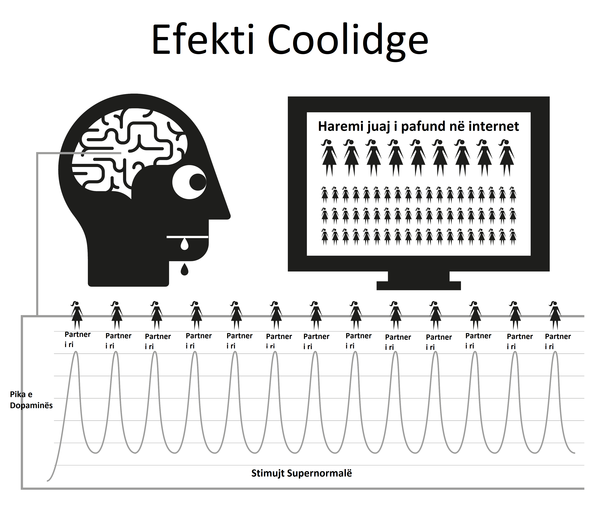

# Natyra

Pornografia në internet funksionon përmes rrëmbimit të mekanizmave natyrorë të shpërblimit të krijuar për t'ju mbajtur të riprodhoni për aq kohë sa të jetë e mundur. Forma e menjëhershme dhe shumë e aksesueshme e pornografisë në internet e mban mekanizmin e shpërblimit të trurit që prodhon dopaminë për shumë më gjatë sesa zakonisht është e mundur. Shkencërisht, ky quhet efekti Coolidge, për të cilin mund të jeni tashmë të vetëdijshëm.

Dopamina është një neurotransmetues i lidhur me ndjenjat e dëshirës, ​​me kënaqësinë aktuale të prodhuar nga opioidet. Më shumë dopaminë, më shumë opioidë dhe më shumë veprim. Pa dopaminë, veprime të tilla si ngrënia nuk ndihen të këndshme dhe nuk përfundojnë, me ushqimet me yndyrë të lartë dhe sheqer që prodhojnë lirimin më të lartë kimik.

Dopamina lëshohet gjithashtu si përgjigje ndaj risisë. Me një sasi në dukje të pafundme pornografie të disponueshme, kjo përmbyt sistemin limbik (qarku i shpërblimit), kështu që herën e parë që shihni pornografi ju veproni, duke orgazmuar dhe duke shkaktuar një përmbytje tjetër të opioideve. I nxitur për të marrë sa më shumë dopaminë të jetë e mundur, truri e ruan këtë si një skenar për rikujtim të lehtë dhe forcon rrugët nervore përmes lëshimit të një kimikati të quajtur DeltaFosB. Tani, truri i thërret këto shtigje në përgjigje të sinjaleve të tilla si reklamat seksi, qëndrimi vetëm, stresi apo edhe ndjenja pak e zhgënjyer dhe papritmas ju jeni gati të bëni një udhëtim në "rrëshqitësin e ujit". Sa herë që kjo përsëritet, lëshohet më shumë DeltaFosB, kështu që rrëshqitja e ujit është e yndyrshme, e gjallë dhe më e lehtë për t'u zbritur herën tjetër.

Sistemi limbik ka një sistem vetë-korrigjues për të shkurtuar numrin e receptorëve të dopaminës dhe opioideve kur zbulohet vërshimi i shpeshtë dhe i përditshëm i dopaminës. Fatkeqësisht, këta receptorë nevojiten gjithashtu për të na mbajtur të motivuar për të përballuar streset e përditshme. Sasitë nominale të dopaminës të prodhuara nga shpërblimet natyrore thjesht nuk krahasohen me pornografinë dhe nuk përthithen në mënyrë efikase nga receptorët e zvogëluar, duke ju bërë të ndiheni më të stresuar dhe të irrituar se normalisht. Ky proces njihet si desensibilizimi.

Në këtë cikël ju e keni kaluar ‘vijën e kuqe’ dhe keni shkaktuar emocione të tilla si faji, neveria, siklet, ankthi dhe frika, të cilat nga ana e tyre rrisin nivelet e dopaminës edhe më lart dhe bëjnë që truri t'i keqinterpretojë këto ndjenja si zgjim seksual.

Me kalimin e kohës, truri jo vetëm që është i pandjeshëm ndaj klipeve të mëparshme që shihen, por edhe zhanreve të ngjashme dhe nivelit të tronditjes. Ky motivim më i ulët shkakton ndjenjën e kënaqësisë më të ulët pasi truri ynë angazhohet në vlerësim të vazhdueshëm, duke ju shtyrë të gjeni klipe për të kënaqur urinë. Kështu që ju kërkoni më shumë risi, duke klikuar në klipin amator dhe tronditës në faqen kryesore që me besim thatë se nuk do ta bënit në vizitën tuaj të parë.

> *“Sepse në vesën e gjërave të vogla zemra gjen se është mëngjes dhe freskohet"*
>
> --- Kahlil Gibran

Një ndjenjë kalimtare sigurie është gjithçka që nevojitet për të kapërcyer një pikë të vështirë në jetë, por a do të jetë në gjendje truri juaj i desensibilizuar të kapë atë pikë qetësuesi që truri i një jo-përdoruesi është në gjendje të përdorë?

Vërshimi i dopaminës vepron si një ilaç me veprim të shpejtë, duke rënë shpejt dhe duke shkaktuar dhimbje të tërheqjes. Shumë përdorues kanë iluzionin se këto dhimbje janë trauma e tmerrshme që pësojnë kur përpiqen ose detyrohen të ndalojnë. Në fakt, ata janë kryesisht mendorë pasi përdoruesi ndihet i privuar nga kënaqësia ose mbështetja e tyre.

## Përbindëshi i Vogël

Tërheqja aktuale kimike nga pornografia është aq delikate saqë shumica e përdoruesve kanë jetuar dhe vdekur pa e kuptuar se janë të varur nga droga. Shumë përdorues kanë frikë nga droga, por kjo është pikërisht ajo që ata janë, të varur nga droga. Për fat të mirë, është një drogë e lehtë për t'u goditur, por së pari duhet të pranoni se jeni, në fakt, i varur. Tërheqja nga pornografia nuk shkakton ndonjë dhimbje fizike dhe është thjesht një ndjenjë e zbrazët, e shqetësuar e diçkaje që mungon, kjo është arsyeja pse shumë besojnë se ka të bëjë me dëshirën seksuale. Për një kohë të gjatë, kjo ndjenjë bëhet nervozizëm, pasiguri, agjitacion, vetëbesim të ulët dhe nervozizëm. Është si uria, për një helm.

Brenda pak sekondash nga përfshirja në një seancë, dopamina furnizohet dhe dëshira përfundon, duke rezultuar në një ndjenjë përmbushjeje ndërsa lëvizni poshtë rrëshqitjes së ujit. Në ditët e para, dhembjet e tërheqjes dhe lehtësimi i tyre i mëvonshëm janë aq të lehta sa nuk jemi në dijeni të tyre. Kur bëhemi përdorues të rregullt, ne besojmë se kjo është për shkak se kemi ardhur t'i shijojmë ata ose kemi marrë "zakon". E vërteta është se ne tashmë jemi të lidhur, por nuk e kuptojmë. Përbindëshi i vogël është tashmë në trurin tonë, kështu që herë pas here bëjmë udhëtime nëpër rrëshqitësin e ujit për ta ushqyer atë.

Të gjithë përdoruesit fillojnë të kërkojnë pornografi për arsye të paarsyeshme. Arsyeja *e vetmja* që dikush vazhdon të përdorë pornografi, pavarësisht nëse është përdorues i rastësishëm apo i rëndë, është të ushqejë atë përbindësh të vogël. E gjithë enigma është një seri dënimesh mizore dhe konfuze, por ndoshta aspekti më patetik është ndjenja e kënaqësisë që një përdorues merr nga një seancë, duke u përpjekur të rikthehet në ndjenjën e paqes, qetësisë dhe besimit që trupi i tyre kishte përpara se të lidhej në vend të parë.

## Alarmi i bezdisshëm

E dini atë ndjenjë kur alarmi i shtëpisë së një fqinji ka rënë gjatë gjithë ditës - ose ndonjë përkeqësim tjetër i vogël i vazhdueshëm - atëherë zhurma ndalet papritur dhe ndjenjat e mrekullueshme të paqes dhe qetësisë ju pushtojnë? Kjo nuk është në të vërtetë paqe, por fundi i një përkeqësimi. Para fillimit të seancës tjetër, trupat tanë janë të kompletuar, por më pas fillojmë të detyrojmë trurin tonë të pompojë dopaminën dhe kur të mbarojmë dhe ajo fillon të largohet, ne vuajmë dhembjet e tërheqjes. Këto nuk janë dhimbje fizike, thjesht një ndjenjë boshe. Ne as nuk jemi të vetëdijshëm se ekziston, por është si një rubinet që pikon brenda trupit tonë.

Mendjet tona racionale nuk e kuptojnë atë, por nuk kanë nevojë. Gjithçka që dimë është se duam pornografi dhe kur masturbohemi, dëshira na shkon. Megjithatë, kënaqësia është kalimtare, sepse për të lehtësuar dëshirën kërkohet më shumë pornografi. Sapo arrini orgazëm, dëshira fillon përsëri dhe kurthi vazhdon t'ju mbajë. Një qark reagimi, nëse nuk e prishni atë!

Kurthi i pornografisë është i ngjashëm me veshjen e këpucëve të ngushta vetëm për të fituar kënaqësinë e heqjes së tyre. Ekzistojnë tre arsye kryesore pse përdoruesit nuk mund ta shohin atë në këtë mënyrë.

1. Që nga lindja, ne kemi qenë subjekt i sasive masive të larjes së trurit duke na thënë se pornografia në internet është thjesht një tjetër zhvillim modern që zëvendësoi versionin e printuar të pornografisë. Ky gabim është i mbushur me të vërtetën se masturbimi nuk është i dëmshëm, kështu që pse të mos i besojmë?

2. Për shkak se tërheqja fizike e dopaminës nuk përfshin dhimbje aktuale, thjesht një ndjenjë boshe të pasigurt të pandashme nga uria dhe stresi normal, kjo ndjenjë manifestohet në një seancë pornografike pasi ato janë pikërisht ato raste kur ne priremi të kërkojmë pornografi në internet. Ne priremi ta konsiderojmë këtë ndjenjë si normale.

3. Megjithatë, arsyeja kryesore që përdoruesit dështojnë të shohin pornografinë e internetit në dritën e saj të vërtetë është për shkak të funksionimit të tij nga përpara. Pikërisht kur *nuk* po e konsumoni, vuani ndjenjën e zbrazëtisë. Për shkak se procesi i fiksimit është tepër delikat dhe gradual në ditët e para, ndjenja e boshllëkut konsiderohet si normale dhe kështu nuk fajësohet në seancën e mëparshme. Në momentin që shfletuesi aktivizohet dhe ju filloni seancën tuaj, ju merrni një nxitje të menjëhershme dhe bëheni më pak nervozë ose më të relaksuar, kështu që pornografia në internet merr meritën.

Ky proces i kundërt "nga mbrapa përpara" e bën të vështirë goditjen e të gjitha barnave. Imagjinoni gjendjen e panikut të një të varur nga heroina pa asnjë heroinë; tani imagjinoni gëzimin e tyre të plotë kur më në fund mund të fusin një gjilpërë në venë e tyre. Njerëzit që nuk janë të varur nga heroina nuk e vuajnë atë ndjenjë paniku.

Heroina nuk e lehtëson ndjenjën, ajo e shkakton atë. Në mënyrë të ngjashme, jo-përdoruesit nuk vuajnë nga ndjenja të zbrazëta të nevojës për pornografi në internet, ose paniku kur janë jashtë linje. Jo-përdoruesit nuk mund të kuptojnë se si përdoruesit mund të marrin kënaqësi nga videot dydimensionale me tinguj të heshtur dhe përmasa jonormale të trupit. Përfundimisht, përdoruesit nuk mund ta kuptojnë poashtu.

Ne flasim që pornografia në internet është relaksuese apo e kënaqshme, por si mund të jeni të kënaqur nëse nuk keni qenë të pakënaqur në radhë të parë? Një jo-përdorues nuk vuan nga kjo gjendje e pakënaqur, plotësisht e relaksuar pas një takimi pa seks, ndërsa përdoruesi nuk vuan derisa të ketë kënaqur 'përbindëshin e tij të vogël'.

## Një kënaqësi apo një mbështetëse?

Një kujtesë e rëndësishme – arsyeja kryesore që përdoruesit e kanë të vështirë të heqin dorë është për shkak të besimit se ata po heqin dorë nga një kënaqësi e vërtetë ose mbështetje. Është thelbësore të kuptoni se po hiqni dorë nga *absolutisht asgjë*. Mënyra më e mirë për të kuptuar hollësitë e kurthit të pornografisë është ta krahasoni atë me të ngrënit. Zakoni i vakteve të rregullta na bën që të mos ndihemi të uritur mes tyre, vetëm të vetëdijshëm për urinë nëse vakti vonohet. Nuk ka dhimbje fizike, vetëm një ndjenjë boshe e pasigurt e njohur si uri. Procesi i plotësimit të urisë është një përvojë shumë e këndshme.

Pornografia duket se është pothuajse identike, por nuk është. Ashtu si uria, nuk ka dhimbje fizike dhe mekanizmi i shpërblimit sillet në mënyra të ngjashme, por është kjo ngjashmëri me të ngrënit që e mashtron përdoruesin të besojë se ka një kënaqësi të vërtetë apo mbështetëse. Edhe pse ngrënia dhe pornografia duket se janë shumë të ngjashme, në realitet ato janë saktësisht të kundërta.

-   Ju hani për të mbijetuar dhe energjizuar jetën tuaj, ndërsa pornografia zbeh dhe pakëson mojo-n tuaj.

-   Ushqimi ka vërtet shije të mirë dhe të ngrënit është një përvojë vërtet e këndshme që e shijojmë gjatë gjithë jetës sonë. Pornografia përfshin vetë-sabotimin e receptorëve të lumturisë dhe kështu shkatërron shanset tuaja për të përballuar dhe për t'u ndjerë të lumtur.

-   Ushqimi nuk krijon uri dhe e lehtëson vërtet atë, ndërsa seanca e parë pornografike fillon dëshirën për dopaminën dhe çdo seancë pasuese. Larg nga lehtësimi i tij, ai siguron vuajtje për pjesën tjetër të jetës suaj.

A është të ngrënit një zakon? Nëse mendoni kështu, provoni ta thyeni plotësisht! Për të përshkruar të ngrënit si zakon do të ishte njësoj si të përshkruani frymëmarrjen si një zakon - të dyja janë thelbësore për mbijetesën. Është e vërtetë që njerëzit kanë zakon të kënaqin urinë e tyre në periudha të ndryshme me lloje të ndryshme ushqimesh, por të ngrënit në vetvete nuk është zakon. As pornografi. Arsyeja e vetme që një përdorues ndez shfletuesin është përpjekja për t'i dhënë fund ndjenjave boshe të krijuara nga sesioni i mëparshëm, në periudha të ndryshme me zhanre të ndryshme në rritje.

Në internet, pornografia përmendet shpesh si një zakon dhe për lehtësi EasyPeasy gjithashtu i referohet "zakonit". Sidoqoftë, jini vazhdimisht të vetëdijshëm se pornografia nuk është zakon, është **varësi ndaj drogës!** Kur fillojmë të përdorim pornografi, duhet ta detyrojmë veten ta përballojmë atë. Përpara se ta kuptojmë, ne po përshkallëzojmë në pornografi gjithnjë e më të çuditshme dhe tronditëse. Eksitimi është në gjuetinë, jo në vrasjen, me dopaminën që largohet me shpejtësi nga trupi pas orgazmës, duke shpjeguar pse përdoruesit duan të 'mbushin' (vonesën e orgazmës) duke lëvizur midis dritareve të shumta të shfletuesit dhe skedave.

## Kalimi i vijës së kuqe

Ashtu si me çdo ilaç tjetër, trupi priret të zhvillojë imunitet ndaj efekteve të të njëjtave kapëse të vjetra, truri ynë dëshiron më shumë ose diçka tjetër. Pas periudhave të shkurtra të shikimit të të njëjtit klip, ai pushon së lehtësuari plotësisht dhembjet e tërheqjes që krijoi seanca e mëparshme. Në këtë parajsë pornografike po ndodh një tërheqje e luftës: ju dëshironi të qëndroni në anën e sigurt të 'vijës së kuqe', por truri juaj po ju kërkon të klikoni në klipin me fruta të ndaluara.

Ndihesh më mirë pas përfshirjes në këtë seancë pornografike, por je më nervoz dhe më pak i relaksuar se dikush që nuk e ka filluar kurrë, edhe pse po jetoni në një parajsë të supozuar pornografike. Ky pozicion është edhe më qesharak sesa veshja e këpucëve të ngushta, sepse ndërsa kaloni jetën, një shqetësim gjithnjë e më i madh mbetet pas heqjes së këpucëve. Për shkak se përdoruesi e di se përbindëshi i vogël duhet të ushqehet, ata vetë vendosin kohën, e cila priret të jetë në katër lloje rastesh ose një kombinim i tyre:

Mërzia / Përqendrimi - Dy të kundërta të plota!
Stresi/Relaksimi – Dy të kundërta të plota!

Cili ilaç magjik mund të ndryshojë papritur efektin që kishte disa minuta më parë? E vërteta është se pornografia as nuk largon mërzinë dhe stresin dhe as nuk nxit përqendrimin dhe relaksimin. Nëse mendoni për këtë, çfarë lloj rastesh të tjera ka në jetën tonë, gjumi në bar? Nëse keni ide për të reduktuar llojet e tjera të zhanreve 'realiste' ose 'të buta' të pornografisë, ju lutemi vini re se përmbajtja e këtij libri vlen për të gjitha pornografitë - print, kamerat e internetit, pay-per-view, chat, shfaqje të drejtpërdrejta, etj. Trupi i njeriut është objekti më i sofistikuar në planet, por asnjë specie, qoftë edhe ameba apo krimbi më i ulët, nuk mbijeton pa e ditur dallimin mes ushqimit dhe helmit.

Nëpërmjet përzgjedhjes natyrore mendjet dhe trupat tanë kanë zhvilluar teknika për veprime shpërblyese që shumëfishojnë dhe mbështesin njerëzimin. Ata nuk janë të përgatitur për stimuj supernormalë që janë më të mëdhenj, më të shndritshëm dhe më të mprehtë se çdo gjë që gjendet në natyrë, pasi edhe imazhi dydimensional më i heshtur na bën të zgjohemi. Por shikoni në mënyrë të përsëritur të njëjtin imazh dhe nuk do të jeni. Në jetën reale, kontrollet dhe balancat sigurojnë që ju të bëni diçka tjetër, por pornografia në internet nuk ka një kufizues të tillë, duke ju bërë të kaloni jetën tuaj në një harem virtual!

Është një gabim që njerëzit e dobët fizikisht dhe mendërisht bëhen përdorues, me fat janë ata që e panë rastin e parë të neveritshëm dhe kurohen për jetë. Përndryshe, ata nuk janë të përgatitur mendërisht për të kaluar nëpër procesin e ashpër të të mësuarit të luftimit për t'u fiksuar, nga frika se mos 'kapen' ose nuk janë mjaftueshëm teknikë për të operuar cilësimet e privatësisë së shfletuesit. Ndoshta pjesa më tragjike e të gjithë biznesit lidhet me adoleshentët – të aftë në gjetjen e materialit dhe mbulimin e gjurmëve të tyre – të cilët fillojnë gjithnjë e më shumë.

Të shijosh pornografinë në internet është një iluzion. Duke kërcyer nga zhanri në zhanër, thjesht duke mbajtur "majmunin" tonë të ri brenda "vijës së kuqe" të zhanreve "të sigurta" të pornos, në mënyrë që të marrim rregullimin tonë të dopaminës. Ashtu si të varurit nga heroina, gjithçka që ata po shijojnë vërtet është rituali i lehtësimit të atyre dhembjeve.

## Lartë Nga Vallëzimi Rreth Vijës Së Kuqe

Edhe me një klip që vazhdon, përdoruesit vazhdimisht mësojnë veten të filtrojnë pjesët e këqija dhe të shëmtuara të klipeve porno. Edhe nëse është solo, ato ende filtrojnë në pjesët e trupit që i tërheqin më shumë. Në fakt, disa kënaqen me këtë kërcim rreth vijës së kuqe, duke gjetur justifikime për të deklaruar se u pëlqejnë 'gjërat e buta' dhe nuk janë të varur nga stimujt supernormalë. Por pyetni një përdorues që beson se i përmbahet një aktori ose zhanri të caktuar, *"Nëse nuk mund të merrni markën tuaj normale të pornografisë dhe mund të merrni vetëm një zhanër të pasigurt, a ndaloni së masturbuari?"*

Në asnjë mënyrë! Një përdorues do të masturbojë për çdo gjë, zhanre të përshkallëzuara, dallime në orientimin seksual, interpretues të ngjashëm, mjedise të rrezikshme, marrëdhënie tronditëse, çdo gjë për të ngopur përbindëshin e vogël. Fillimisht, ato kanë shije të tmerrshme, por duke pasur kohë të mjaftueshme do të mësoni t'i shijoni ato. Përdoruesit do të kërkojnë përmbushje të zbrazët pas seksit të vërtetë, pas një dite të gjatë pune, ethe, ftohje, grip, dhimbje të fytit dhe madje edhe gjatë shtrimit në spital.

Kënaqësia nuk ka të bëjë me të; nëse kërkohet seksi, nuk ka kuptim të jesh me laptopin. Disa përdorues e shohin alarmante të kuptojnë se janë të varur nga droga dhe besojnë se kjo do ta bëjë edhe më të vështirë ndalimin. Në fakt, ky është një lajm i mirë për dy arsye të rëndësishme.

1. Arsyeja pse shumica vazhdojnë të përdorin është sepse edhe pse ne e dimë se disavantazhet janë shumë më të mëdha se avantazhet, ne besojmë se ka diçka në pornografi që na pëlqen në të vërtetë ose që vepron si një lloj mbështetjeje. Jemi nën iluzionin se pasi të ndalojmë përdorimin do të ketë një zbrazëti, disa situata në jetën tonë nuk do të jenë kurrë krejt të njëjta. Në fakt pornografia jo vetëm që nuk ofron asgjë, por edhe zbret.

2. Edhe pse pornografia në internet është shkasja më e fuqishme për risitë dhe përmbytjen e dopaminës me bazë seksi, për shkak të shpejtësisë që të tërhiqesh, nuk je i lidhur kurrë keq. Dhimbjet aktuale të tërheqjes janë aq të lehta saqë shumica e përdoruesve kanë jetuar dhe vdekur pa e kuptuar se i kanë vuajtur ato.

Pse është atëherë që shumë përdorues e kanë kaq të vështirë të ndalojnë, duke kaluar muaj torturash dhe duke kaluar pjesën tjetër të jetës së tyre duke u përpjekur për të në momente të çuditshme? Përgjigja është arsyeja e dytë, shpëlarja e trurit. Varësia ndaj neurotransmetuesve është e lehtë për t'u përballuar, shumica e përdoruesve qëndrojnë për ditë të tëra pa pornografi në internet në udhëtime pune ose udhëtime, të pandikuar nga dhembjet e tërheqjes. Përbindëshi i tyre i vogël është i sigurt duke ditur se do të hapni laptopin sapo të ktheheni në dhomën tuaj të hotelit. Ju mund t'i mbijetoni klientit tuaj të padurueshëm dhe menaxherit tuaj megaloman, duke ditur se zgjidhja është aty për t'u marrë.

## Analogjia e duhanpirësve

Një analogji e mirë është ajo e duhanpirësit. Nëse do të kalonin dhjetë orë të ditës pa cigare, do t'i hiqnin flokët, por shumë duhanpirës do të blejnë një makinë të re dhe do të përmbahen nga pirja e duhanit në të. Shumë do të vizitojnë teatro, supermarkete, kisha dhe pamundësia për të pirë duhan nuk u shkakton atyre probleme. Edhe në trena dhe aeroplanë nuk ka pasur trazira. Duhanpirësit janë pothuajse të kënaqur që dikush ose diçka t'i ndalojë pirjen e duhanit.

Përdoruesit do të përmbahen automatikisht nga përdorimi i pornografisë në internet në shtëpinë e prindërve të tyre gjatë mbledhjeve familjare dhe ngjarjeve të tjera me pak shqetësim. Në fakt, shumica e përdoruesve kanë periudha të gjata gjatë të cilave abstenojnë pa përpjekje. Përbindëshi i vogël neurologjik është i lehtë për t'u përballuar edhe kur je ende i varur. Ka miliona përdorues që mbeten përdorues të rastësishëm gjatë gjithë jetës së tyre dhe ata janë po aq të varur sa përdoruesi i rëndë. Madje, ka përdorues të rëndë që kanë hequr dorë nga varësia, por herë pas here i hedhin një sy, duke lyer rrëshqitjen e ujit për t'u zbritur në uljen e ardhshme me humor.

Siç u tha më parë, varësia aktuale nga pornografia nuk është problemi kryesor, ai thjesht po vepron si një katalizator për të mbajtur mendjet tona të hutuara mbi problemin e vërtetë - larjen e trurit. Megjithatë, mos mendoni se efektet e këqija të pornografisë në internet janë të ekzagjeruara; nëse ka ndonjë gjë, ata fatkeqësisht janë nënvlerësuar. Herë pas here, qarkullojnë thashetheme se rrugët nervore të krijuara janë atje për jetën, me përzierjen e duhur të rastësisë dhe stimulit që ju dërgon përsëri në rrëshqitjen e ujit që shkatërron jetën, por këto janë të pavërteta. Truri dhe trupi ynë janë makina të mrekullueshme, që rikuperohen brenda disa javësh.

Nuk është kurrë vonë për të ndaluar! Një shfletim i shpejtë i komuniteteve në internet do t'ju tregojë njerëz të të gjitha moshave që rinisin jetën e tyre (dhe të partnerit të tyre). Si me çdo gjë, disa e çojnë atë në një nivel tjetër, duke praktikuar mbajtjen e spermës, Karezza dhe përmes diferencimit të anëve shqisore dhe përhapëse të seksit i bëjnë partnerët e tyre më të lumtur se kurrë më parë.

Mund të jetë ngushëlluese për përdoruesit e përjetshëm dhe të rëndë që është po aq e lehtë për ta që të ndalojnë si përdoruesit e rastësishëm dhe në një mënyrë të veçantë është më e lehtë. Sa më shumë të tërhiq poshtë, aq më i madh është lehtësimi. Kur ndalova, shkova drejt e në *zero* dhe nuk pata asnjë brejtje të keqe. Në fakt, procesi ishte në të vërtetë i këndshëm edhe gjatë periudhës së tërheqjes.

Por së pari, ne duhet të heqim larjen e trurit.
