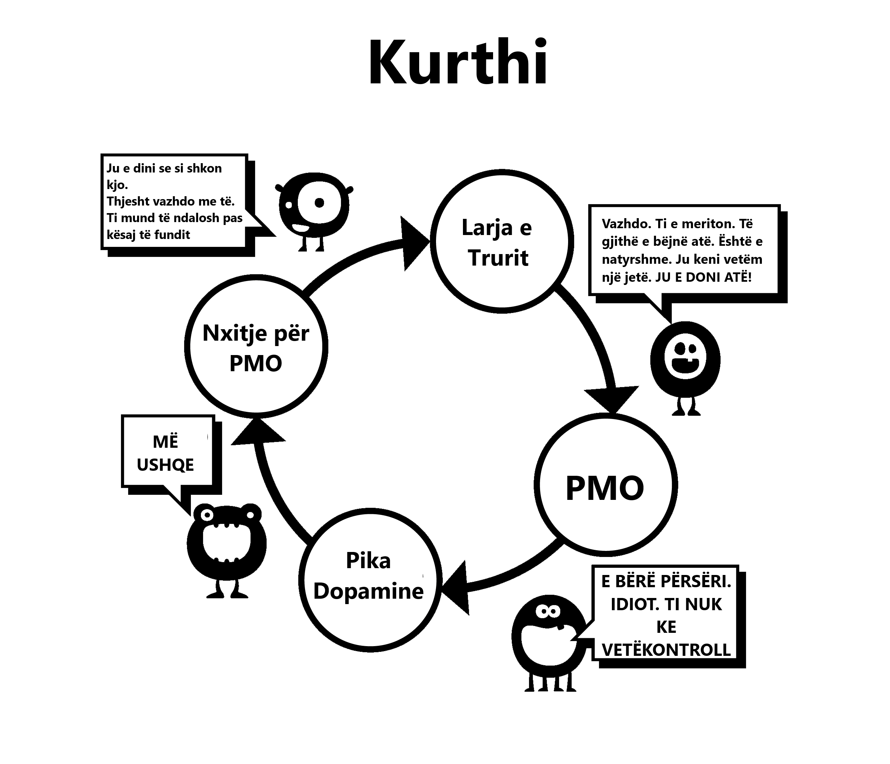

# Shpëlarje truri

Kjo është arsyeja e dytë që ne fillojmë të përdorim. Kuptimi i plotë i këtij shpëlarje truri na kërkonte që së pari të shqyrtonim efektet e fuqishme të stimulit supernormal. Truri ynë thjesht nuk është i përgatitur për krijimin e një 'haremi në internet', duke na lejuar të lëvizim midis më shumë bashkëshortëve të mundshëm në pesëmbëdhjetë minuta sesa paraardhësit tanë në disa jetë.

Ka pasur shumë këshilla të gabuara në të kaluarën, një shembull është se masturbimi çon në verbëri. Kjo, së bashku me taktikat e tjera të frikësimit, e teproi qartë. Keqkuptime si këto kishin të drejtë të rrëzoheshin nga shkenca. Por foshnja është hedhur jashtë me ujin e banjës; që nga vitet tona më të hershme, nënndërgjegjja jonë është e bombarduar me mesazhe dhe imazhe seksuale, revista dhe reklama të ngarkuara me nënkuptime. Disa video pop janë jashtëzakonisht sugjestive, por mos u dëshpëroni, bëjeni një lojë për të identifikuar se cilët komponentë po përdorin - a është vlera shokuese, risi, ngjyra, madhësia, tabuja, nostalgjia, etj. Një lojë e tillë madje mund të mësohet te para-adoleshentët si një mënyrë për t'i edukuar ata.

Në thelb, mesazhi është *"Gjëja më e çmuar në këtë tokë, mendimi dhe veprimi im i fundit, do të jetë orgazma."* A është ky ekzagjerim? Shikoni ndonjë komplot televiziv ose filmi dhe do të shihni përzierjen e pjesëve shqisore (prekje, nuhatje, zë) dhe pjesëve përhapëse (orgazmike) të seksit. Ndikimi i kësaj nuk regjistrohet në vetëdijen tonë, por nënndërgjegjja ka kohë ta përthithë atë.

## Arsyetimi shkencor

Ka publicitet në anën tjetër: frikësimet nga mosfunksionimi seksual, humbja e motivimit, preferenca e pornografisë virtuale ndaj vajzave reale, YourBrainOnPorn.com dhe nënkulturat e ndryshme të internetit, por këto lëvizje në fakt nuk i pengojnë njerëzit të përdorin. Duke folur logjikisht ata duhet, por fakti i thjeshtë është se ata nuk e bëjnë. Edhe rreziqet shëndetësore të listuara nga studimet e rishikuara nga kolegët në YourBrainOnPorn.com nuk janë të mjaftueshme për të ndaluar një adoleshent të fillojë.

Ironikisht, forca më e fuqishme në këtë konfuzion është vetë përdoruesi. Është një gabim që përdoruesit janë njerëz me vullnet të dobët ose fizikisht të dobët. Duhet të jesh fizikisht i fortë në mënyrë që të përballosh një varësi pasi ta dish se ekziston. Ndoshta aspekti më i dhimbshëm është se ata e vendosin veten si humbës të pasuksesshëm dhe introvertë të padurueshëm. Ka të ngjarë që një mik mund të jetë më interesant personalisht nëse nuk do ta kishte vënë veten poshtë për të kërkuar kënaqësinë e vetvetes.

## Probleme me përdorimin e vullnetit

Përdoruesit që heqin dorë duke përdorur metodën e vullnetit fajësojnë mungesën e vullnetit të tyre dhe prishin paqen dhe lumturinë e tyre. Është një gjë të dështoni në vetëdisiplinë dhe një tjetër gjë të urreni veten. Në fund të fundit, nuk ka asnjë ligj që të kërkon të jesh i ashpër gjatë gjithë kohës para seksit, të eksituar siç duhet dhe të aftë për të kënaqur partnerin. Ne po punojmë për një varësi, jo një zakon dhe në asnjë moment nuk debatoni me veten për të hequr dorë nga një zakon si golfi, por të bëni të njëjtën gjë me varësinë ndaj pornografisë është normalizuar - pse?

Ekspozimi i vazhdueshëm ndaj një stimuli supernormal rilidh trurin tuaj, kështu që ndërtimi i një rezistence ndaj këtij shpëlarjeje truri është kritike, sikur të blini një makinë nga një shitës makinash të dorës së dytë - duke tundur kokën me mirësjellje, por duke mos besuar asnjë fjalë që thotë njeriu. Pra, mos besoni se duhet të bëni sa më shumë seks që të mundeni, e gjithë kjo është jashtëzakonisht e mirë, duke përdorur pornografinë në mungesë të saj.

Mos luani as lojën e sigurt pornografike; përbindëshi juaj i vogël e shpiku atë lojë për t'ju joshur. A është pornografia amatore e certifikuar nga ndonjë autoritet? Faqet pornografike mbledhin të dhëna nga përdoruesit e tyre dhe i përdorin ato për të plotësuar nevojat e tyre, dhe nëse shohin një rritje në një kategori të caktuar, ata do të fokusohen në të dhe do të nxjerrin përmbajtjen sa më shpejt të jetë e mundur. Mos u mashtroni nga qëllimi edukativ apo klipet ‘të sigurta’ të tregtuara nga femrat. Filloni të pyesni veten: *“Pse po e bëj? A kam vërtet nevojë?”*

**Jo, sigurisht që jo!**

Shumica e përdoruesve betohen se shikojnë vetëm pornografi statike dhe të buta dhe për këtë arsye janë mirë, kur në fakt janë duke u sforcuar në zinxhir, duke luftuar me vullnetin e tyre për t'i rezistuar tundimeve. Nëse bëhet shumë shpesh dhe për një kohë të gjatë, kjo e varfëron në mënyrë të konsiderueshme vullnetin e tyre dhe ata fillojnë të dështojnë në projekte të tjera të jetës ku vullneti ka një vlerë të madhe, si ushtrimet, dieta, etj. Dështimi në këto fusha i bën ata të ndihen të mjerë dhe fajtorë, duke u futur në përdorim. përsëri pornografi. Nëse kjo nuk bëhet, ata do të shfryjnë zemërimin dhe depresionin e tyre te të dashurit.
Once you become addicted to internet porn, the brainwashing is increased. Your subconscious mind knows the little monster has to be fed, blocking everything else. It's fear that keeps people from quitting, fear of that empty, insecure feeling they get when they stop flooding their brains with dopamine. Just because you're unaware of it doesn't mean it's not there. You don't have to understand it any more than a cat needs to understand where the hot water pipes are: the cat just knows that if it sits in a certain spot it feels warm.

## Pasiviteti

Pasiviteti i mendjeve tona dhe varësia nga autoriteti që çon në larjen e trurit është vështirësia kryesore për të hequr dorë nga pornografia. Edukimi ynë në shoqëri, i përforcuar nga shpëlarja e trurit të varësisë sonë dhe e kombinuar me më të fuqishmit - miqtë, të afërmit dhe kolegët tanë. Faza "dorëzim" është një shembull klasik i larjes së trurit, që nënkupton sakrificë të vërtetë. E vërteta e bukur është se nuk ka asgjë për të hequr dorë; përkundrazi, do të çliroheni nga një sëmundje e tmerrshme dhe do të arrini përfitime të mrekullueshme pozitive. Ne do të fillojmë ta heqim këtë shpëlarje truri tani, duke mos iu referuar më "dorëzimit", por ndalimit, largimit ose ndoshta pozicionit të vërtetë, **ikjes!**

E vetmja gjë që na bind të përdorim fillimisht është njerëzit e tjerë që e bëjnë atë dhe ndjejnë se po humbasim. Ne punojmë shumë për t'u lidhur, por nuk e gjejmë kurrë atë që u ka munguar. Sa herë që shohim një klip tjetër, na siguron se duhet të ketë diçka në të, përndryshe njerëzit nuk do ta bënin atë dhe biznesi nuk do të ishte aq i madh. Edhe kur e heqin zakonin, ish-përdoruesi ndjen se po privohet kur një diskutim mbi një artiste seksi, këngëtare apo edhe një yll pornografie shfaqet gjatë festave ose funksioneve shoqërore. *“Ata duhet të jenë të mirë nëse të gjithë miqtë e mi flasin për to, apo jo? A kanë fotografi falas në internet?”* Ata ndihen të sigurt, do të kenë vetëm një shikim sonte dhe para se ta kuptojnë, janë të fiksuar sërish.

Shpëlarja e trurit është jashtëzakonisht e fuqishme dhe ju duhet të jeni të vetëdijshëm për efektet e tij. Teknologjia vazhdon të rritet dhe e ardhmja do të sjellë website dhe metoda aksesi në mënyrë eksponenciale më të shpejta. Industria e pornografisë po investon miliona në realitetin virtual në mënyrë që të bëhet gjëja tjetër më e mirë. Ne nuk e dimë se ku po shkojmë, të papajisur për t'u marrë me teknologjinë aktuale apo çfarë do të vijë.

Ne jemi gati ta heqim këtë shpëlarje truri. Nuk është jo-përdoruesi ai që po privohet, por përdoruesi që po humbë një jetë me:

-   Shëndet

-   Energji

-   Pasuri

-   Paqe e mendjes

-   Konfidencë

-   Guxim

-   Vetë-respekt

-   Lumturi

-   Liri

Çfarë përfitojnë ata nga këto sakrifica të konsiderueshme? **ABSOLUTISHT ASGJË**, përveç iluzionit të përpjekjes për t'u rikthyer në gjendjen e paqes, qetësisë dhe besimit që gëzon gjithmonë mospërdoruesi.

## Dhimbjet e tërheqjes

Siç u shpjegua më herët, përdoruesit besojnë se përdorin pornografinë për kënaqësi, relaksim ose një lloj edukimi. Arsyeja aktuale është lehtësimi i dhimbjeve të tërheqjes. Mendja jonë nënndërgjegjeshëm fillon të mësojë se pornografia në internet dhe masturbimi në momente të caktuara priren të jenë të këndshme. Ndërsa jemi gjithnjë e më të lidhur pas drogës, aq më e madhe bëhet nevoja për të lehtësuar dhembjet e tërheqjes dhe aq më tej kurthi delikat ju tërheq poshtë. Ky proces ndodh aq ngadalë sa nuk jeni as të vetëdijshëm për të, shumica e përdoruesve të rinj nuk e kuptojnë se janë të varur derisa të përpiqen ta ndalojnë dhe madje edhe atëherë, shumë nuk do ta pranojnë.

Merrni këtë bisedë që një terapist bëri me qindra adoleshentë:

**Terapistja:** "*Ti e kupton që pornografia në internet është një drogë dhe arsyeja e vetme pse po përdor është se nuk mund të ndalosh.*"
>
**Pacienti:** “*Pa kuptim! Më pëlqen, nëse jo, do të ndaloja.”
>
**Terapistja:** "*Thjesht ndalo për një javë për të më vërtetuar se mundesh nëse dëshiron.*"
>
**Pacienti:** “*Nuk ka nevojë, më pëlqen. Nëse do të doja të ndaloja, do ta bëja.*”
>
**Terapisti:** "*Thjesht ndalo për një javë për t'i vërtetuar vetes se nuk je i lidhur.*"
>
>>Pacienti:** “*Cili është qëllimi? Une e shijoj ate."*

Siç u tha tashmë, përdoruesit priren të lehtësojnë dhembjet e tyre të tërheqjes në momente stresi, mërzie, përqendrimi ose kombinimesh të tyre. Në kapitujt në vijim, ne do të synojmë këto aspekte të larjes së trurit.
