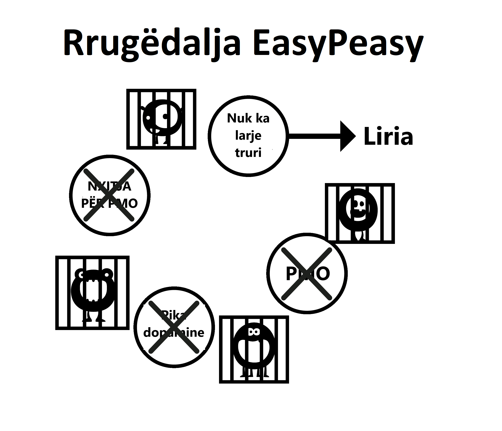

# Aspekte të larjes së trurit

Përbindëshi i madh i kurthit të pornografisë edukohet përmes kulmit të shumë aspekteve, duke përfshirë forcat shoqërore, portretizimet mediatike, kolegët dhe narrativën e brendshme të përdoruesit. Dështimi për të zbërthyer këto gabime gjatë përdorimit të metodës së vullnetit përfundimisht çon në ndjenjat e privimit, duke e çuar përdoruesin përsëri në grackë. Zbërthimi i vlerës së imagjinuar të pornografisë është vendimtar për suksesin dhe ju lejon të shihni se ku jeni duke u grabitur!

Me rëndësi për t'u theksuar është lidhja midis larjes së trurit dhe frikës. Është frika e ndjesisë së ***dhembjeve të tërheqjes në të ardhmen*** ajo që krijon dhembjet. Frika është vetë dhembja. Mendoni kur keni pasur simptoma të tërheqjes si djersitje të pëllëmbëve, gulçim, probleme me gjumin dhe paaftësi për të menduar drejt. Tani mendoni për situata të ngjashme kur keni pasur ato ndjenja: intervista për punë, nerva rreth një personi tërheqës, fjalim publik, etj. Këto janë të njëjtat ndjenja ankthi që shkakton frika. E thënë thjesht, si mundet që një drogë fizike t'i tërheqë njerëzit edhe disa muaj pas ndalimit? Duhet të jetë mendërisht, apo jo?

## Stresi

Jo vetëm tragjeditë e mëdha në jetë, por edhe streset e vogla i shtyjnë përdoruesit në zonën e ndaluar 'të pasigurt' të përjashtuar më parë. Stresi përfshin shoqërimin, telefonatat, ankthet e amvisës me fëmijë të vegjël dhe shumë të tjera. Le të marrim telefonatat si shembull, veçanërisht për një biznesmen. Shumica e telefonatave nuk janë nga klientët e kënaqur ose nga shefi juaj që ju përgëzon, ka një lloj përkeqësimi. Kthimi në shtëpi në jetën e zakonshme familjare të fëmijëve që bërtasin dhe kërkesave emocionale të partnerit të tyre e bën përdoruesin - nëse nuk po e bën tashmë këtë - të fantazojë lehtësimin e pornografisë së premtuar atë natë. Ata në mënyrë të pandërgjegjshme vuajnë nga dhimbjet e tërheqjes, destresorët të dobësuar dhe të papërgatitur për përkeqësim shtesë. Duke lehtësuar pjesërisht dhimbjet në të njëjtën kohë me stresin normal, totali zvogëlohet dhe përdoruesi merr një nxitje të përkohshme. Nxitja nuk është një iluzion, përdoruesi vërtet ndihet më mirë se më parë, por ata janë më të tensionuar sesa do të ishin si një jopërdorues.

Shembulli i mëposhtëm nuk është krijuar për t'ju tronditur - EasyPeasy nuk premton një trajtim të tillë - por është për të theksuar se pornografia shkatërron nervat tuaja në vend që t'i qetësojë ato.

Mundohuni të imagjinoni të arrini në një fazë ku nuk jeni në gjendje të eksitoheni, madje edhe me një partner shumë seksi dhe tërheqës. Për një moment, ndaloni dhe përpiquni të vizualizoni jetën ku një person shumë i bukur dhe simpatik duhet të konkurrojë dhe të dështojë me yjet e pornografisë virtuale që pushtojnë 'haremin' tuaj për të tërhequr vëmendjen tuaj. Imagjinoni gjendjen shpirtërore të një personi të cilit, kur i jepet ai paralajmërim, vazhdon të përdorë dhe vdes pa bërë kurrë seks të vërtetë me këtë partner simpatik dhe të gatshëm. Është e lehtë t'i hedhësh poshtë këta njerëz si të çuditshëm, por histori si këto nuk janë false – kjo është ajo që risia e tmerrshme e drogës pornografike i bën trurit tuaj. Sa më shumë të kaloni nëpër jetë, aq më shumë kurajo të humbet dhe aq më shumë mashtroheni duke besuar se pornografia po bën të kundërtën.

A ju ka zënë ndonjëherë paniku kur WiFi ndalon së punuari ose është shumë i ngadaltë? Jo-përdoruesit nuk vuajnë nga kjo, pasi pornografia e internetit *shkakton* atë ndjenjë. Ndërsa kaloni nëpër jetë, ai shkatërron sistematikisht nervin dhe guximin tuaj, duke e lënë DeltaFosB të formojë rrëshqitje të fuqishme uji nervore pas saj, duke shkatërruar në mënyrë progresive aftësinë tuaj për të thënë jo. Në fazën kur viriliteti është vrarë, përdoruesi beson se pornografia është partneri i tyre i ri dhe nuk është në gjendje të përballet me jetën pa të.

*Pornografia në internet nuk po ju lehtëson nervat, por ngadalë po i shkatërron ato*. Një nga përfitimet e mëdha të thyerjes së varësisë është rikthimi i besimit tuaj natyror dhe vetëbesimit.

Nuk ka nevojë të vlerësoni veten për aftësinë tuaj për të kënaqur një partner - kjo nuk është liri. Por kjo liri nuk mund të arrihet duke vazhduar të yndyrosni rrëshqitjen e ujit të dopaminës në mënyra që dëmtojnë lumturinë dhe epshin tuaj duke përsëritur të njëjtën sjellje shkatërruese.

## Mërzia

Nëse jeni si shumë njerëz, sapo të ngjiteni në shtrat, jeni tashmë në faqen tuaj të preferuar pornografike, ndoshta tashmë keni harruar derisa t'ju kujtohet. Është bërë natyrë e dytë. Në mënyrë të ngjashme, pornografia që lehtëson mërzinë është një tjetër gabim, sepse mërzia është një kornizë mendore, që ndodh kur jeni të privuar për një kohë të gjatë ose jeni duke u përpjekur ta shkurtoni.

Situata aktuale është kjo, kur je i varur nga tërheqja supernormale e pornografisë në internet dhe më pas përpiqesh të abstenosh, të duket sikur diçka mungon. Nëse keni diçka për të pushtuar mendjen tuaj që nuk është stresuese, mund të shkoni për periudha të gjata kohore pa u shqetësuar nga mungesa e drogës. Sidoqoftë, kur jeni të mërzitur, nuk ka asgjë për t'ju hequr mendjen, kështu që ju ushqeni përbindëshin. Kur kënaqeni me veten dhe nuk përpiqeni të ndaloni ose shkurtoni, edhe ndezja e shfletimit privat bëhet nënndërgjegjshëm. Ky ritual është automatik; nëse përdoruesi përpiqet të kujtojë seancat gjatë javës së fundit, ai është në gjendje të kujtojë vetëm një pjesë të vogël të tyre, si atë të fundit ose seancën pas një abstinence të gjatë.

E vërteta është se pornografia rrit mërzitjen në mënyrë indirekte sepse orgazmat ju bëjnë të ndiheni letargjik dhe në vend që të ndërmerrni një aktivitet energjik, përdoruesit priren të preferojnë të pushojnë përreth, të mërziten dhe të lehtësojnë dhembjet e tyre të tërheqjes. Kundërshtimi i larjes së trurit është i rëndësishëm sepse përdoruesit priren të shohin pornografi kur mërziten, truri ynë është i lidhur për të interpretuar pornografinë si interesante. Në mënyrë të ngjashme, ne gjithashtu na është shpëlarë truri duke besuar se seksi - madje edhe seksi i keq - ndihmon për t'u çlodhur. Është fakt se kur janë të trishtuar apo nën stres, çiftet duan të bëjnë seks. Në mungesë të diskriminimit midis seksit tantrik dhe atij propagandues, shikoni sa shpejt dëshironi të largoheni nga njëri-tjetri pasi të keni arritur orgazmën e detyrueshme. Nëse çifti do të kishte vendosur të përqafohej, të fliste ose të përqafohej dhe të flinte, ata do të ishin ndjerë të lehtësuar.

## Përqendrimi

Masturbimi dhe seksi nuk ndihmojnë përqendrimin - kur përpiqeni të përqendroheni, përpiqeni automatikisht të shmangni shpërqendrimet. Prandaj, kur një përdorues dëshiron të përqendrohet, ata as që mendojnë - hapin automatikisht shfletuesin, ushqejnë përbindëshin e vogël dhe i japin fund pjesërisht dëshirës. Ata vazhdojnë me çështjen në fjalë, duke harruar tashmë se kanë parë pornografi. Pas viteve të vërshimit të dopaminës, ndryshimet neurologjike ndikojnë në aftësi të tilla si qasja në informacion, planifikimi dhe kontrolli i impulseve.

Ju jeni gjithashtu të detyruar të ofroni risi për seancën e ardhshme pasi të njëjtat gjëra nuk gjenerojnë më dopaminë dhe opioidë të mjaftueshëm. Kështu që do t'ju duhet të endeni nëpër rrugët e internetit për risi, duke luftuar forcën për të kaluar kufirin drejt materialit tronditës, i cili nga ana tjetër gjeneron më shumë stres dhe ju lë të paplotësuar pas përfundimit.

Përqendrimi ndikohet gjithashtu negativisht pasi receptorët e dopaminës shkatërrohen për shkak të tolerancës natyrore ndaj rritjeve të mëdha, duke reduktuar përfitimin e rritjeve më të vogla të dopaminës nga destressorët natyrorë. Përqendrimi dhe frymëzimi juaj do të rriten shumë pasi ky proces reduktohet. Për shumë njerëz, është aspekti i përqendrimit që i pengon ata të kenë sukses me metodën e vullnetit: ata mund të durojnë nervozizmin dhe temperamentin e keq, por dështimi për t'u përqëndruar në diçka të vështirë pasi t'u hiqet mbështetja shkatërron shumë.

Humbja e përqendrimit që përdoruesit pësojnë kur përpiqen të shpëtojnë nuk është për shkak të mungesës së seksit, e lëre më pornografisë. Ju keni blloqe mendore kur jeni të varur nga diçka dhe kur keni një bllokim mendor, çfarë bëni? Ju ndezni shfletuesin - i cili nuk e shëron bllokimin - atëherë çfarë të bëni? Ju bëni atë që duhet të bëni, duke vazhduar me të ashtu siç bëjnë jo-përdoruesit.

Kur je përdorues, asgjë nuk fajësohet për shkakun: përdoruesit nuk kanë kurrë *disfunksionim seksual*, vetëm kohë pas kohe joproduktive. Në momentin që ndaloni përdorimin, gjithçka që shkon keq fajësohet për arsyen që e keni ndërprerë. Tani kur keni një bllokim mendor, në vend që të vazhdoni vetëm me të, filloni të thoni "*Sikur të mund të kontrolloja haremin tim tani, ai do të zgjidhte të gjitha problemet e mia*". Ju pastaj filloni të vini në dyshim vendimin tuaj për t'u larguar dhe për të shpëtuar nga skllavëria.

Nëse besoni se pornografia është një ndihmë e vërtetë për përqendrimin, shqetësimi për të do të garantojë që nuk do të jeni në gjendje të përqendroheni. Problemin e krijon dyshimi, jo dhembjet fizike të tërheqjes. Mos harroni gjithmonë, është përdoruesi ai që pëson dhimbje, jo jo-përdoruesit.

## Relaksimi

Shumica e përdoruesve mendojnë se pornografia i ndihmon ata të relaksohen. Nuk e bën. Kërkimi i furishëm për të gjetur zgjidhjen në ato 'rrugicat e errëta të internetit' dhe lufta e brendshme për t'u sforcuar në zinxhir për të kaluar vijën e kuqe sigurisht që nuk *tingëllon* si një aktivitet shumë relaksues.

Ndërsa nata fillon pas një udhëtimi në një vend të ri ose një ditë të gjatë, ne ulemi për t'u çlodhur, duke lehtësuar urinë, etjen dhe jemi plotësisht të kënaqur. Përdoruesi nuk është, pasi ata kanë një uri tjetër për të kënaqur. Përdoruesit mendojnë për pornografinë si qershinë mbi tortë, por në fakt është ‘përbindëshi i vogël’ që ka nevojë për ushqim. E vërteta është se i varur nuk mund të jetë kurrë plotësisht i relaksuar dhe duke kaluar nëpër jetë përkeqësohet në mënyrë eksponenciale. Merrni një koment në internet nga një ish-përdorues:

> "*Unë me të vërtetë besoja se kisha një demon të keq në përbërjen time, tani e di që kisha, megjithatë nuk ishte ndonjë e metë e natyrshme në karakterin tim, por përbindëshi i vogël i pornografisë në internet që po krijonte problemin. Gjatë atyre kohëve Mendova se i kisha të gjitha problemet në botë, por kur kthej kokën pas në jetën time pyes veten se ku ishte gjithë stresi i madh. Në çdo gjë tjetër në jetën time isha nën kontroll, e vetmja gjë që më kontrollonte ishte skllavëria pornografike. Gjëja e trishtueshme është se edhe sot nuk mund t'i bind fëmijët e mi se ishte skllavëria që më bëri të jem kaq nervoz.*".

Sa herë që dëgjoj të varur nga pornografia që përpiqen të justifikojnë varësinë e tyre, mesazhi është: "*Oh më ndihmon të relaksohem.*" Merrni llogarinë në internet të një baba beqar, djali gjashtëvjeçar i të cilit donte të ndante shtratin e tij gjatë natës pas një ngjarjeje të frikshme. film, por babai do të refuzonte në mënyrë që ai të mund të bënte seancën dhe avantazhin e tij për orë të tëra.

Këtu është një tjetër analogji e duhanpirjes, disa vjet më parë autoritetet e birësimit kërcënuan se do të pengonin duhanpirësit të birësonin fëmijë. Një burrë thirri, i zemëruar. “*E ke krejtësisht gabim*”, tha ai, “*Më kujtohet kur isha fëmijë, nëse do të kisha një çështje kontestuese për të ngritur me nënën time, do të prisja derisa ajo të ndizte një cigare sepse ajo ishte më e qetë atëherë. .*" Pse burri nuk mund të fliste me nënën e tij kur ajo nuk pinte një cigare?

Pse disa përdorues janë kaq të stresuar kur nuk po marrin zgjidhjen e tyre, edhe pas seksit të vërtetë? Një histori në internet detajon një burrë që punonte në fushën e reklamave që kishte 9 dhe 10 të hapura për takime në çdo kohë, por humbi interesin për t'i marrë për darkë, pasi pornografia në internet ishte shumë më e lehtë, nuk përfshinte shpenzime në restorant dhe nuk kishte asnjë mundësi për një "jo". ' nga takimi i tij në fund të një mbrëmjeje. Pse të shqetësoheni kur përbindëshi i tij i vogël e bën atë të dëshirojë skemën me rrezik të ulët dhe me shpërblim të lartë në majë të gishtave të tij pasi të arrijë në shtëpi?

Pse jo-përdoruesit janë plotësisht të relaksuar atëherë? Pse përdoruesit nuk janë në gjendje të pushojnë pa një rregullim për një ose dy ditë? Lexoni për përvojën e një përdoruesi që bën betimin për abstinencë dhe heq dorë dhe do të vini re luftën me tundimet: qartësisht jo i relaksuar kur nuk lejohen më të kenë "kënaqësinë e vetme" që "kanë të drejtë të shijojnë". Ata kanë harruar se si është të jesh plotësisht i relaksuar. Pornografia mund të krahasohet me një mizë që kapet në një bimë shtambë, fillimisht miza do të thotë të hajë nektarin, por në një fazë të padukshme bima fillon të hajë mizën.

A nuk është koha që të dilni nga uzina?

## Energjia

Shumica e përdoruesve janë të vetëdijshëm për efektet progresive që ka risia e pornografisë dhe kërkimi i përshkallëzimit në sistemin e shpërblimit dhe seksual të trurit të tyre. Megjithatë, ata nuk janë të vetëdijshëm për efektin që ka në nivelin e tyre të energjisë.

Një nga hollësitë e kurthit të pornografisë është se efektet që ka mbi ne, si fizikisht ashtu edhe mendërisht, ndodhin aq gradualisht dhe në mënyrë të padukshme saqë ne mbetemi të pavetëdijshëm për to dhe në vend të kësaj e konsiderojmë tërheqjen si normale. Efekti është i ngjashëm me atë të zakoneve të këqija të të ngrënit: ne shikojmë njerëzit që janë tepër mbipeshë dhe pyesim veten se si mund ta kishin lejuar veten të arrinin atë gjendje. Por supozoni se kjo ndodhi gjatë natës - ju shkuat në shtrat të rregulluar, duke u valëzuar me muskuj dhe jo një ons yndyrë në trupin tuaj - dhe u zgjuat për ta parë veten të shëndoshë, të fryrë dhe me bark. Në vend që të zgjoheni duke u çlodhur plotësisht dhe plot energji, ju ndiheni të mjerë, letargjik dhe mezi i hapni sytë.

Ju do të pushtoheni nga paniku, duke pyetur veten se çfarë sëmundjeje të tmerrshme kishit marrë brenda natës, dhe megjithatë sëmundja është saktësisht e njëjta. Fakti që ju deshën njëzet vjet për të mbërritur atje është i parëndësishëm. Pornografia është e njëjtë: nëse do të ishte e mundur të transferonit menjëherë mendjen dhe trupin tuaj për t'ju bërë një krahasim të drejtpërdrejtë me atë se si do të ndiheshit duke e ndërprerë pornografinë për vetëm tre javë, kjo është gjithçka që do të duhej për t'ju bindur. Ju do të pyesni veten, a do të ndiheni vërtet kaq mirë, apo çfarë do të thotë në të vërtetë, "*Sikur të isha zhytur vërtet kaq poshtë?*" Ju nuk do të ndiheshit thjesht më të shëndetshëm, me më shumë energji, por duke pasur shumë më shumë besim dhe një aftësi e rritur për t'u përqendruar.

Mungesa e energjisë, lodhja dhe gjithçka që lidhet me të fshihet bukur nën qilimin e ‘plakjes’. Miqtë dhe kolegët të cilët gjithashtu bëjnë një mënyrë jetese të ulur e ndërlikojnë më tej normalizimin e kësaj sjelljeje. Besimi se energjia është prerogativë ekskluzive e fëmijëve dhe adoleshentëve dhe se pleqëria fillon në të njëzetat është një tjetër simptomë e larjes së trurit, si dhe mosvetëdija për zakonet e të ngrënit dhe stërvitjes si rezultat i efekteve të ndërlikuara të desensibilizimit të dopaminës.

Menjëherë pas ndalimit të pornografisë, ndjenja e mjegullës dhe e mjegullt do t'ju lërë. Çështja është se me pornografinë ju jeni gjithmonë duke debituar energjinë tuaj dhe në atë proces, duke ngatërruar kiminë e sistemit tuaj limbik. Ndryshe nga lënia e duhanit, ku kthimi i shëndetit tuaj fizik dhe mendor është vetëm gradual, lënia e pornografisë ju jep rezultate të shkëlqyera që nga dita e parë. Vrasja e "përbindëshit të vogël" dhe mbyllja e rrëshqitjeve të ujit kërkon pak kohë, por rikuperimi i qendrës suaj të shpërblimit nuk është aspak si rrëshqitja e ngadaltë në gropë. Nëse po kaloni traumën e metodës së vullnetit, çdo fitim shëndetësor ose energjie do të zhduket nga depresioni që do të kaloni. Fatkeqësisht, nuk është e mundur që EasyPeasy t'ju transferojë menjëherë në mendjen tuaj brenda tre javësh, por ju mundeni! Ju e dini instinktivisht se ajo që ju thuhet është e saktë, gjithçka që duhet të bëni është **të përdorni imagjinatën tuaj!**

## Sesionet e natës sociale

Ky është një dezinformatë që duket se ka kuptim, por nuk ka. Për të kontrolluar oreksin tuaj, a do të hani në shtëpi përpara se të niseni për të shkuar në një restorant apo festë? Kjo është ajo që po bëni me seancat para netëve sociale, duke u dukur të lodhur dhe jo në më të mirën tuaj. Adoptimi i gjerë i teknikave të marrjes ka sjellë presion për të performuar, marrë dhe shënuar. Përpjekja për të mbytur fluturat tuaja me pornografi dhe substanca vetëm sa do ta përkeqësojë problemin në planin afatgjatë. Personalisht, më pëlqen pak ankthi për të më mbajtur të fokusuar dhe të angazhuar dhe lodhja mendore dhe fizike me orgazmën nuk do të ndihmojë.

Pornografia sociale e natës shkaktohet nga dy ose më shumë nga arsyet tona të zakonshme për kërkimin e kënaqësisë/propozimit, funksionet sociale në thelb të tyre janë stresuese dhe relaksuese. Kjo mund të duket të jetë një kontradiktë, por çdo formë e socializimit mund të jetë stresuese – edhe me miqtë – duke dashur të jeni vetvetja dhe plotësisht i relaksuar. Ka shumë raste që kanë faktorë të shumtë të pranishëm në çdo kohë, merrni si shembull ngarjen, pasi në fund të fundit, jeta juaj është në rrezik. Stresi, me përqendrim të nevojshëm për periudha të qëndrueshme kohore. Ju nuk duhet të jeni të vetëdijshëm për këta faktorë, nënndërgjegjja juaj tashmë e merr mesazhin. Në të njëjtën mënyrë, kur e gjeni veten të ngecur në bllokime trafiku ose të mërzitur në udhëtime të gjata në autostradë, premtimi për një seancë pas mbërritjes në shtëpi ju pushton mendjen.

Një shembull tjetër i mirë është të dilni në një takim të parë, mendja juaj hedh pyetje në lidhje me personin që do të takoni. Pastaj, nëse entuziazmi juaj fillon të zbehet me takimin me personin, do të filloni të ndiheni shumë të relaksuar, pastaj fajtor që ndiheni në këtë mënyrë. Tërheqja e luftës ka filluar, "*Dua seks ose më largo sa më shpejt nga këtu*", duke të përgatitur për pornografi pas takimit.

Edhe nëse takimi shkoi mirë dhe disa orë më vonë ju jeni kthyer në vendin tuaj, pavarësisht se në cilën mënyrë do të shkojë, nuk do të jeni të kënaqur nëse qëllimi juaj i vetëm është të kërkoni orgazëm. Në raste të tjera ju udhëtoni vetëm në shtëpi, dhe mendimi juaj i vetëm është haremi juaj në internet në vend që të përgëzoni veten për përpjekjet tuaja. Mund të vini bast se dikush në këtë pozicion do të ketë një seancë pasi të arrijë në shtëpi dhe shpesh pas netëve si këto - zgjimi për të ndjerë zbrazëti të shqetësuar - janë ato që do të na mungojnë më shumë kur mendojmë të ndalojmë pornografinë. Ne mendojmë se jeta nuk do të jetë më kurrë aq e këndshme. Në fakt, është i njëjti parim në punë: seancat thjesht ofrojnë lehtësim nga dhembjet e tërheqjes, në disa raste duke pasur nevoja më të mëdha se të tjerat, duke lyer rrëshqitjen e ujit për sinjalin tjetër.

Bëjeni të qartë këtë - nuk janë të veçantë banorët e pornografisë dhe haremit në internet, por rasti. Pasi të hiqet nevoja për pornografi, rastet e tilla do të bëhen më të këndshme dhe situatat stresuese më pak stresuese.

