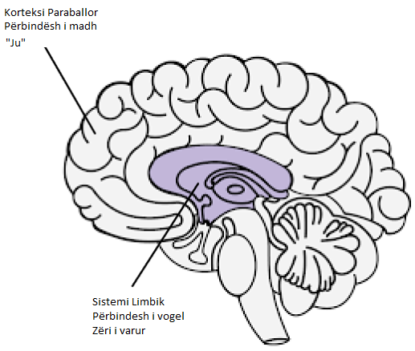

# Burimet {-}

[Meditimet e një të varur nga porno](../resources/meditations.pdf) - Guillaco

[Lista kontrolluese e deklaratave EasyPeasy](https://old.reddit.com/r/pmohackbook/comments/id6nie/easypeasy_statements_checklist/) - SWATxKATS

[Meditim 9 minutash](https://www.youtube.com/watch?v=tw7XBKhZJh4) - Sam Harris

[Kursi i Meditimit Waking Up](https://wakingup.com) - Sam Harris

[Dalja nga Moderniteti](https://jdemeta.net/2019/09/15/exiting-modernity/) - Meta Nomad // ([pdf](https://jdemeta.net/wp-content/uploads/2019/09/Exiting-Modernity.pdf))

[Letër që po dërgoj në shkolla](../resources/principal.pdf)

[Liri Përgjithmonë (PMO Hacknotes)](https://sites.google.com/view/freeforever/home)

[Pse po riktheheni - u/Different_Guide_5205](https://old.reddit.com/r/pmohackbook/comments/mynwjl/why_youre_relapsing/)

[Kundër Frikës - u/Different_Guide_5205](https://old.reddit.com/r/pmohackbook/comments/n5027n/countering_fear/)

## Deklaratat e përballimit të REBT {-}

- *“Unë mund ta ndaloj PMO-në, edhe pse duket ‘e vështirë’ për ta bërë këtë. Nuk është shumë e vështirë dhe sado mundim të marrë, ia vlen!”*

- *"Nëse vazhdoj të injoroj dhe të mos dorëzohem kurrë para nxitjeve të mia të fuqishme ndaj PMO, do ta bëj më të lehtë dhe më të lehtë t'i rezistoj atyre."*

- *"Unë mund ta pranoj plotësisht dhe pa kushte veten time - po, edhe me të gjitha të metat dhe dështimet e mia."*

- *"PMO duket se shpejt 'shëron' problemet e mia, por në fakt i bën ato më keq."*

- *"Ndonjëherë, do të doja shumë t'i mbysja problemet e mia në PMO, por kjo nuk është kurrë një arsye për ta bërë këtë."*

- *“Është më e pakëndshme kur nuk e marr atë që dua vërtet. Por nuk është e tmerrshme apo e tmerrshme nëse nuk zgjedh të besoj se është dhe zgjedh të besoj diçka më realiste dhe më të dobishme.”*

- *"Nuk do të më pëlqejë kurrë trajtimi i padrejtë, por mund ta duroj mirë dhe ndoshta komplotoj dhe planifikoj ta ndaloj."*

- *“Pavarësisht se sa herë dështoj në këtë ndjekje të rëndësishme, dështimi im nuk më bën kurrë një morr të paaftë. Thjesht më bën një person që mund të ketë vepruar në mënyrë të paaftë në atë kohë.”*

- *“Nuk kam absolutisht nevojë për atë që dua, por prapë mund të jem mjaft i lumtur, megjithëse jo aq i lumtur sa kur nuk e marr atë.”*

- *“Preferoj fort të jem i spikatur në punën time, por nuk kam pse të jem. Sa keq nëse nuk jam, por nuk më bën inferiore. Unë gjithmonë mund të vazhdoj të përpiqem të bëj më mirë pa pasur nevojë të bëj më mirë."*

- *“Shumë gjëra mund të më ndihmojnë të më vjen keq dhe të zhgënjehem, por kur kërkoj dhe urdhëroj që këto gjëra të mos ekzistojnë, atëherë e bëj veten në panik, depresion dhe tërbim.”*

- *"Po, shpesh kam dështuar të bëj atë që kam premtuar se do ta bëj, por kjo nuk do të thotë se nuk mundem ose nuk do ta zbatoj këtë premtim."*

- *“E urrej si dreq të jem në ankth dhe në depresion, por nuk kam pse t'i shpërndaj menjëherë këto ndjenja me PMO. Kur jam PMO, ndihem përkohësisht më mirë për problemet e mia, por nuk përmirësohem. Në planin afatgjatë, PMO i bën ato më keq.”*

- *“Njerëzit nuk më tërbojnë duke më trajtuar keq. Zgjedh me mendjemadhësi të zemërohem për trajtimin e tyre të keq duke kërkuar dhe urdhëruar që të veprojnë më mirë."*

## Kombinimi i EasyPeasy me teknikën Addictive të Njohjes së Zërit të Jack Trimpey (AVRT) {-}

*Kredi për az#8773 në Discord*

Kjo është për njerëzit që po përpiqen të përdorin metodën Easyway të Allen Carr-it për t'u shëruar nga një varësi, pavarësisht heqjes së larjes së trurit. Unë do të supozoj se kushdo që e lexon këtë ka lexuar ndonjë nga librat e Allen Carr dhe ka kuptuar metodën e tij Easyway (AKA Easypeasy). Nëse jo, unë rekomandoj fuqimisht ta bëni këtë. Do të ndihmonte gjithashtu nëse lexoni "Rimëkëmbja Racionale" nga Jack Trimpey. Nëse nuk e keni lexuar, atëherë nuk ka problem sepse unë do të mbuloj bazat e tij këtu, por gjithsesi ju rekomandoj ta lexoni pasi do të hyjë në shumë më tepër detaje se sa unë. Kjo nuk do të synojë ndonjë varësi të veçantë dhe për këtë arsye do të jetë e zbatueshme për çdo varësi. Qëllimi i këtij shkrimi është të krahasojë Easyway me një metodë tjetër të suksesshme të varësisë të quajtur 'Teknika e Njohjes së Zërit Addictive' (AVRT) dhe të kombinojë 2. Ndërsa unë besoj se Easyway është më e mirë se të gjitha metodat e tjera të rikuperimit të varësisë, besoj se të kuptuarit e AVRT gjithashtu mund të jetë lidhja që mungon për kaq shumë njerëz që dështojnë të përdorin Easyway pavarësisht se vrasin përbindëshin e madh.

Ka shumë metoda konkurruese për të kapërcyer varësinë, secila me shkallë të ndryshme suksesi. Nuk do të përmend asnjë prej tyre, sepse shumica e tyre janë humbje kohe dhe dua ta mbaj këtë sa më shkurt. Metodat e vetme për të cilat do të shkruaj janë Easyway e Allen Carr dhe AVRT e Jack Trimpey (themeluesi i Rational Recovery). Të dyja metodat kanë nivele jashtëzakonisht të larta suksesi, por secila synon një gjë të ndryshme. Easyway dhe AVRT janë të ngjashme në faktin se Easyway ndan varësinë në "Përbindëshi i vogël" dhe "Përbindëshi i madh" dhe AVRT ndan mendjen tuaj në "Zërin Addictive" (AKA bisha) dhe "Ti". Zëri i varur dhe përbindëshi i vogël janë e njëjta gjë, dhe përbindëshi i madh (shpëlarja e trurit AKA) është sistemi i besimit që ju mbani që ju bën të mendoni se varësia juaj ju jep një lloj përfitimi ose mbështetja. Easyway fokusohet në eliminimin e përbindëshit të madh me pak kujdes për përbindëshin e vogël ndërsa AVRT fokusohet te përbindëshi i vogël pa marrë parasysh përbindëshin e madh. Ndërsa Easyway shkatërron varësinë psikologjike, AVRT ju mëson të dalloni varësinë fizike që maskohet si ju dhe të ndaheni prej saj. Më duket interesante që Easyway dhe AVRT të dyja kanë nivele shumë të larta suksesi pavarësisht se janë fokusuar në gjënë e kundërt.

Ndërsa unë besoj se Easyway është shumë më e lartë se të gjitha metodat e tjera të rikuperimit të varësisë, dhe ndërsa e rekomandoj mbi të gjitha, mund të zgjedh 2 vrima të vogla në të. Së pari, më duket se nënvlerëson përbindëshin e vogël. Dua të shmang përdorimin e anekdotave personale në këtë shkrim, por nga përvoja ime dhe përvojat e të tjerëve duket se disa prej nesh dështojnë në Easyway jo sepse nuk arritëm ta eliminonim plotësisht përbindëshin e madh (edhe pse kjo mund dhe ndodh), por sepse ne nënvlerësoi përbindëshin e vogël. Përbindëshi i vogël nuk është problem për shumicën e njerëzve, gjë që shpjegon shkallët e larta të suksesit të Easyways, por për të tjerët, përfshirë edhe vetë, mund të jetë. Vrima e dytë është se Easyway thotë se të gjitha dështimet janë rezultat ose i mosndjekjes së udhëzimeve ose mos heqjes së përbindëshit të madh.

Thelbi themelor i Easyway është ky. Varësia ka 2 komponentë, varësinë fizike ndaj dopaminës dhe varësinë psikologjike të përbërë nga besimet (shpëlarja e trurit) se varësia juaj ju jep një lloj kënaqësie ose paterica. Këta quhen përkatësisht përbindëshat e vegjël dhe të mëdhenj. Sipas Easyway, përbindëshi i vogël nuk është gjë tjetër veçse një ndjenjë boshe, paksa e pasigurt, e cila mezi dallohet. Sapo vrisni përbindëshin e madh duke zhbërë larjen e trurit duke mësuar se varësia juaj nuk ka përfitime dhe se si çdo kënaqësi ose paterica e perceptuar është thjesht iluzion, dhe po aq e rëndësishme është se si nuk ka asgjë për t'u frikësuar nga një jetë pa varësinë tuaj, dëshirat zhduken. Dëshirat rrjedhin nga frika juaj se jeta pa patericën tuaj të vogël do të ishte e padurueshme, gjë që ju bën të dyshoni për ta lënë, që është dëshira. Ju e kapërceni frikën duke kuptuar se sa më e këndshme do të jetë jeta juaj pa varësinë tuaj dhe ju e ruani atë ndjenjë gëzimi.

Ndërsa unë besoj se kjo është metoda më e mirë për t'u rikuperuar nga një varësi, ajo nuk e vë theksin te përbindëshi i vogël, sepse në teori, sapo të kujdeset për përbindëshin e madh, përbindëshi i vogël i pafuqishëm thjesht do të thahet dhe do të vdesë vetë, dhe gjithsesi është thuajse e padukshme ndaj kujt i intereson. Përbindëshi i vogël mund të jetë i parëndësishëm për shumë njerëz, por nga përvoja ime dhe e të tjerëve duket se nuk është gjithmonë kështu. Kur njerëzit dështojnë me Easyway, sipas Easyway, ka vetëm 2 arsye të mundshme, ose nuk i keni ndjekur udhëzimet siç duhet ose nuk keni arritur të hiqni përbindëshin e madh. Unë besoj se kjo është e dëmshme dhe do ta shpjegoj pse më vonë.

Teknika e Njohjes së Zërit Addictive (AVRT) e ndan trurin në 2 pjesë, trurin e poshtëm (sistemi limbik) ku qëndron varësia juaj dhe trurin më të lartë (korteksi paraballor) ku banoni ju (ose të paktën mendimet dhe egoja juaj). Jack Trimpey i referohet zërit të varur si bishë sepse ai banon në pjesën shtazore të trurit tonë dhe di vetëm një gjë, "E DUA DHE E DUA TANI". Unë vetë nuk më duket e dobishme ta personifikoj atë si një bishë, por mendoj se është më mirë sesa të besosh se je ti. Zëri i varur (AV, përbindësh i vogël) do të rrëmbejë zërin tuaj të mendjes dhe do ta përdorë kundër jush për t'ju bërë të kënaqeni me varësinë tuaj. Duhet ta bëjë këtë sepse nuk mund të kontrollojë vetë funksionet tuaja motorike. Mund ta provoni këtë tani, ngrini dorën përpara fytyrës dhe tundni gishtat. Tani kërkoni varësinë tuaj të bëjë të njëjtën gjë. nuk mundet. Kjo do të thotë që ju jeni në fund të fundit në kontroll këtu.

AV jo vetëm që rrëmben zërin tuaj të mendjes, por gjithashtu fshihet në mënyrë mashtruese pas përemrit "Unë". Ai thotë "Unë vërtet mund të bëja me X tani për tani", "Sigurisht që më mungon të bëj X", "A nuk do të ishte mirë të bëja X tani, në fund të fundit e meritoj pas sot." AVRT thekson faktin se ju nuk jeni zëri juaj i varur, ju thjesht mendoni se jeni. Kur e njihni AV si "jo ju" dhe i thoni jo, ai heq "Unë" dhe fillon të përdorë "ju", "ne". Kjo është dëshmi se nuk jeni ju.

Kur i thoni "Jo" AV tuaj, kjo ndodh:
"Unë vërtet mund të bëja me X tani për tani" bëhet "Oh hajde, ju mund të bëni vërtet me X tani dhe ju e dini atë". "Sigurisht që më mungon të bësh X" bëhet "Oh hajde, patjetër që të mungon të bësh X, nuk e ndjen dot?" "A nuk do të ishte mirë të bëja X tani, në fund të fundit unë e meritoj atë pas sot." bëhet "Ne meritojmë të bëjmë X tani pas gjithë asaj që kemi kaluar, si mund të na e mohosh këtë?"

Në këtë pikë më duhet të sqaroj diçka. Kjo nuk është "tërheqja e luftës" të cilës i referohet Allen Carr. "Tug of war" është disonancë konjitive, e cila është ajo ku keni 2 ose më shumë sisteme besimi konfliktuale dhe është rezultat i mosvrasjes së përbindëshit të madh. "Unë me të vërtetë nuk dua të bëj X për shkak të këtij efekti negativ që më jep, por gjithashtu më bën X kështu që dua ta bëj". Kjo është tërheqja e luftës dhe është vepër e përbindëshit të madh. Sapo përbindëshi i madh të vdesë duke hequr larjen e trurit, zërat e vetëm që ju thonë të përfshiheni në varësinë tuaj do të vijnë nga përbindëshi i vogël (AV). Për shkak se AV përdor përemrin "Unë", ngatërrimi i AV me përbindëshin e madh bëhet një mundësi.

Është gjithashtu e rëndësishme të theksohet se AV është një gënjeshtar masiv. Shqetësimi i vetëm është marrja e dopaminës me çdo kusht. AV juaj do të përpiqet t'ju bindë që ta vendosni veten në situata potencialisht vdekjeprurëse nëse kjo do të thotë të merrni një rregullim.

Më herët thashë “Kur njerëzit dështojnë me Easyway, sipas Easyway, ka vetëm 2 arsye të mundshme, ose nuk i keni ndjekur udhëzimet siç duhet ose nuk keni arritur të hiqni përbindëshin e madh. Unë besoj se kjo është e dëmshme dhe do ta shpjegoj pse më vonë.” Unë besoj se kjo është e dëmshme sepse dështimi për të njohur AV ka bërë që unë dhe të tjerët që kanë përdorur Easyway të besojnë në mënyrë të rreme se nuk e kemi vrarë plotësisht përbindëshin e madh, kështu që ne e rilexojmë librin për t'u përpjekur të vrasim përsëri larjen e trurit, edhe pse ne e kam tashme. Dështimi për të njohur AV-në e kombinuar me besimin se "nëse dështove me Easyway do të thotë që nuk arrite të vrasësh përbindëshin e madh" do të bëjë që të përqendrosh përsëri përpjekjet te përbindëshi i madh kur ai tashmë është mposhtur. Ju mund të përfundoni në një cikël rileximi të librave të Allen Carr-it, që zgjasin pak dhe pastaj përsëriteni pa pushim.

Kur AV thotë diçka si "Unë dua të bëj X tani sepse më bën X", nëse keni zhbërë larjen e trurit dhe keni hequr përbindëshin e madh, mund të mendoni "Por unë e di që kjo nuk është e vërtetë, kështu që pse ta bëj? ende besoni se është? A nuk kam arritur ta zhbëj plotësisht larjen e trurit”. E vërteta këtu është se ju e keni hequr lavazhin e trurit, që dëshmohet nga fakti se ju e dini më mirë se çfarë ju thotë AV-ja, thjesht mendoni se AV-ja jeni ju sepse ka përdorur përemrin "unë". Njohja e AV dhe detyrimi i tij të zbulohet duke hedhur "unë" për "ju", "ne" duhet t'ju konfirmojë se nuk është përbindëshi i madh këtu, është përbindëshi i vogël. Nëse do të ishte vërtet përbindëshi i madh, nuk do të zëvendësonte "unë" për "ti", "ne" ose "ne".

Tani kur AV thotë "Ju lutem, a mund të bëjmë X edhe një herë për hir të kohës së vjetër, vetëm një tjetër?" dhe ju thoni "Jo", mund të ndjeni një përgjigje emocionale. Mund të ndjeni frikë ose trishtim. Është jashtëzakonisht e rëndësishme të kuptosh se kjo ndjenjë nuk vjen nga ti, po vjen prej saj. Nëse nuk jeni në gjendje të njihni AV, do të mendoni se ky emocion vjen nga ju dhe do të jeni më të prirur të dorëzoheni. Njihni AV dhe faktin që emocionet që vijnë prej tij nuk vijnë nga ju, atëherë ndjeni gëzim te kjo.

Kur i bashkoni të dyja këto metoda (nëse është e nevojshme, jo të gjithë njerëzit duket se kanë problem me përbindëshin e vogël) dhe mbani një ndjenjë gëzimi dhe ngazëllimi sa herë që e njihni AV, suksesi është i juaji.
