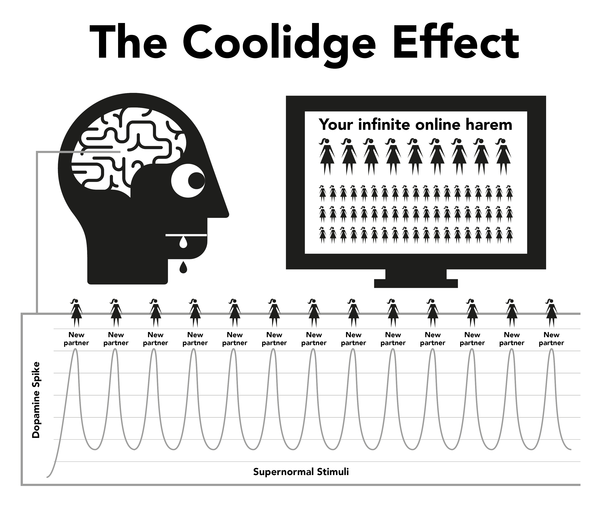

# Naturen

Internetporr kapar de naturliga belöningsmekanismerna som säkerställer att du försöker fortplanta dig så länge som möjligt. Internetporrens omedelbara och tillgängliga form gör att hjärnans belöningsmekanism producerar dopamin långt mycket mer än vad som normalt är möjligt. Vetenskapligt kallas det för Coolidge-effekten, vilken du kanske redan känner till.
Dopamin är en signalsubstans som associeras till känslor av att vilja någonting, medan faktisk njutning produceras av opioider. Mer dopamin, mer opioider och mer action. Utan dopamin skulle företeelser som att äta inte kännas njutbara och måltider skulle inte avslutas. Där är mat med mycket fett och socker som orsakar mest kemisk frisättning.
Dopamin frisätts också som ett svar på nyhetens behag. Med en till synes oändlig mängd tillgänglig porr så sköljer det över det limbiska systemet (belöningssystemet), så första gången du ser porr och agerar på det, får orgasm, så triggar du igång ännu en översvämning av opioider. Sporrad av att få så mycket dopamin som möjligt lagrar hjärnan som ett skript för att lätt kunna minnas och stärker nervbanorna genom att frisätta en kemikalie som heter DeltaFosB. Nu kallar hjärnan på dessa nervbanor som svar på signaler som sexiga reklamsnuttar, ensamtid, stress eller till och med om du känner dig nere och plötsligt är du redo för en tur i ”vattenrutschkanan”. För varje gång som det här upprepas så frisätts än mer DeltaFosB så att vattenrutschkanan håller sig insmord, igång och enklare att åka nedför nästa gång.
Det limbiska systemet har ett självkorrigerande system som trimmar ner antalet dopamin- och opioidreceptorer när frekventa dagliga dopaminöverflöd upptäcks. Tyvärr behövs dessa receptorer för att hålla oss motiverade att hantera den dagliga livsstressen. Den nominella mängden dopamin som produceras av naturliga belöningar kan inte mäta sig med porrens och absorberas inte lika effektivt av de nedreglerade receptorerna, vilket gör dig mer stressad och irriterad än normalt. Den här processen kallas för desensibilisering.
Under den här cykeln passerar du den ”röda linjen” och utlöser känslor som skuld, avsmak, skam, ångest och rädsla, vilka i sin tur höjer dopaminnivåerna ännu mer och som hjärnan misstolkar som sexuell upphetsning.
Med tiden blir hjärnan bara inte likgiltig till klipp den redan har sett, utan också mot liknande genrer och chocknivåer. Denna lägre motivation utlöser känslor som lägre tillfredsställelse då hjärnan ägnar sig åt konstanta bedömningar som driver på dig att hitta klipp som mättar hungern. Så du eftersöker mer nyhetens behag och klickar till slut på den amatörmässiga, chockerande videon som du med säkerhet sa att du aldrig skulle göra vid ditt första besök på sajten.

> *"För i de små tingens dagg finner hjärtat sin morgon och friskas upp"*
>
> --- Kahlil Gibran

En flyktig känsla av säkerhet är allt som krävs för att ta sig genom en tuff period i livet, men kan din avdomnade hjärna kapabel till att fånga upp den där droppen av en avslappnande effekt som en icke-användares hjärna kan använda sig av?
Översvämning av dopamin fungerar precis som en snabbverkande drog som avtar snabbt och orsakar abstinensbesvär. Många användare är under villvarelsen att dessa besvär är hemska trauman som de genomlider när de försöker, eller blir tvingade, att sluta. I själva verket är besvären främst psykiska då användaren känner sig berövad på sin njutning eller sin stöttning.

## Det Lilla Monstret
Den faktiska kemiska abstinensen som porren orsakar är så diskret att de flesta användare har levt och dött utan att inse att de är drogmissbrukare. Många användare är rädd för knark, ändå är det precis vad de är: drogmissbrukare. Lyckligtvis är det en drog som är lätt att bli av med, men först så måste du acceptera att du faktiskt är beroende. Porrabstinens åsamkar ingen fysisk smärta och blott en tom, rastlös känsla av att någonting saknas. Det är därför många kopplar det till sexuella begär. På sikt så förvandlas den känslan till nervositet, osäkerhet, lättretlighet, dåligt självförtroende och irritation. Det är som hunger, fast för ett gift.
Bara några sekunder in på en session så tillhandahålls dopamin och suget släpper vilket resulterar i känslor av tillfredsställelse som du kastar dig ner för vattenrutschkanan. Under de första dagarna så är abstinensbesvären och lättnaden av dem så små att vi är omedvetna om dem. När vi blir regelbundna användare så tror vi att det är för att vi gillar det eller för att det har blivit en ”vana”. Sanningen är den att vi redan var fast utan att själva inse det. Det lilla monstret finns redan i våra hjärnor så vi tar en tur nedför vattenrutschkanan lite då och då för att mata det.

Alla användare börjar söka efter porr av helt irrationella skäl. Det *enda’ skälet till att någon fortsätter att använda porr, oavsett om de tillfälliga eller tunga användare, är för att mata det lilla monstret. Hela problemet är en rad av grymma och förvirrande bestraffningar, men den kanske mest patetiska aspekten är den känsla av njutning som användaren får av en session när han försöker hitta tillbaka till lugnet och självförtroendet han hade innan han blev beroende från första början.

## Det Irriterande Alarmet

Du vet känslan när en grannes hemlarm har ringt hela dagen – eller något annat mindre ihållande irritationsmoment – och oljudet plötsligt upphör och en fantastisk känsla av lugn och ro sköljer över dig? Det är egentligen inget riktigt lugn, utan bara ett obehag som tar slut. Innan vi påbörjar en session så är våra kroppar kompletta, men sedan tvingar vi hjärnan att börja pumpa dopamin och när vi är klara och dopaminet börjar skingras så kommer abstinensbesvären. Dessa är inte fysisk smärta, bara en tomhetskänsla. Vi är omedvetna om dess existens, men det är som en droppande kran inuti våra kroppar.
Våra rationella hjärnor förstår inte det här, men det behöver de också inte. Allt vi vet är att vi vill ha porr och när vi runkar så försvinner begäret. Tillfredställelsen är dock flyktig eftersom det krävs ännu mer porr för att lätta på suget. Så snart du har fått orgasm så börjar suget igen och fällan håller dig i ett fortsatt grepp. Du är fast i en feedback-loop, såvida du inte bryter den!
Att vara i porrfällan är som att ha på sig för trånga skor bara för att få känna känslan av att ta av dem. Det finns tre huvudsakliga anledningar till att användare inte kan se det på det sättet.
1. Ända från födseln har vi varit utsatta för massiv hjärntvättning som säger åt oss att internetporr bara är ännu en modern utveckling som har ersatt den tryckta varianten av porr. Den här villfarelsen är paketerad tillsammans med sanningen att onani inte är skadligt, så varför skulle vi inte tro dem?
2. Eftersom fysisk dopaminabstinens inte innebär någon smärta, utan bara en tom osäkerhetskänsla jämförbar med hunger och vanlig stress, så manifesteras denna känsla i ännu en porrsession eftersom det är vid de tillfällena vi tenderar att söka internetporr. Vi betraktar gärna den känslan som helt normal.
3. Den främsta anledning till varför användare misslyckas med att se internetporrens sanna natur beror på att de fungerar bakifrån och fram. Det är när du *inte* konsumerar porr som du lider av den där tomma känslan. Eftersom processen att bli beroende är otroligt diskret och i början sker gradvis, så framstår tomhetskänslan som helt normal och därför beskylls inte den senaste sessionen. I samma sekund som du öppnar webbläsaren och påbörjar din session så för du en omedelbar boost och blir mindre nervös och mer avslappnad, vilket då tillskrivs porren.

Den här bakvända processen gör alla droger svåra att bli av med. Föreställ dig paniken hos en heroinmissbrukare utan tillgång till heroin; föreställ dig sedan den rena glädjen när de till slut kan trycka in sprutan i venen. Icke-heroinmissbrukare lider inte av den panikkänslan.
Heroinet lättar inte på den känslan, det skapar den. På samma sätt känner inte icke-användare att de måste ha internetporr, inte heller panik när de är offline. Icke-användare kan inte förstå hur användare känna njutning av tvådimensionella videor med neddraget ljud och oproportionerliga kroppar. Till slut så kan inte användare heller förstå det.
Vi pratar om internetporr som avslappnande eller tillfredställande, men hur kan du bli tillfredställd såvida du inte var otillfredsställd från början? En icke-användare lider inte av det här otillfredsställda tillståndet och är helt avslappnade efter en dejt som inte leder till sex, vilket en användare inte är förrän de har mättat deras lilla monster.

## En Njutning Eller Ett Stöd?
En viktig påminnelse: huvudanledningen till att det är svårt för användare att sluta beror på tron att de tvingas ge upp genuin njutning eller en krycka. Det är av yttersta vikt att förstå att du inte ger upp *absolut ingenting*. Den bästa jämförelsen för att förstå porrfällans diskretion är med att äta mat. Vanan av regelbundna måltider får oss att inte känna hunger emellan dem, man märker bara av hungern om en måltid skjuts upp. Ingen fysisk smärta, bara en tomhetskänsla som känns igen som hunger. Processen att tillfredsställa sin hunger är en väldigt njutbar upplevelse.
Porr framstår som nästan identiskt, men det är det inte. likt hunger så uppstår ingen fysisk smärta och belöningsmekanismen agerar på ett liknande sätt, men det är likheten med hunger som lurar användaren till att tro njutningen eller kryckan är genuin. Även om porranvändning och att äta mat liknar varandra så är verkligheten det rakt motsatta.
–   Man äter för att överleva och ge energi till sitt liv, medan porr fördunklar och förminskar din livsgnista.
–   Mat smakar gott på riktigt och att äta är en genuint njutbar upplevelse som vi får njuta av hela livet. Porr självsaboterar dina lyckoreceptorer och förgör alla dina chanser att bemöta livet och känna dig lycklig.
–   Ätande tar bort hunger och skapar ingen ny hunger, medan din första porrsession startar begären för dopamin som sedan ökar för varje session. Istället för att lätta på de begären, så säkerställer porren lidande i resten av ditt liv.
Är ätande en vana? Om du tror det så försök att bryta den helt! Att beskriva ätande som en vana skulle vara som att säga att andas också är det. Båda är oumbärliga för vår överlevnad. Visst har folk för vana att mätta deras hunger vid olika tillfällen med olika sorters mat, men ätandet i sig är ingen vana. Det är inte porr heller. Enda skälet till att en användare kör igång webbläsaren är för att försöka fylla tomheten som den förra sessionen skapade, vid olika tillvällen med varierande, eskalerande genrer.
På internet refererar man ständigt till porren som en vana och för enkelhetens skull använder EasyPeasy sig också av termen ”vanan”. Var dock alltid medveten om att porr inte är en vana, det är ett **drogberoende**! När vi börjar använda porr så måste vi tvinga oss själva att hantera den. Innan vi vet ordet av sitter vi där framför allt mer bisarr och chockerande porr. Spänningen ligger i jakten, inte i dödandet, med dopamin som snabbt lämnar kroppen efter orgasm vilket förklarar varför användare vill ”edga” (fördröja orgasmen) genom att hoppa mellan flertalet webbläsarfönster och –flikar.

## Korsa Den Röda Linjen

Precis som med alla andra droger så utvecklar kroppen immunitet mot effekterna av de gamla vanliga videoklippen. Hjärnan vill ha mer, eller någonting annat. Efter att ha sett på samma klipp under en period så slutar det att lätta på abstinensen som den senaste sessionen skapade. Det blir då en dragkamp i porrparadiset när du vill stanna på den säkra sidan av din ”röda linje”, medan hjärna ber dig klicka på videon med förbjuden frukt.
Du mår bättre efter att ha utfört den porrsessionen, men du är också mer nervös och mindre avslappnad än någon som aldrig har börjat, även om du skulle bo i ett förmodat porrparadis. Den positionen är ännu löjligare än att bära för trånga skor eftersom du går genom livet med en ökande grad av lidande som hänger kvar efter att du tagit av dig skorna. Eftersom användaren vet att det lilla monstret måste matat så bestämmer de tidpunkten som brukar vara vid fyra olika tillfällen, eller en kombination av dem.
Leda/Koncentration – två raka motsatser
Stress/Avslappnande – två raka motsatser.
Vilken magisk drog kan plötsligt reversera precis de effekter som de hade bara minuter tidigare? Sanningen är att porr varken gör dig mindre uttråkad eller lättar på din stress eller verkar för bättre koncentration och avslappning. Om du funderar på det, vilka tillfällen i livet gör det, förutom sömn? Om du ämnar tona ner till andra typer av realistisk eller mjuk porr, notera gärna att den här boken vänder sig till all porr – tidningar, webbkameror, pay-per-views, chattar, live-shower, osv. människokroppen är det mest sofistikerade föremålet på jorden, men inga arter, inte ens en amöba eller en mask, överlever utan att veta skillnaden mellan mat och gift.
Genom naturligt urval har våra sinnen och kroppar utvecklat tekniker för att belöna företeelser som multiplicerar och bevarar mänskligheten. Vi är inte förberedda på supernormal stimulans som är större, mer vågat och mer bländande än någonting som går att hitta i naturen. Till och med den mest nedtonade tvådimensionella bilden gör oss upphetsade. Men om du tittar på samma bild om och om igen så blir du inte det. I verkliga livet ser sans och balans till att man gör någonting annat, men internetporr har inga sådana begränsningsmedel vilket får dig att tillbringa ditt liv med ett virtuellt harem.
Det är en villfarelse att bara fysiskt och mentalt svaga personer blir användare, att de som haft tur nog att se sitt första porrtittande som avskyvärd är de som blir botade för livet. Alternativt så är de inte mentalt förberedda för att gå genom den hårda inlärningsprocessen som krävs för att bli beroende och är rädda för att ”åka fast” eller inte vara nog tekniska för att fixa med privatinställningar i webbläsaren. Det mest tragiska måste vara tonåringarna där allt fler börjar och som är skickliga på att hitta material och på att sopa undan sina spår. 
Att uppskatta internetporr är en illusion. Att hoppa från kategori till kategori och bara nyhetsapan på rätt sida av den säkra porrens röda linje för att få vår dopamindos. Precis som heroinberoende, det enda som de egentligen uppskattar är ritualen de har för att lätta på abstinensen.

## Ruset Från Att Dansa Runt Den Röda Linjen

Även med den där filmen som man dröjer kvar med så lär sig användare att filtrera bort den dåliga och smutsiga parten av porrvideor. Även om det är solofilmer så ställer de in filtret på kroppsdelar som eggar dem mest. I själva verket är det många som gillar dansen runt den röda linjen, hittar ursäkter för att de gillar ”mjuk porr” och att de inte är beroende av supernormal stimulans. Men fråga en användare som hävdar att de håller sig till en specifik aktör eller genre: *”Om du inte hittar din föredragna typ av porr och bara kan se en otrygg genre, slutar du då att onanera?”*
Inte en chans! En användare onanerar till vad som helst: eskalerande genrer, avvikande läggningar, look-alike-aktörer, farliga omgivningar, chockerande förhållanden, allt för att mätta det lilla monstret. I början ger de avsmak, men efter tillräckligt med tid lär man sig att uppskatta dem. Användare kommer att söka tom tillfredställdhet efter att de haft riktig sex, efter en lång arbetsdag, vid feber, förkylning, influensor, halsont och till och med när de är inlagda på sjukhus.
Njutning har ingenting med saken att göra, om man önskar ha sex så är det helt ologiskt att vara med din laptop. För en del användare känns det alarmerande att de är drogmissbrukare och tror att det gör det ännu svårare att sluta. I själva verket är det bra nyheter av två viktiga anledningar.
1.   Skälet till varför de flesta fortsätter är för att även om vi känner till att nackdelarna vida överväger fördelarna, så tror vi att det finns någonting i porren som vi faktiskt gillar eller att det fungerar som någon sorts hjälpmedel. Vi inbillar oss att om vi slutar så kommer det att uppstå ett hålrum, att vissa situationer i livet aldrig kommer att bli detsamma. Det är faktiskt så att porr inte tillför någonting, det bara tar ifrån. 
2.   Även fast internetporr är den mest kraftfulla triggern för nyhets- och sexbaserad dopaminsköljning så eftersom du fastnar för det så snabbt, så blir du aldrig kraftigt beroende. De faktiska abstinensbesvären är så milda att de flesta har levt och dött utan att inse att de har lidit av dem.
Varför är det då så att många användare tycker att det är så svårt att sluta och går genom månader av tortyr och tillbringar resten av livet med att tråna efter det? Svaret ligger i den andra anledningen: hjärntvättning. Signalsubstansberoendet är lätt att hantera då de flesta användare kan gå utan porr i flera dagar när de är på olika resor, opåverkad av abstinens. Det lilla monstret sitter lugnt i vetskapen att du kommer att öppna laptopen så fort du kommer till hotellrummet. Du kan överleva din jobbiga klient eller storhetsvansinniga chef om du vet att din fix är nära förestående.
## Rökarliknelsen

En rökare utgör en bra liknelse. Om en rökare går tio timmar utan en cigarett så sliter de snart sitt hår, men om de köper ny bil så skulle många rökare avstå från att röka i den. Många besöker teatrar, mataffärer och kyrkor utan att besväras av att inte få röka. På tåg och flyg blir det aldrig upplopp. Rökare uppskattar nästan om någon eller något förhindrar dem från att röka.
Användare avstår per automatik från internetporr i deras föräldrahem under familjetillställningar och andra samlingar utan att bli obekväma. De flesta användare har faktiskt längre perioder då de avstår utan problem. Det neurologiska lilla monstret är lätt att hantera till och med när du ännu är beroende. Miljontals användare fortsätter att vara sporadiska användare under hela livet, men är lika beroende som de tunga användarna. Det finns tunga användare som slutat missbruka, men som tar sig en titt och smörjer upp vattenrutschkanan för att sedan ta en tur när hans humör dippar nästa gång.
Som tidigare sagts så är inte själva porrberoendet det huvudsakliga problemet. Det fungerar egentligen som en katalysator för att vi ska förvirras av vad som är det riktiga problemet, nämligen hjärntvätt. Tro inte att porrens dåliga effekter är överdrivna, om något så är de snarare gravt underskattade. Ibland cirkulerar rykten som gör gällande att de nervbanor som skapas finns kvar livet ut och att med rätt blandning av slump och stimulans kommer att skicka ner dig för den livsförstörande vattenrutschkanan igen, men det är inte sant. Våra hjärnor och kroppar är mirakulösa maskiner som kan återhämta sig inom bara några veckor.
Det är aldrig för sent för att sluta. Under snabbt besök på vissa communityn online ser du personer i alla åldrar som startar om sina (och sina partners) liv. Precis som allt människan gör, så är det vissa som tar det till ytterligare en nivå och praktiserar spermaretention och Karezza och genom att skilja på den sensoriska och fortplantande delen av sex gör de sina partners lyckligare än någonsin förut.
Det kan vara en tröst för livslånga tunga användare att det är lika enkelt för dem att sluta som för de sporadiska, på ett märkligt sätt faktiskt enklare. Ju längre du dras ner, desto större är lättnaden. När jag slutade och gick direkt till *noll* så hade jag inte ett enda abstinensbesvär. Processen var i själva verket njutbar även under abstinensperioden.
Men först av allt så måste vi avlägsna hjärntvätten.
